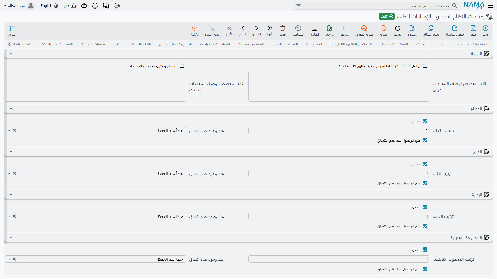

# المحددات

المحددات هي إجابة النظام عن سؤال: «إلى أي جزء من العمل ينتمي هذا السجل؟». وهي خمسة — شركة وقطاع وفرع وإدارة ومجموعة تحليلية — ويحمل كل سجل في النظام تقريباً هذه الخمسة جميعاً. وهي التي تحكم الصلاحيات (من يرى السجل)، والتقارير (كيف تُجمَّع الأرقام)، وبنية الحسابات.

وتحدد هذه الصفحة أي هذه المحددات تستعمله تركيبتك فعلاً، ومدى صرامة النظام في التحقق من اتساق محددات المستند مع بعضها، وكيف تنعكس المحددات على أكواد الحسابات.

## الشركة

الشركة هي المحدد الوحيد الذي لا يمكن إيقافه — فهي المنشأة، وكل سجل ينتمي إلى واحدة منها (أو إلى لا شيء، ومعناه *عام*).

**إظهار المستندات العامة للجميع** `value.info.showPublicDocumentsToAll` — السجل المحفوظ بشركة فارغة سجل عام. وفي الوضع الطبيعي يظل السجل العام مخفياً عن المستخدمين العاملين داخل شركة محددة. وتفعيل هذا الخيار يجعل السجلات العامة ظاهرة من كل الشركات، وهو المطلوب مع البيانات الأساسية المشتركة مثل دليل أصناف موحّد.

**تجاهل تطابق الشركة اذا لم يتم تحديد تطابق لاي محدد اخر** `value.info.ignoreDimensionsConsistency` — يتخطى فحص اتساق محددات التخزين تماماً. ولا يعمل إلا إذا كانت مستويات الاتساق الأربعة أدناه مضبوطة على «بدون»؛ فهو مخرج للتركيبات التي لا تستعمل اتساق المحددات عن قصد، لا وسيلة لإسكات أخطاء بعينها.

::: tip تخفيف القاعدة لحقل واحد بدل النظام كله
الإعدادان أعلاه إما الكل أو لا شيء. فإن كانت المشكلة في حفنة حقول فحسب — مستند يحتاج فعلاً إلى الإشارة إلى سجل من فرع آخر — فيمكن إيقاف فحص اتساق المحددات على حقل المرجع ذاك وحده، كما يمكن إعلان نوع سجل بعينه عاماً على مستوى المحددات، من [أعدادات الحقول و الشاشات](/ar/platform/fields-and-entities-settings/fields-settings-relaxing-restrictions). وهكذا يبقى الفحص الصارم قائماً في كل ما عداه.
:::

**السماح بتعديل محددات المحددات** `value.info.allowChangingDimsOfDims` — لسجل المحدد محددات خاصة به؛ فالفرع ينتمي إلى قطاع مثلاً. وفي الوضع الطبيعي تتجمّد محددات المحدد بمجرد أن تشير إليه ملفات أساسية، لأن تغييرها يعيد تصنيف كل سجل تحته في صمت. فعّل هذا الخيار لإعادة هيكلة مقصودة فقط، وتوقّع مراجعة السجلات المتأثرة بعدها.

**قالب مخصص لوصف المحددات عربى** / **إنجليزى** `value.info.customDimensionsDescriptionTemplateAr`, `...En` — يعرض النظام في مواضع مختلفة سطراً وصفياً مقروءاً لمحددات السجل. وهذان القالبان يتيحان لك التحكم في نص ذلك السطر وترتيبه في كل لغة.

## المحددات الأربعة الاختيارية

يحصل كل من القطاع والفرع والإدارة والمجموعة التحليلية على المجموعة نفسها من أربعة خيارات، ومعناها واحد في كل الحالات، فوُصفت هنا مرة واحدة.

**مفعل** `value.sectorEnabled`, `value.branchEnabled`, `value.departmentEnabled`, `value.analysisSetEnabled` *(الكل مفعل افتراضياً)* — يفعّل المحدد. أوقف أي محدد لا يستعمله العمل فعلاً: فتختفي حقوله من كل الشاشات، وهو ما يزيل عموداً من التشويش عن إدخال البيانات في النظام كله. وهذا قرار يُتخذ عند التركيب — فإيقاف محدد بعد أن حملت السجلات قيماً فيه يترك تلك البيانات معلّقة.

**ترتيب القطاع / الفرع / القسم / المجموعة التحليلية** `value.sectorOrder` *(1)*, `value.branchOrder` *(2)*, `value.departmentOrder` *(3)*, `value.analysisSetOrder` *(4)* — الوزن النسبي للمحدد حين يحل النظام تسلسل المحددات. والقيم الافتراضية تصف الاحتواء المعتاد: القطاع يضم فروعاً، والفرع يضم إدارات. لا تغيّرها إلا إذا كانت مؤسستك ترتّبها على نحو مختلف.

**عند وجود عدم اتساق** `value.sectorConsistencyLevel`, `value.branchConsistencyLevel`, `value.departmentConsistencyLevel`, `value.analysisSetConsistencyLevel` *(الكل «خطأ عند الحفظ» افتراضياً)* — ماذا يحدث حين يخالف محدد سطر المستند رأسَه أو مخزنه. **خطأ عند الحفظ** يرفض الحفظ، و**تحذير عند الحفظ** يمرره مع تنبيه، و**بدون** لا يقول شيئاً. وإبقاؤها على «خطأ» هو الخيار الآمن: فالمحدد غير المتسق يفسد في صمت كل تقرير يُجمِّع به.

**منع الوصول عند عدم الاتساق** `value.sectorAcessibilityEnabled`, `value.branchAcessibilityEnabled`, `value.departmentAcessibilityEnabled`, `value.analysisSetAcessibilityEnabled` *(الكل مفعل افتراضياً)* — هل يشارك المحدد في التحكم بالوصول إلى السجلات. فمع تفعيله لا يرى المستخدم المقيّد بفرع واحد إلا سجلات ذلك الفرع. وإيقافه يجعل المحدد وصفياً بحتاً — يُسجَّل ويظهر في التقارير، لكنه لم يعد حاجزاً أمنياً.

::: tip مفعل، مرتّب، مفحوص، ملزِم
يفيد أن تقرأ الخيارات الأربعة كمتتابعة: **مفعل** يسأل هل المحدد موجود أصلاً، و**الترتيب** أين موقعه في التسلسل، و**عند عدم الاتساق** كم يعلو صوت النظام حين لا تستقيم القيم، و**منع الوصول** هل يقيّد أيضاً من يرى السجل.
:::

## أجزاء كود الحساب

كثير من أدلة الحسابات تضمّن المحددات داخل كود الحساب نفسه؛ فقد يعني `1010-05-03-11` الحساب 1010 والقطاع 05 والفرع 03 والمجموعة التحليلية 11. وهذه الإعدادات تخبر النظام كيف يقرأ هذا الكود ويحوّله إلى محددات.

**ترتيب جزء القطاع** *(1)*، **ترتيب جزء الفرع** *(2)*، **ترتيب جزء الإدارة** *(3)*، **ترتيب جزء المجموعة التحليلية** *(4)* `value.accountDimensionConfigurations.sectorSegmentOrder` وأخواته — موقع كل محدد في الكود، بالعد من اليسار بعد رقم الحساب نفسه. والصفر يعني أن ذلك المحدد ليس جزءاً من الكود.

**فاصل الأجزاء** `value.accountDimensionConfigurations.segmentSeperator` *(الافتراضي `-`)* — الحرف الذي يُقسَّم الكود عنده.

::: warning هذه الإعدادات تصف أكوادك ولا تنشئها
تغيير ترتيب جزء لا يعيد ترقيم شيء — بل يغيّر طريقة *تفسير* الأكواد الموجودة. فإن أخطأت فيها قرأ النظام جزء الفرع على أنه القطاع. اضبطها لتطابق نظام التكويد الذي تستعمله فعلاً، مرة واحدة، قبل إنشاء الحسابات.
:::
