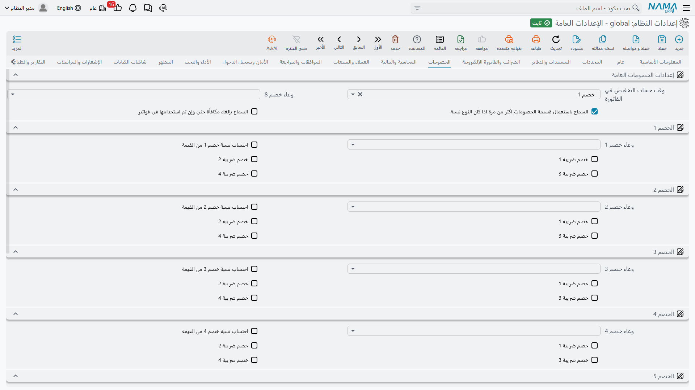

# الخصومات

يستطيع سطر المستند في النظام أن يحمل حتى ثمانية خصومات منفصلة، إضافةً إلى خصم على رأس المستند. وقد تبدو الثمانية مبالغة حتى تقابل موزّعاً سعره هو سعر القائمة، ناقص الخصم التجاري، ناقص خصم الكمية، ناقص العرض الموسمي، ناقص خصم السداد المعجّل — كلٌّ متفاوض عليه على حدة، وكلٌّ يجب أن يظهر على الفاتورة قائماً بذاته.

وتحدد هذه الصفحة وعاء حساب كل خصم وكيفية تفاعله مع الضرائب الأربع.

::: tip قد ترى أقل من ثمانية
الخصومات الثمانية مرخَّصة كلٌّ على حدة. فإن كانت تركيبتك مرخّصة لثلاثة، لم يظهر في هذه الصفحة وعلى أسطر المستندات إلا الخصم 1 إلى الخصم 3.
:::

## إعدادات الخصومات العامة

**موقع الخصم** `value.discountLocation` *(الافتراضي الخصم 1)* — المستندات التي فيها حقل خصم واحد عام تحتاج أن تعرف أي الخانات الثماني يقابله. وما لم يكن لديك سبب لغير ذلك، اتركه على الخصم 1 لتقع الحالة البسيطة في الخانة الأولى.

**نوع تطبيق خصم الرأس** `value.info.headerDiscountApplyType` — الوعاء الذي تُطبَّق عليه نسبة خصم الرأس، بالقائمة نفسها المستعملة مع خصومات الأسطر أدناه. ويُطبَّق خصم الرأس على المستند ككل بعد حساب الأسطر.

**السماح باستخدام كوبون الخصم مرات عديدة إذا كان نسبة** `value.info.allowUsingDiscountCouponManyTimesIfPercentageType` — يُستهلك كوبون الخصم عادةً بأول مستند يستخدمه. وكوبون النسبة ليس له رصيد يُستنفد، فيتيح هذا الخيار استخدامه مراراً — وهو السلوك الصحيح لكود حملة «خصم 10٪ طوال الموسم».

**السماح بعكس كوبون الخصم حتى لو استُخدم في فواتير** `value.info.allowReverseDiscountCouponEvenIfUsedInInvoices` — يسمح بعكس استخدام كوبون استهلكته فواتير بالفعل. ويلزم لتصحيح خطأ، لكنه يعني بقاء خصم على الفواتير لم يعد الكوبون يسجّله.

## من الخصم 1 إلى الخصم 8

لكل خصم من الثمانية الأنواع الثلاثة نفسها من الإعدادات. وباستعمال الخصم *ن* للدلالة على أي منها:

**نوع تطبيق الخصم ن** `value.info.discountNApplyType` — الوعاء الذي تُطبَّق عليه النسبة. والخيارات هي السلسلة نفسها التي تستعملها الضرائب: إجمالي السعر، أو السعر بعد أي خصم سابق، أو بعد خصم الرأس، أو قيمة خصم أو ضريبة بعينها، أو وعاء مخصص. وهذا ما يرتّب الخصومات — فالخصم 2 المضبوط على «السعر بعد الخصم 1» يُركَّب فوق الخصم 1، أما المضبوط على «إجمالي السعر» فيُحسب على السعر الأصلي ويتجمّع الخصمان بالجمع البسيط.

::: info مركَّب أم متوازٍ — قرار مقصود
خصمان بنسبة 10٪ على إجمالي السعر يقتطعان 20٪. والخصمان نفسهما مطبَّقين واحداً تلو الآخر يقتطعان 19٪. وعلى عقد كبير يكون هذا الفرق مالاً حقيقياً، وهو محكوم كلياً بنوع التطبيق. تأكّد من الإدارة التجارية أي السلوكين تفترضه اتفاقيات الأسعار.
:::

**حساب نسبة الخصم ن من القيمة** `value.info.calcDiscNPercentFromValue` — يكتب المستخدم النسبة عادةً فيحسب النظام المبلغ. ومع تفعيل هذا الخيار تنعكس العلاقة: يكتب المستخدم المبلغ فيستنتج النظام النسبة التي يمثلها. فعّله مع الخصومات المتفاوض عليها كمبالغ مقطوعة («انزل 500») لا كنسب.

**اعتبار الضريبة 1 / 2 / 3 / 4** `value.info.discountN.considerTax1` حتى `...considerTax4` — هل تدخل كل ضريبة من الأربع في الوعاء الذي يُحسب عليه هذا الخصم. والحالة الشائعة خصم يؤخذ على الصافي قبل ضريبة القيمة المضافة، ومعناها ترك خانة تلك الضريبة فارغة. ولا تؤشّرها إلا حيث يخصم الاتفاق التجاري فعلاً من المبلغ شامل الضريبة.

::: warning الخصم 3 كان غير قابل للضبط سابقاً
في الإصدارات السابقة كانت خيارات تأثير الضريبة على الخصم 3 في هذه الشاشة موصولة بالخصم 2، فكانت إعدادات الخصم 2 تظهر مرتين ويتعذّر ضبط الخصم 3 أصلاً. وقد صُحّح ذلك. فإن كانت تركيبتك تستعمل الخصم 3، فراجع خانات **اعتبار الضريبة** الأربع الخاصة به الآن — فقد لا تكون ضُبطت يوماً على ما قصدته.
:::
