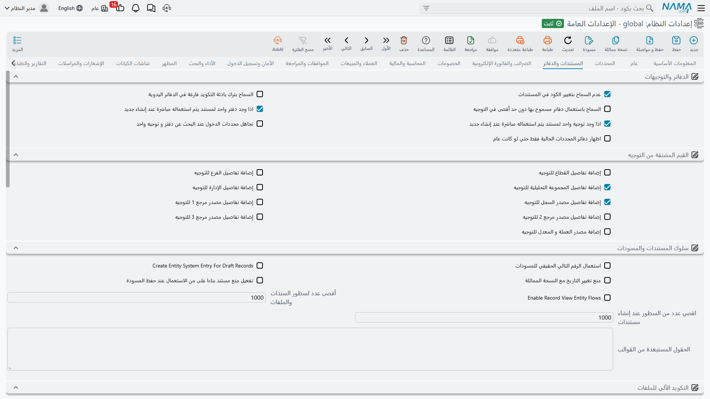

# المستندات والدفاتر

كل مستند في النظام يأخذ رقمه من **دفتر** وسلوكه من **توجيه**. وتحكم هذه الصفحة هذه الآلية: كيف يُختار الدفتر والتوجيه، وما الذي يُسمح للتوجيه بالتحكم فيه، وكيف تُرقَّم المسودات، وكيف تُكوَّد الملفات الأساسية آلياً، وكيف تُولَّد الأقساط، ومن يُسمح له بالترحيل إلى فترة مالية مقفلة.

## الدفاتر والتوجيهات

**عدم السماح بتحديد كود المستند** `value.info.doNotAllowSpecifyingDocCode` *(مفعل افتراضياً)* — لا يستطيع المستخدم كتابة كود المستند يدوياً؛ فالرقم يأتي دائماً من مكوّد الدفتر. وهو مفعّل افتراضياً لسبب وجيه — فالأكواد المكتوبة يدوياً تُحدث فجوات وتكراراً يصعب تسويته لاحقاً.

**السماح ببادئة فارغة للدفتر اليدوي** `value.info.allowEmptyPrefixForManualBook` — يحتاج الدفتر المكوَّد يدوياً عادةً بادئة كود حتى تُميَّز مستنداته. فعّل هذا الخيار إذا كان لديك دفتر يجب أن تقف أرقامه وحدها.

**عدد غير محدود من الدفاتر المسموحة في التوجيهات** `value.info.unlimtedAllowedBooksInTerms` — يسرد التوجيه الدفاتر التي يسمح بها، وتُحفظ هذه القائمة في حقل سعته 700 حرف، فيفيض التوجيه الذي يسمح بدفاتر كثيرة. وتفعيل هذا الخيار ينقل القائمة إلى حقل طويل بلا حد عملي.

::: warning أعد حفظ التوجيهات بعد التفعيل
تُكتب قائمة الدفاتر المسموحة عند حفظ التوجيه. وتفعيل هذا الخيار لا يعيد كتابة التوجيهات الموجودة — بل عليك إعادة حفظ كل توجيه مستند بعده، وإلا ظلت تستعمل القائمة القصيرة القديمة.
:::

**استخدام الدفتر الوحيد المعرّف للكيان مع الجديد** `value.info.ifSingleBookIsDefinedForEntityUseItWithNew` — حين يوجد دفتر واحد فقط يناسب المستند الجاري إنشاؤه، يُختار آلياً بدل السؤال. تفصيل صغير يوفّر نقرة على كل مستند.

**استخدام التوجيه الوحيد المعرّف للكيان مع الجديد** `value.info.ifSingleTermIsDefinedForEntityUseItWithNew` — والمثل مع توجيهات المستندات.

**عدم مراعاة المحددات عند البحث عن التوجيه أو الدفتر الوحيد** `value.info.doNotConsiderDimensionsWhenSearchingForSingleTermBook` — يجري فحص «هل يوجد واحد فقط؟» أعلاه ضمن المحددات الحالية افتراضياً. ومع تفعيل هذا الخيار يتجاهل البحث المحددات، فيُختار آلياً التوجيه أو الدفتر المناسب بصرف النظر عن الفرع.

**إظهار دفاتر المحدد الحالي فقط** `value.info.showOnlyCurrentDimensionBooks` — يقصر قائمة اختيار الدفتر على الدفاتر المطابقة لمحددات السجل. مفيد بعد أن يصير لكل فرع سلسلة ترقيم خاصة وتريد منع الموظفين من اختيار دفتر فرع آخر.

## القيم المشتقة من التوجيه

يستطيع التوجيه أن *يمدّ* المستند الذي يحكمه بالقيم؛ فتوجيه مبيعات فرع القاهرة يمكنه فرض الفرع وحقول المرجع بل والعملة. وكل خيار هنا يضيف عمود مصدر واحداً إلى شاشة توجيه المستند. وهي موقفة افتراضياً لأن كل عمود تضيفه قرار إضافي على من يصون التوجيهات.

- **إضافة مصدر القطاع للتوجيهات** `value.info.addSectorSourceToTerms`
- **إضافة مصدر الفرع للتوجيهات** `value.info.addBranchSourceToTerms`
- **إضافة مصدر المجموعة التحليلية للتوجيهات** `value.info.addAnalysisSourceToTerms` *(مفعل افتراضياً)*
- **إضافة مصدر الإدارة للتوجيهات** `value.info.addDeptSourceToTerms`
- **إضافة مصدر السجل للتوجيهات** `value.info.addEntityDimSourceToTerms`
- **إضافة مصدر المرجع 1 / 2 / 3 للتوجيهات** `value.info.addRef1SourceToTerms`, `...addRef2SourceToTerms`, `...addRef3SourceToTerms`
- **إضافة مصدر العملة والسعر للتوجيهات** `value.info.addCurrencyAndRateSourceToTerms`

## سلوك المستندات والمسودات

**استخدام الرقم الحقيقي التالي للمسودات** `value.info.useNextRealNumberForDrafts` — تسحب المسودات أرقامها عادةً من سلسلة مسودات منفصلة، فلا تستهلك المسودة غير المرحّلة رقماً حقيقياً. وتفعيل هذا الخيار يجعل المسودة تأخذ الرقم الحقيقي التالي، فتبقى سلسلة المستندات المرحّلة بلا فجوات، مقابل استهلاك أرقام على مسودات مهجورة. ويمكن لكل مكوّد على حدة تجاوز هذا الإعداد.

**إنشاء مدخل نظامي للسجل المسودة** `value.info.createEntitySystemEntryForDraftRecord` — يكتب مدخلاً نظامياً للمسودات كما للسجلات المرحّلة. ويلزم حين يحتاج ربطٌ خارجي أو تقرير أن يرى المستندات قبل ترحيلها.

**عدم تغيير التاريخ مع النسخة المماثلة** `value.info.doNotChangeDateWithDuplicate` — يعيد إجراء «نسخة مماثلة» ضبط تاريخ المستند الجديد إلى اليوم افتراضياً. ومع تفعيل هذا الخيار يحتفظ بتاريخ المستند الأصلي، وهو السلوك الصحيح حين تنسخ لتصحيح قيد تاريخي.

**تفعيل منع مستند بناءا على من الاستعمال عند حفظ المسودة** `value.info.applyPreventUsageOfFromDocWithDrafts` — يمكن وسم المستند المصدر بحيث لا يُستهلك إلا مرة واحدة، ويُفحص ذلك عادةً عند الترحيل. وهذا الخيار يطبّقه عند حفظ المسودة أيضاً، فلا يبدأ شخصان مسودتين من المصدر نفسه.

**تفعيل مسارات الكيان عند عرض السجل** `value.info.enableRecordViewEntityFlows` — يسمح بمسارات الكيان التي محفّزها *عرض السجل*، فتُنفَّذ كلما فُتح سجل. وهو موقف افتراضياً ويُستحسن إبقاؤه كذلك ما لم تحتجه: فهو يضيف عملاً على فتح كل سجل. ويرفض النظام حفظ مسار كيان يستعمل هذا المحفّز ما دام الخيار موقفاً.

**أقصى عدد للأسطر** `value.info.maxLinesCount` *(الافتراضي 750)* — الحد الأعلى الافتراضي لعدد أسطر التفاصيل في السجل الواحد، وهو يحمي الخادم من مستند ضخم منفرد. ويمكن منح تركيبات كيان/جدول بعينها حداً خاصاً يتجاوز هذا.

**أقصى عدد أسطر للمستند المولَّد** `value.info.maxLinesPerGeneratedDoc` *(الافتراضي 1000)* — حين ينتج إقفال آخر السنة قيوده، يوزّعها على عدة مستندات بدل بناء قيد واحد هائل. وهذا هو عدد الأسطر في المستند المولَّد الواحد.

**الحقول المستبعدة من القيم الافتراضية** `value.info.defaultValuesExcludedFields` — حين يحفظ المستخدم سجلاً كقالب «قيم افتراضية» يُنسخ كل ما فيه. اكتب هنا معرّفات الحقول — واحداً في كل سطر — لاستبعادها من هذه القوالب. والتواريخ والأكواد وأرقام المراجع هي المرشحة المعتادة.

## التكويد الآلي للملفات

يمكن تكويد الأصناف والحسابات وغيرها من الملفات الأساسية بصيغة حسابية بدل الكتابة اليدوية. وتعرّف هذه المجموعة تلك الصيغ، ويفحصها النظام عند حفظ الإعدادات.

**منع التكويد اليدوي** `value.info.preventManualCoding` — يرفض حفظ سجل كُتب كوده يدوياً بينما مكوّده مضبوط على التكويد الآلي. وهو النظير الصارم لخيار كود المستند أعلاه.

**صيغة حساب الكود** `value.info.itemCodingFormula.codeCalculationFormula` — تبني الكود نفسه، وعادةً من مجموعة الصنف وتصنيفه ورقم متسلسل.

**استعلام صلاحية الكود** `value.info.itemCodingFormula.codeValidityQuery` — فحص يجب أن يجتازه الكود المولَّد. فإن طابق الاستعلام سجلاً موجوداً رُفض الكود وجُرِّب الرقم التالي. وبهذا تفرض قاعدة «لا يجوز أن يتشارك صنفان هذا الشكل من الكود».

**بادئة تسلسل الكود** `value.info.itemCodingFormula.codeSequencePrefix` — صيغة تنتج البادئة التي ينتمي عدّادها إلى اللاحقة الرقمية، فتحصل كل عائلة منتجات على سلسلة مستقلة.

**طول لاحقة الكود** / **أول رقم في اللاحقة** `value.info.itemCodingFormula.codeSuffixLength`, `...codeSuffixFirstNumber` — عرض الجزء الرقمي (مع أصفار التعبئة) والرقم الذي يبدأ منه.

**صيغة حساب الاسم العربي / الإنجليزي** `value.info.itemCodingFormula.name1CalculationFormula`, `...name2CalculationFormula` — صيغتان تبنيان الاسمين العربي والإنجليزي، فيخرج الصنف المولَّد موصوفاً تماماً دون كتابة.

**صيغة الكود البديل** `value.info.itemCodingFormula.altCodeFormula` — تبني الكود البديل.

**صيغة كود المراجعة** و**صيغة اسم المراجعة العربي / الإنجليزي** `value.info.itemCodingFormula.revCodeCalculationFormula`, `...rvName1Formula`, `...rvName2Formula` — الصيغ الثلاث نفسها مطبَّقة على مراجعات الأصناف المولَّدة.

**صيغة كود المقاس واللون** و**صيغة اسم المقاس واللون العربي / الإنجليزي** `value.info.itemCodingFormula.sizeAndColorCodeCalculationFormula`, `...szName1Formula`, `...szName2Formula` — والمثل مع متغيّرات المقاس واللون المولَّدة، وهنا يظهر عائد التكويد الآلي حقاً: فقميص بخمسة مقاسات وأربعة ألوان يصير عشرين سجلاً مسمّى تسمية صحيحة بلا كتابة.

**عدم إعادة ضبط الكود مع التعديل** `value.info.itemCodingFormula.doNotResetCodeWithUpdate` — يبقي الكود الحالي عند تعديل السجل، حتى لو تغيّرت مدخلات الصيغة.

**تحديث المراجعة إذا كانت فارغة** / **تحديث اللون والمقاس إذا كانا فارغين** `value.info.itemCodingFormula.updateRevisionIfEmpty`, `...updateColorAndSizeIfEmpty` — يملأ هذه الأكواد فقط حين تكون فارغة، ولا يمس ما كُوِّد من قبل.

## الأقساط

**طريقة تكويد الأقساط** `value.info.installmentCodingMethod` — كيف تُرقَّم الأقساط المولَّدة: **كود المستند ورقم السطر**، أو **تاريخ القسط ورقم السطر**، أو **صيغة**.

**صيغة تكويد الأقساط** `value.info.installmentCodingFormula` — الصيغة المستعملة حين تكون الطريقة «صيغة».

**القيمة المتجاهلة عند مقارنة المدفوع بالأقساط (الدفعات)** `value.info.ignoredValueWhenPayingInstallments` — التسامح عند مقارنة الدفعة بقيمة القسط. اضبطه فوق أصغر وحدة نقدية لديك بقليل، حتى لا يعطّل فرق تقريب بقرش واحد تسويةً كاملة.

**عدم مقارنة المتبقي بإجمالي الدفعات في الفواتير** `value.info.doNotCompareRemainingWithPaymentTotalInInvoices` — يتخطى التحقق من أن متبقي الفاتورة يساوي إجمالي جدول دفعاتها. استعمله فقط حيث يختلف الرقمان بحكم التصميم.

## الفترات المالية والإقفال

**عدم منع تعديل المستندات قبل آخر قيد إقفال** `value.info.doNotPreventModifyingDocsBeforeLastCloseEntry` — يُقفل المستند المؤرخ قبل آخر قيد إقفال عادةً، لأن تعديله يغيّر فترة أُقفلت وصدرت عنها تقارير. وهذا الخيار يرفع ذلك القفل.

**السماح بإعادة معالجة طلبات الأعمال المحاسبية قبل قيد الإقفال** `value.info.allowReprocessingOfLedgerTransRequestsBeforeClosingEntry` — يسمح بإعادة معالجة الآثار المحاسبية للمستندات المؤرخة قبل قيد الإقفال.

**السماح بإعادة معالجة طلبات الأعمال المخزنية قبل قيد الإقفال** `value.info.allowReprocessingOfInvTransRequestsBeforeClosingEntry` — والمثل مع الآثار المخزنية.

::: danger هذان الخياران موسومان بالخطورة
يطلب كلا الخيارين تأكيداً صريحاً قبل تفعيلهما، ويسجّل النظام أنهما فُعِّلا. فإعادة المعالجة عبر قيد إقفال تعيد كتابة أرقام بُنيت عليها فترة مقفلة، فقد تتغيّر في صمت أرصدة سبق رفعها إلى الإدارة أو إلى مراجع الحسابات. فعّلهما لتصحيح مُراقَب ثم أوقفهما مرة أخرى.
:::

**تفعيل تحديث حالة السنة المالية** `value.info.enableFiscalYearStatusUpdateFile` — يفعّل ملف تحديث حالة السنة المالية، الذي يتيح فتح الفترات أو إقفالها لتركيبة بعينها من الكيان والمحددات والمستخدم بدل الفتح والإقفال الشاملين.

**تجاهل الفترات المقفلة في** `value.info.ignoreClosedPeriodsIn` *(جدول)* — بديل أدق من الخيارات أعلاه. كل سطر يمنح مستخدماً واحداً (أو مجموعة «السماح لـ») حق الترحيل إلى فترة مالية وسنة محددتين، لنوع كيان واحد، مع إمكانية تضييقه بمحددات بعينها. وبهذا تدع المحاسب ينهي تسويات الشهر الماضي دون فتح الفترة للجميع.
