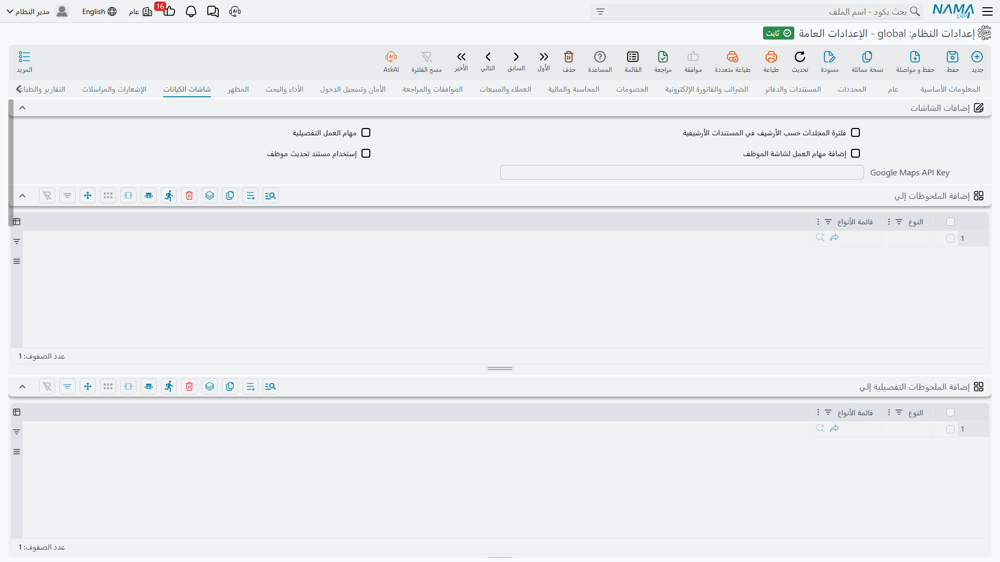

# شاشات الكيانات

هذه الصفحة غير معتادة: فلا شيء فيها يغيّر *سلوك* النظام، بل كل ما فيها يغيّر **شكل شاشات الكيانات الأخرى** — أي الصفحات الإضافية تظهر على العميل، وهل تظهر صورة الصنف في نتائج البحث، وأي السجلات تحصل على ترميز لوني.

وهذا يجعلها المكان المناسب للبدء حين يسأل أحدهم: «لماذا في شاشة المورد عندنا صفحة جهات اتصال وليست موجودة في النسخة التجريبية؟».

::: info النظير على مستوى الحقل
ما تضبطه هنا افتراضيٌّ لنوع سجل كامل. أما الشاشة التي تؤدي المهمة نفسها لكل **حقل** على حدة فهي [أعدادات الحقول و الشاشات](/ar/platform/fields-and-entities-settings/) من **الأساسي ← الإعدادات** — أقنعة العرض وأنماط الحقول، والأيقونات والألوان، وقواعد الإدخال، وكيف يبحث حقل المرجع، والحقول المحسوبة وغيرها. فالجأ إلى تلك الشاشة حين تكون الإجابة «على هذا الحقل وحده».
:::

## إضافات الشاشات

**ترشيح مجلدات مستند إدارة الوثائق حسب الموقع** `value.info.dmsDocFilterFoldersByLocation` — يقصر قائمة اختيار المجلد في سجل إدارة الوثائق على المجلدات التابعة لموقع السجل، فلا يضطر مستخدم في مكتب إلى تصفح بنية حفظ كل المكاتب الأخرى.

**مهام العمل التفصيلية** `value.info.detailedWorkTasks` — يحوّل شاشات مهام العمل إلى تخطيطها التفصيلي، الذي يحمل حقولاً أكثر لكل مهمة.

**إضافة قائمة مهام العمل للموظف** `value.info.addWorkTasksListToEmployee` — يضيف قائمة مهام عمل الموظف إلى شاشة الموظف، فيرى المدير عبء عمل أحدهم من سجله بدل تشغيل استعلام منفصل.

**استخدام مستند تحديث بيانات الموظف** `value.useUpdateEmpInfoDoc` — تُغيَّر بيانات الموظف عبر مستند مخصص هو *تحديث بيانات الموظف* بدل تعديلها مباشرةً على شاشة الموظف. وبهذا تحصل على أثر موافقة وتاريخ مؤرَّخ لتغييرات الموارد البشرية: فيصير التغيير مستنداً يمكن مراجعته واعتماده ورفع تقرير عنه، لا تعديلاً صامتاً.

**مفتاح Google Maps** `value.info.googleMapsApiKey` — المفتاح الذي يستعمله منتقي الخرائط في حقول المواقع، ويستعمله تطبيق التوصيل. وبدونه ترتد الحقول المعتمدة على الخريطة إلى الإدخال اليدوي.

## صفحات إضافية على الكيانات الأخرى

كل جدول من هذه الجداول يسمّي أنواع الكيانات التي ينبغي أن تحصل على صفحة إضافية واحدة. أضف سطراً لكل نوع كيان، أو استعمل عمود قائمة أنواع الكيانات لتغطية عدة أنواع دفعة واحدة.

**إضافة صفحة الملاحظات إلى** `value.info.addRemarksPageTo` — يضيف صفحة ملاحظات. ويأتي مضبوطاً مسبقاً على الموظف والمورد والعميل والأصل الثابت والطرف الآخر.

**إضافة صفحة الملاحظات التفصيلية إلى** `value.info.addDetailedRemarksPageTo` — يضيف صفحة الملاحظات التفصيلية، التي تسجّل الملاحظات كمدخلات مؤرَّخة منظمة لا كنص حر.

**إضافة صفحة ملاحظات الاجتماعات إلى** `value.info.addMeetingRemarksPageTo` — يضيف صفحة لمحاضر الاجتماعات.

**إضافة صفحة جهات الاتصال إلى** `value.info.addContactsPageTo` — يضيف صفحة جهات اتصال، للأشخاص المعنيين لدى ذلك العميل أو المورد.

**إضافة مستندات إدارة الوثائق إلى** `value.info.addDMSDocsTo` — يضيف صفحة إدارة وثائق، فتعيش الأوراق الممسوحة على السجل الذي تخصه. وبالقائمة المضبوطة مسبقاً نفسها.

**إضافة رصيد الذمة إلى** `value.info.addSubsidiaryBalanceTo` — يضيف كتلة أرصدة حسابات، فتفتح العميل وترى ما عليه دون مغادرة الشاشة.

::: tip أضف الصفحات حيث ستُستعمل لا في كل مكان
كل صفحة تضيفها هنا تظهر لكل مستخدم يفتح ذلك الكيان. فصفحة جهات الاتصال على العميل تستحق مكانها، والصفحة نفسها على اثني عشر كياناً لا يملؤها أحد ليست إلا اثنتي عشرة صفحة فارغة إضافية يتصفحها المستخدم.
:::

## ألوان السجلات

**استخدام الألوان لـ** `value.info.useColorFor` — نطاق الترميز اللوني للسجلات: **كل المستندات** أو **كل الملفات الأساسية** أو **كل الكيانات** أو **كيانات محددة**.

**استخدام الألوان في** `value.info.useColorsIn` *(جدول)* — حين يكون النطاق «كيانات محددة» فهذه هي القائمة. والترميز اللوني أنفع ما يكون حين يكون نادراً — طبّقه على الشاشات القليلة التي تحتاج حالتها أن تقفز إلى العين، لا على كل شيء.

## صور الكيانات

**صور الكيانات** `value.info.entityImages` *(جدول)* — يستطيع النظام عرض صورة السجل في مواضع كثيرة، ويتحكم هذا الجدول في كل موضع على حدة، ولكل نوع كيان.

ولكل كيان تضيفه تختار هل تظهر صورته — وبأي عرض وارتفاع — في:

- **الاقتراحات** (`useInSuggestion`, `widthInSuggestion`, `heightInSuggestion`) — القائمة المنسدلة التي تظهر بينما يكتب المستخدم في حقل مرجع.
- **أعمدة الجداول** (`useInGridColumns`, `widthInGridColumns`, `heightInGridColumns`) — داخل جداول التفاصيل.
- **عمود منفصل** (`showInSeparateColumn`, `widthOfSeparateColumns`, `heightOfSeparateColumns`) — كعمود قائم بذاته لا بجوار النص.
- **نافذة البحث** (`useInSearch`, `widthInSearcher`, `heightInSearcher`).
- **مطالعة القوائم** (`useInList`, `widthInList`, `heightInList`).
- **حقول الرأس** (`useInHeaderFields`, `widthInHeaderFields`, `heightInHeaderFields`) — بجوار حقل مرجع على رأس المستند.
- **النافذة المنبثقة مع الكود** (`showInPopupWithCode`).

ويحدد **نسبة عرض الملف الرئيسي** (`mainFileWidthPercent`) كم تشغل الصورة الرئيسية من شاشة السجل نفسه.

والحالة الواضحة هي دليل المنتجات، حيث تجعل الصورة في قائمة الاقتراحات اختيار الصنف الصحيح أسرع بكثير من قراءة الأكواد. وهي تكلّف نطاقاً ترددياً في كل قائمة تعرضها، ففعّل المواضع التي تنفع فيها الصورة فعلاً واترك بقيتها.
