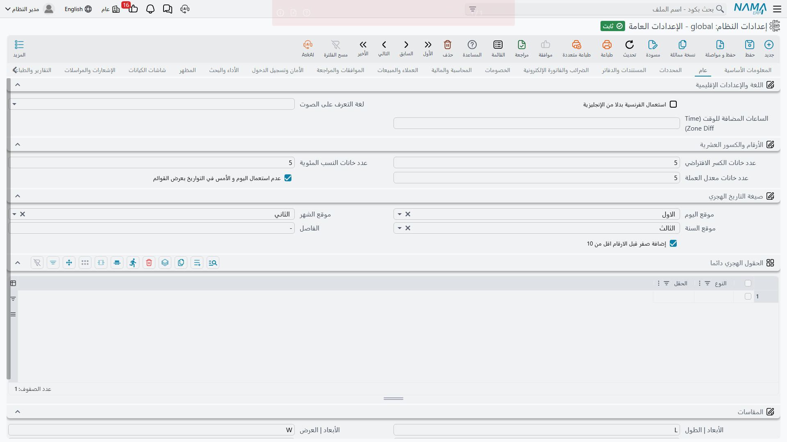

# عام

تضم صفحة «عام» الإعدادات التي لا تخص مجالاً محاسبياً بعينه، لكنها تحكم شكل الأرقام والتواريخ والنصوص في كل مكان: ما هي لغة الواجهة الثانية، وكم خانة عشرية يحمل سعر الصرف، وكيف يُكتب التاريخ الهجري، وماذا تعني حقول المقاسات الثلاثة على سطر المستند.

## اللغة والإعدادات الإقليمية

**استعمال الفرنسية بدلا من الإنجليزية** `value.info.useFrenchInsteadOfEnglish` — يأتي نظام Nama بواجهة عربية وأخرى إنجليزية. وتفعيل هذا الخيار يستبدل الفرنسية بالإنجليزية في كل مكان: القوائم وعناوين الحقول وأسماء الإجراءات ونصوص التقارير. وهو استبدال لا إضافة — فتحصل على العربية والفرنسية، لا على الثلاث معاً.

**لغة التعرف على الصوت** `value.info.audioSpeechContextLanguage` — حين يملي المستخدم نصاً في حقل بدل كتابته، تحتاج خدمة التعرف على الصوت أن تعرف اللغة واللهجة المتوقعة. والخيارات هي العربية المصرية والسعودية والكويتية، والإنجليزية الأمريكية، والفرنسية. واختيار اللهجة التي يتحدث بها مستخدموك فعلاً يُحدث فرقاً ملموساً في دقة التعرف.

**الساعات المضافة للوقت (Time Zone Diff)** `value.info.addedHoursToTime` — عدد ثابت من الساعات يُضاف كلما سجّل النظام الوقت الحالي. وُجد هذا الخيار للحالة الشائعة التي يكون فيها خادم قاعدة البيانات في منطقة زمنية والعمل في منطقة أخرى: فبدلاً من نقل الخادم تُزيح الساعة التي يراها التطبيق. اكتب `3` إذا كان العمل يسبق الخادم بثلاث ساعات، أو `2-` إذا كان يتأخر عنه بساعتين. ولأنه يؤثر في كل «الآن» يسجّلها النظام، اضبطه مرة واحدة عند التركيب ثم اتركه.

## الأرقام والكسور العشرية

يحفظ النظام المبالغ بدقتها الكاملة، وهذه الإعدادات الثلاثة تحكم عدد الخانات الكسرية التي *تُحفظ وتُعرض* للأنواع الثلاثة التي تحتاج عادةً أكثر من خانتين.

**عدد خانات الكسر الافتراضي** `value.info.defaultDisplayDecimalPlaces` *(الافتراضي 5)* — يُستعمل مع أي حقل عشري لا يعلن دقته الخاصة.

**عدد خانات النسب المئوية** `value.info.percentageFractionalDecimalPlaces` *(الافتراضي 5)* — يسري على كل حقول النسب: نسب الخصم والضريبة، ونسب حصر المقاولات، ونسب نقاط البيع. وقد تبدو خمس خانات سخية، لكن النسب قيم وسيطة تُضرب في مبالغ كبيرة، فالخانات الإضافية تمنع تراكم أخطاء التقريب.

**عدد خانات معدل العملة** `value.info.rateFractionalDecimalPlaces` *(الافتراضي 5)* — يسري على حقول أسعار الصرف. والعملات ذات النسبة الكبيرة إلى العملة الأساسية تحتاج هذه الدقة.

**عدم استعمال اليوم والأمس في التواريخ بعرض القوائم** `value.info.doNotUseTodayAndYesterdayForDates` — يعرض النظام افتراضياً التاريخ القريب بكلمتي «اليوم» أو «أمس»، وهو أسهل في القراءة لكنه يخفي التاريخ الفعلي. فعّل هذا الخيار حين يحتاج المستخدمون رؤية التاريخ الحقيقي في كل مكان، وهو الحال عادةً في الأعمال التي تقارن المستندات بالتاريخ طوال اليوم.

## صيغة التاريخ الهجري

يستطيع النظام عرض مقابل هجري لأي حقل تاريخ، وهذه الخيارات تحدد كيف يُكتب ذلك التاريخ الهجري.

**موقع اليوم** / **موقع الشهر** / **موقع السنة** `value.info.hijriFormat.dayPosition`, `...monthPosition`, `...yearPosition` — يوضع كل جزء في الموقع الأول أو الثاني أو الثالث. والافتراضي يعطي يوم-شهر-سنة؛ واجعل اليوم ثالثاً والسنة أولاً إذا أردت البدء بالسنة.

**الفاصل** `value.info.hijriFormat.seperator` *(الافتراضي `-`)* — الحرف الفاصل بين الأجزاء.

**إضافة صفر قبل الارقام اقل من 10** `value.info.hijriFormat.addZeroToNumbersLessThan10` *(مفعل افتراضياً)* — يكتب `05` بدل `5` حتى تصطف التواريخ في الأعمدة.

**الحقول الهجرية** `value.info.hijriFields` *(جدول)* — هنا تحدد *أي* التواريخ يحصل على مقابل هجري. كل سطر يذكر كياناً وأحد حقول التاريخ فيه، فيعرض النظام حقلاً هجرياً بجواره على الشاشة. أضف التواريخ التي تحتاجه فعلاً — تاريخ توقيع عقد، تاريخ تعيين موظف — لا كل تاريخ في كل شاشة.

## المقاسات

كثير من الأعمال تصف الصنف بثلاثة مقاسات لا بكمية واحدة: لوح الزجاج مترين في متر ونصف، وبكرة الكابل مئتا متر. ويحمل النظام ثلاثة حقول مقاسات على سطر المستند، وهذه المجموعة تحدد أسماءها وطريقة تركيبها.

**الأبعاد | الطول** / **الأبعاد | العرض** / **الأبعاد | الارتفاع** `value.measuresConfiguration.length`, `...width`, `...height` — العنوان الظاهر لكل مقاس. وترك أحدها فارغاً يخفي ذلك المقاس من الشاشات التي تستعمله، وهو المطلوب حين يكون اثنان فقط من الثلاثة ذوَي معنى.

**الفاصل** `value.measuresConfiguration.seperator` *(الافتراضي `*`)* — الحرف المستخدم حين تُكتب المقاسات الثلاثة كنص وصفي واحد، فتصبح `2*1.5`. ويعيد النظام القيمة الافتراضية إذا حفظته فارغاً.

**حساب العدد بناء على الكمية** `value.info.calculateCountBasedOnQty` *(مفعل افتراضياً)* — عند تفعيله يُشتق *العدد* على السطر من ضرب الكمية في المقاسات بدل كتابته يدوياً، فإدخال 10 ألواح مقاس 2 × 1.5 يعطي عدداً قدره 30 متراً مربعاً آلياً. ووحدة القياس هي التي تحدد المقاسات المشاركة: فالوحدة الموسومة بتجاهل الطول أو العرض تُخرج ذلك العامل من عملية الضرب.

## الملاحظات وإعادة التحميل

**ملاحظات** `info` — حقل نص حر على سجل الإعدادات نفسه. ومن المفيد أن تسجّل فيه *سبب* تفعيل خيار غير معتاد وتاريخه.

ويجبر إجراء **إعادة تحميل الإعدادات** في شريط الأدوات كل خوادم النظام على إهمال نسختها المخزّنة وإعادة قراءة السجل. ونادراً ما تحتاجه لأن الحفظ يحدّث المخزون المؤقت أصلاً، لكنه أول ما تجربه إذا بدا أن أحد الخوادم يتصرف على نحو مختلف عن غيره.
