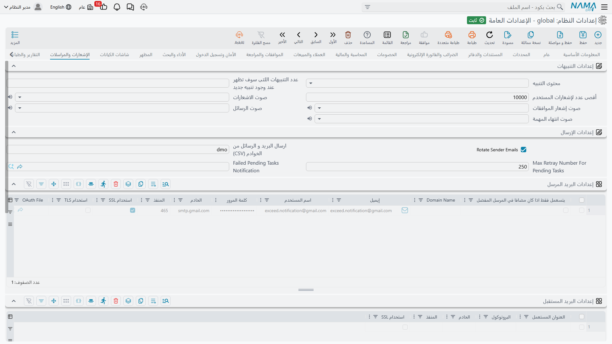

# الإشعارات والمراسلات

كل ما يحتاجه النظام ليخبر أحداً بشيء: الإشعارات داخل التطبيق وأصواتها، وحسابات البريد والرسائل القصيرة التي يرسل عبرها.

ولمعرفة كيف تُعرَّف الإشعارات وتُطلَق، انظر [منظومة الإشعارات](../notifications/notifications-system.md) و[الرسائل القصيرة وواتساب](../notifications/sms-and-whatsapp.md).

## الإشعارات

**محتوى التنبيه** `value.info.notificationContent` — هل يُعرض نص الإشعار نفسه (**عرض المحتوى**) أم مجرد تلميح محايد بأن «لديك إشعاراً» (**عدم عرض المحتوى**). اختر «عدم عرض المحتوى» حيث قد تحمل الإشعارات أرقام رواتب أو بيانات عملاء أو أي شيء لا ينبغي أن يبقى على شاشة غير مراقَبة.

**عدد التنبيهات** `value.info.notificationsCount` — كم إشعاراً يُدرج في اللوحة.

**أقصى عدد لتنبيهات المستخدم** `value.info.maxUserNotificationCount` *(الافتراضي 10000)* — حد احتفاظ لكل مستخدم. وعند تجاوزه يرفع النظام رسالة حرجة. وبلا حد ينمو تاريخ الإشعارات بلا نهاية على تركيبة مزدحمة.

**عدم إرسال التنبيهات للموظف المفوض** `value.info.doNotSendNotificationsToDelegates` — في الوضع المعتاد، إذا كان للموظف تفويض ساري رُفعت التنبيهات الموجهة إليه لنائبه أيضاً موسومةً بـ**مفوض من**. وتفعيل هذا الخيار يوقف ذلك في كل مكان. والأفضل استعمال حقل **عدم تطبيق التفويض** في تعريف التنبيه نفسه حين يراد إبقاء تنبيهات حساسة قليلة مع مستلمها الأصلي فقط — انظر [منظومة الإشعارات](../notifications/notifications-system.md).

**صوت الاشعارات** / **صوت إشعار الموافقات** / **صوت الرسائل** / **صوت انتهاء المهمة** `value.info.notificationsSound`, `value.info.approvalsSound`, `value.info.messagesSound`, `value.info.taskEndedSound` — كل منها **بدون** أو أحد خمسة أصوات. ومنح الموافقات صوتاً مميزاً عن الإشعارات العامة مفيد بحق لمن يعتمد طوال اليوم، أما منح الأربعة الصوت نفسه فليس إلا ضجيجاً.

## إعدادات الإرسال

**تدوير حسابات إرسال البريد** `value.info.rotateSenderEmails` *(مفعل افتراضياً)* — يتنقل بين حسابات الإرسال المعرّفة بدل استعمال الأول دائماً. وهذا يوزّع الحجم على الحسابات، وهو مهم لأن معظم مزوّدي البريد يحدّون من معدل الحساب الواحد.

**إرسال البريد والرسائل من الخوادم التالية فقط** `value.info.sendMailsAndSMSOnlyFromServers` — قائمة معرّفات الخوادم المسموح لها بالإرسال فعلاً. وقيمته الافتراضية هي معرّف هذا الخادم نفسه، وهذا الافتراضي ميزة أمان تستحق الفهم.

::: warning هذا ما يمنع نسخة الاختبار من مراسلة عملائك
حين تستعيد قاعدة بيانات الإنتاج على خادم اختبار، تأتي معها كل الإشعارات المجدولة. ولأن هذا الحقل يحمل معرّف خادم *الإنتاج* ومعرّف خادم الاختبار مختلف، تمتنع نسخة الاختبار في صمت عن إرسال أي شيء. اتركه مملوءاً، وحين تنقل الإنتاج عمداً إلى خادم جديد فتذكّر تحديثه — وإلا توقّف خادم الإنتاج الجديد عن الإرسال هو الآخر.
:::

**أقصى عدد محاولات للمهام المعلقة** `value.info.maxRetrayNumForPendingTasks` *(الافتراضي 250)* — كم مرة يُعاد تنفيذ المهمة المعلقة قبل التخلي عنها.

**تنبيه المهام المعلقة الفاشلة** `value.info.failedPendingTasksNotification` — الإشعار الذي يُرفع حين تستسلم المهمة أخيراً، فيعلم إنسانٌ أن الرسائل لا تخرج.

## حسابات إرسال البريد

**إعدادات البريد** `value.info.emailSettings` *(جدول)* — سطر لكل حساب إرسال. ويحمل كل سطر **اسم النطاق** و**البريد** و**اسم المستخدم** و**كلمة المرور** و**الخادم** و**المنفذ** وخيارَي **استخدام SSL** و**استخدام TLS**، إضافةً إلى **ملف OAuth** اختياري للمزوّدين الذين يشترطونه بدل كلمة المرور.

ويسم **استخدام فقط إذا كان مفضلاً** حساباً ينبغي ألا يُستعمل إلا حين يطلبه شيء صراحةً، بدل دخوله في التدوير العام.

وتتيح أعمدة المحددات الخمسة — الشركة والقطاع والفرع والإدارة والمجموعة التحليلية — تخصيص نطاق الحساب، فترسل كل شركة في المجموعة من عنوانها.

::: info حسابات OAuth تُفحص عند الحفظ
إذا أشار سطر إلى ملف OAuth فإن الحفظ يفحص ثلاثة أمور: أن يكون الملف مصرَّحاً (افتحه واستعمل «بدء OAuth» إن لم يكن)، وأن يكون موسوماً بأنه لإرسال البريد من Gmail، وأن يكون بريد مستخدمه مطابقاً تماماً لاسم المستخدم في السطر. وكل إخفاق يذكر اسم الملف ويبيّن الخطأ بالضبط.
:::

## استقبال البريد

**إعدادات استقبال البريد** `value.info.emailReceiverSettings` *(جدول)* — حسابات البريد الوارد، لمسارات العمل التي تنشئ سجلات من بريد مستلَم. ولكل سطر **نمط البريد** و**البروتوكول** و**الخادم** و**المنفذ** وخيار **استخدام SSL**.

## مزوّدو الرسائل القصيرة

**إعدادات الرسائل القصيرة** `value.info.smsSettings` *(جدول)* — سطر لكل مزوّد رسائل، بأعمدة المحددات الخمسة نفسها لتخصيص النطاق.

وإلى جانب **المزود** و**المرسل** و**اسم المستخدم** و**كلمة المرور** و**استخدام فقط إذا كان مفضلاً**، يحمل السطر ما يحتاجه أي مزوّد HTTP عام: **استخدام طريقة POST** و**ترويسات HTTP** و**قالب جسم الطلب** و**مؤشر النجاح** (النص الذي يعني في الرد أن الإرسال نجح) و**إعدادات أخرى**.

و**مصحح رقم الهاتف** استعلام يعيد كتابة الأرقام إلى الصيغة التي يتوقعها المزوّد — فيحوّل `01012345678` المحفوظ محلياً إلى `201012345678` مثلاً.

::: warning مزوّدان لهما متطلبات إضافية
لا يقبل **WaboxApp** إلا الأرقام بالصيغة الدولية، فمصحح رقم الهاتف مطلوب — ويرفض النظام حفظ السطر بدونه. ويشترط مزوّد **الرابط العام** وضع الرابط المستهدف في «إعدادات أخرى»، ولا يُحفظ بدونه كذلك. وفي الحالتين يذكر الخطأ رقم السطر.
:::

## خادم البريد القديم

**الخادم** / **المنفذ** / **نوع الاتصال** / **موثّق** / **اسم المستخدم** / **كلمة المرور** `value.info.mailServerSettings.server` وأخواته — حساب SMTP واحد، من قبل وجود جدول المرسِلين أعلاه. وما زال يُستعمل بديلاً احتياطياً حين لا يطابق أي سطر في جدول إعدادات البريد. وينبغي للتركيبات الجديدة أن تضبط الجدول وتترك هذا فارغاً.
