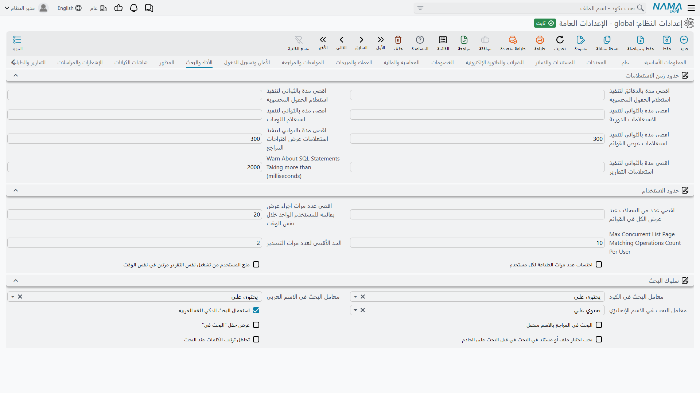

# الأداء والبحث

في هذه الصفحة همّان مترابطان. الأول حماية الخادم من عمل لن ينتهي أبداً: حدود زمن الاستعلامات وحدود الاستخدام لكل مستخدم. والثاني سلوك البحث، وهو مسألة سهولة استعمال ومسألة أداء في آن — بحكم طريقة استفادة قواعد البيانات من الفهارس.

## حدود زمن الاستعلامات

يحدّ كل من هذه الإعدادات المدة التي يُسمح فيها لنوع من الاستعلامات بالعمل قبل التخلي عنه. ووُجدت لأن فلتراً واحداً سيئ الكتابة قد يحتلّ اتصال قاعدة بيانات إلى ما لا نهاية ويبطئ النظام على الجميع.

**أقصى دقائق لتنفيذ استعلام حقل SQL** `value.info.maxMinutesToExecuteSqlFieldQuery` — الحد الأعلى بالدقائق لاستعلام حقل SQL.

**أقصى ثوان لتنفيذ استعلام حقل SQL** `value.info.maxSecondsToExecuteSqlFieldQuery` — الحد نفسه بالثواني، لتحكم أدق.

**أقصى ثوان لتنفيذ استعلامات المستخدم المؤقتة** `value.info.maxSecondsToExecuteUserTimedQueries` — للاستعلامات التي يجدولها المستخدمون بأنفسهم.

**أقصى ثوان لتنفيذ استعلام لوحة المعلومات** `value.info.maxSecondsToExecuteDashboardQuery` — لعناصر لوحات المعلومات. ويستحق ضبطاً منخفضاً نسبياً: فلوحة المعلومات يُفترض أن تُقرأ بنظرة، والعنصر الذي يستغرق نصف دقيقة معطوب سواء عاد بنتيجة في النهاية أم لا.

**أقصى ثوان لتنفيذ استعلامات مطالعة القوائم** `value.info.maxSecondsToExecuteListViewQueries` *(الافتراضي 300)* — لشاشات مطالعة القوائم.

**أقصى ثوان لتنفيذ استعلامات صفحات القوائم** `value.info.maxSecondsToExecuteListPageQueries` *(الافتراضي 300)* — لصفحات القوائم المضمّنة داخل سجل.

**أقصى ثوان لتنفيذ استعلامات التقارير** `value.info.maxSecondsToExecuteReportsQueries` — لاستعلامات التقارير. وهو أسخى الحدود عادةً، لأن تقرير آخر الشهر الثقيل يستغرق دقائق بحق.

**تسجيل جمل SQL التي تستغرق (مللي ثانية)** `value.info.logSqlStatementsTakingMS` *(الافتراضي 2000)* — تُكتب في السجل كل جملة أبطأ من هذا. وهذا هو الإعداد الذي تلجأ إليه حين «يبدو النظام بطيئاً» ولا يستطيع أحد تحديد أين: أنقصه ليوم، واقرأ السجل، ثم أعده. ويمكن لمسار كيان تجاوزه لتشغيلة واحدة.

## حدود الاستخدام

**أقصى عدد سجلات في صفحة مطالعة القوائم** `value.info.maxRecordsPerPageForListViews` — يحدّ حجم الصفحة الذي يطلبه المستخدم. وبدونه سيطلب أحدهم يوماً خمسين ألف سطر في صفحة واحدة.

**أقصى عدد مطالعات قوائم للمستخدم** `value.info.maxListViewCountPerUser` *(الافتراضي 20)* — كم شاشة مطالعة محفوظة يحتفظ بها المستخدم الواحد.

**أقصى عدد صفحات قوائم المراجع المطابقة للمستخدم** `value.info.maxListPageMatchingRefCountPerUser` *(الافتراضي 10)* — كم صفحة قوائم مراجع مطابقة يحتفظ بها المستخدم الواحد.

**أقصى عدد لعمليات التصدير** `value.info.maxExportCount` *(الافتراضي 2)* — كم عملية تصدير ينفذها المستخدم. ويتجاوزه إعداد على مستوى المستخدم حيث يحتاج أحدهم أكثر بحق.

**عدّ الطباعات لكل مستخدم** `value.info.countPrintsPerUser` — يسجّل كل طباعة على المستخدم في سجل الإجراءات ويطبّق حدود الطباعة لكل تقرير. فعّله حيث تكون الطباعة محكومة — قوائم الأسعار، والشهادات، وكل ما لنسخته تكلفة.

**منع المستخدم من تشغيل نفس التقرير عدة مرات** `value.info.prevUserToRunSameRepMultipleTimes` — يمنع المستخدم من إطلاق تقرير مجدداً بينما تشغيلته السابقة ما زالت تعمل. وهذا الخيار يحل مشكلة حقيقية شائعة: يبدو التقرير البطيء وكأنه متوقف، فينقر المستخدم مرة أخرى، فتتنافس نسختان على قاعدة البيانات نفسها.

## سلوك البحث

**معامل البحث في الكود** `value.info.codeSearchOperator` *(الافتراضي «يحتوي»)* — كيف يُطابَق البحث في حقل الكود: **يحتوي** أو **يبدأ بـ** أو **ينتهي بـ**.

**معامل البحث في الاسم العربي** / **الاسم الإنجليزي** `value.info.name1SearchOperator`, `value.info.name2SearchOperator` *(كلاهما «يحتوي» افتراضياً)* — والمثل مع حقلي الاسم العربي والإنجليزي.

::: tip «يبدأ بـ» أسرع بفارق كبير
«يحتوي» لا يستطيع الاستفادة من فهرس قاعدة البيانات — فعلى الخادم أن يقرأ كل سطر ويفحص نصه. أما «يبدأ بـ» فيستطيع، وعلى جدول فيه ملايين السجلات يكون الفرق بين إجابة فورية وانتظار ملحوظ. فإن صار البحث بطيئاً مع نمو بياناتك، فتحويل الكود إلى «يبدأ بـ» هو أنجع تغيير مفرد متاح في هذه الشاشة عادةً.
:::

::: info الاختيار نفسه لكن لحقل مرجع واحد
تسري المعاملات الثلاثة أعلاه على كل بحث في النظام. فإن كان ملف رئيسي واحد فقط هو الثقيل، فيمكن ضبط معامل البحث على حقل المرجع ذاك وحده من [أعدادات الحقول و الشاشات](/ar/platform/fields-and-entities-settings/fields-settings-reference-lookups) — وهي أيضاً الشاشة التي تضيف فيها أعمدة وأكواداً إضافية يبحث فيها حقل المرجع، فيجد المستخدم العميل برقم هاتفه أو رقمه الضريبي بدل اسمه.
:::

**البحث العربي الذكي في يحتوي** `value.info.smartArabicSearchInContains` *(مفعل افتراضياً)* — تُكتب العربية بصور مختلفة: فالألف تُكتب أ وإ وآ وا بالتبادل، والتاء المربوطة والهاء كذلك، والألف المقصورة والياء أيضاً. ومع تفعيل هذا الخيار يوسّع النظام هذه الحروف إلى صورها، فيجد الباحث عن «محمد» الاسم مهما كُتب أصلاً. ويستحق الإبقاء عليه مفعّلاً مع البيانات العربية دائماً تقريباً.

**البحث بالأسماء المرتبطة في المراجع** `value.info.searchWithConnectedNamesInRefs` — تطابق اقتراحات المراجع أسماء السجلات المرتبطة أيضاً، فكتابة اسم العميل قد تجد العقد الذي يخصه.

**إظهار «البحث في» في الشريط العلوي** `value.info.showSearchInForTopPanel` — يضيف قائمة اختيار الكيان «البحث في» إلى شريط البحث العلوي، فيضيّق المستخدم بحثه الشامل إلى نوع سجل واحد.

**وجوب اختيار الكيان في «البحث في» قبل البحث على الخادم** `value.info.mustSelectEntityInSearchInBeforeSearchOnServer` — يشترط أن يختار المستخدم كياناً هناك قبل تشغيل أي بحث على الخادم. وعلى قاعدة بيانات كبيرة يمنع هذا بحثاً غير مركّز من مسح كل شيء. وهو يعتمد على الخيار السابق — فيرفض النظام حفظه دون إظهار القائمة، ويخبرك بذلك.

**تجاهل ترتيب الكلمات عند البحث** `value.info.ignoreWordOrderInSearch` — يجب في الوضع المعتاد أن يظهر النص الذي يكتبه المستخدم في السجل كما كتبه وبالترتيب نفسه، فلا يجد الباحث عن «محمد أحمد» شيئاً إذا أُدخل العميل باسم «أحمد علي محمد». وبتفعيل هذا الخيار يُقسَّم النص المكتوب إلى كلمات، فيطابِق السجلُ حين يحتوي عليها كلها بأي ترتيب. ويسري على اقتراحات حقول المرجع وعلى البحث في حقول الكود والاسمين في القوائم. وهو يستحق التفعيل حيث تطول الأسماء ويختلف ترتيبها — والأسماء الشخصية العربية قبل كل شيء، إذ يُدخل كل موظف الاسم نفسه بترتيب مختلف.

::: warning لا يجعل البحث أسرع
مطابقة الكلمات بأي ترتيب لا تستطيع الاستفادة من فهرس قاعدة البيانات، فيقرأ الخادم كل سطر تماماً كما يفعل مع «يحتوي». فإن كان البحث بطيئاً فليس هذا علاجه، بل «يبدأ بـ» أعلاه. كذلك يظل معامل البحث المضبوط على حقل مرجع بعينه في [أعدادات الحقول و الشاشات](/ar/platform/fields-and-entities-settings/fields-settings-reference-lookups) متقدماً على هذا الخيار.
:::
