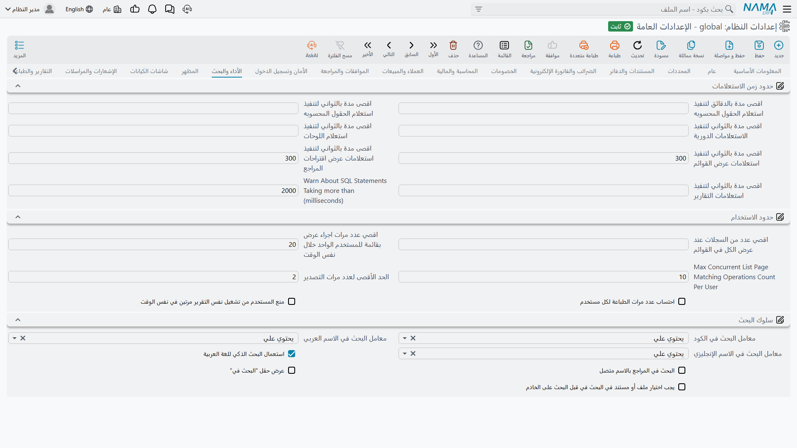

# الأداء والبحث

في هذه الصفحة همّان مترابطان. الأول حماية الخادم من عمل لن ينتهي أبداً: حدود زمن الاستعلامات وحدود الاستخدام لكل مستخدم. والثاني سلوك البحث، وهو مسألة سهولة استعمال ومسألة أداء في آن — بحكم طريقة استفادة قواعد البيانات من الفهارس.

## حدود زمن الاستعلامات

يحدّ كل من هذه الإعدادات المدة التي يُسمح فيها لنوع من الاستعلامات بالعمل قبل التخلي عنه. ووُجدت لأن فلتراً واحداً سيئ الكتابة قد يحتلّ اتصال قاعدة بيانات إلى ما لا نهاية ويبطئ النظام على الجميع.

**اقصى مدة بالدقائق لتنفيذ استعلام الحقول المحسوبه** `value.info.maxMinutesToExecuteSqlFieldQuery` — الحد الأعلى بالدقائق لاستعلام حقل SQL.

**اقصى مدة بالثواني لتنفيذ استعلام الحقول المحسوبه** `value.info.maxSecondsToExecuteSqlFieldQuery` — الحد نفسه بالثواني، لتحكم أدق.

**اقصى مدة بالثواني لتنفيذ الاستعلامات الدورية** `value.info.maxSecondsToExecuteUserTimedQueries` — للاستعلامات التي يجدولها المستخدمون بأنفسهم.

**اقصى مدة بالثواني لتنفيذ استعلام اللوحات** `value.info.maxSecondsToExecuteDashboardQuery` — لعناصر لوحات المعلومات. ويستحق ضبطاً منخفضاً نسبياً: فلوحة المعلومات يُفترض أن تُقرأ بنظرة، والعنصر الذي يستغرق نصف دقيقة معطوب سواء عاد بنتيجة في النهاية أم لا.

**اقصى مدة بالثواني لتنفيذ استعلامات عرض القوائم** `value.info.maxSecondsToExecuteListViewQueries` *(الافتراضي 300)* — لشاشات مطالعة القوائم.

**اقصى مدة بالثواني لتنفيذ استعلامات عرض اقتراحات المراجع** `value.info.maxSecondsToExecuteListPageQueries` *(الافتراضي 300)* — للاقتراحات التي يجلبها حقل المرجع وأنت تكتب فيه أو تبحث منه.

**اقصى مدة بالثواني لتنفيذ استعلامات التقارير** `value.info.maxSecondsToExecuteReportsQueries` — لاستعلامات التقارير. وهو أسخى الحدود عادةً، لأن تقرير آخر الشهر الثقيل يستغرق دقائق بحق.

**Warn About SQL Statements Taking more than (milliseconds)** `value.info.logSqlStatementsTakingMS` *(2000 إذا تُرك فارغاً)* — يظهر هذا الإعداد بالإنجليزية حتى في الواجهة العربية. كل جملة قاعدة بيانات أبطأ من هذا الحد تُضاف إلى القائمة في **Utilities ← View SQL Statements With Excessive Time**، مرة واحدة لكل جملة، مع أطول زمن استغرقته وعدد مرات تنفيذها. وهذا هو الإعداد الذي تلجأ إليه حين «يبدو النظام بطيئاً» ولا يستطيع أحد تحديد أين: أنقصه ليوم، واقرأ القائمة، ثم أعده. والقائمة محفوظة في الذاكرة، فتبدأ فارغة بعد كل إعادة تشغيل — انظر [حين يصبح النظام بطيئًا](/ar/admin/troubleshooting/system-is-slow).

## حدود الاستخدام

**اقصي عدد من السجلات عند عرض الكل في القوائم** `value.info.maxRecordsPerPageForListViews` — يحدّ عدد السجلات التي تعرضها القائمة حين يختار المستخدم *الكل* حجماً للصفحة. وبدونه سيطلب أحدهم يوماً خمسين ألف سطر في صفحة واحدة. ويمكن أن تضع إعدادات المستخدم نفسه، أو ملف صلاحياته، حداً مختلفاً له؛ ولا يمكن أن يُعطى مستخدمٌ *الكل* حجماً افتراضياً للصفحة ما دام هذا الحقل فارغاً.

**اقصي عدد مرات اجراء عرض بقائمة للمستخدم الواحد خلال نفس الوقت** `value.info.maxListViewCountPerUser` *(الافتراضي 20)* — كم عملية تحميل لشاشات القوائم يُسمح للمستخدم الواحد أن تعمل له على الخادم في اللحظة نفسها. ومن يتجاوزه يُرفض طلبه حتى ينتهي بعضها.

**Max Concurrent List Page Matching Operations Count Per User** `value.info.maxListPageMatchingRefCountPerUser` *(الافتراضي 10)* — يظهر بالإنجليزية حتى في الواجهة العربية. وهو الحد نفسه لعمليات البحث في حقول المرجع: كم منها يُسمح للمستخدم الواحد أن تعمل له في وقت واحد.

**الحد الأقصى لعدد مرات التصدير** `value.info.maxExportCount` *(الافتراضي 2)* — كم عملية تصدير يُسمح للمستخدم الواحد أن تعمل له في الوقت نفسه؛ وتُرفض أي عملية زائدة حتى تنتهي إحداها. والحقل نفسه في إعدادات المستخدم يتجاوز هذه القيمة لذلك المستخدم.

**احتساب عدد مرات الطباعة لكل مستخدم** `value.info.countPrintsPerUser` — يغيّر طريقة عدّ مرات إعادة الطباعة. ففي العادة يُعدّ السجل الذي طُبع مرة مطبوعاً في حق الجميع، فتحتاج طباعته التالية من أي مستخدم إلى صلاحية **الطباعة أكثر من مرة** وتُحسب ضمن حد الطباعة. ومع تفعيل هذا الخيار لا تُحسب إلا طباعات المستخدم الحالي نفسه السابقة لذلك السجل.

**منع المستخدم من تشغيل نفس التقرير مرتين في نفس الوقت** `value.info.prevUserToRunSameRepMultipleTimes` — يمنع المستخدم من إطلاق تقرير مجدداً بينما تشغيلته السابقة له ما زالت تعمل. وهذا الخيار يحل مشكلة حقيقية شائعة: يبدو التقرير البطيء وكأنه متوقف، فينقر المستخدم مرة أخرى، فتتنافس نسختان على قاعدة البيانات نفسها. والخيار نفسه موجود في إعدادات المستخدم وفي ملف الصلاحيات، فيمكن تطبيقه على بعض المستخدمين دون غيرهم.

## سلوك البحث

**معامل البحث في الكود** `value.info.codeSearchOperator` *(الافتراضي «يحتوي»)* — كيف يُطابَق البحث في حقل الكود: **يحتوي** أو **يبدأ بـ** أو **ينتهي بـ**.

**معامل البحث في الاسم العربي** / **الاسم الإنجليزي** `value.info.name1SearchOperator`, `value.info.name2SearchOperator` *(كلاهما «يحتوي» افتراضياً)* — والمثل مع حقلي الاسم العربي والإنجليزي.

::: tip «يبدأ بـ» أسرع بفارق كبير
«يحتوي» لا يستطيع الاستفادة من فهرس قاعدة البيانات — فعلى الخادم أن يقرأ كل سطر ويفحص نصه. أما «يبدأ بـ» فيستطيع، وعلى جدول فيه ملايين السجلات يكون الفرق بين إجابة فورية وانتظار ملحوظ. فإن صار البحث بطيئاً مع نمو بياناتك، فتحويل الكود إلى «يبدأ بـ» هو أنجع تغيير مفرد متاح في هذه الشاشة عادةً.
:::

::: info الاختيار نفسه لكن لحقل مرجع واحد
تسري المعاملات الثلاثة أعلاه على كل بحث في النظام. فإن كان ملف رئيسي واحد فقط هو الثقيل، فيمكن ضبط معامل البحث على حقل المرجع ذاك وحده من [أعدادات الحقول و الشاشات](/ar/platform/fields-and-entities-settings/fields-settings-reference-lookups) — وهي أيضاً الشاشة التي تضيف فيها أعمدة وأكواداً إضافية يبحث فيها حقل المرجع، فيجد المستخدم العميل برقم هاتفه أو رقمه الضريبي بدل اسمه.
:::

**البحث العربي الذكي في يحتوي** `value.info.smartArabicSearchInContains` *(مفعل افتراضياً)* — تُكتب العربية بصور مختلفة: فالألف تُكتب أ وإ وآ وا بالتبادل، والتاء المربوطة والهاء كذلك، والألف المقصورة والياء أيضاً. ومع تفعيل هذا الخيار يوسّع النظام هذه الحروف إلى صورها، فيجد الباحث عن «محمد» الاسم مهما كُتب أصلاً. ويستحق الإبقاء عليه مفعّلاً مع البيانات العربية دائماً تقريباً.

**البحث بالأسماء المرتبطة في المراجع** `value.info.searchWithConnectedNamesInRefs` — تطابق اقتراحات المراجع أسماء السجلات المرتبطة أيضاً، فكتابة اسم العميل قد تجد العقد الذي يخصه.

**إظهار «البحث في» في الشريط العلوي** `value.info.showSearchInForTopPanel` — يضيف قائمة اختيار الكيان «البحث في» إلى شريط البحث العلوي، فيضيّق المستخدم بحثه الشامل إلى نوع سجل واحد.

**وجوب اختيار الكيان في «البحث في» قبل البحث على الخادم** `value.info.mustSelectEntityInSearchInBeforeSearchOnServer` — يشترط أن يختار المستخدم كياناً هناك قبل تشغيل أي بحث على الخادم. وعلى قاعدة بيانات كبيرة يمنع هذا بحثاً غير مركّز من مسح كل شيء. وهو يعتمد على الخيار السابق — فيرفض النظام حفظه دون إظهار القائمة، ويخبرك بذلك.

**تجاهل ترتيب الكلمات عند البحث** `value.info.ignoreWordOrderInSearch` — يجب في الوضع المعتاد أن يظهر النص الذي يكتبه المستخدم في السجل كما كتبه وبالترتيب نفسه، فلا يجد الباحث عن «محمد أحمد» شيئاً إذا أُدخل العميل باسم «أحمد علي محمد». وبتفعيل هذا الخيار يُقسَّم النص المكتوب إلى كلمات، فيطابِق السجلُ حين يحتوي عليها كلها بأي ترتيب. ويسري على اقتراحات حقول المرجع وعلى البحث في حقول الكود والاسمين في القوائم. وهو يستحق التفعيل حيث تطول الأسماء ويختلف ترتيبها — والأسماء الشخصية العربية قبل كل شيء، إذ يُدخل كل موظف الاسم نفسه بترتيب مختلف.

::: warning لا يجعل البحث أسرع
مطابقة الكلمات بأي ترتيب لا تستطيع الاستفادة من فهرس قاعدة البيانات، فيقرأ الخادم كل سطر تماماً كما يفعل مع «يحتوي». فإن كان البحث بطيئاً فليس هذا علاجه، بل «يبدأ بـ» أعلاه. كذلك يظل معامل البحث المضبوط على حقل مرجع بعينه في [أعدادات الحقول و الشاشات](/ar/platform/fields-and-entities-settings/fields-settings-reference-lookups) متقدماً على هذا الخيار.
:::
