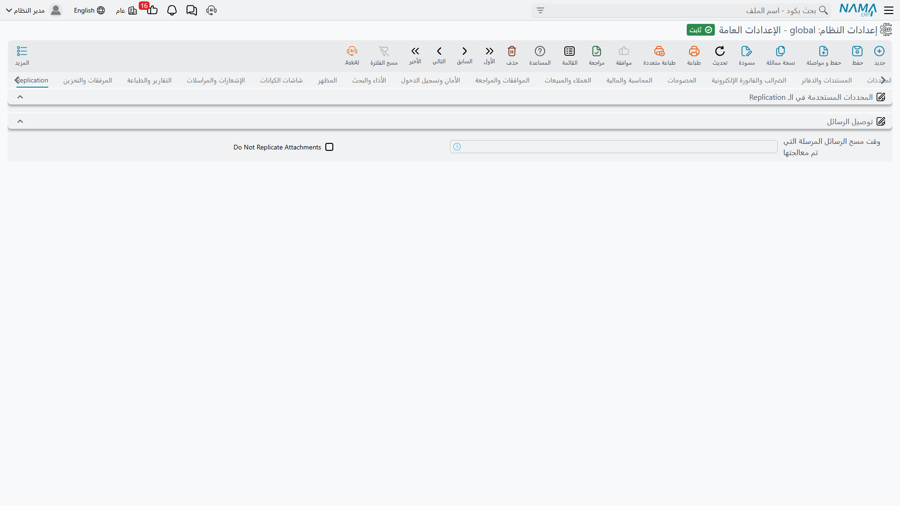

# Replication

يبقي الـ Replication عدة مواقع للنظام متسقة — مركزاً رئيسياً وفروعه، أو خوادم في بلدان مختلفة. فالسجلات المنشأة في موقع تُحزَم كرسائل وتُسلَّم إلى الباقي. وتحدد هذه الصفحة أي السجلات تسافر وإلى أين، وماذا يحدث حين يفشل التسليم.

::: tip قد لا ترى خيارات هذه الصفحة
الـ Replication مرخَّص على حدة، وخياراته تُخفى تماماً لا تُعرض معطلة حين تغيب الرخصة. والصورة أعلاه من تركيبة لا تملكها — فلا يظهر فيها إلا عنوانا المجموعتين والخيارات القليلة غير المرتبطة بالرخصة. أما في التركيبة المرخَّصة فتحمل الصفحة نفسها كل الحقول الموصوفة أدناه إضافةً إلى جدولين.
:::

## المحددات المستخدمة في الـ Replication

أول سؤال على الـ Replication أن يجيب عنه: *إلى أي موقع ينتمي هذا السجل؟* — والجواب يأتي من محددات السجل. وهذه المفاتيح الخمسة تحدد أي المحددات تشارك.

**استخدام الشركة في الـ Replication** `value.info.useLegalEntityInReplication` — تشارك الشركة في التوجيه.

**استخدام القطاع في الـ Replication** `value.info.useSectorInReplication`، **استخدام الفرع في الـ Replication** `value.info.useBranchInReplication` *(مفعل افتراضياً)*، **استخدام الإدارة في الـ Replication** `value.info.useDepartmentInReplication`، **استخدام المجموعة التحليلية في الـ Replication** `value.info.useAnalysisSetInReplication` — والمثل مع المحددات الأربعة الأخرى.

والفرع مفعّل افتراضياً لأن البنية المعتادة خادم لكل فرع. ولا تفعّل محدداً ثانياً إلا حيث يعتمد التوجيه عليه فعلاً — فكل محدد تضيفه يجعل قواعد التوجيه أصعب على التحليل حين لا يصل سجل إلى حيث كان متوقعاً.

## توصيل الرسائل

**أقصى عدد محاولات للرسائل** `value.info.maxTrialsForMessages` *(الافتراضي 0، ومعناه بلا حد)* — كم مرة تُحاوَل تسلمة رسالة الـ Replication قبل التخلي عنها.

**طلب إعادة الترحيل بعد الإخفاقات** `value.info.requestReCommitAfterFailures` — بعد إخفاقات متكررة، يطلب من الموقع المصدر ترحيل السجل مرة أخرى بدل الاستمرار في إعادة إرسال الرسالة نفسها.

**وقت تنظيف الـ Replication** `value.info.replicationCleanUpTime` — وقت اليوم الذي تُحذف فيه الرسائل المسلَّمة. اجعله ساعة هادئة: فالتنظيف يمسّ أسطراً كثيرة.

**عدم إرسال المرفقات في الـ Replication** `value.info.donotReplicateAttachments` — يُخرج المرفقات من حِزم الـ Replication. وهو الخيار الصحيح كثيراً على وصلة بطيئة أو محدودة، حيث قد تعطّل بضع صفحات ممسوحة كل رسالة أخرى خلفها.

**منع استخدام الفروع عندما يكون المركز الرئيسي متصلاً** `value.info.preventUsingBranchesWhenHeadOfficeIsOnline` — ترفض خوادم الفروع العمل محلياً ما دام المركز الرئيسي متاحاً، فيكتب الجميع في مكان واحد ولا يبقى ما يُسوَّى. ويصير خادم الفرع بديلاً احتياطياً عند انقطاع الوصلة لا نظيراً.

**مهلة منع استخدام الفروع عندما يكون المركز الرئيسي متصلاً** `value.info.preventUsingBranchesWhenHeadOfficeIsOnlineTimeout` *(الافتراضي 60)* — كم ثانية بلا رد قبل أن يُعدّ المركز الرئيسي غير متاح فيتولى الفرع. فالمهلة القصيرة تقلب الفرع إلى الوضع المحلي مراراً على وصلة بطيئة، والطويلة تجعل الموظفين ينتظرون دقيقة قبل أن يعملوا أثناء انقطاع حقيقي.

**رسالة خطأ دفتر الـ Replication بالعربية** / **بالإنجليزية** `value.info.replicationBookArabicError`, `value.info.replicationBookEnglishError` — الرسالة المعروضة حين يحاول أحدهم إنشاء سجل على الموقع الخطأ بالنسبة لموقع الـ Replication الخاص بمكوّده. وكلتاهما تقبل بديلين: `{0}` هو الخادم الذي كان ينبغي إنشاء السجل عليه، و`{1}` هو موقع الـ Replication الذي ينتمي إليه المكوّد. والقيم الافتراضية تذكر الاثنين أصلاً، وهذا ما يجعل الخطأ مفهوماً بذاته لمستخدم الفرع.

## ما يُستثنى من الـ Replication

**عدم الـ Replication** `value.info.doNotReplicate` *(جدول)* — أنواع الكيانات التي لا تدخل الـ Replication أبداً. كل سطر يذكر نوع كيان أو قائمة أنواع. استعمله مع كل ما هو محلي بحق — كإعدادات أجهزة الموقع نفسه مثلاً.

**عدم الـ Replication في مواقع** `value.info.noReplicationInSites` *(جدول)* — أكثر انتقائية: فكل سطر يذكر نوع كيان *وموقع Replication*، فيمكن مشاركة نوع سجل مع معظم المواقع وحجبه عن واحد. وبهذا تُبقي بيانات الرواتب مثلاً بعيدة عن موقع لا شأن له برؤيتها.
