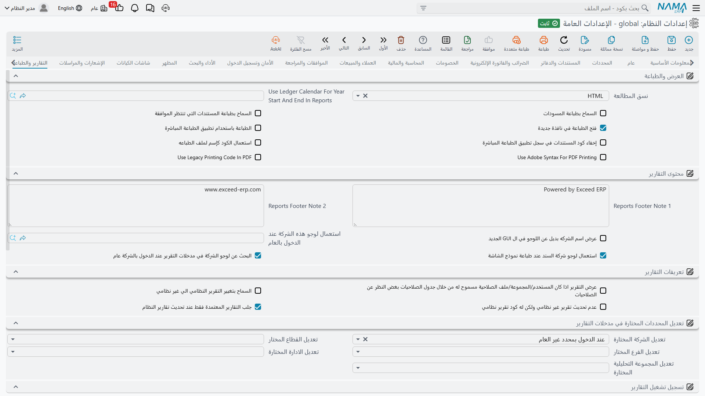

# التقارير والطباعة

كل ما يخص إنتاج المخرجات: الصيغة التي يُفتح بها التقرير، وما يظهر على الصفحة المطبوعة، وكيف تُملأ مدخلات المحددات، وما الذي يُسجَّل، وكيف تُنسَّق القيم، وكيف يُبنى التصدير إلى إكسل.

ولكتابة التقارير وتشغيلها انظر [دليل التقارير](../reports/reports-guide.md).

## العرض والطباعة

**صيغة العرض** `value.info.viewingFormat` *(الافتراضي HTML)* — هل يُفتح التقرير بصيغة **HTML** أم **PDF** أم **XLSX**. فـHTML أسرع في العرض ويتكيّف مع الشاشة، وPDF هو المطلوب حين يُطبع التقرير أو يُرسل بالبريد كما هو، وXLSX يسلّم القارئ جدولاً يعمل عليه. ويستطيع تعريف التقرير وإعدادات المستخدم نفسه تجاوز هذا الإعداد.

**استخدام تقويم الدفتر لبداية ونهاية السنة في التقارير** `value.info.useLedgerCalendarForYearStartAndEndInReports` — يشير إلى دفتر يحدد تقويمه المالي معنى «بداية السنة» و«نهايتها» في مدخلات التقارير. ولا غنى عنه حيث لا تمتد السنة المالية من يناير إلى ديسمبر.

**السماح بطباعة المسودات** `value.info.allowPrintingDrafts` *(موقف افتراضياً)* — هل تُطبع المسودة. وهو موقف افتراضياً لأن المسودة المطبوعة تبدو تماماً كمستند مطبوع في عين من يستلمها.

**السماح بطباعة السجلات في انتظار الموافقة** `value.info.allowPrintingAwaitingApprovalRecords` *(موقف افتراضياً)* — السؤال نفسه للسجلات التي ما زالت تنتظر موافقة.

**فتح الطباعة في نافذة المتصفح** `value.info.openPrintInBrowserWindow` — تُفتح المخرجات في نافذة متصفح بدل العارض المدمج، فيستعمل المستخدمون نافذة طباعة المتصفح نفسها.

**الطباعة باستخدام خادم Nama** `value.info.printUsingNamaServer` — يوجّه الطباعة عبر تطبيق الطباعة المباشرة، الذي يرسل المخرجات إلى طابعة مسمّاة مباشرةً بدل المرور بالمتصفح. وبهذا تطبع إيصالاً على طابعة المنفذ دون ظهور أي نافذة.

**إخفاء كود المستندات في سجل تطبيق الطباعة المباشرة** `value.info.doNotShowDocumentCodeInNamaServerPrintingLog` — يبقي أكواد المستندات خارج سجل ذلك التطبيق.

**استخدام كود السجل كاسم للملف** `value.info.useEntityCodeForFileName` — يسمّي الملف المصدَّر أو المطبوع بكود السجل، فيصير ملف الفاتورة معروفاً في مجلد التنزيلات.

**استخدام صيغة Adobe في طباعة PDF** `value.info.useAdobeSyntaxForPDFPrinting` — ينتج PDF بصيغة متوافقة مع Adobe. جرّبه إذا أساء عارض أو طابعة بعينها التعامل مع مخرجاتك.

**استخدام كود الطباعة القديم في PDF** `value.info.useLegacyPrintingCodeInPDF` — يرتد إلى مسار إنتاج PDF القديم، للتصميمات التي اعتمدت على سلوكه.

## محتوى التقارير

**ملاحظة تذييل التقارير 1** / **2** `value.info.reportsFooterNote1`, `value.info.reportsFooterNote2` *(الافتراضي "Powered by Nama ERP" و"www.namasoft.com")* — سطرا التذييل في كل تقرير. ومعظم التركيبات تستبدل بهما اسم الشركة وبيانات التواصل.

**إظهار اسم الشركة بجوار الشعار** `value.info.showCompanyNameNextToLogo` — يطبع اسم الشركة بجوار الشعار بدل الاعتماد على الشعار وحده.

**استخدام الشعار للعام** `value.info.useLogoForPublic` — شعار أي شركة يُستعمل حين يكون السجل المطبوع عاماً فلا شركة له.

**استخدام شعار شركة السجل عند طباعة النموذج** `value.info.useEntityLegalEntityLogoWhenPrintForm` *(مفعل افتراضياً)* — يحمل النموذج المطبوع شعار شركة السجل نفسه. وفي مجموعة شركات هذا ما يجعل فاتورة كل تابعة تبدو فاتورتها هي.

**البحث عن شعار الشركة في مدخلات التقرير حين تكون الشركة عامة** `value.info.whenPublicLegalEntitySearchLegalEntityLogoInReportParameters` *(مفعل افتراضياً)* — مع الشركة العامة، يُبحث عن الشعار في مدخلات التقرير بدلاً من ذلك.

## تعريفات التقارير

**السماح بالتقرير إذا كان المستخدم مسموحاً له عبر جدول الصلاحيات بصرف النظر عن الصلاحيات** `value.info.allowReportIfUserAllowedThroughSecurityTableRegardlessOfSecurity` — يكفي منح في جدول الصلاحيات لتشغيل تقرير حتى حيث ترفض الصلاحيات المعتادة.

**السماح بتغيير التقرير النظامي الي غير نظامي** `value.info.allowChangeSystemReportToNonSystem` — يسمح بتحويل تقرير نظامي إلى تقرير عادي، فيمكن تعديله محلياً.

**عدم تحديث تقرير غير نظامي يحمل كود تقرير نظامي** `value.info.dontUpdateReportNotASystemReportButHaveSameCodeOfSystemReport` — يترك أثناء تحديث التقارير النظامية أي تقرير مستخدم يصادف أن يحمل كود تقرير نظامي.

::: warning الخياران أعلاه مترابطان
يرفض النظام حفظ **السماح بتغيير التقرير النظامي الي غير نظامي** ما لم يكن الخيار الثاني مفعّلاً أيضاً، ويخبرك بذلك. والسبب مباشر: فتحويل تقرير نظامي يترك تقرير مستخدم يحمل كوداً نظامياً، وبدون الخيار الثاني سيطمس تحديثُ التقارير النظامية التالي تعديلاتك.
:::

**جلب التقارير المراجعة والمعتمدة فقط عند تحديث التقارير النظامية** `value.info.fetchReviewedAndApprovedReportsOnlyWhenUpdateSystemReports` — يقصر تحديث التقارير النظامية على التعريفات التي روجعت واعتُمدت.

## أنواع الذمم في مدخلات التقارير

التقرير الذي يأخذ ذمة كمدخل يسأل أولاً عن *نوع* الذمة، والقائمة المعروضة طويلة: ففي النظام نحو ثمانين نوع ذمة تغطي كل موديولات النظام. ولا تستعمل أكثر المنشآت منها إلا خمسة أو ستة.

**اظهار الذمم التالية فقط في مدخل نوع الذمة بالتقارير** `value.info.showOnlyTheseSubsidiaryTypesInReports` *(جدول)* — كل سطر يذكر نوعاً واحداً في عمود **نوع الذمة** `value.info.showOnlyTheseSubsidiaryTypesInReports.subsidiaryType`. واترك الجدول فارغاً فيعرض المدخل كل نوع تتيحه رخصتك، وهو الوضع الافتراضي؛ وأضف سطوراً فلا يعرض إلا ما ذكرته. فشركة تجارية لا ترفع تقاريرها إلا عن العملاء والموردين والموظفين تستطيع أن تختصر القائمة من ثمانين بنداً إلى ثلاثة، فيزول بذلك مصدرٌ حقيقي لإعادة تشغيل التقارير بمدخل خاطئ. أما الأنواع التابعة لموديول لا تملكه فتبقى مخفية في الحالتين.

ويمسّ هذا مدخل التقرير وحده. فهو لا يغيّر ما يُرجعه أي تقرير، ولا يقيّد حقول الذمة على المستندات.

## مدخلات المحددات في التقارير

**تعديل الشركة / القطاع / الفرع / الإدارة / المجموعة التحليلية المختارة** `value.info.overrideSelectedLegalEntity`, `...overrideSelectedSector`, `...overrideSelectedBranch`, `...overrideSelectedDepartment`, `...overrideSelectedAnalysisSet` — يأخذ كل منها **أبداً** أو **دائماً** أو **حين لا يكون عاماً**، ويقرر هل يُفرض المحدد الذي اختاره المستخدم حالياً في مدخل التقرير المقابل.

فـ**دائماً** يضمن ألا يرفع المستخدم تقريراً إلا عن فرعه، مقابل تعذّر تشغيل تقرير عابر للفروع. و**حين لا يكون عاماً** هو الوسط المعتاد: يُفرض المحدد حين يعمل المستخدم داخل واحد، ويُترك المدخل حراً حين لا يفعل. و**أبداً** يترك الاختيار كله لمن يشغّل التقرير.

## تسجيل تشغيل التقارير

**تسجيل أداء التقارير في قاعدة البيانات** `value.info.logReportPerformanceToDB` — يسجّل كم استغرق كل تقرير. وهو المفتاح الرئيسي للخيارات الثلاثة التالية.

**تسجيل المدخلات في قاعدة البيانات** `value.info.logParametersToDB` — يحفظ كذلك قيم المدخلات في كل تشغيلة، وهو ما يتيح لك التمييز بين تقرير بطيء و*مجموعة مدخلات* بطيئة.

**تسجيل التصدير في قاعدة البيانات** `value.info.logExportsToDB` — يسجّل عمليات التصدير كما يسجّل تشغيل التقارير.

**تسجيل النماذج في سجل التقارير** `value.info.logFormsToReportLog` — يُدخل النماذج المطبوعة في السجل نفسه.

::: info الثلاثة تعتمد على الأول
تفعيل أي من الثلاثة أعلاه بينما تسجيل أداء التقارير موقف مرفوضٌ عند الحفظ برسالة صريحة تذكر الخيار. فهي تسجّل تفاصيل *عن* تشغيلة مسجَّلة، فلا بد من تشغيلة مسجَّلة تُلحق بها.
:::

**إضافة تشغيل التقارير لسجل الإجراءات** / **إضافة التصدير لسجل الإجراءات** `value.info.addReportRunsToActionHistory`, `value.info.addExportToActionHistory` — يكتبان تشغيل التقارير وعمليات التصدير في سجل إجراءات السجل نفسه. وهذا هو جواب الأثر الرقابي عن سؤال «من صدّر قائمة العملاء هذه؟».

## صيغ عرض القيم في التقارير

تتحكم هذه الإعدادات في تنسيق الأرقام والتواريخ في مخرجات التقارير.

**صيغة العملة** `value.info.currencyPatternInReports` *(الافتراضي `#,##0.00;(#,##0.00)`)* — لاحظ الشطرين المفصولين بفاصلة منقوطة: الثاني يُستعمل للقيم السالبة، فيُطبع المبلغ السالب بين قوسين على الطريقة المحاسبية لا بإشارة ناقص.

**صيغة الكمية** `value.info.quantityPatternInReports` *(الافتراضي `#,##0.##`)* — تُحذف الأصفار الزائدة، فتُطبع الكمية 5 هكذا `5` لا `5.00`.

**صيغة المعدل** / **صيغة النسبة** `value.info.ratePatternInReports`, `value.info.percentPatternInReports` — لأسعار الصرف والنسب المئوية.

**صيغة التاريخ** `value.info.datePatternInReports` *(الافتراضي `yyyy-MM-dd`)*، **صيغة التاريخ والوقت** `value.info.dateTimePatternInReports` *(الافتراضي `yyyy-MM-dd HH:mm:ss`)*، **صيغة الوقت** `value.info.timePatternInReports` *(الافتراضي `hh:mm a`)* — اضبطها على ما يتوقعه قراؤك؛ و`dd/MM/yyyy` هو البديل الشائع.

## التصدير إلى إكسل

حين يُصدَّر التقرير إلى إكسل، يبدو التصميم الذي كان صحيحاً على الصفحة المطبوعة خاطئاً في جدول البيانات عادةً: فترويسات الصفحات تتكرر، والخلايا المدمجة تعطّل الفرز، والرسوم الخلفية تعترض الطريق. وهذه الخيارات تنظّف ذلك.

**تحديد نوع الخلية** `value.info.excelExportConfig.detectCellType` *(مفعل افتراضياً)* — يكتب الأرقام أرقاماً والتواريخ تواريخ لا نصوصاً. وهذا هو الخيار الذي يقرر هل يمكن جمع الورقة المصدَّرة وفرزها، فاتركه مفعّلاً.

**خلفية بيضاء** `value.info.excelExportConfig.whiteBackground` *(مفعل)*، **منع دمج الأسطر** `value.info.excelExportConfig.preventRowSpan` *(مفعل)*، **تجاهل حدود الخلية** `value.info.excelExportConfig.ignoreCellBorder` *(مفعل)*، **تجاهل خلفية الخلية** `value.info.excelExportConfig.igonreCellBackground`، **تجاهل الرسوم** `value.info.excelExportConfig.ignoreGraphics` — تجرّد التنسيق البصري الذي لا يحتاجه جدول البيانات. ومنع دمج الأسطر تحديداً هو ما يمنع الخلايا المدمجة من تعطيل الفلاتر والفرز.

**إزالة المساحات الفارغة بين الأسطر** / **بين الأعمدة** `value.info.excelExportConfig.removeEmptySpaceBetweenRows`, `...removeEmptySpaceBetweenColumns` — تزيل الأسطر والأعمدة الفاصلة التي يستعملها تصميم الطباعة للهوامش.

**إزالة ترويسة الصفحة** `value.info.excelExportConfig.removePageHeader` *(مفعل)* و**عدم إزالة ترويسة الصفحة الأولى** `value.info.excelExportConfig.dontRemoveFirstPageHeader` *(مفعل)* — يبقيان الترويسة مرة واحدة في الأعلى ويحذفان تكرارها في كل صفحة تالية، وهو تماماً ما يريده جدول البيانات.

**إزالة تذييل الصفحة** `value.info.excelExportConfig.removePageFooter` *(مفعل)*، **إزالة ترويسة العمود** `value.info.excelExportConfig.removeColumnHeader` *(مفعل)*، **إزالة تذييل العمود** `value.info.excelExportConfig.removeColumnFooter` *(مفعل)*، **إزالة عنوان التقرير** `value.info.excelExportConfig.removeReportTitle` *(مفعل)* — تحذف بقية زخارف الطباعة.

**تصدير نسخة المسودة** `value.info.exportDraftVersion` *(مفعل افتراضياً)* — يصدّر تصديرُ السجل نسختَه المسودة حين توجد.
