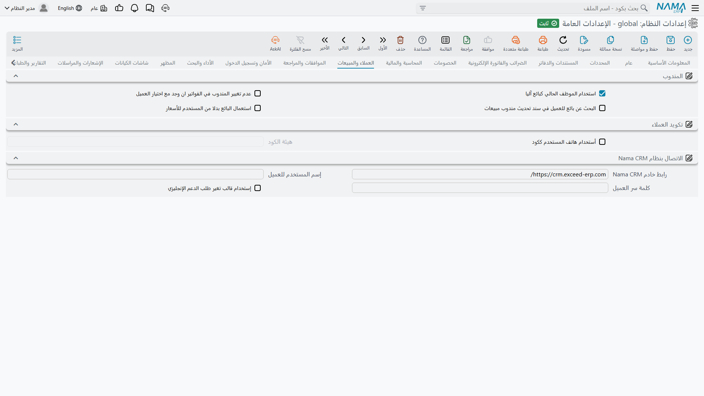

# العملاء والمبيعات

صفحة قصيرة بثلاث مهام غير مترابطة: تحديد من يُعدّ المندوب على المستند، وكيف تتكوّن أكواد العملاء، وكيف تتحدث هذه التركيبة مع نظام Nama CRM.

## المندوب

المندوب على مستند المبيعات يحكم العمولة والمستهدفات والتسعير في أحيان كثيرة، فيهمّ أن يقع الاسم الصحيح في مكانه دون أن يفكر فيه أحد. وهذه الخيارات الأربعة تصف كيف يختار النظام.

**استخدام الموظف الحالي كبائع آليا** `value.info.useCurrentUserAsSalesMan` *(مفعل افتراضياً)* — يصير سجل موظف المستخدم المسجَّل دخوله مندوبَ المستند، بشرط أن يكون ذلك الموظف موسوماً بأنه مندوب. وهو الإعداد الطبيعي حيث يكون مدخل الطلب هو من باعه — صالة عرض، أو منفذ بيع، أو جهاز لوحي للمبيعات الميدانية.

**عدم تغيير المندوب في الفواتير ان وجد مع اختيار العميل** `value.info.doNotOverrideSalesManWithCustomer` — يمكن أن يكون للعميل مندوب افتراضي، واختيار العميل يطبّقه عادةً فيستبدل ما كان موجوداً. ومع تفعيل هذا الخيار يُترك المندوب المختار على المستند كما هو. فعّله حيث لا يكون البائع دائماً هو ممثل العميل المعتمد.

**البحث عن بائع للعميل في سند تحديث مندوب مبيعات** `value.info.salesManSearch` — يمرّ البحث عن المندوب على مستند المبيعات عبر خدمة تراعي العميل بدل بحث عادي، فتكون القائمة المعروضة هي المندوبين المرتبطين بذلك العميل فعلاً.

**استعمال البائع بدلا من المستخدم للأسعار** `value.info.useSalesManAsEmployeeForPriceLists` — يمكن حل قوائم الأسعار حسب الموظف. ومع تفعيل هذا الخيار يكون *مندوب المستند* هو الموظف المستعمل في التسعير؛ ومع إيقافه يُستعمل موظف *المستخدم المسجَّل دخوله*. والفرق مهم في مكتب خلفي يُدخل فيه موظف واحد طلبات نيابةً عن مندوبين كثيرين — وهناك يكون المندوب هو الإجابة الصحيحة دائماً تقريباً.

## تكويد العملاء

**أستخدام هاتف المستخدم ككود** `value.info.useUserPhoneAsCode` — يصير رقم هاتف العميل كودَه. وتحب أعمال التجزئة والتوصيل هذا لأن رقم الهاتف هو ما يعرفه العميل وما يبحث به مركز الاتصال.

**هيئة الكود** `value.info.userCodeMask` — نمط يجب أن يطابقه الكود المولَّد، وبه تفرض شكل رقم هاتف بدل قبول أي أرقام. وهو **مطلوب** حين يكون الخيار السابق مفعّلاً؛ ويرفض النظام الحفظ بدونه.

## الاتصال بنظام Nama CRM

يمكن تبادل تذاكر الدعم مع نظام Nama CRM، وهذه الإعدادات الثلاثة هي الاتصال به.

**رابط خادم Nama CRM** `value.info.namaServerUrl` *(الافتراضي `https://crm.namasoft.com/`)* — عنوان نسخة الـ CRM.

**إسم المستخدم للعميل** / **كلمة سر العميل** `value.info.customerUserName`, `value.info.customerPassword` — بيانات الدخول التي تستعملها هذه التركيبة للتوثّق لديه.

**إستخدام قالب تغير طلب الدعم الإنجليزي** `value.info.useEnglishCRMTroubleTicketChangeTemplate` — يرسل النسخة الإنجليزية من إشعار تغيّر التذكرة بدل العربية.
