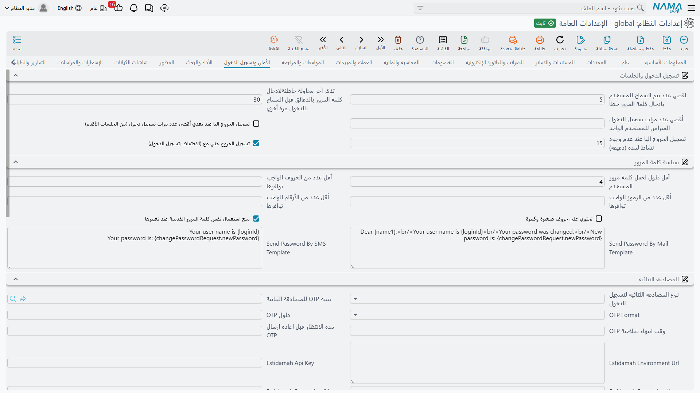

# الأمان وتسجيل الدخول

كل ما يخص الدخول إلى النظام وما تراه بعد الدخول: محاولات الدخول والجلسات، وقواعد كلمة المرور، والمصادقة الثنائية، وLDAP، ورؤية السجلات، وصفحة تسجيل المستخدمين العامة.

وللصورة الأوسع عن ملفات الصلاحيات، انظر [نظرة عامة على الصلاحيات](../security/security-overview.md).

## تسجيل الدخول والجلسات

**أقصى عدد لمحاولات الدخول الفاشلة** `value.info.maxFailedLoginAttempts` *(الافتراضي 5)* — عدد الإخفاقات المتتالية قبل حجب الحساب.

**عدد الدقائق لتذكر محاولات الدخول الفاشلة** `value.info.minutesToRememberFailedLogins` *(الافتراضي 30)* — النافذة الزمنية التي تُعدّ فيها تلك الإخفاقات. فخمس محاولات في ثلاثين دقيقة تقفل الحساب، والخمس نفسها موزّعة على يوم لا تقفله. والرقمان معاً يفرّقان بين مستخدم نسي وبين من يخمّن كلمات المرور.

**أقصى عدد لجلسات الدخول** `value.info.maxLoginSessions` — كم جلسة يملكها المستخدم الواحد في وقت واحد. اتركه فارغاً لبلا حد.

**الخروج الآلي عند بلوغ أقصى عدد للجلسات** `value.info.autoLogoutWithMaxSessions` — ماذا يحدث عند بلوغ الحد: مع تفعيله تُخرَج أقدم جلسة لإفساح المكان، ومع إيقافه يُرفض الدخول الجديد. والأول أرفق بمن ترك جلسة مفتوحة على جهاز آخر.

**وقت الخروج الآلي** `value.info.autoLogoutTime` *(الافتراضي 15)* — دقائق الخمول قبل إغلاق الجلسة آلياً.

**الخروج الآلي مع تذكرني** `value.info.autoLogoutRememberMe` *(مفعل افتراضياً)* — هل تخضع جلسات «تذكرني» أيضاً لمهلة الخمول تلك.

## سياسة كلمة المرور

تُفحص هذه القواعد كلما ضُبطت كلمة مرور أو غُيّرت.

**أقل طول لكلمة المرور** `value.info.minPasswordLength` *(الافتراضي 6)*، **أقل عدد حروف** `value.info.minAlphaChars`، **أقل عدد رموز خاصة** `value.info.minSpecialChars`، **أقل عدد أرقام** `value.info.minNumbersChars`، **حروف كبيرة وصغيرة** `value.info.upperAndLowerCase` — متطلبات التعقيد المعتادة.

**منع نفس كلمة المرور عند التغيير** `value.info.preventSamePasswordWhenChanging` *(مفعل افتراضياً)* — يرفض «تغييراً» يعيد كلمة المرور إلى ما كانت عليه.

**قالب إرسال كلمة المرور بالبريد** / **بالرسائل القصيرة** `value.info.sendPasswordByMailTemplate`, `value.info.sendPasswordBySMSTemplate` — الرسالتان المُرسلتان عند تسليم كلمة مرور جديدة. وكلتاهما تقبلان بدائل: `{name1}` لاسم المستخدم، و`{loginId}` لاسم الدخول، و`{changePasswordRequest.newPassword}` لكلمة المرور الجديدة نفسها.

## المصادقة الثنائية

**نوع المصادقة الثنائية لتسجيل الدخول** `value.info.login2FAMethod` — العامل الثاني المطلوب عند الدخول: **بدون**، أو **تطبيق المصادقة** (رمز متغيّر من تطبيق على هاتف المستخدم)، أو **رمز OTP برسالة**، أو **Estidamah API**.

**تنبيه OTP للمصادقة الثنائية** `value.info.notificationFor2FAOtp` — التنبيه الذي يحمل الرمز. وهو **مطلوب** حين تكون الطريقة «رمز OTP برسالة» — ويرفض النظام الحفظ بدونه، لأن رمزاً لا يصل أحداً يقفل الجميع خارج النظام.

**صيغة OTP** `value.info.otpFormat` — **أرقام** أو **أرقام وحروف** أو **حروف**. والأرقام أسهل في القراءة من الهاتف والكتابة، والأرقام والحروف أقوى عند الطول نفسه.

**طول OTP** / **وقت انتهاء صلاحية OTP** / **مدة الانتظار قبل إعادة إرسال OTP** `value.info.otpLength`, `value.info.otpExpiryTime`, `value.info.otpResendDelay` — كم طول الرمز، وكم يبقى صالحاً، وكم ينتظر المستخدم قبل طلب رمز آخر. ومدة الانتظار هي ما يمنع مستخدماً متعثراً من إطلاق سيل من الرسائل.

**Estidamah Environment Url**، **Estidamah Api Key**، **Estidamah Encryption Key**، **Estidamah Encryption IV** `value.info.estidamahEnvironmentUrl`, `value.info.estidamahApiKey`, `value.info.estidamahEncryptionKey`, `value.info.estidamahEncryptionIV` — عنوان الخدمة ومواد التشفير الخاصة بخدمة Estidamah. والأربعة مطلوبة عند اختيار تلك الطريقة.

::: warning Estidamah تحتاج إعداداً على الخادم أيضاً
اختيار طريقة Estidamah يستلزم كذلك تفعيل مدقق كلمة المرور المخصص في ملف `nama.properties` على الخادم (`use-custom-password-validator=true`). ويرفض النظام حفظ الإعدادات حتى يتم ذلك، ويخبرك بالإعداد الناقص بالضبط.
:::

## LDAP

**استخدام LDAP لدخول المستخدمين** `value.info.useLDAPForUsersLogin` — يوثّق المستخدمين لدى خادم الدليل بدل كلمات المرور المحفوظة داخل النظام.

**رابط خادم LDAP** / **نطاق LDAP الافتراضي** `value.info.ldapServerURL`, `value.info.defaultLDAPDomain` — عنوان خادم الدليل، والنطاق المفترض حين يكتب المستخدم اسم دخول مجرداً.

::: warning LDAP تحتاج إعداداً على الخادم أيضاً
كما مع Estidamah، يستلزم هذا وضع `use-ldap-for-authentication=true` في `nama.properties` قبل أن تُحفظ الإعدادات.
:::

## أمان السجلات

**السماح بتعطيل حقل الكود بالصلاحيات** `value.info.allowDisablingCodeFieldWithSecurity` *(مفعل افتراضياً)* — يتيح لملف الصلاحيات تعطيل حقل الكود.

**السماح بملء الحقول المعطلة بواسطة المكوّنات** `value.info.allowFillingDisabledFieldsWithCreators` *(مفعل افتراضياً)* — يدع مكوّنات النظام تكتب في حقول لا يُسمح للمستخدم بتعديلها. وهو المطلوب عادةً: فمن لا يُسمح له بكتابة الفرع يدوياً ينبغي أن يُملأ له آلياً.

**دمج ملفات الصلاحيات البديلة في المستخدم الرئيسي** `value.info.mergeAlternateSecurityProfilesIntoMainUser` — يمكن أن يحمل المستخدم ملفات صلاحيات بديلة، ويُنتقل بينها عادةً؛ ومع تفعيل هذا الخيار تُدمج في مجموعة صلاحيات فعّالة واحدة، فيملك المستخدم دائماً اتحاد ما تسمح به ملفاته كلها.

**عرض السجلات الممنوعة** `value.info.displayPreventedRecords` — تظل السجلات التي لا يملك المستخدم صلاحية عرضها مدرجةً (محجوبة لا مفتوحة) بدل اختفائها. وبعض المؤسسات تفضّل رسالة «لا يُسمح لك برؤية هذا» الظاهرة على قائمة أقصر في صمت.

**عدم عرض السجلات الممنوعة في مطالعة القوائم** `value.info.doNotdispPrevRecInListView` — القرار نفسه متخذاً على حدة لشاشات مطالعة القوائم. ويمكن ضبط كليهما على مستوى ملف الصلاحيات أيضاً، فيتجاوز ما ضُبط هنا.

**عرض السجلات ذات صلاحية التعديل للمستخدمين** `value.info.displayRecordsWithUpdateCapabilityToUsers` — يصير السجل ظاهراً إذا ملك المستخدم صلاحية العرض *أو* التعديل، بدل اشتراط العرض تحديداً. ويعالج الحالة المفاجئة لمستخدم يُسمح له بتعديل سجل ولا يُسمح له برؤيته.

**تجاهل صلاحيات السجلات في كل مطالعات القوائم** `value.info.ignoreRecordCapabilitiesInAllListViews` — يوقف ترشيح صلاحيات السجلات في كل شاشات مطالعة القوائم.

**تجاهل صلاحيات السجلات في** `value.info.ignoreRecordCapabilitiesIn` *(جدول)* — الشيء نفسه مقصوراً على أنواع الكيانات التي تسردها. وهو مفضَّل على الخيار الشامل أعلاه.

**منع حذف المستخدم المرتبط ب Entity System Entries** `value.info.preventDeleteUserRelatedToEntitySystemEntries` *(مفعل افتراضياً)* — يرفض حذف مستخدم ما زالت المدخلات النظامية تشير إليه. اتركه مفعّلاً — فحذف مثل هذا المستخدم يكسر الأثر الرقابي الذي تمثله تلك المدخلات.

## طلبات إضافة المستخدمين

يستطيع النظام إتاحة صفحة عامة يطلب فيها المستخدمون الجدد حساباً، وهذه الإعدادات تتحكم فيها.

**توجيه طلب إضافة مستخدم** / **دفتر طلب إضافة مستخدم** `value.info.userAddRequestTerm`, `value.info.userAddRequestBook` — التوجيه والدفتر المستعملان للطلبات التي تنشئها تلك الصفحة.

**عدم عرض نوع الموظف / المقاول / العميل / المورد** `value.info.dontDisplayEmployeeType`, `...dontDisplayContractorType`, `...dontDisplayCustomerType`, `...dontDisplaySupplierType` — يزيل كل نوع حساب من الخيارات التي تعرضها الصفحة العامة. فالعمل الذي يسجّل العملاء فقط ينبغي أن يوقف الأنواع الثلاثة الأخرى.

**رسالة ترحيب طلب إضافة مستخدم عربي** / **إنجليزي** `value.info.userAddRequestWelcomeMessageAr`, `value.info.userAddRequestWelcomeMessageEn` — النص المعروض لمن يصل إلى تلك الصفحة، بكل لغة.
