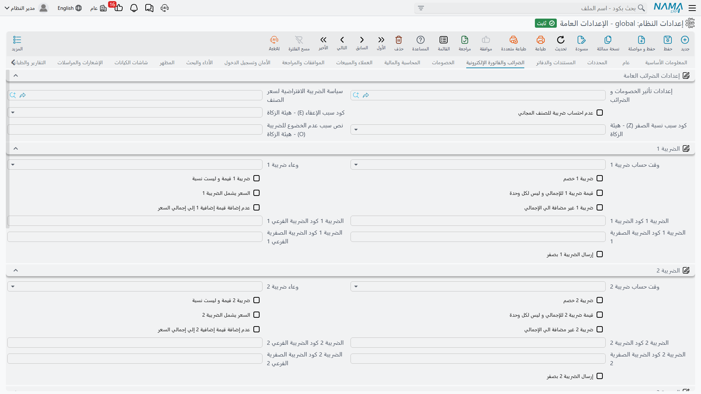

# الضرائب والفاتورة الإلكترونية

يحمل النظام أربع ضرائب مستقلة على كل سطر مستند، وهي عامة عن قصد: فالضريبة 1 هي ضريبة القيمة المضافة عادةً، لكن الضريبة 2 قد تكون خصماً تحت حساب الضريبة، والضريبة 3 رسماً بلدياً، والضريبة 4 دمغة. وما *هي* كل ضريبة يأتي كلياً من طريقة ضبطها هنا.

ولأن هذه الإعدادات نفسها يستعملها الخادم، والعميل على الويب أثناء كتابة المستخدم، وجهاز نقطة البيع، فإن الثلاثة يصلون إلى الرقم نفسه — ولهذا يهمّ أن تُضبط مرة واحدة مركزياً وأن تكون مفهومة.

## كيف تُوصف الضريبة

تحصل كل ضريبة من الأربع على المجموعة نفسها من الخيارات. وبدل تكرارها أربع مرات، إليك معنى كل خيار، مستعملين الضريبة *ن* للدلالة على أي منها.

**موقع الضريبة ن** `value.info.taxNLocation` — أي خانة مالية على السطر تُكتب فيها الضريبة المحسوبة: السعر الأساسي، أو أحد الخصومات الثمانية، أو خصم الرأس. وهذا ما يتيح لـ«ضريبة» أن تتصرف كخصم — وجّهها إلى خانة خصم فتنقص من السطر بدل أن تزيد عليه.

**نوع تطبيق الضريبة ن** `value.info.taxNApplyType` — الوعاء الذي تُطبَّق عليه النسبة، وهو أهم اختيار في هذه المجموعة على الإطلاق. وتتدرّج خياراته مع حساب السطر: **إجمالي السعر**، و**السعر بعد الخصم 1** حتى **السعر بعد الخصم 8**، و**بعد خصم الرأس**، وقيمة أي خصم منفرد، وقيمة خصم الفاتورة، وقيمة ضريبة أخرى، أو **مخصص**. فضريبة القيمة المضافة التي تُحتسب على الصافي بعد كل الخصومات التجارية هي «السعر بعد الخصم ن» لآخر خصم في سلسلتك؛ والضريبة المحتسبة على الإجمالي هي «إجمالي السعر».

**الضريبة ن خصم** `value.info.taxNIsDiscount` — يسم الضريبة بأنها اقتطاع لا إضافة. والخصم تحت حساب الضريبة هو الحالة المعتادة: يُحسب كضريبة لكنه يُطرح مما يدفعه العميل.

**الضريبة ن قيمة** `value.info.taxNIsValue` — تُدخل الضريبة كمبلغ مطلق بدل نسبة مئوية. استعمله مع الرسوم الثابتة على الوحدة.

**قيمة الضريبة ن للإجمالي** `value.info.taxNValueIsForTotal` — يُقرأ مع الخيار السابق: حين تكون الضريبة قيمة، هل هي للوحدة أم للسطر كله؟ التفعيل يعني السطر كله.

**السعر شامل الضريبة ن** `value.info.priceIncludesTax` (للضريبة 1)، `value.info.priceIncludesTax2`, `...3`, `...4` — سعر الوحدة يتضمن هذه الضريبة أصلاً، فيستخرجها النظام بدل إضافتها فوقه. وهذه حالة التجزئة: فسعر الرف هو ما يدفعه العميل، وعلى النظام أن يستخرج الضريبة منه عكسياً.

**الضريبة ن غير مضمنة في الإجمالي** `value.info.taxNNotIncludedInTotal` — تُحسب الضريبة وتُعرض لكنها لا تدخل في إجمالي المستند. تُستعمل مع الضرائب الإعلامية التي يُبلَّغ عنها ولا تُحصَّل على هذا المستند.

**عدم استخدام نسبة الضريبة ن كقيمة إضافية ن** `value.info.doNotUseTaxNPercentageAsAdditionalValueN` — تُنسخ نسبة الضريبة عادةً إلى حقل القيمة الإضافية على السطر، حيث تلتقطها التقارير وعمليات الربط. فعّل هذا الخيار إذا أردت ذلك الحقل لغرض آخر.

**كود الضريبة ن لدى المصلحة / الكود الفرعي** `value.info.taxesCodes.taxNTaxAuthType`, `...taxNTaxAuthSubType` — الأكواد التي تتوقعها مصلحة الضرائب لهذه الضريبة على الفاتورة الإلكترونية.

**كود الضريبة الصفرية ن / الكود الفرعي** `value.info.taxesCodes.taxNZeroTaxAuthType`, `...taxNZeroTaxAuthSubType` — الأكواد المستعملة بدلاً منها حين تكون قيمة الضريبة صفراً، إذ تطلب معظم المصالح الإبلاغ عن التوريد صفري النسبة بكود يختلف عن كود التوريد الخاضع.

**إرسال الضريبة ن بصفر** `value.info.taxesCodes.sendTaxNWithZero` — يُضمّن عنصر الضريبة في الإرسال حتى لو كانت قيمته صفراً. فبعض المصالح تشترط وجود السطر، وبعضها يرفضه.

::: tip اضبط السلسلة على الورق أولاً
الموقع ونوع التطبيق وإعدادات الخصومات في [صفحة الخصومات](./global-config-discounts.md) تصف معاً سلسلة حساب واحدة. اكتب سطر فاتورة حقيقياً على الورق — سعر القائمة، وكل خصم، وكل ضريبة، والإجمالي الذي يدفعه العميل فعلاً — ثم اضبط الخيارات بعد ذلك ليعيد النظام إنتاجه. فتغيير نوع التطبيق لاحقاً يغيّر حسابات كل مستند تُعاد حسبته.
:::

## إعدادات الضرائب العامة

**إعدادات التأثيرات** `value.info.effectsConfig` — يشير إلى ملف إعدادات تأثيرات الضرائب والخصومات. وهو البديل العام للسلسلة الثابتة أعلاه: فبدل الترتيب المدمج للخصومات والضرائب، يعرّف ذلك الملف حتى ثلاثة عشر تأثيراً مالياً وترتيبها وما يُحسب عليه كل منها بالضبط. الجأ إليه حين يتعذّر التعبير عن حساباتك بالإعدادات القياسية فعلاً.

**خطة الضرائب الافتراضية لسعر الصنف** `value.info.defaultTaxPlanForItemPrice` — خطة الضرائب المفترضة عند تسعير صنف ليست له خطة خاصة.

**لا ضرائب على الصنف المجاني** `value.info.noTaxesForFreeItem` — يصفّر الضرائب الأربع على الأسطر الموسومة بأنها أصناف مجانية، فلا تولّد الهدية الترويجية ضريبة على سعر صفري.

**كود سبب الإعفاء من ضريبة القيمة المضافة** `value.info.taxesCodes.vatExemptReasonCode` — سبب الإعفاء الافتراضي المُرسل مع التوريدات المعفاة.

**كود سبب النسبة الصفرية** `value.info.taxesCodes.vatZeroRateReasonCode` — السبب الافتراضي المُرسل مع التوريدات صفرية النسبة.

**نص سبب الخروج عن نطاق الضريبة** `value.info.taxesCodes.vatOutOfScopeReasonText` — نص حر يُستعمل سبباً للتوريدات الخارجة عن نطاق ضريبة القيمة المضافة.

## خصم التقريب

كثيراً ما تقرّب الأعمال النقدية إجمالي الفاتورة إلى رقم قابل للدفع — فيصير الإجمالي 99.87 مئةً كاملة أو العكس — وتقيّد الفرق في مكان مناسب.

**تفعيل خصم التقريب** `value.info.activateApproximationDiscount` — يفعّل التقريب.

**قيمة خصم التقريب** `value.info.approximationDiscountValue` — خطوة التقريب. اضبطها على أصغر عملة تتعامل بها فعلاً: `0.05` إن لم يكن لديك أصغر من خمسة قروش.

**اعتبار الدفع بالقسائم مع خصم التقريب** `value.info.considerVouchersPaymentWithApproxDisc` — يُدخل الدفع بالقسائم في المبلغ المقرَّب، بدل تقريب الجزء النقدي وحده.

## الفاتورة الإلكترونية

**طريقة عرض صفحة الفاتورة الإلكترونية** `value.info.einvoicePageShowType` — يدعم النظام عدة أنظمة وطنية للفوترة الإلكترونية، ويضيف كل منها صفحة حقول خاصة به إلى الشاشات الضريبية. اختر **مصر** أو **ZATCA** (السعودية) أو **JoFotara** (الأردن) أو **الإمارات** أو **كل الصفحات**. واختيار البلد الذي تعمل فيه يُخفي حقول الأنظمة الأخرى، وهو تقليل كبير للتشويش على الشاشة. وتركه فارغاً يتصرف كاختيار مصر.

**أقصى عدد أسطر عند تجميع مستندات المصلحة** `value.info.maxNumberOfLinesWhenCollectTaxAuthDocs` — عند تجميع المستندات لإرسالها إلى المصلحة، يحدّ هذا الخيار عدد ما يدخل الدفعة الواحدة. أنقصه إذا انتهت مهلة الإرسال، وزده لترسل دفعات أقل عدداً وأكبر حجماً.
