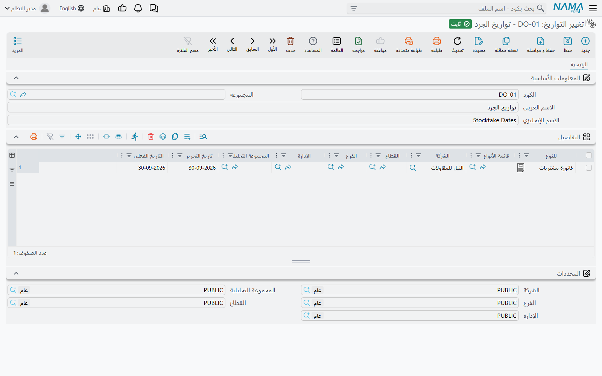

# تجميد الماضي وتغيير تواريخ المستندات

شاشتان صغيرتان تقرران *أي تاريخ يجوز أن يحمله المستند*. الأولى ترسم خطًّا تحت الماضي فلا يُعدَّل
شيء قبله ولا يُعاد حسابه. والثانية تقرر بأي تاريخ تحرير وتاريخ فعلي يُفتح المستند الجديد. لا صلة بين
غرضيهما، لكن الدعم الفني يلقاهما بالطريقة نفسها: عميل يشكو أن تاريخًا «خطأ» أو «لا يمكن استخدامه»،
والسبب سجل لا يذكر أحد أنه أنشأه.

## مستند تجميد المعالجة (Freeze Processing Document)

**الحسابات ← المستندات ← Freeze Processing Document**

تخيّل أن المراجعين اعتمدوا النصف الأول من السنة. الأرقام نهائية، والإقرارات الضريبية قُدّمت، ولا ينبغي
لأحد أن يسجّل أو يعدّل أو يعيد حساب أي شيء قبل 30 يونيو — لكن السنة لم تنتهِ، فلا يوجد قيد ختامي يرسم
هذا الخط. هنا يأتي **Freeze Processing Document** ليرسمه.

لا شيء في المستند يُملأ سوى رأسه المعتاد: **التاريخ الفعلي** والمحددات، والمهم منها **الشركة** وحدها.
فإذا اعتُمد جمّد كل ما تاريخه **في** تاريخه الفعلي **أو قبله** لتلك الشركة:

- **الحفظ مرفوض.** أي مستند لتلك الشركة له أثر محاسبي أو مخزني — أي شيء يُعالَج في الخلفية — لا
  يُحفظ وتاريخ أثره في الخط أو قبله، في أي وحدة. إنه الرفض نفسه الذي يُحدثه القيد الختامي، بالرسالة
  نفسها. أما المستندات التي لا أثر لها من هذا النوع فلا تتأثر.
- **نقل المستند عبر الخط مرفوض.** المستند المؤرَّخ قبل الخط لا يُنقل تاريخه الفعلي إلى ما بعده.
- **المعالجة في الخلفية تترك الماضي كما هو.** معالجة القيود والتكلفة التي تقع في الخط أو قبله
  تُتخطّى. فإذن استلام متأخر لم يعد يُرجع تغييرات التكلفة إلى صرف مجمّد، وإعادة معالجة مستند مجمّد لا
  تعيد بناء قيده — إلا إذا شُغّل أحد مفاتيح الاستعادة الموصوفة في صفحة الإقفال السنوي.

والخط مشترك مع القيود الختامية. لكل شركة يأخذ النظام آخر قيد ختامي **معتمد** وآخر مستند تجميد
**معتمد**، ويستعمل الأحدث منهما — فلا يتراكمان، والأحدث هو الغالب دائمًا. وكل ما يقال في
[الإقفال السنوي والتحكم في الفترات](/ar/modules/accounting/year-end-and-period-control) عن التعامل مع
القيد الختامي ينطبق هنا حرفًا بحرف.

::: warning لا ينشئه ولا يحذفه إلا الدعم الفني لنما
مستند التجميد ينتمي إلى مستوى الأمان المحمي L3Critical. حفظه أو حذفه من جلسة عادية يُرفض بالرسالة
«انت لا تمتلك صلاحية التعديل على الحقل {0} لأنه ينتمى لمستوى الأمان {1} برجاء التواصل مع الدعم الفنى»
— وهو الحاجز نفسه الذي يحمي أخطر خيارات الإعدادات العامة. العميل الذي يحتاج تجميد الماضي، أو فكّ
تجميده، يطلب ذلك من الدعم الفني لنما ليتمّه من جلسة دعم.
:::

لرفع التجميد يحذف الدعم الفني المستند (أو يستبدل به مستندًا بتاريخ أقدم). لا توجد علامة «غير نشط»: ما
دام مستند تجميد معتمد موجودًا فخطّه قائم.

::: tip اسم الشاشة يبقى بالإنجليزية
ليس للشاشة اسم عربي، فيرى المستخدم العربي **Freeze Processing Document** في القائمة وفي الرسائل.
:::

### مستند تجميد أم فترة مغلقة؟

كلاهما يمنع التسجيل في الماضي، لكنهما يعملان بطريقتين مختلفتين. **الفترة المالية** المغلقة
([التحكم في إقفال الفترات المحاسبية](/ar/platform/governance/fiscal-period-control-guide)) ترفض الحركات الجديدة داخلها،
ويمكن إعادة فتحها من شاشة **سنة مالية**. أما مستند التجميد فتاريخ واحد للشركة كلها، ويوقف إعادة
الحساب في الخلفية أيضًا، ولا يحرّكه إلا الدعم الفني. استعمل الفترات للإقفال الشهري، واحتفظ بالتجميد
لماضٍ يجب ألا يتغير أبدًا.

## تغيير التواريخ (Dates Overrider)

**الأساسيات ← الإعدادات ← تغيير التواريخ**

كل مستند جديد يُفتح بتاريخ اليوم تاريخًا للتحرير وتاريخًا فعليًا معًا. وهذا خطأ لفريق ما زال يُدخل
أوراق الشهر الماضي، أو لفرع طُلب منه أن يؤرّخ كل شيء بنهاية جرد. شاشة **تغيير التواريخ** تغيّر
تواريخ البداية بدل الاعتماد على تذكّر كل مستخدم أن يغيّرها.

الشاشة جدول واحد، يقول كل سطر فيه: *لهذه المستندات، إذا فتحها شخص يعمل تحت هذه المحددات، ابدأ بهذه
التواريخ.*

| العمود | ما يفعله |
|---|---|
| **للنوع** (For Type) | نوع مستند واحد يسري عليه السطر. |
| **قائمة الأنواع** (Entity List) | قائمة أنواع محفوظة، حين يجب أن يغطي سطر واحد عدة أنواع. اترك هذا العمود و**للنوع** فارغين ليغطي السطر كل أنواع المستندات. |
| **الشركة**، **القطاع**، **الفرع**، **الإدارة**، **المجموعة التحليلية** | محددات العمل التي يخصها السطر. |
| **تاريخ التحرير** (Issue Date) | تاريخ التحرير الذي يبدأ به المستند الجديد. اتركه فارغًا ليبقى الافتراضي المعتاد. |
| **التاريخ الفعلي** (Value Date) | التاريخ الفعلي الذي يبدأ به المستند الجديد. اتركه فارغًا ليبقى الافتراضي المعتاد. |

لا يعمل إلا لحظة فتح **مستند جديد**. يظل المستخدم قادرًا على تغيير أي من التاريخين قبل الحفظ، ولا
تُمسّ المستندات الموجودة أبدًا. والملفات الرئيسية لا تاريخ تحرير لها ولا تاريخ فعليًا، فلا تتأثر.

### كيف يُختار السطر

تُطابَق المحددات مع المحددات الخمسة التي **يعمل تحتها المستخدم** — التي اختارها عند الدخول أو من
مبدّل المحددات — لا مع المستند. ويجب أن تتطابق الخمسة كلها تمامًا، والخانة الفارغة في الجدول تعني
القيمة «عام» (PUBLIC)، **لا** «أي قيمة». فالسطر الذي لا يذكر إلا الشركة يسري على مستخدم قطاعه وفرعه
وإدارته ومجموعته التحليلية كلها «عام»، ولا يغطي مستخدمًا يعمل تحت فرع بعينه. إن أردت التواريخ نفسها
لثلاثة فروع فاكتب ثلاثة أسطر.

ولمجموعة محددات واحدة، السطر الذي يذكر نوع المستند (مباشرة أو عبر قائمة الأنواع) يغلب السطر الذي لا
نوع فيه. فإن لم يوجد أي منهما فُتح المستند بتاريخ اليوم كالمعتاد.

ويسري أي تعديل على شاشة تغيير التواريخ على المستند التالي الذي يُفتح — لا حاجة لأن يخرج أحد ويدخل.

::: tip «كل فاتورة جديدة تُفتح بتاريخ 31»
إذا شكا عميل من أن المستندات الجديدة تُفتح دائمًا بتاريخ قديم، فافتح شاشة تغيير التواريخ قبل أي شيء
آخر. سطر نُسي بعد جرد أو بعد اللحاق بنهاية السنة هو السبب المعتاد، وحذفه أو تفريغ عمودي التاريخ فيه
يحل المشكلة في الحال.
:::

## رسائل قد تظهر لك

| الرسالة | السبب | ماذا تفعل |
|---|---|---|
| «لا يمكن تعديل المستند {0} بتاريخ {1} لانه يوجد قيد ختامى بتاريخ {2}» | تاريخ المستند في الخط الذي رسمه آخر قيد ختامي **أو** مستند تجميد معتمد لشركته، أو قبله. | إن لم يفسّر أي قيد ختامي التاريخ في `{2}` فابحث عن Freeze Processing Document بتاريخ `{2}`. أدخل المستند بتاريخ لاحق، أو اسأل الدعم الفني هل ينبغي تحريك التجميد. |
| «لا يمكن تعديل التاريخ الفعلى للمستند {0} من تاريخ {1} الى تاريخ {2} لانه يوجد قيد ختامى بتاريخ {3}» | المستند قبل الخط، وحاول أحدهم نقله إلى ما بعده. | اترك المستند المجمّد كما هو، وسجّل التصحيح في مستند جديد بعد الخط. |
| «انت لا تمتلك صلاحية التعديل على الحقل {0} لأنه ينتمى لمستوى الأمان {1} برجاء التواصل مع الدعم الفنى» | حاول أحدهم حفظ Freeze Processing Document أو حذفه من جلسة عادية. | لا ينشئ مستند التجميد أو يعدّله أو يحذفه إلا الدعم الفني لنما. |
