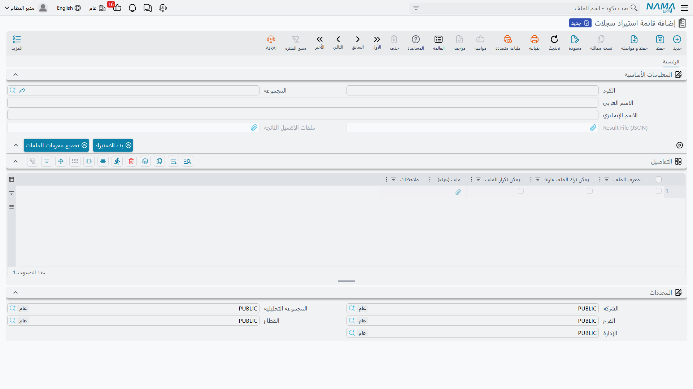
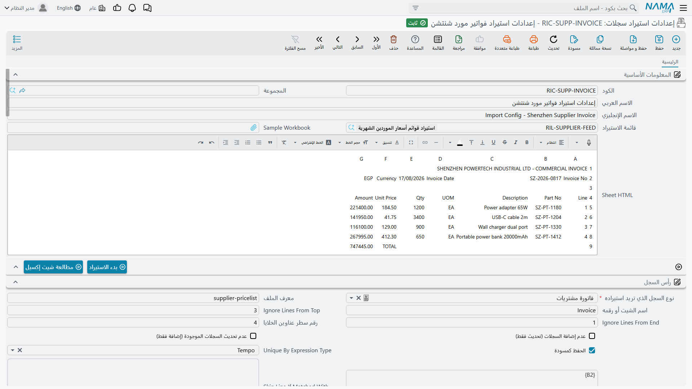
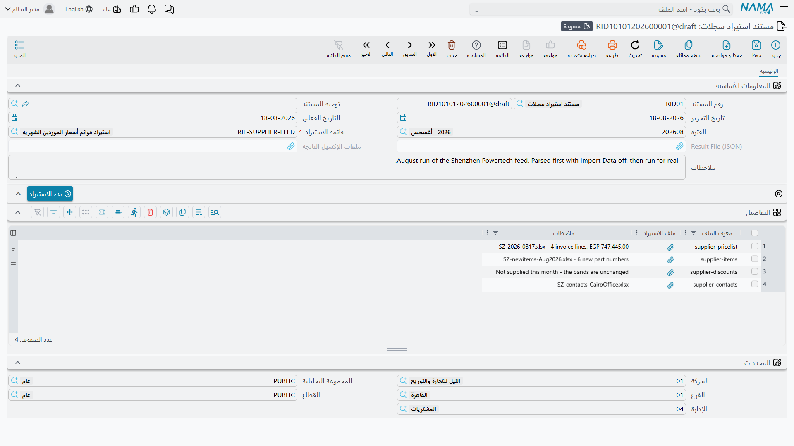

# الاستيراد المتقدم للسجلات

لأمر [استيراد السجلات](/ar/platform/import-export/importing-records.md) المعتاد شرط واحد يستبعد بهدوء نصف حالات تحميل البيانات الواقعية: أن يكون الملف بتخطيط Nama نفسه. وهذا سهل حين تكون أنت من صدّره. وهو مستحيل حين يأتي الملف من مكان آخر.

فمورّد يرسل قائمة أسعار بعناوينه وترتيب أعمدته. وبنك يرسل كشف حساب فوقه ثلاثة سطور ترويسة وتحته سطر إجماليات. ونظام قديم ينتج كشف عملاء يكون الفرع فيه كودًا عليك ترجمته، والتاريخ مكتوبًا `31/12/2024` في عمود و`2024-12-31` في آخر، ونصف السطور فراغات عليك تخطّيها.

تستطيع إعادة تشكيل كل واحد من هذه يدويًا كل شهر وتأمل ألا يخطئ أحد في عدّ عمود. والاستيراد المتقدم للسجلات هو البديل: تصف تخطيط الورقة الغريبة **مرة واحدة**، ثم تغذّيها ملفات جديدة إلى الأبد.

::: info الترخيص
الشاشات الثلاث في هذه الصفحة تتطلب ترخيص الاستيراد المتقدم (`basic-advanced-import`) وتقع تحت **الأساسيات ← الإعدادات**. أما أمر استيراد السجلات المعتاد فلا يحتاج ترخيصًا إضافيًا.
:::

## كيف تتكامل الشاشات الثلاث

يفصل التصميم بين *مِمَّ تتكون عملية التحميل*، و*كيف يُقرأ كل ملف*، و*تشغيلة هذا الشهر الفعلية*. وهذا الفصل هو ما يجعل الإعداد قابلًا لإعادة الاستعمال.

**قائمة استيراد سجلات** تسمّي عملية التحميل. فـ«الأرصدة الافتتاحية» قد تتكون من أربعة ملفات: العملاء، والأصناف، والمخزون الافتتاحي، والأستاذ الافتتاحي. وتعطي القائمة كلًّا منها معرّفًا وتقول هل هو اختياري.

**إعدادات استيراد سجلات** تصف ملفًا واحدًا — بل ورقة واحدة من ملف واحد في الحقيقة. أين العناوين، وأي السطور تُتخطى، وأي نوع كيان تصير إليه السطور، وأي خلية تغذّي أي حقل. وتكتب إعدادًا واحدًا لكل ملف في القائمة.

**مستند استيراد سجلات** هو التشغيلة. يشير إلى قائمة، وترفق أنت ملفات هذا الشهر الفعلية، وتضغط الزر.

اضبط الأولين مرة واحدة؛ ومن بعدها لا يكون الاستعمال اليومي إلا الثالث.

## قائمة استيراد سجلات



شاشة قصيرة. وجدول **التفاصيل** هو كل غرضها — سطر لكل ملف تتوقعه عملية التحميل:

| العمود | بالإنجليزية | الغرض |
|---|---|---|
| **معرف الملف** | File ID | معرّف قصير لهذا الملف مثل `customers` أو `opening-stock`. وهو المقبض الذي يستعمله كل ما عداه: فالإعداد يقول أي معرف ملف يصف، ومستند الاستيراد يقول أي معرف ملف يقابل كل ملف مرفوع. |
| **يمكن ترك الملف فارغا** | File Can Be Empty | أشِّر عليه فتستطيع التشغيلة المضيّ دون هذا الملف. واتركه خاليًا فيكون الملف إلزاميًا. |
| **يمكن تكرار الملف** | File Can Not Be Repeated | يمنع تقديم الملف نفسه أكثر من مرة في التشغيلة الواحدة. |
| **ملف (عينة)** | Sample File | أرفق نموذجًا لما ينبغي أن يبدو عليه هذا الملف، ليجد من يجهّز بيانات الشهر القادم ما ينسج على منواله. |
| **ملاحظات** | Description | ملاحظات حرة. ويستحق الملء — فهو ما يقرؤه من يجهّز الملفات. |

وفوق الجدول زران. **تجميع معرفات الملفات** يملأ لك الجدول من الإعدادات التي تشير إلى هذه القائمة سلفًا، وهو أيسر من كتابة المعرفات مرتين. و**بدء الاستيراد** يشغّل القائمة كلها.

أما حقلا **Result File (JSON)** و**ملفات الإكسيل الناتجة** الرماديان في الأعلى فيملؤهما النظام بعد التشغيلة — إذ يحملان ما عاد منها.

## إعدادات استيراد سجلات



هنا يقع العمل. فالإعداد الواحد يصف ورقة واحدة ويحوّل سطورها إلى سجلات من نوع كيان واحد.

### أن تعرف أين أنت

قبل ربط أي شيء أرفق **Sample Workbook** واضغط **مطالعة شيت إكسيل**. سيسألك عن الملف، وعن الورقة (بالاسم أو بالرقم، والافتراضي الأولى)، وعن عدد السطور المعروضة (خمسون افتراضيًا)، ثم يعرض الورقة داخل صندوق **Sheet HTML** على الشاشة. فتصير ترى الأعمدة الحقيقية وحروفها الحقيقية وأنت تملأ الربط، بدل التنقل ذهابًا وإيابًا إلى Excel.

ويربط حقل **قائمة الاستيراد** هذا الإعدادَ بالقائمة التي ينتمي إليها.

### مجموعة الهيدر — أين تبدأ البيانات فعلًا

نادرًا ما تبدأ الأوراق الغريبة ببيانات في السطر الأول. ومجموعة **الهيدر** هي وسيلتك لتقول للنظام أن يتجاوز الزخرفة:

| الحقل | بالإنجليزية | الغرض |
|---|---|---|
| **نوع السجل الذي تريد استيراده** | Imported Type | إلزامي. أي نوع كيان تصير إليه هذه السطور. |
| **معرف الملف** | Workbook ID | أي معرف ملف من قائمة الاستيراد يصفه هذا الإعداد. |
| **اسم الشيت أو رقمه** | Sheet Name Or Index | أي ورقة داخل الملف. |
| **Ignore Lines From Top** | | تخطَّ هذا العدد من سطور الترويسة قبل البيانات. |
| **رقم سطر عناوين الخلايا** | Cell Titles Row Number | أي سطر يحمل عناوين الأعمدة، حتى يمكن مطابقة الأعمدة بعناوينها لا بحروفها. |
| **Ignore Lines From End** | | تخطَّ هذا العدد من السطور في الأسفل — سطر الإجماليات، وسطر التوقيع. |
| **Skip Line If Matched With Query** | | أسقِط السطور التي تحقق شرطًا، للحالات العسيرة التي لا تعبّر عنها أعداد السطور أعلاه. |
| **Unique By Expression Type** / **Unique By Expression** | | ابنِ مفتاحًا من قيم السطر حتى تنطبق السطور المكررة على سجل واحد بدل أن تنشئ نسخًا. |
| **عدم إضافة السجلات (تحديث فقط)** | Do Not Add Records | ارفض إنشاء أي شيء؛ حدِّث الموجود فقط. |
| **عدم تحديث السجلات الموجودة (إضافة فقط)** | Do Not Update Records | ارفض الكتابة فوق أي شيء؛ أنشئ فقط. |
| **الحفظ كمسودة** | Save As Draft | اترك السجلات المستوردة مسودات للمراجعة. |

::: tip طابِق الأعمدة بالعنوان لا بالحرف
املأ **رقم سطر عناوين الخلايا** ثم اربط كل حقل بـ **عنوان الخلية** بدل **الخلية**. عندها يصمد الربط أمام إدراج المورّد عمودًا جديدًا الشهر القادم — وسيفعل، دون أن يخبرك.
:::

### جداول ربط الحقول

يربط جدول **حقول الهيدر** أعمدةَ الورقة بحقول السجل نفسه. وكل سطر فيه حقل واحد:

| العمود | بالإنجليزية | الغرض |
|---|---|---|
| **Field ID** | | إلزامي. الحقل الذي يُملأ. |
| **الخلية** | Cell Name | خذ القيمة من هذا العمود في الورقة — `B` للعمود B من السطر الجاري، أو عنوان كامل مثل `B2` لخلية ثابتة واحدة يشترك فيها كل السجلات. |
| **عنوان الخلية** | Cell Title | أو اعثر على العمود بنص عنوانه بدلًا من ذلك. |
| **القيمة الثابتة** / **تاريخ** / **مرجع** | Constant Value / Date / Reference | لا تقرأ الورقة أصلًا — ضع هذه القيمة الثابتة في كل سجل. وهكذا تختم كل سطر مستورد بالمخزن نفسه أو بدفتر المستندات نفسه حين لا يذكره الملف. |
| **Expression Type** / **Expression** | | احسب القيمة بدل قراءتها، للأعمدة التي تحتاج دمجًا أو تقسيمًا أو ترجمة — وللقيم التي تسكن خلية ثابتة لا عمودًا. انظر [الإشارة إلى الخلايا داخل الصيغة](#lshr-l-lkhly-dkhl-lSyG). |
| **تجاهل السطر بالكامل إذا كان الحقل فارغا** | Skip Row If Empty Or Zero | إن انتهى هذا الحقل فارغًا فاطرح السطر كله. وجّهه إلى عمود مفتاحي فتختفي سطور الحشو الفارغة في أسفل الورقة من تلقاء نفسها. |
| **تجاهل الحقل إذا كان فارغا** | Skip Field If Empty Or Zero | اترك الحقل كما هو حين تكون الخلية فارغة، بدل الكتابة بالفراغ فوق قيمة قائمة. وهذا جوهري في تشغيلات التحديث التي لا تحمل فيها الورقة إلا بعض الأعمدة. |
| **نوع الحقل** | Field Type | افرض كيفية قراءة الخلية، حين تخطئ القراءة التلقائية. |
| **يستعمل لمنع التكرار** | Use As Uniqueness Key | هذا الحقل جزء مما يحدّد هوية السجل، فسطران يحملان القيمة نفسها هما السجل نفسه. |
| **Date Formats** | | أنماط التواريخ التي تُجرَّب، مفصولة بـ `##`. وهذا جواب الملف الذي يكتب التواريخ بشكل يرفض Excel التعرّف عليه. |
| **ملاحظات** | Description | ملاحظات على الربط. وستشكر نفسك عليها لاحقًا. |

وتفعل جداول **حقول سطور 1** حتى **حقول سطور 5** الشيء نفسه لخمسة جداول تفاصيل على الأكثر، لكل منها ورقة عينة خاصة ومجموعة هيدر خاصة. ويضيف كل جدول تفاصيل ثلاثة حقول لا يحتاجها الهيدر:

- **معرف السطور** — أي جدول تفاصيل في السجل الهدف تملؤه هذه السطور.
- **Header Link Field** و**Detail Link Field** — زوج الأعمدة الذي يقول أي سطر هيدر ينتمي إليه كل سطر تفاصيل. وهذا نظير العمود `#headerconnector` في ملف التصدير الأصلي: فالقيمة في عمود ربط سطر التفاصيل لا بد أن تطابق القيمة في عمود ربط أحد سطور الهيدر.

### الإشارة إلى الخلايا داخل الصيغة

يتكفّل حقلا **الخلية** و**عنوان الخلية** بالحالة المعتادة، حيث تجلس القيمة في عمود ويحمل كل سطر نسخته منها. أما **Expression** فهو لكل ما عدا ذلك، ويحدّد **Expression Type** طريقة كتابته: **Tempo** (قالب نصي) أو **Groovy** (سكربت قصير) أو **Query** (جملة SQL تصير نتيجتها هي القيمة).

وتقرأ الطرق الثلاث الورقةَ بالأسلوب نفسه. فحرف العمود يسمّي خلية، والسطر المفهوم ضمنًا هو السطر الجاري استيراده. وتضع Tempo وQuery الحرفَ بين قوسين معقوفين — `{A}` و`{AC}` — بينما تكتبه Groovy مجرّدًا:

```groovy
A + " - " + B          // ضمّ عمودين
$H * $I                // الكمية × السعر، مقروءَين كأرقام
```

وتضيف Groovy تسهيلين: تصديرُ الاسم بعلامة `$` يفرض قراءة الخلية رقمًا، فتصير الخلية غير المقروءة صفرًا بدل أن تكون خطأ، و`rowNum` يعطيك رقم السطر. والحروف لا تفرّق بين الكبير والصغير — فـ `a + 2` و`$a` سليمان.

#### خلايا تقع خارج السطر

تحبّ الأوراق الواردة من الخارج أن تضع القيم التي تعمّ الورقة كلها في خلية مستقلة قرب أعلاها: شهر كشف الحساب في `B2`، وسعر الصرف في `D1`، واسم الفرع مدفونًا في ترويسة الخطاب. وهذه القيم تخصّ كل سجل أنت بصدد إنشائه، لكنها موجودة مرة واحدة فقط ولا تقع في أي عمود، فلا يستطيع حرف العمود بلوغها. وكانت الحيلة المعتادة أن تنسخ القيمة إلى تسعمائة سطر قبل الرفع، وتدعو ألّا ينساها أحد.

اكتب **العنوان الكامل** — الحرف *ورقم السطر* معًا — تحصل على تلك الخلية بعينها، أيًّا كان السطر الجاري استيراده:

```groovy
A + " / " + B2         // العمود A من هذا السطر، مع الخلية الثابتة B2
$D1 * $H               // سعر الصرف المركون في D1 مطبَّقًا على مبلغ هذا السطر
```

وتعمل الأقواس المعقوفة بالطريقة نفسها في صيغ Tempo وQuery: `{B2}` و`{AA55}`.

::: tip رقم السطر هو الذي تراه في Excel
الخلية `B2` هي السطر المادي الثاني في الورقة، مرقَّمًا تمامًا كما يرقّمه Excel. ولا يزحزحه حقلا **Ignore Lines From Top** و**Ignore Lines From End** — فالقيمة القابعة في سطور الترويسة التي تخطّيتها عمدًا تبقى في المتناول، وهذا هو المقصود عادةً.
:::

ويستطيع سكربت Groovy كذلك أن يصل إلى الورقة مباشرة عبر `sheet`، وهو أوضح حين تحتاج عدة خلايا ثابتة دفعة واحدة:

```groovy
sheet.getCell("A9")
sheet.A9               // الخلية نفسها بكتابة أقصر
```

ويفهم عمود **الخلية** الصيغتين نفسيهما، فلست بحاجة إلى صيغة محسوبة أصلًا حين يتغذّى الحقل من خلية ثابتة واحدة: ضع فيه `B2` بدل `B` فيأخذ كل سجل قيمته من تلك الخلية وحدها.

### تشغيل إعداد واحد

يشغّل زر **بدء الاستيراد** في هذه الشاشة هذا الإعداد وحده. ويطرح أربعة أسئلة أو خمسة:

| الخيار | الافتراضي هنا | ما الذي يفعله |
|---|---|---|
| **Parse Data From Files** | مفعّل | اقرأ الملفات واستنتج معنى السطور. |
| **استيراد** | **غير مفعّل** | اكتب السجلات فعلًا. واتركه غير مفعّل فتحصل على تشغيلة تجريبية للقراءة فقط — يخبرك النظام بما *كان* سينشئه دون أن يمسّ شيئًا. |
| **Save Result As Excel Sheets** | مفعّل | أعِد النتيجة كأوراق Excel مؤشَّر عليها بدل بيانات خام. |
| **المتابعة عند حدوث خطأ** | غير مفعّل | امضِ متجاوزًا السطر الفاشل. |
| **Copy Inserted Property From Old Data** | مفعّل | انقل علامات «تم الإدراج» من التشغيلة السابقة، حتى تتخطى إعادةُ التشغيل ما نجح سلفًا. |

::: tip اقرأ قبل أن تستورد
القيمة الافتراضية هنا مقصودة. شغّلها مرة و**استيراد** غير مفعّل، واقرأ النتيجة، وأصلح الربط، وعندها فقط شغّلها للجدّ. فالتشغيلة التجريبية لا تكلفك شيئًا وتلتقط العمود المربوط خطأً الذي كان سيكتب أكواد أصناف في حقل الملاحظات لتسعمئة سجل.
:::

## مستند استيراد سجلات



الشاشة اليومية — وهي التي يفتحها فعلًا من يقوم بالتحميل الشهري.

اختر **قائمة الاستيراد**، ثم أضف سطرًا لكل ملف في الجدول: **معرف الملف** الذي يقول أي الملفات المتوقعة هو هذا، و**ملف الاستيراد** نفسه. ثم اضغط **بدء الاستيراد**.

ولأنه مستند لا إعداد فهو يحتفظ بأثر: فكل تشغيلة مستند محفوظ تستطيع الرجوع إليه، يبيّن أي الملفات حُمِّلت ومتى وما الذي عاد منها. وقيمه الافتراضية في **بدء الاستيراد** مضبوطة للاستعمال الحقيقي لا للتجربة — فـ**استيراد** و**المتابعة عند حدوث خطأ** يبدآن مفعّلين.

## الاختيار بين الآليتين

| | استيراد سجلات | الاستيراد المتقدم للسجلات |
|---|---|---|
| **تخطيط الملف** | لا بد أن يكون تخطيط Nama | أي تخطيط تستطيع وصفه |
| **الإعداد المطلوب** | لا شيء | إعداد لكل ملف |
| **من أين تبدأ** | قائمة المزيد في أي شاشة قائمة | شاشة مستند استيراد سجلات |
| **الأنسب لـ** | تعديل ما صدّرته؛ تصحيح عابر | تغذية متكررة من نظام لا تتحكم فيه |
| **ترخيص إضافي** | لا | نعم |

والقاعدة العملية: إن كنت تستطيع إنتاج الملف بنفسك فصدِّر قالبًا واستعمل **استيراد سجلات**. وإن كان الملف يصلك من غيرك بشكل لا تملي أنت هيئته — وسيصل ثانية الشهر القادم — فكلفة إعداد الربط تسدّد نفسها فورًا.

وهناك خيار ثالث جدير بالمعرفة للتغذيات التي ينبغي أن تعمل دون أن يضغط أحد زرًا أصلًا: إذ يستطيع [مسار الكيان أن يستورد من ورقة Excel أو من استعلام SQL](/ar/platform/entity-flows/excel-and-sql-import-by-entity-flow.md) وفق جدول زمني أو استجابةً لحدث.

وخيار رابع، حين لا ينبغي أن يصل الملف إلى خادمك يدويًا من الأساس: نقطة **مُكامِل استيراد** تُسجَّل في [أعدادات الحقول و الشاشات](/ar/platform/fields-and-entities-settings/fields-settings-integrations)، فتمنح النظامَ المرسِل عنوانًا يدفع إليه الملف مباشرة. فلا أحد ينزّل مرفقًا ولا أحد يفتح شاشة — بل يسلّم نظام المورّد الملف فيعمل الاستيراد.
