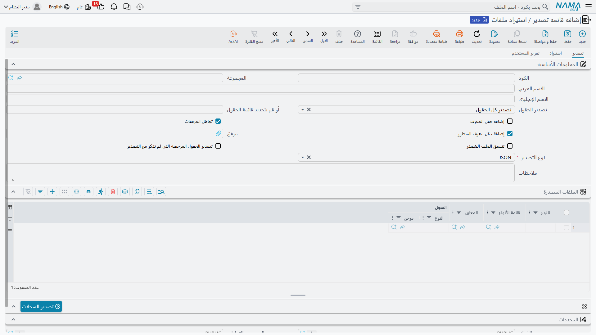
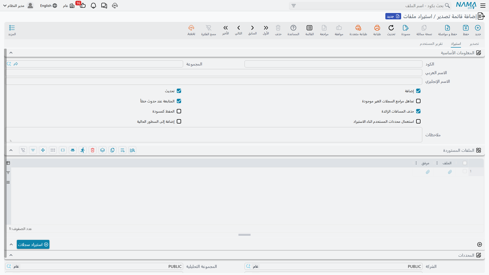
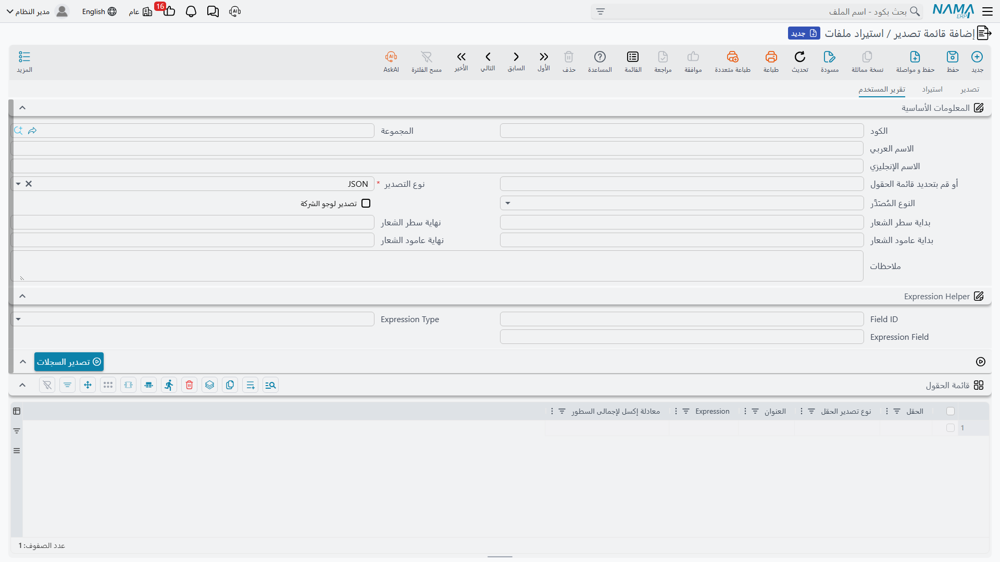

# قائمة تصدير / استيراد ملفات

نافذة التصدير كافية لعملية عابرة. لكن بعض عمليات التصدير ليست عابرة — فالمجموعة نفسها من السجلات، بالأعمدة نفسها، تُسحب كل شهر للمحاسب نفسه. وإعادة اختيار تسعة خيارات وإعادة كتابة قائمة حقول في كل مرة هي بالضبط ما يقع فيه الخطأ.

وشاشة **قائمة تصدير / استيراد ملفات** تحوّل عملية التصدير إلى تعريف محفوظ باسم تشغّله بزر واحد. وتفعل الشيء نفسه للاستيراد. ولها حيلة ثالثة لا علاقة لها بالرحلة ذهابًا وإيابًا: إذ تستطيع بناء **ورقة Excel مخصصة** بعناوين أعمدة من عندك وأعمدة محسوبة وإجماليات — تقرير خفيف تصمّمه دون أن تفتح مصمّم التقارير.

وتجدها في **الأساسيات ← الإعدادات ← قائمة تصدير / استيراد ملفات**. وللشاشة ثلاث صفحات، وأيّها تستعمل يتوقف على أي الأعمال الثلاثة تؤدي.

## الصفحة الأولى — التصدير



يكرر النصف العلوي خيارات نافذة التصدير — *الحقول المصدرة* و*أو قم بتحديد قائمة الحقول* و*إضافة حقل المعرف* و*تجاهل المرفقات* و*إضافة حقل معرف السطور* و*نوع التصدير* — حتى تحمل القائمة المحفوظة إجاباتها بنفسها فلا يضطر أحد إلى تذكّرها.

وهنا يظهر خياران لا تقدّمهما النافذة:

| الخيار | بالإنجليزية | ما الذي يفعله |
|---|---|---|
| **تنسيق الملف المُصدر** | Export Formatted Json | يكتب ملف JSON منسّقًا مقروءًا بدل سطر واحد طويل. ولا يهمّ إلا مع JSON. |
| **تصدير الحقول المرجعية التي لم تذكر مع التصدير** | Export Inner Reference | يُصدِّر أيضًا السجلات الرئيسية التي تشير إليها سجلاتك وإن لم تخترها. صدِّر دفعة فواتير وهذا الخيار مفعّل فيأتي معها العملاء والأصناف التي تشير إليها — وهو ما تريده تحديدًا حين تنقل بيانات إلى تطبيق آخر لا تكون موجودة عنده بعد. |

وجدول **الملفات المصدرة** أسفل ذلك هو موضع تحديد *ما* الذي تصدّره. وكل سطر فيه كتلة سجلات:

| العمود | بالإنجليزية | الغرض |
|---|---|---|
| **للنوع** | For Type | نوع الكيان الذي يصدّره هذا السطر. |
| **قائمة الأنواع** | Entity List | قائمة أنواع، حين يُراد لسطر واحد أن يغطي عدة أنواع. |
| **المعايير** | Criteria | تعريف معايير محفوظ يضيّق نطاق السجلات. ولا يعرض المنتقي إلا المعايير المبنية للنوع الذي اخترته. |
| **السجل** | Record | سجل بعينه، حين تريد تصدير سجل واحد بالتحديد. |

أضف عدة سطور فتنتج التشغيلة الواحدة ملفًا واحدًا يحويها جميعًا — العملاء والأصناف وقوائم الأسعار معًا. اضغط **تصدير السجلات** فتصل النتيجة كتنزيل في ملف مضغوط.

::: tip هكذا تنقل إعدادًا بين التطبيقات
قائمة فيها بضعة سطور — دفاتر المستندات، والتوجيهات، وتعريفات المعايير، وتخطيطات الشاشات — مع تفعيل *تصدير الحقول المرجعية التي لم تذكر مع التصدير* تعطيك حزمة «انقل هذا الإعداد إلى خادم العميل» قابلة للتكرار. شغّل القائمة نفسها بعد كل تعديل فيكون الملف محدّثًا دائمًا.
:::

## الصفحة الثانية — الاستيراد



الفكرة نفسها بالاتجاه المعاكس. والمربعات الثمانية هي بعينها التي في نافذة [استيراد السجلات](/ar/platform/import-export/importing-records.md) — *إضافة* و*تحديث* و*تجاهل مراجع السجلات الغير موجودة* و*المتابعة عند حدوث خطأ* و*حذف المسافات الزائدة* و*الحفظ كمسودة* و*استعمال محددات المستخدم اثناء الاستيراد* و*إضافة إلى السطور الحالية* — بالقيم الافتراضية نفسها، محفوظةً مرة واحدة بدل اختيارها في كل مرة.

وجدول **الملفات المستوردة** يستقبل الملفات نفسها: لكل سطر **الملف** الحامل للبيانات، و**المرفق** المضغوط المرافق إن احتاجه. أرفق عدة ملفات بقائمة واحدة فيعالجها **استيراد السجلات** كلها في تشغيلة واحدة.

وهذا هو النصف الطبيعي المقابل لقائمة التصدير أعلاه: صدِّر إعدادًا من تطبيق، وافتحه كمرفق هنا في التطبيق الآخر، واضغط الزر.

## الصفحة الثالثة — تقرير المستخدم



تفعل هذه الصفحة شيئًا مختلفًا عن الصفحتين الأخريين، ومن السهل ألا تنتبه له. اضبط **نوع التصدير** على **تقرير** فتكفّ القائمة عن إنتاج ملف تقرؤه الآلة وتبدأ بإنتاج **ورقة صمّمتها أنت**: أعمدتك بترتيبك بعناوينك، بما في ذلك أعمدة محسوبة وإجماليات في الأسفل.

::: warning ورقة التقرير طريق مسدود، عن قصد
فليس فيها سطور علامات ولا معرفات حقول ولا عمود أخطاء — إنها ورقة ليقرأها إنسان. ولا يمكن استيرادها مرة أخرى. فإن احتجت ملفًا يعود في رحلة ذهاب وإياب فاستعمل Excel أو XML أو JSON في الصفحة الأولى.
:::

اضبط **النوع المُصَدَّر** على السجل الذي تعدّ عنه التقرير. وهذا الاختيار وحده يقود كل ما بعده في الصفحة: فمنتقيات الحقول أدناه لن تعرض إلا حقول ذلك النوع، ولا يمكن إعداد تقرير عن أكثر من نوع واحد في القائمة الواحدة.

### تصميم الأعمدة

جدول **قائمة الحقول** هو سطح التصميم. و**السطر الواحد فيه عمود واحد في المخرجات**، وترتيب السطور هو ترتيب الأعمدة.

| العمود | بالإنجليزية | الغرض |
|---|---|---|
| **الحقل** | On Field | الحقل المراد قراءته. وقد يشير إلى داخل جدول تفاصيل — راجع الملاحظة عن تعدد السطور أدناه. |
| **نوع تصدير الحقل** | Field Export Type | كيفية عرضه: **قيمة الحقل** (القيمة الخام)، أو **الكود** أو **الاسم العربي** أو **الاسم الإنجليزي** (لمرجع، فيُعرض كود الهدف أو اسمه العربي أو الإنجليزي)، أو **Expression** (يُحسب — انظر أدناه)، أو **إجمالي السطور**. |
| **العنوان** | Title | عنوان العمود. اتركه فارغًا فيُستعمل مسمّى الحقل نفسه على الشاشة باللغة الحالية. |
| **Expression** | Expression | الصيغة الحسابية، وتُستعمل حين يكون *نوع تصدير الحقل* هو **Expression**. |
| **معادلة إكسل لإجمالى السطور** | Lines Total Excel Function | يضع لهذا العمود معادلة Excel حقيقية في سطر عريض أسفل البيانات: **المجموع** أو **المتوسط** أو **أكبر قيمة** أو **أقل قيمة** أو **عدم التطبيق**. |

وسطر الإجماليات معادلة Excel حقيقية تمتد على سطور البيانات، لا رقمًا مجمّدًا — افتح الورقة واحذف سطرًا فيتحدّث الإجمالي.

### الأعمدة المحسوبة

ضبط *نوع تصدير الحقل* على **Expression** يتيح للعمود أن يحسب قيمته بدل أن يقرأ واحدة. وهناك مساعدتان متاحتان بالداخل:

- `e.field("fieldId")` — قيمة ذلك الحقل في السجل الجاري كتابته.
- `e.total("fieldId")` — مجموع ذلك الحقل عبر كل سطور تفاصيل السجل، حين يكون الحقل داخل جدول تفاصيل.

وما عدا ذلك حساب وشروط عادية، فيستطيع العمود أن يقول «صافي الراتب زائد مكافأة خمسمئة»:

```groovy
e.field("netSalary") + 500
```

أو أن يطبّق قاعدة:

```groovy
e.field("netSalary") > 5000 ? e.field("netSalary") : e.field("netSalary") * 1.5
```

::: info الحقل الفارغ يُحتسب صفرًا
تعيد `e.field()` صفرًا لا لا شيء حين يكون الحقل فارغًا، فلا ينكسر الحساب في منتصفه. والوجه الآخر أن قيمة *نصية* مفقودة تعود هي أيضًا `0` — فإن رأيت عمودًا يعرض أصفارًا حيث توقعت أسماء فراجع معرّف الحقل.
:::

وإن أردت لصيغة أن تغذّي سطر الإجماليات فتأكد أنها تعيد **رقمًا**. فالنتيجة التي تعود كنص تنزل في الخلية نصًا، ولن يجمعها Excel.

ومجموعة **Expression Helper** فوق الجدول موجودة لتوفير الكتابة فحسب. اختر حقلًا في **Field ID**، ثم اختر **قيمة الحقل** أو **إجمالى الحقل** في **Expression Type**، فيمتلئ **Expression Field** بالمقتطف المقابل `e.field("…")` أو `e.total("…")` جاهزًا لنسخه إلى سطر في الجدول. ولا يُصدَّر شيء من تلك المجموعة — فهي مسوّدة جانبية.

### اختيار السجلات التي تظهر

إن شغّلت القائمة من شاشة قائمة وفيها سطور مؤشَّر عليها فستحصل على تلك السطور. وإن شغّلتها من زر **تصدير السجلات** في الصفحة نفسها فمجموعات الفلاتر الثلاث في الأسفل هي التي تحدد النطاق، وكل منها مدى «من / إلى» شامل للطرفين:

- **فلتر المحددات** — الشركة والفرع والقطاع والإدارة.
- **فلتر السندات** — التاريخ الفعلي ودفتر المستند وتوجيه المستند.
- **فلتر الملفات** — المجموعة.

### إضافة شعار الشركة

أشِّر على **تصدير لوجو الشركة** فيُدرج شعار الشركة في الورقة. وتحدد حقول **بداية/نهاية سطر الشعار** و**بداية/نهاية عامود الشعار** الأربعة الخلايا التي يشغلها؛ ثم يبدأ جدول البيانات في السطر الذي يليه. واترك قيمتَي النهاية فارغتين فتُعطى للشعار ثلاثة سطور.

### مثال عملي

لنقل إن الرواتب تريد ورقة شهرية: الموظف، والفترة، وقيمة صافية مطبَّقة عليها قاعدة — وإجمالي في الأسفل.

أنشئ قائمة بـ **النوع المُصَدَّر** = مستند رواتب، و**نوع التصدير** = تقرير، وثلاثة سطور في جدول قائمة الحقول:

| الحقل | نوع تصدير الحقل | العنوان | Expression | معادلة إكسل لإجمالى السطور |
|---|---|---|---|---|
| `employee.name1` | قيمة الحقل | الاسم | | |
| `hrPeriod.name1` | قيمة الحقل | الفترة | | |
| | Expression | الصافي | `e.field("netSalary") > 5000 ? e.field("netSalary") : e.field("netSalary") * 1.5` | المجموع |

اضغط **تصدير السجلات** فتحصل على ورقة من ثلاثة أعمدة — وتحت العمود الثالث معادلة `SUM`:

| | الاسم | الفترة | الصافي |
|---|---|---|---|
| | موظف 002 | 2024 - يناير | 705 |
| | موظف 003 | 2024 - يناير | 705 |
| | موظف 004 | 2024 - يناير | 1,530 |
| | | | **=SUM(…)** |

::: warning السجلات ذات سطور التفاصيل تنتج عدة سطور
إن أشار أحد أعمدتك إلى داخل جدول تفاصيل فسيتمدد كل سجل إلى عدد من السطور بعدد سطوره — فالمستند ذو خمسة سطور يصير خمسة سطور. وتُملأ أعمدة مستوى الهيدر في أول تلك السطور فقط وتُترك فارغة تحتها، وهو ما يُقرأ جيدًا في Excel لكنه يعني أنك لا تستطيع جمع عمود هيدر وتتوقع عدد السجلات.
:::

## تشغيل قائمة محفوظة من شاشة قائمة

لست مضطرًا إلى فتح هذه الشاشة لاستعمال قائمة. ففي نافذة التصدير المعتادة في أي شاشة قائمة أو تحرير يوجد حقل **قائمة تصدير / استيراد ملفات**: اختر واحدة منه فيُنفَّذ التصدير عبرها بأعمدتها وصيغتها بدلًا من خيارات النافذة. ولا تعرض القائمة المنسدلة إلا القوائم التي يطابق **نوعها المُصَدَّر** الشاشةَ التي أنت فيها، فلن ترى عادةً إلا واحدة أو اثنتين مما يناسب.

وهذا أيضًا هو الطريق الوحيد إلى صيغة **تقرير** — فقائمة الأنواع في النافذة نفسها تعرض Excel وXML وJSON، لا التقرير.

::: info أين تعيش هذه التعريفات
قائمة تصدير / استيراد ملفات ملف رئيسي عادي: له كود وأسماء ومجموعة ومحددات، ويخضع للصلاحيات المعتادة. امنح المحاسب صلاحية الاطلاع على القائمة وصلاحية التصدير على نوع الكيان، فيستطيع تشغيل الاستخراج الشهري دون أن يكون قادرًا على تصميم قائمة جديدة.
:::
