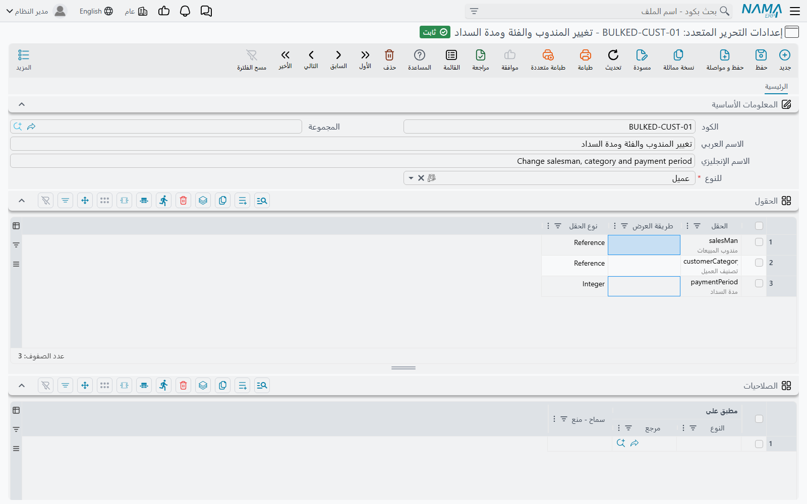
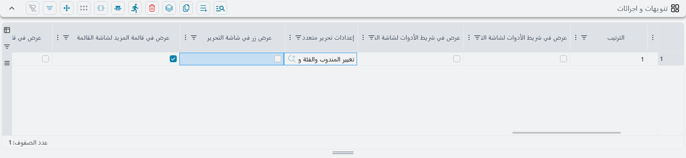
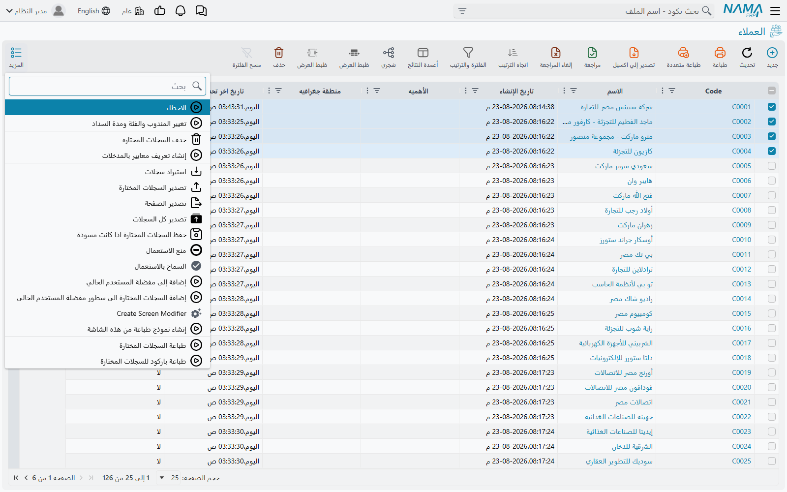
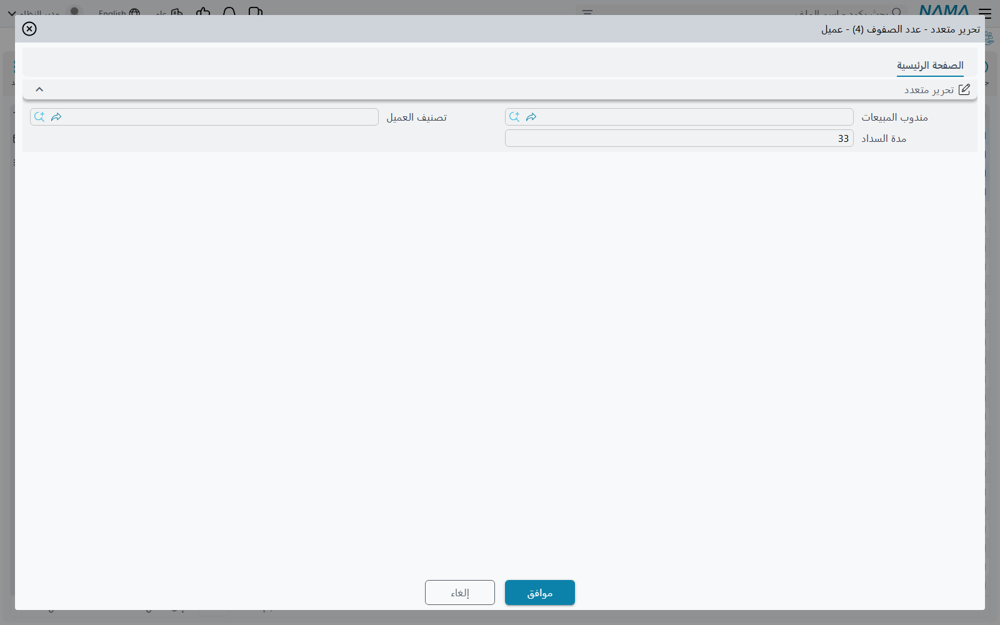

# التحرير المتعدد

لا بد لأحدهم أن ينقل أربعمائة عميل إلى مندوب مبيعات جديد. أو أن يضبط طريقة السداد في كل فاتورة
أصدرها فرع من الفروع في الشهر الماضي. وفتح أربعمائة شاشة ليس حلًا، وتصدير الجميع إلى ملف إكسل
لإعادة استيراده طريق ثقيل لتغيير عمود واحد.

**التحرير المتعدد** هو الطريق الخفيف. تختار السجلات في شاشة القائمة، فتُفتح لك نافذة صغيرة لا
تحوي إلا الحقول المسموح لك بتغييرها، فتكتب القيمة الجديدة مرة واحدة، فتتغيّر كل السجلات المختارة.

::: warning التحرير المتعدد لا يظهر في أي مكان قبل أن يُعدّه أحد
ليس في النظام زر تحرير متعدد ينتظر أن تعثر عليه. فهو لا يوجد إلا حيث أنشأ له المسؤول سجلين:
**إعدادات التحرير المتعدد** التي تحدد أي الحقول يجوز تغييرها، و**تعديل شاشة** يضع الزر على
الشاشة. وقبل أن يوجد السجلان معًا ويُفعَّل تعديل الشاشة لا يظهر زر تحرير متعدد في أي شاشة.

وهذا مقصود. فالتحرير المتعدد يعيد كتابة سجلات معتمدة دون فتحها، فأي الشاشات تتيحه وأي الحقول
يجوز أن يمسّها قراران يتخذهما أحد عن عمد.
:::

## تحديد ما يجوز تغييره

السجل الأول هو **إعدادات التحرير المتعدد**، وتجده في **الإدارة ← تخصيص شكل النظام ← إعدادات
التحرير المتعدد**.

وإلى جانب الكود والأسماء فيه حقل واحد إلزامي وجدول واحد هو المهم.

حقل **للنوع** يسمّي الكيان الذي أُعدّت له هذه الإعدادات، أي الشاشة التي ستُحرَّر سجلاتها. ولا بد
من ملئه.

أما جدول **الحقول** فهو مقصد السجل كله: سطر لكل حقل ستعرضه النافذة. تسمّي الحقل في عمود **الحقل**
ويتكفّل الباقي بنفسه، فعمود **نوع الحقل** يُملأ لك عند الحفظ، وعمود **طريقة العرض** لا يحدد إلا
عرض الحقل داخل النافذة.

::: tip اجعل قائمة الحقول قصيرة
الحقول التي تدرجها هنا هي الحقول التي تعرضها النافذة، وكل واحد منها — لأسباب مشروحة فيما يلي —
يُكتب في كل سجل مختار في كل مرة، سواء كتب فيه أحد أم لم يكتب. فإعدادات فيها حقلان آمنة وواضحة،
وإعدادات فيها اثنا عشر حقلًا فخّ.

وإن احتاجت مجموعتان من المستخدمين إلى تغيير حقول مختلفة في الشاشة نفسها، فأنشئ لهما سجلَي
إعدادات لا سجلًا واحدًا واسعًا.
:::

وثمة نوعان من الحقول لا يمكن تحريرهما تحريرًا متعددًا ولا يُعرضان عليك أصلًا عند الاختيار:

- **حقول سطور التفاصيل.** فالمتاح هو حقول الرأس فقط، ومن ثمّ لا يصل التحرير المتعدد إلى سطور
  المستند. وتغيير شيء في سطور عدة مستندات عمل يخص
  [الاستيراد](/ar/platform/import-export/importing-records).
- **المرفقات.** وهذه مرفوضة صراحة، عند الاختيار وعند الحفظ.

أما جدول **الصلاحيات** في الأسفل فيضيّق دائرة من تُعرض عليهم هذه الإعدادات. اتركه فارغًا — وهو
الغالب — فتُعرض على كل من يستطيع الوصول إلى الزر. وإن أضفت سطورًا سمّى كل سطر مستخدمًا أو ملف
صلاحيات أو مجموعة مستخدمين، وحدد أهو سماح أم منع. وعمود **مطبق على** هو في الحقيقة عمودان
متجاوران: نوع السجل أولًا ثم السجل نفسه.

## وضع الزر على الشاشة

السجل الثاني هو **تعديل شاشة** للشاشة التي تريد الزر فيها. وفي صفحة **تنويهات و اجرائات** منه
جدول للإجراءات المخصصة؛ أضف سطرًا واملأ عموده **إعدادات تحرير متعدد** بالإعدادات التي أنشأتها.

وهذا السطر نفسه يحدد أين يظهر الزر، والمواضع ثلاثة:

| مربع الاختيار | أين يظهر الزر |
|---|---|
| عرض في قائمة المزيد لشاشة القائمة | في قائمة **المزيد** بشاشة القائمة |
| عرض في شريط الأدوات لشاشة القائمة | في شريط أدوات شاشة القائمة |
| الإظهار في عمود الإجراءات بعرض القائمة | في عمود **الإجراءات** داخل الجدول نفسه |

فإن لم تعلّم أيًّا منها وُجدت الإعدادات ولم يُرسم زر قط.

::: warning أمران يمنعان ظهور الزر
**لا بد من تفعيل تعديل الشاشة.** فتعديل الشاشة الذي تُرك مربع **التفعيل** فيه دون تعليم يُهمَل
إهمالًا تامًّا — لا جزئيًّا ولا في صمت متدرج، بل لا يُحمَّل أصلًا. وهذا أشيع سبب على الإطلاق لأن
تحريرًا متعددًا جديدًا «لا يظهر».

**ولا يجوز وضع التحرير المتعدد في شاشة السجل.** فمربعات مواضع شاشة السجل الثلاثة مرفوضة إذا كان
السطر يحمل إعدادات تحرير متعدد، ويمتنع تعديل الشاشة عن الحفظ. فالتحرير المتعدد أداة شاشة قائمة
بحكم تصميمها، إذ لا شيء تختاره في شاشة سجل واحد.
:::

وثمة أمران أصغر يحسن أن تعرفهما حين تُعدّ واحدًا:

**اسم الزر يأتي من الإعدادات إن لم تسمّه.** فإن تركت حقول العنوان في سطر الإجراء فارغة حمل الزر
اسم إعدادات التحرير المتعدد نفسها، العربي والإنجليزي. وتسمية الإعدادات باسم يعرفه المستخدم —
«تغيير المندوب» بدلًا من «BEC001» — توفّر خطوة.

**والوضع في عمود الإجراءات ليس تحريرًا متعددًا حقًّا.** فالزر في عمود الإجراءات يخص الصف الذي هو
فيه، فيفتح النافذة لذلك السجل وحده ويتجاهل ما هو مختار. وقد يكون هذا مرادك أحيانًا — طريق سريع
لتغيير حقلين دون فتح السجل — لكنه ليس عملية جماعية.

## الاستعمال

اختر الصفوف في شاشة القائمة ثم اختر الإجراء من حيث وُضع.

فتُفتح النافذة على عرض الشاشة، وفي عنوانها عدد السجلات التي هي على وشك تغييرها:

وفيها حقل واحد لكل سطر في الإعدادات ولا شيء غير ذلك؛ فليس هنا اختيار للحقول، ولا تحديد لأيها
يُطبَّق. فالحقول التي تراها هي الحقول التي تسمح بها الإعدادات، وتصلك **مملوءة سلفًا بقيم أول سجل
اخترته**.

::: warning كل حقل في النافذة يُكتب في كل سجل مختار
هذا هو الأمر الذي ينبغي فهمه قبل تشغيل أي تحرير متعدد. فالنافذة لا تفرّق بين حقل كتبت فيه وحقل
تركته؛ وحين تضغط موافق تُكتب **كل** حقول الإعدادات في **كل** السجلات المختارة.

ولأن النافذة تُفتح مملوءة من أول سجل في اختيارك، فإن ترك حقل دون مساس لا يعني «اتركه كما هو في
كل سجل»، بل يعني «انسخ قيمة السجل الأول إلى الجميع».

فلنفترض أن الإعدادات تعرض المندوب وطريقة السداد. اخترت خمسين عميلًا لتغيير مندوبهم، ولم تمسّ
طريقة السداد. سيخرج الخمسون جميعًا بطريقة سداد العميل الذي صادف أن كان أول المختارين.

ولهذا ينبغي أن تدرج الإعدادات أقل عدد من الحقول يفي بالغرض. وإن اضطرت الإعدادات إلى حمل حقلين
ولم تكن تريد تغيير إلا واحد منهما في المرة، فتحقق من قيمة الآخر قبل الضغط على موافق.
:::

وبدء الإجراء دون اختيار أي سجل يوقفه برسالة **من فضلك اختر السجلات أولا**. وكما هي الحال في كل
شاشة قائمة، فإن مربع الاختيار في رأس العمود يختار **الصفحة التي أمامك** لا نتيجة البحث كلها —
وفي [التعامل مع عدة سجلات دفعة واحدة](/ar/platform/list-views/mass-operations) بيان ما يعنيه
ذلك عمليًّا.

## ما الذي يحدث حين تضغط موافق

يُجلَب كل سجل، وتُوضع فيه قيم النافذة، ثم يُحفظ ويُعتمد — بالحفظ نفسه والاعتماد نفسه اللذين كانا
سيحدثان لو أن أحدًا فتح السجل وكتب القيم وضغط الزر. ومن ثمّ تعمل كل اختبارات الصحة، وتنطلق كل
مسارات الكيانات والتنويهات، وتسري الموافقات، ويسجّل سجل التدقيق التغيير بوصفه تعديلًا عاديًا.

ويترتب على ذلك أربع نتائج، وأربعتها تفاجئ الناس:

::: warning التنفيذ الذي يفشل في منتصفه لا يُلغى
تُعالَج السجلات واحدًا تلو الآخر، ويُعتمد كل واحد منها على حدة. فإن سقط السجل العشرون من خمسين
في اختبار صحة، كانت التسعة عشر الأولى قد اعتُمدت وبقيت كذلك، ويُبلَّغ عن السجل الساقط، ولا
تُمَسّ السجلات من الحادي والعشرين إلى الخمسين.

والرسالة التي تصلك لا تذكر إلا مشكلة السجل الساقط وحده، وليس فيها بيان بما تم قبله. وبعد إصلاح
السبب فإن تشغيل الإجراء من جديد يعيد معالجة السجلات التي نجحت بالفعل — وهو غير ضار ما دامت القيم
هي هي، لكن يحسن إدراكه.
:::

::: warning المسودات التي في الاختيار تُعتمد
كل سجل في الاختيار يُعتمد، سواء أكان مسودة من قبل أم لا. فاختيار خليط من المسودات والسجلات
المعتمدة وتحريرها تحريرًا متعددًا يحوّل المسودات إلى سجلات معتمدة، عرَضًا. وإن كانت تلك المسودات
غير مكتملة فليس هذا ما أراده أحد.

وفلترة القائمة على السجلات المعتمدة قبل الاختيار هي سبيل تجنّب ذلك.
:::

::: info القائمة تظل تعرض القيم القديمة
حين ينجح التنفيذ تُغلق النافذة وتظهر رسالة واحدة: **تم بنجاح** — بلا عدد ولا بيان لكل سجل، وهي
الرسالة نفسها مهما كان عدد السجلات التي تغيّرت. والجدول خلفها لا يُعاد تحميله، فيظل يعرض ما كان
يعرضه. والسجلات قد تغيّرت فعلًا؛ فحدّث القائمة لتراها. ويبلّغ المستخدمون عن هذا
دائمًا بقولهم «قال إنه نجح ولم يحدث شيء».
:::

**والتنفيذ الطويل يحجز المتصفح.** فبخلاف
[الإجراءات الجاهزة](/ar/platform/list-views/mass-operations) التي تعمل في الخلفية وتعيد إليك
الشاشة في الحال، يمضي التحرير المتعدد في السجلات المختارة وأنت تنتظر. ويظهر التنفيذ في لوحة
المهام ويمكن إيقافه منها، لكن التبويب الذي بدأ منه يظل مشغولًا حتى ينتهي. ومن ثمّ فإن اختيارًا
كبيرًا وراءه اختبارات صحة ثقيلة يحسن تقسيمه إلى عدة تنفيذات أصغر.

والسجلات **المُراجَعة** مرفوضة، ولأن الرفض ينهي التنفيذ فإن سجلًا مراجَعًا في منتصف الاختيار
يوقف كل ما بعده.

## التحرير المتعدد أم التصدير وإعادة الاستيراد؟

كلاهما يغيّر عدة سجلات دفعة واحدة، ولكل منهما ما يناسبه.

| | التحرير المتعدد | [التصدير والتصحيح وإعادة الاستيراد](/ar/platform/import-export/) |
|---|---|---|
| الإعداد | يحتاج إلى إعدادات وتعديل شاشة، مرة واحدة | لا يحتاج إلى إعداد |
| الحقول | ما تدرجه الإعدادات فقط، وحقول الرأس فقط | أي حقل، وسطور التفاصيل معها |
| قيمة مختلفة لكل سجل | لا، قيمة واحدة للجميع | نعم، عمود لكل حقل |
| السجلات المشمولة | ما تستطيع اختياره في صفحة واحدة | كل ما في الملف |
| عند حدوث خطأ | يتوقف عنده وتبقى السجلات السابقة مغيَّرة | يُبلَّغ عنه لكل سطر |

وخلاصة الأمر: التحرير المتعدد **لقيمة جديدة واحدة في عدد معتدل من السجلات**، وهو سريع لأنه لا
ملف فيه يُنقل. أما التصدير وإعادة الاستيراد فـ**لقيمة مختلفة في كل سجل**، أو لسطور التفاصيل، أو
لأعداد كبيرة جدًّا.

## أين تجدها

تجد **إعدادات التحرير المتعدد** و**تعديل شاشة** كليهما تحت **الإدارة ← تخصيص شكل النظام**، إلى
جانب [القوائم](/ar/platform/menus/) وسائر الأدوات التي تغيّر شكل الشاشات وسلوكها.

ولأن كل سجل إعدادات يسمّي الكيان الذي يخصه، فإن تلك القائمة الواحدة تضم إعدادات النظام كله.

## اقرأ أيضًا

- [التعامل مع عدة سجلات دفعة واحدة](/ar/platform/list-views/mass-operations) — الإجراءات
  الجاهزة التي لا تحتاج إلى إعداد
- [استيراد وتصدير السجلات](/ar/platform/import-export/) — الطريق الآخر لتغيير عدة سجلات
- [الأزرار الموجودة في كل شاشة](/ar/platform/screen-buttons) — القوائم التي تُضاف إليها هذه
  الأزرار
