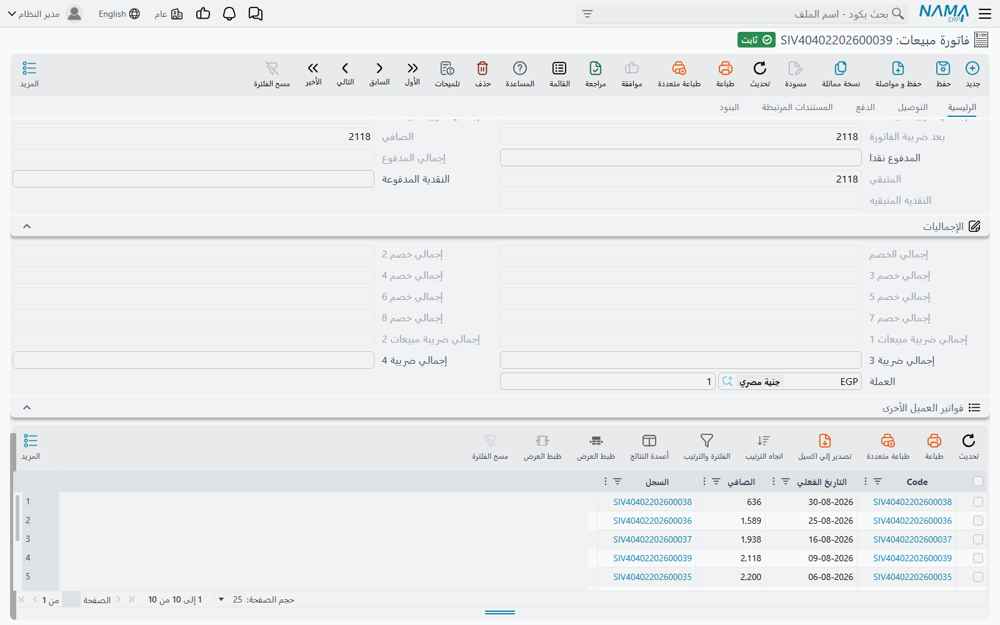
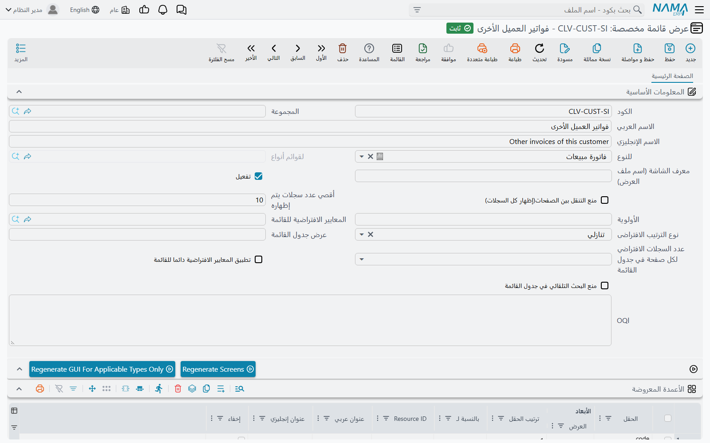
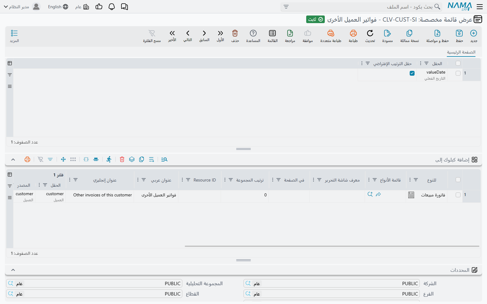

# عرض قائمة مخصصة (Custom List View)

نادرًا ما يقف السجل وحده. وأنت تنظر إلى فاتورة مبيعات، كثيرًا ما يكون السؤال المفيد: «ماذا اشترى منّا
هذا العميل غير ذلك؟». والإجابة عادةً تعني أن تترك الفاتورة، وتفتح قائمة الفواتير، وتفلترها بيدك.

**عرض القائمة المخصصة** يوفّر عليك هذا المشوار. فهو يعرّف قائمة صغيرة من السجلات المرتبطة، ويضعها
كبلوك **داخل شاشة سجل آخر**، مفلترةً مسبقًا بقيمة مأخوذة من ذلك السجل. افتح أي فاتورة مبيعات، فتجد
تحتها بلوكًا يعرض فواتير العميل نفسه الأخرى، دون أي بحث.

وهو لا يضيف اختيارًا جديدًا إلى شاشة القائمة الرئيسية للنوع. فإن أردت تغيير شكل القائمة الرئيسية، أو
تقديم نسخة ثانية منها بترتيب مختلف، فاستعمل [تعديل الشاشة](/ar/platform/screen-modifier/screen-modifier-list-and-search)
بدلًا منه.

## مثال عملي

لنفترض أنك تريد أن تعرض كل فاتورة مبيعات فواتير العميل الأخرى.

1. افتح **إدارة النظام ← تخصيص شكل النظام ← عرض قائمة مخصصة** وأضف سجلًا.
2. اجعل **للنوع** = *فاتورة مبيعات*. هذا هو نوع السجلات التي يعرضها البلوك.
3. في جدول **الأعمدة المعروضة** أضف الأعمدة التي تريدها في البلوك بمعرّف الحقل، مثل `valueDate`
   و`money.netValue`.
4. في جدول **إضافة كبلوك إلى** أضف سطرًا فيه **للنوع** = *فاتورة مبيعات* (وهو هنا الشاشة التي
   تستقبل البلوك)، و**فلتر 1 | الحقل** = `customer`، و**فلتر 1 | المصدر** = `customer`.
5. احفظ، ثم اضغط **Regenerate GUI For Applicable Types Only**.

صارت كل فاتورة مبيعات تحمل بلوكًا عنوانه اسم السجل. ويعرض البلوك فواتير المبيعات التي *عميلها* هو
*عميل* الفاتورة التي تنظر إليها.

## رأس الشاشة

| الحقل | ماذا يفعل |
| --- | --- |
| **للنوع (For Type)** | نوع السجلات التي يعرضها البلوك. حقل إلزامي. |
| **تفعيل (Activate)** | لا يُطبَّق إلا السجل المفعّل. ألغِ التفعيل لترفع البلوك عن الشاشات عند إعادة التوليد التالية دون أن تحذف السجل. |
| **الأولوية (Priority)** | ترتيب تطبيق عروض القوائم المخصصة المفعّلة إذا تعددت. |
| **أقصي عدد سجلات يتم إظهاره** / **منع التنقل بين الصفحات(إظهار كل السجلات)** | عند منع التنقل بين الصفحات يعرض البلوك كل الصفوف المطابقة دفعة واحدة، بحدٍّ أقصى هو *أقصي عدد سجلات يتم إظهاره* إن ملأته. |
| **المعايير الافتراضية للقائمة**، **تطبيق المعايير الافتراضية دائما للقائمة** | [تعريف معايير](/ar/platform/automation-and-rules/criteria-definitions) يطبّقه البلوك فوق الفلاتر، وهل يُطبَّق في كل مرة. |
| **نوع الترتيب الافتراضى**، **عرض جدول القائمة**، **عدد السجلات الافتراضي لكل صفحة في جدول القائمة**، **منع البحث التلقائي في جدول القائمة** | تعمل كنظيراتها في [تعديل الشاشة](/ar/platform/screen-modifier/screen-modifier-list-and-search). |
| **OQl** | للمطوّرين. اتركه فارغًا ويبني النظام استعلام البلوك من الفلاتر بنفسه. |

حقل **معرف الشاشة (اسم ملف العرض)** لا أثر له. فالنظام يسمّي قائمة البلوك بنفسه (راجع قسم
«الصلاحيات» أدناه).

## الجداول

جداول **الأعمدة المعروضة** و**الاعمدة المحسوبة** و**حقول البحث (المعايير)** و**حقول الترتيب** تضيف إلى
قائمة البلوك أعمدة، وأعمدة محسوبة، وحقول فلترة، وحقول ترتيب. وتُملأ بالطريقة نفسها كما في تعديل الشاشة.
وتبدأ القائمة دائمًا بعمود واحد يعرض السجل نفسه، ثم تأتي أعمدتك بعده.

جدول **إضافة كبلوك إلى** يحدّد أين يظهر البلوك. كل سطر يضعه على شاشة واحدة:

| العمود | ماذا يفعل |
| --- | --- |
| **للنوع** / **قائمة الأنواع** | الشاشة التي تستقبل البلوك: نوع واحد، أو كل نوع في قائمة أنواع. لا بد من أحدهما. |
| **معرف شاشة التحرير** | يقصر البلوك على شكل واحد لتلك الشاشة، كنسخة صنعها تعديل الشاشة مثلًا. الفارغ يعني كل الأشكال. |
| **في الصفحة** | صفحة (تبويب) الشاشة: رقمها (1، 2، 3…) أو معرّفها. الفارغ يعني الصفحة الأولى. |
| **ترتيب المجموعة** | موضع البلوك بين بلوكات الصفحة. الفارغ يضعه في الآخر. |
| **Resource ID**، **عنوان عربي**، **عنوان إنجليزي** | عنوان البلوك. إن تُرك فارغًا استُعمل الاسم العربي والإنجليزي للسجل. |
| **فلتر 1 … فلتر 5** | كل زوج يربط حقلًا في السجلات المعروضة (**الحقل**) بحقل في سجل الشاشة (**المصدر**). ولا يعرض البلوك إلا الصفوف التي يتطابق فيها كل زوج. |

السطر الذي ليس فيه أي فلتر يُرفض عند الحفظ:

«يجب ملئ عدد فلتر 1 على الأقل»

## كيف تظهر التغييرات

حفظ السجل لا يغيّر شيئًا على الشاشة بعد. فالشاشات تُبنى مسبقًا، ولا بد من إعادة بنائها. وفي الشاشة
زرّان لذلك:

- **Regenerate GUI For Applicable Types Only** يعيد بناء الأنواع المذكورة في هذا السجل فقط، في الرأس
  وفي جدول *إضافة كبلوك إلى*. استعمل هذا الزر.
- **Regenerate Screens** يعيد بناء كل شاشات النظام.

::: warning زر Regenerate Screens يعيد بناء القائمة أيضًا
فهو يعيد بناء القائمة الجاهزة من الصفر، فيمحو أي تعديل يدوي أُجري عليها. راجع
[تغيير القائمة](/ar/platform/menus/menu-update).
:::

## الصلاحيات (Security)

هنا أمران يُتحكَّم في كل منهما على حدة.

**من يستطيع إنشاء عروض القوائم المخصصة أو تعديلها.** هذه صلاحيات عادية على نوع *عرض قائمة مخصصة* في
[ملف الصلاحيات](/ar/platform/security/security-profiles). فعرض القائمة المخصصة يغيّر ما يراه كل مستخدم
على الشاشات التي يستهدفها، فاجعله في يد من يتولّون صيانة الشاشات.

**من يرى البلوك.** البلوك قائمة عادية، فيمكن لصفحة
[صلاحيات مطالعة القوائم](/ar/platform/security/field-page-listview-security)
في ملف الصلاحيات أو المستخدم أن تسمح به أو تمنعه. استعمل هذه القيم:

- **النوع** — *للنوع* في عرض القائمة المخصصة (أي النوع المعروض، لا الشاشة التي تستضيف البلوك).
- **معرف العرض** — المعرّف الداخلي لسجل عرض القائمة المخصصة، يليه مباشرةً نوع الشاشة المستضيفة، دون
  مسافة بينهما. ويظهر المعرّف في [التصدير](/ar/platform/import-export/exporting-records) إذا فعّلت
  *إضافة حقل المعرف*.

المستخدم الممنوع من القائمة يظل يفتح السجل المستضيف. والبلوك وحده هو الذي يرفض التحميل، برسالة:

«لا تملك صلاحية مطالعة القائمة بالمعرف {0} والنوع {1}»
