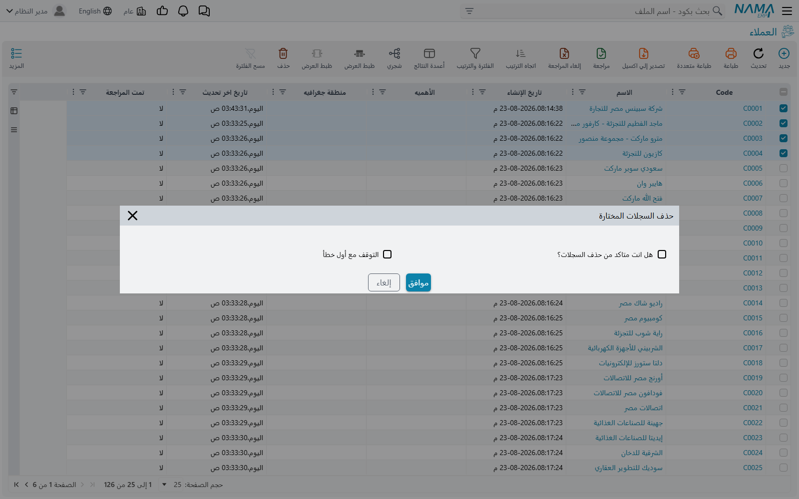

# التعامل مع عدة سجلات دفعة واحدة

شاشة القائمة تفعل أكثر من مجرد عرض السجلات. اختر بضعة صفوف تجد في قائمة **المزيد** مجموعة من
الإجراءات التي تعمل على السجلات المختارة كلها دفعة واحدة: حذفها، أو اعتماد المسودات من بينها، أو
منعها من الاستعمال، أو تصديرها إلى ملف إكسل.

هذه الإجراءات جاهزة في النظام. تجدها في كل شاشة قائمة، ولكل كيان، دون أي إعداد مسبق.

## اختيار السجلات

لكل صف مربع اختيار عند طرفه، وفي رأس العمود مربع آخر يختار الصفحة كلها بنقرة واحدة.

::: warning اختيار الكل يعني الصفحة المعروضة أمامك، لا نتيجة البحث كلها
مربع الاختيار في رأس العمود يختار **الصفوف المعروضة حاليًا**، لا كل سجل طابق الفلتر. ومع حجم
الصفحة الافتراضي وهو ٢٥ سجلًا، فإن بحثًا نتج عنه ٩٠٠ سجل ثم نقرة واحدة على مربع رأس العمود يعطيك
٢٥ سجلًا مختارًا لا ٩٠٠.

فإن احتجت إلى العمل على أكثر من صفحة، ارفع حجم الصفحة أولًا — والاختيارات المتاحة أسفل القائمة هي
٢٥ و ٥٠ و ٧٥ و ١٠٠ والكل — ثم اختر. فما تراه هو ما تحصل عليه.
:::

وإن بدأت إجراءً دون اختيار أي سجل توقف فورًا برسالة **من فضلك اختر السجلات أولا**.

## حذف السجلات المختارة

يحذف إجراء **حذف السجلات المختارة** كل سجل مختار، واحدًا تلو الآخر. وقبل أن يعمل يسألك سؤالين:

| السؤال | ما الذي يحدده |
|---|---|
| هل انت متاكد من حذف السجلات؟ | ما إذا كان الحذف سيتم أصلًا |
| التوقف مع أول خطأ | ما يحدث لبقية السجلات حين يمتنع أحدها |

والمربعان كلاهما يبدأ **دون تعليم**.

::: warning مربع التأكيد هو التأكيد نفسه، ولا بد من تعليمه
المربع الأول ليس تنبيهًا تقرؤه ثم تتجاوزه، بل هو المفتاح الذي يسمح للحذف بأن يتم. اتركه دون
تعليم ثم اضغط موافق ينتهِ الإجراء في الحال: لا يُحذف شيء، ولا تظهر أي رسالة. ويبدو الأمر
للمستخدم كأن الإجراء لم يعمل.
:::

::: tip اترك «التوقف مع أول خطأ» دون تعليم ما لم يكن لديك سبب
حين يُترك دون تعليم — وهو الوضع الافتراضي — يمضي التنفيذ متجاوزًا أي سجل يتعذر حذفه، وينتهي
بعرض أكواد كل السجلات التي فشلت مع سبب كل واحد منها. أما إذا علّمته فيتوقف التنفيذ عند أول
امتناع، ويُترك كل ما بعده دون مساس.

وترْكه دون تعليم هو المناسب غالبًا، إذ يخبرك تنفيذ واحد بكل المشكلات مرة واحدة بدلًا من أن
تكتشفها سجلًا بعد سجل.

:::

وتمتنع السجلات عن الحذف للأسباب المعتادة: وجود سجل آخر في النظام لا يزال يشير إليها، أو كونها
مُراجَعة، أو ألا يملك المستخدم صلاحية الحذف على ذلك الكيان. والحذف نفسه هو الحذف الذي يقوم به زر
الحذف على السجل الواحد، فلا شيء يُتجاوز أو يُفرض لمجرد أن العملية جماعية.

## اعتماد المسودات من بين السجلات المختارة

إجراء **حفظ السجلات المختارة اذا كانت مسودة** يعتمد السجلات. وعلى خلاف ما توحي به التسمية فهو لا
يحفظ شيئًا كمسودة، بل ينظر في كل سجل مختار فيعتمد ما كان منها مسودة، ويتجاوز ما كان معتمدًا من
قبل دون أن يذكر عنه شيئًا.

وهو الطريق السريع لإنهاء دفعة من المستندات أُدخلت وتُركت مسودات، دون فتح كل واحد منها. ويمر كل
سجل بعملية الاعتماد المعتادة، فالمسودة التي تسقط في اختبارات الصحة تسقط هنا كما كانت تسقط على
شاشتها.

## منع السجلات من الاستعمال

يظهر **منع الاستعمال** و**السماح بالاستعمال** في القائمة نفسها، ويعملان على السجلات المختارة كلها
دفعة واحدة. وحين يُشغَّلان من شاشة القائمة **يُحفظ التغيير فورًا** — بخلاف الإجراء نفسه على شاشة
السجل، فهو يكتفي بتعليم الشاشة بأنها تغيّرت وينتظر منك الحفظ.

أما ما يعنيه منع السجل من الاستعمال فعليًا، وأي الإعدادات يحدد من يظل يرى تلك السجلات ويستعملها،
وكيف تعرف السجل الممنوع بنظرة واحدة، فكل ذلك في
[منع استعمال سجل](/ar/platform/prevent-usage).

ويتوقف الإجراءان كلاهما عند أول سجل يتعذر التعامل معه، وتُترك السجلات التي بعده دون مساس.

## تصدير السجلات إلى ملف إكسل

تتجاور في القائمة ثلاثة إجراءات للتصدير لا تختلف إلا فيما تشمله:

| الإجراء | ما الذي يُصدَّر |
|---|---|
| تصدير السجلات المختارة | الصفوف المختارة |
| تصدير الصفحة | كل صف في الصفحة المعروضة أمامك |
| تصدير كل السجلات | كل سجلات ذلك النوع |

ويفتح كل منها صندوق الاختيارات نفسه: أي الحقول تُدرَج، وهل تُضاف أعمدة المعرفات، وهل تذهب سطور
التفاصيل إلى ورقة مستقلة. وهذه الاختيارات، ومعها الاستيراد الذي يقرأ الملف مرة أخرى، مشروحة في
[استيراد وتصدير السجلات](/ar/platform/import-export/).

وإجراء **استيراد سجلات** في القائمة نفسها هو النصف الآخر من هذه الرحلة.

## إضافة السجلات إلى المفضلة

إجراء **إضافة إلى مفضلة المستخدم الحالي** يضيف الشاشة نفسها إلى قائمة المفضلة عندك. أما **إضافة
السجلات المختارة الى سطور مفضلة المستخدم الحالى** فهو المختلف والأنفع: يثبّت السجلات التي اخترتها
بعينها، فتصبح المستندات القليلة التي تعود إليها دائمًا على بعد نقرة واحدة.

## متابعة التنفيذ وإيقافه

هذه الإجراءات لا تحجز المتصفح. فكل إجراء يبدأ ويعيد إليك الشاشة في الحال بينما يمضي هو في
السجلات المختارة في الخلفية، ويعرض تقدمه أولًا بأول. وإذا طال التنفيذ أكثر مما ينبغي، أو بدأ
بالخطأ، أمكن إنهاؤه من الموضع نفسه بـ **إنهاء المهمة** — فيبقى ما تمت معالجته كما هو، ويُترك
الباقي دون مساس.

وحين ينتهي التنفيذ وفيه إخفاقات يذكر التقرير أكواد السجلات التي فشلت وسبب كل واحد منها، فيمكن
معالجتها بعد ذلك.

## ما الذي يُسجَّل في التاريخ

يمر كل إجراء من هذه الإجراءات بالخدمة نفسها التي تستعملها الشاشات، فينال كل سجل تأثر به قيده
المعتاد في التاريخ: نسخة جديدة، وسطر في سجل التدقيق يبيّن ما تغيّر. والمستخدم الذي يتصفح تاريخ
السجل بعد ذلك يرى تعديلًا عاديًا.

ولا شيء يميّز التغيير بأنه جاء من إجراء جماعي، ولا تُجمَّع هذه التغييرات معًا بأي صورة. فإن كان
مهمًا أن تعرف أن دفعة من السجلات تغيّرت معًا في يوم بعينه، فأوقات التغيير هي الرابط الوحيد
بينها — وهو ما يحسن أن تعرفه قبل تشغيل أحد هذه الإجراءات على عدد كبير من السجلات.

## اقرأ أيضًا

- [منع استعمال سجل](/ar/platform/prevent-usage) — ما الذي يفعله منع الاستعمال
- [استيراد وتصدير السجلات](/ar/platform/import-export/) — اختيارات التصدير كاملة
- [الفلاتر السريعة في قوائم المستندات](/ar/platform/list-views/quick-filters) — تضييق القائمة
  قبل الاختيار
