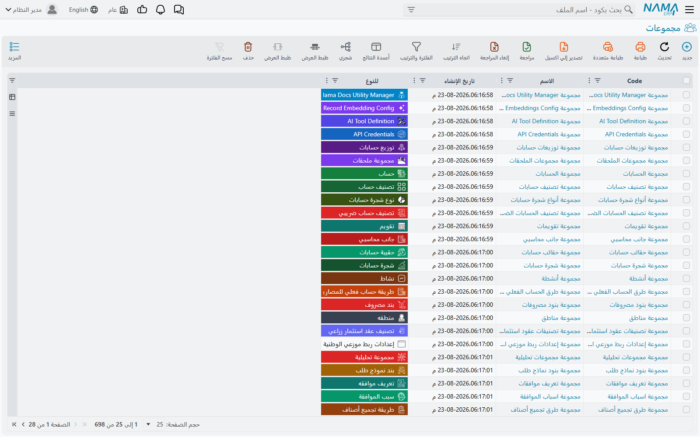
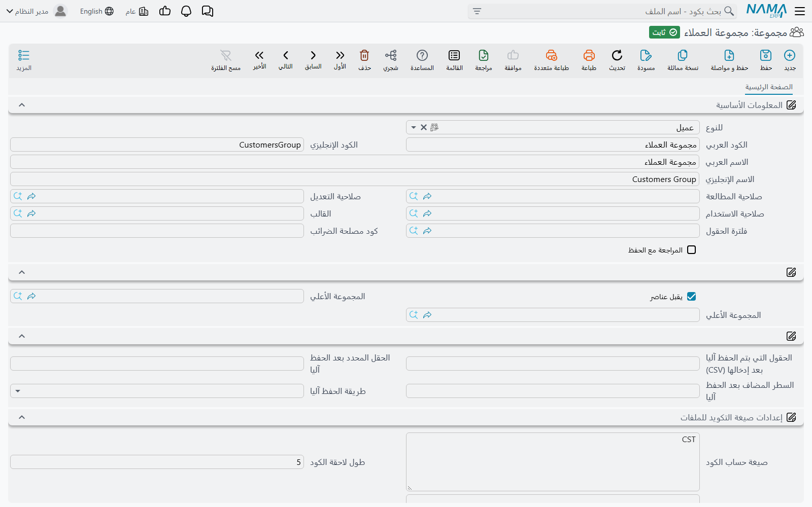
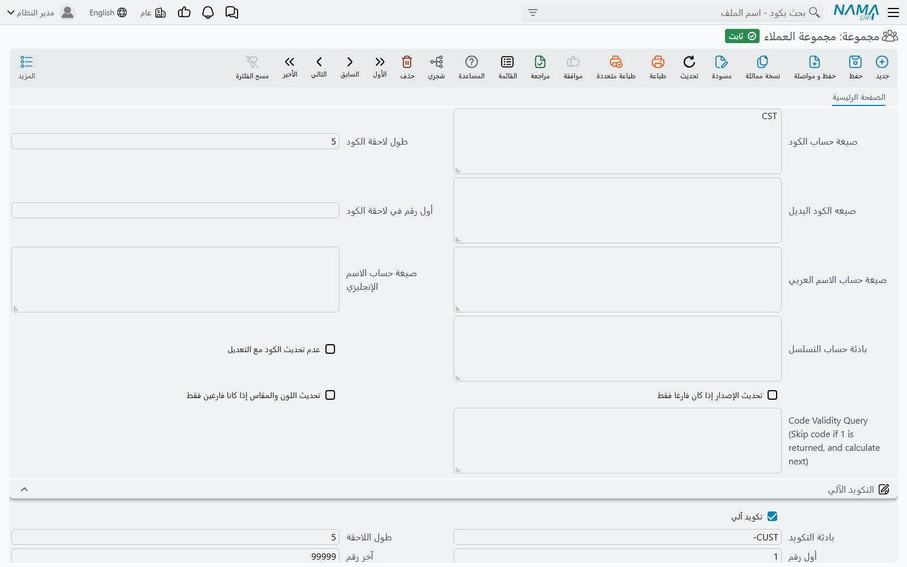

# المجموعات (Master Groups)

دفاتر المستندات تُرقّم المستندات. و**المجموعات** تؤدي الوظيفة نفسها للنصف الآخر من النظام — الملفات
الرئيسية. فالعملاء والأصناف والموظفون والموردون ومراكز التكلفة، كلٌّ منها يجوز أن ينتمي إلى مجموعة،
والمجموعة هي التي تمنحه كوده.

هذه هي الوظيفة الأولى، وهي تعمل تقريبًا كما يعمل دفتر المستند تمامًا. أما الوظيفة الثانية فلا تملكها
الدفاتر: المجموعات تكوّن **شجرة**، وهذه الشجرة تظهر لوحةَ تنقّل بجوار كل قائمة ملف رئيسي في النظام.
اضغط **الجملة** في اللوحة فتضيق قائمة العملاء إلى عملاء الجملة.

::: info أين تجدها
**الأساسيات ← الإعدادات ← مجموعة**، بعد دفتر المستند وتوجيه المستند مباشرة. وتعرض القائمة كل المجموعات
في النظام، ويخبرك عمود **للنوع** بما هي كل مجموعة.
:::

## مجموعة واحدة لنوع ملف رئيسي واحد

أول حقل في المجموعة هو **للنوع**، وهو الذي يقرر كل ما عداه. فالمجموعة التي نوعها «عميل» تُوضَع على
العملاء ولا تُوضَع على غيرهم. جرّبها على صنف فيفشل الحفظ برسالة
*«Selected group is for type Customer, it should be for type Item»*.

ويقبل حقل **للنوع** أي ملف رئيسي — أي كل ما ليس مستندًا.

::: warning يُجمَّد حقل «للنوع» بمجرد أول حفظ للمجموعة
احفظ المجموعة مرة واحدة ولن يمكن تغيير نوعها بعدها أبدًا:
*«Can not change group type after first save»*. ولا مخرج من ذلك. والمجموعة التي أُنشئت لنوع خاطئ
مجموعة تُترَك، لا مجموعة تُصحَّح.
:::

ومن آثار حقل «للنوع» أثر يحسن أن تعرفه قبل أي استيراد. فكود المجموعة يحمل داخليًا نوعها أمامه، على
الصورة `Customer$#WHOLESALE`. ويتبع ذلك أمران نافعان: يجوز إعادة استعمال الكود نفسه مرة واحدة لكل نوع
رئيسي — فمجموعة `WHOLESALE` للعملاء وأخرى للأصناف تتعايشان — و**ملف الاستيراد الذي يضع مجموعة على سجل
لا بد أن يكتب الصورة الطويلة**، لا الكود المجرّد. وهذا مشروح في
[استيراد السجلات](/ar/platform/import-export/importing-records).

## الشجرة، والقاعدة التي تحكمها

تستطيع المجموعة أن تشير إلى **المجموعة الأعلي**، وبذلك تُبنى الشجرة. غير أن ثمّ قاعدة واحدة توقع
الجميع في أول مرة، وهي مربع الاختيار **يقبل عناصر**.

::: warning المجموعة إما مجلد وإما مجموعة صالحة للاستعمال، ولا تكون الاثنين معًا
**يقبل عناصر** مؤشَّر في كل مجموعة جديدة، والمجموعة المؤشَّر فيها هي التي تُوضَع عليها السجلات. أما
المجموعة التي أُزيل التأشير عنها فهي مجلد: تصلح أن يكون تحتها فروع، ولا يصلح أن يوضع عليها سجل واحد
مباشرة.

والأمران متنافيان، والنظام يفرض المنع في الاتجاهين. اختر مجموعةً تقبل عناصر لتكون مجموعةً أعلى
لغيرها، فيفشل الحفظ برسالة «المجموعة … لا يمكن استخدامها كمجموعة أعلى». وحاول وضع مجموعة مجلد على
عميل، فيفشل الحفظ برسالة *«Selected group cannot be used in elments directly»*.

فبناء الشجرة يعني إذن إنشاء الفروع أولًا ومربع «يقبل عناصر» غير مؤشَّر فيها، ثم إنشاء الأوراق التي
ستستعملها السجلات فعلًا.
:::

وحقل المجموعة في الملف الرئيسي يعرف هذه القاعدة سلفًا: فهو لا يعرض إلا مجموعات النوع الصحيح التي
تقبل عناصر، فلا تظهر المجلدات فيه أصلًا.

::: tip المجموعة الأعلى تصنيف ليس إلا
المجموعة الأعلى لا تورّث فروعها شيئًا — لا تكويدًا ولا قالبًا ولا صلاحيات. وكل فرع ستستعمله السجلات
عليه أن يحمل إعداداته كاملة بنفسه. فالشجرة تقرر كيف تُصنَّف السجلات وكيف تُرتَّب لوحة التنقّل، ولا
تقرر شيئًا عن كيفية ترقيمها.
:::

### لوحة التنقّل

وهذه هي الفائدة اليومية. فكل شاشة قائمة لملف رئيسي في النظام تعرض في أحد جانبيها شجرةَ المجموعات
الخاصة بنوعها. والضغط على فرع يضيّق القائمة إلى السجلات المصنّفة تحته في أي مستوى — فالفرع الذي تحته
ثلاث مجموعات فرعية يعرض سجلات الثلاث جميعًا.

ولهذا يحسن الاعتناء بترتيب المجموعات حتى في تطبيق لا يستعملها في الترقيم أصلًا.

## ترقيم السجلات داخل المجموعة

وهنا الأمر الذي يفاجئ الناس في هذه الشاشة، ويحسن قوله قبل كل شيء.

::: warning في هذه الشاشة محرّكا تكويد، والأعلى منهما يغلب في صمت
تحمل الشاشة مجموعةَ حقول عنوانها **إعدادات صيغة التكويد للملفات**، وتحتها أخرى عنوانها **التكويد
الآلي**. وليستا وجهين لشيء واحد، ولا بديلين تختار بينهما بمفتاح. فإن كان في كتلة الصيغة **صيغة حساب
الكود**، فهي التي تُكوِّد السجلات — وكتلة التكويد الآلي تحتها لا يُنظَر فيها أبدًا.

ولا شيء في الشاشة يقول ذلك، ولا تحذير يمنعك، والكتلتان تبقيان قابلتين للتعديل. والمجموعة في الصورة
أعلاه على هذه الحال بعينها: فيها صيغة `CST` في الأعلى **ومعها** سلسلة كاملة `CUST-00001` أسفلها، ولن
يُستعمل من الاثنتين إلا الأولى. والمجموعة التي «تتجاهل أرقامها البادئة التي وضعتها» يكون فيها في
الغالب صيغةٌ معبّأة في الأعلى.
:::

والترتيب الكامل الذي يمشي عليه النظام مع سجل له مجموعة:

١. أول سطر في **جدول التفاصيل** تنطبق معاييره على السجل — تُستعمل صيغته؛
٢. وإلا فكتلة **إعدادات صيغة التكويد للملفات** الخاصة بالمجموعة؛
٣. وإلا فجدول **التكويد الآلي للملفات** في
   [إعدادات الحقول والكيانات](/ar/platform/fields-and-entities-settings/fields-settings-auto-coding)،
   وهو يُكوِّد بصيغة دون أي مجموعة؛
٤. وإلا فكتلة **التكويد الآلي** في المجموعة.

### كتلة التكويد الآلي

هذا هو محرّك السلاسل نفسه الذي يستعمله دفتر المستند، بالحقول الستة نفسها والحساب نفسه. وبدلًا من
إعادته، اقرأ [دفاتر المستندات](/ar/platform/document-books) — فالبادئة والرقم المتسلسل المكمَّل،
وإعادة البدء كل سنة عبر **صيغة التكويد**، و**عدم استعمال صيغة بادئة التكويد في حساب الرقم التالي**،
و**استعمال الرقم التالي الحقيقي للمسودات**، وما يحدث حين تنفد الأرقام، كلها تعمل هنا بالطريقة نفسها.
والملفات الرئيسية تأخذ أكوادًا مبدئية تنتهي بـ `@draft` تمامًا كالمستندات.

::: tip الشاشة تكمل لك بقية السلسلة
اكتب **طول اللاحقة**، فيصير **أول رقم** ١ ويصير **آخر رقم** تسعاتٍ بعدد ذلك الطول، إن كانا ما
يزالان فارغين — فطول ٥ يعطيك آخر رقم `99999` بمجرد أن يغادر المؤشر الحقل. واكتب **آخر رقم** بدلًا من
ذلك، فيُرفَع طول اللاحقة ليتّسع له.
:::

وثمّ فرقان يستحقان التصريح.

**البادئة مطلوبة فقط حين يكون التكويد الآلي مشغَّلًا.** ففي الدفتر تُطلَب البادئة حتى مع الترقيم
اليدوي، وثمّ إعداد عام يخفّف ذلك. أما في المجموعة فلا شيء يُخفَّف: أطفئ التكويد الآلي فلا تُطلب
البادئة أصلًا.

**وكل سجل في المجموعة لا بد أن يبدأ كوده ببادئة المجموعة، حتى الكود الذي تكتبه بيدك.** ضع عميلًا في
مجموعة بادئتها `WH-` وأعطه الكود `X001`، فيفشل الاعتماد برسالة *«code must start with WH-»*.
فالبادئة صفة للمجموعة، لا للأرقام التي تولّدها وحدها.

::: tip لكل مجموعة سلسلتها الخاصة
كما في الدفاتر، الرقم الجاري ملك للمجموعة. ومجموعتان من النوع نفسه لهما البادئة نفسها تُرفَضان عند
الحفظ — «بادئة التكويد … طول اللاحقة … وأول رقم … يتعارضوا مع …» — فلا تستطيع مجموعتان أن تتداخل
أرقامهما في صمت.
:::

واختر مجموعة في ملف رئيسي جديد، فيمتلئ حقل الكود فورًا بالرقم الذي سيأخذه. وهذا عرض مبدئي: فالرقم لا
يُحجَز في السلسلة إلا عند حفظ السجل.

### كتلة إعدادات صيغة التكويد للملفات

أما المحرّك الآخر فيبني الكود من قيم السجل نفسه بدل أن يعدّ. وحقله الأساسي **صيغة حساب الكود** — قالب
يقرأ حقولًا من السجل الجاري حفظه. وبجانبه ثلاث صيغ أخرى تعبّئ **الكود البديل** والاسمين، وكل واحدة
منها لا تُطبَّق إلا إذا أنتجت شيئًا: فالصيغة التي تخرج فارغة تترك القيمة الموجودة كما هي.

وبقية الكتلة تتحكم في العدّاد الذي يُلحَق بناتج الصيغة:

| الحقل | ما الذي يفعله |
|---|---|
| بادئة حساب التسلسل | المفتاح الذي يُعَدّ الرقم الجاري بحسبه. واتركه فارغًا فيكون نص الكود المحسوب نفسه هو المفتاح. |
| طول لاحقة الكود | عدد الخانات التي يُكمَّل إليها العدّاد. وحدّه الأقصى ٢٠. |
| أول رقم في لاحقة الكود | الرقم الذي تبدأ منه. |
| عدم تحديث الكود مع التعديل | يترك كود السجلات التي سبق اعتمادها كما هو بدل إعادة حسابه. |
| Code Validity Query | استعلام يرفض الرقم المرشَّح، فيجرّب النظام الذي يليه، ثم الذي يليه، حتى يكفّ الاستعلام عن الانطباق. |

::: info لغة الصيغة هنا ليست هي نفسها المستعملة في مواضع أخرى
الصيغة المكتوبة بـ `${…}` حول أسماء الحقول تُقرأ إحلالًا مباشرًا للحقول. والصيغة المكتوبة بـ `{…}` تمرّ
على لغة القوالب الكاملة بدوالها وشروطها. ولا يجوز خلط الاثنين في صيغة واحدة — فوجود `${` يحوّل النص
كله إلى الأسلوب الأبسط.

و**Code Validity Query** واحد من حقول قليلة في هذه الشاشة لم تُترجَم قط، فيراها المستخدم العربي
بالإنجليزية.
:::

وإذا كان آخر سجل كُوِّد من صيغة تنتهي لاحقته بما ليس رقمًا — كتب أحدهم كودًا بيده، أو رُحِّل سجل قديم —
فشل الحفظ التالي وسمّى لك السجل الذي عجز عن قراءة رقم منه. وهذا هو السبب المعتاد لصيغة عملت شهورًا ثم
توقفت.

### صيغة مختلفة لكل نوع من السجلات

وتحت الكتلتين جدول: سطر لكل **معايير**، ولكل سطر أعمدةُ صيغة تكويد خاصة به. وهكذا تُكوِّد المجموعة
الواحدة سجلاتٍ مختلفة تكويدًا مختلفًا — أصناف عائلة منتجات تأخذ شكل كود، وأصناف عائلة أخرى تأخذ شكلًا
ثانيًا.

::: warning أول سطر ينطبق هو الذي يُعتمد، والسطر الذي بلا معايير ينطبق على كل شيء
تُقرأ السطور من أعلى إلى أسفل، ويُعتمد أول سطر تنطبق معاييره على السجل. والسطور التي تحته لا يُنظَر
فيها مهما كانت أنسب.

والسطر الذي معاييره فارغة ينطبق على كل سجل، فيحجب كل ما تحته. فاجعل الحالات العامة في الأسفل والحالات
الخاصة في الأعلى، كما تفعل في أي قائمة يُعتمد فيها أول انطباق.
:::

وإن لم ينطبق أي سطر، استُعملت كتلة الصيغة الخاصة بالمجموعة. وإن كانت هي الأخرى فارغة، مضى البحث في
الترتيب المذكور أعلاه.

## ما الذي يُقفَل بعد استعمال المجموعة

تكفّ المجموعة عن كونها قابلة للتعديل بحرية عند لحظتين.

**عند أول حفظ لها**، يُجمَّد حقل «للنوع».

**وعند أول سجل معتمَد من نوعها يشير إليها**، تُجمَّد أربعة حقول: **تكويد آلي** و**بادئة التكويد**
و**أول رقم** و**طول اللاحقة**. وتعديل أي منها بعد ذلك يفشل برسالة
*«Can not change auto coding as the record was used in documents»* — والرسالة تقول «مستندات» حتى في
مجموعة ملفات رئيسية، وهذه هي صياغتها كما هي.

::: tip المسودات لا تجمّد شيئًا
لا يُحسَب إلا السجل المعتمَد. فالمجموعة التي تحتها خمسون مسودة تبقى قابلة للتعديل بتمامها؛ وأول
اعتماد هو الذي يقفلها.
:::

وما عدا ذلك يبقى مفتوحًا، وهو كثير: **آخر رقم**، و**صيغة التكويد**، و**موقع التكرار**، وكتلة الصيغة
كلها، وجدول التفاصيل كله. فالتجميد يحمي سلسلة العدّ وحدها لا غير — وصيغة سطر بعينه يمكن إعادة كتابتها
بعد أن كوّدت آلاف السجلات.

ولا سبيل مدعومًا لفكّ التجميد. فحين يلزم تغيير السلسلة نفسها، يكون الجواب هو جواب الدفاتر: أنشئ
مجموعة جديدة.

## إحالة المجموعة إلى التقاعد

في المجموعة حقل **منع الاستعمال**، وهو مفتاح التقاعد. عيّنه فلا يمكن اعتماد سجل جديد على المجموعة —
«لا يمكن استعمال السجلات التي تم منع استعمالها …» — بينما تمضي كل السجلات القائمة عليها دون مساس. وما
الذي يعنيه منع الاستعمال عمومًا، ومن الذي يجوز أن يتجاوزه، مشروح في
[منع استعمال سجل](/ar/platform/prevent-usage).

ولاحظ أن المجموعة ليس فيها حقل **غير نشط** ولا **غير نشط من تاريخ**. فهذان لدفاتر المستندات؛ أما في
المجموعة فمنع الاستعمال هو القصة كلها.

::: warning المجموعة التي استُعملت مرة واحدة لا يمكن حذفها أبدًا
بمجرد أن يشير سجل واحد إلى مجموعة، يُرفَض حذفها — *«Can not Delete this  record because it used in
another record»*. والعلامة التي تسبّب هذا لا تُمسَح أبدًا: فحذف آخر سجل كان يستعمل المجموعة **لا**
يعيدها قابلة للحذف.

فمنع الاستعمال إذن ليس خيارًا ثانيًا بعد الحذف، بل هو الخيار الوحيد. واحسب حسابك على أن المجموعات
دائمة.
:::

وثمّ طريق آخر تتقاعد به المجموعة بنفسها: إذا بلغت السلسلة **آخر رقم**، عيّنت المجموعة منع الاستعمال
على نفسها. فالسجل الذي أخذ آخر رقم يُحفَظ عاديًا، والذي يليه يجد المجموعة مغلقة.

## ماذا تحمل المجموعة أيضًا

بعيدًا عن الترقيم، المجموعة مكان مناسب لتعليق إعدادات ينبغي أن تسري على عائلة واحدة من السجلات
الرئيسية دون غيرها.

| الحقل | ما الذي يفعله |
|---|---|
| القالب | [قالب قيم افتراضية](/ar/platform/default-values-templates) يُطبَّق على سجلات المجموعة. |
| فلترة الحقول | [فلترة حقول](/ar/platform/field-filter-with-criteria) تخفي حقولًا في تلك السجلات أو تحميها. والفلترة الآلية مرفوضة هنا. |
| صلاحية المطالعة / التعديل / الاستخدام | صلاحيات تُنسَخ على السجلات التي تنضم إلى المجموعة. |
| المحددات | الشركة والقطاع والفرع والإدارة ومجموعة التحليل، تُنسَخ على السجلات التي تنضم إلى المجموعة. |
| المراجعة مع الحفظ | تجعل سجلات المجموعة تُراجَع مع اعتمادها. |
| كود مصلحة الضرائب | يغذّي الفوترة الإلكترونية: فحين يكون إعداد المكلَّف مضبوطًا على أخذ كود نوع الصنف من المجموعة، فهذا هو الكود المبلَّغ. |
| حقول الحفظ الآلي | تحفظ السجل آليًا بمجرد تعبئة حقل بعينه، ثم تنقل المؤشر أو تضيف سطرًا في جدول. |

::: warning اختيار المجموعة يستبدل صلاحيات السجل
حين تختار مجموعة في ملف رئيسي، تُنسَخ محددات المجموعة على السجل حيث لا يزال السجل يحمل القيمة
الافتراضية **PUBLIC** فقط — أما **الصلاحيات** الثلاث فتُنسَخ **دون شرط**، فتحلّ محل ما كان موجودًا. فإن كان السجل يحتاج صلاحية
خاصة به، فعيّنها بعد اختيار المجموعة لا قبله.
:::

## هل يحتاج كل ملف رئيسي إلى مجموعة؟

لا. فحقل المجموعة اختياري في كل مكان، والسجل الذي بلا مجموعة يمضي ببساطة إلى آلية التكويد التالية، ثم
إليك: فمع عدم إعداد شيء يصير الكود شيئًا يكتبه المستخدم، والكود الفارغ يفشل عند الاعتماد.

فالمجموعات تصير في العمل واجبة بالعُرف لا بالقاعدة — ففي تطبيق تكون فيه المجموعة هي التي تكوّد
العملاء، يكون العميل بلا مجموعة عميلًا بلا كود.

::: info قد يكون في تطبيقك أصلًا مجموعة لكل نوع
معالج التهيئة، إن كان قد شُغِّل، ينشئ مجموعة لكل نوع رئيسي، مسماة باسم النوع ومكوَّدة من كوده المختصر
بخمس خانات متسلسلة. وهذه هي المجموعات التي يبدأ بها التطبيق؛ فابحث عنها قبل أن تنشئ مجموعاتك.
:::

::: info رسائل تظهر بالإنجليزية
عدة من رسائل الخطأ المذكورة في هذه الصفحة لم تُترجَم، فيراها المستخدم العربي بالإنجليزية كما هي هنا.
وهذا يعين على البحث عنها، ولا يدل على خلل.
:::

## اقرأ أيضًا

- [دفاتر المستندات](/ar/platform/document-books) — محرّك الترقيم نفسه، للمستندات
- [التكويد الآلي للملفات](/ar/platform/fields-and-entities-settings/fields-settings-auto-coding) —
  التكويد بصيغة دون مجموعة
- [قوالب القيم الافتراضية](/ar/platform/default-values-templates) — ما يشير إليه حقل القالب
- [منع استعمال سجل](/ar/platform/prevent-usage) — مفتاح التقاعد
- [استيراد السجلات](/ar/platform/import-export/importing-records) — الصورة الطويلة التي يأخذها كود
  المجموعة في الملف
