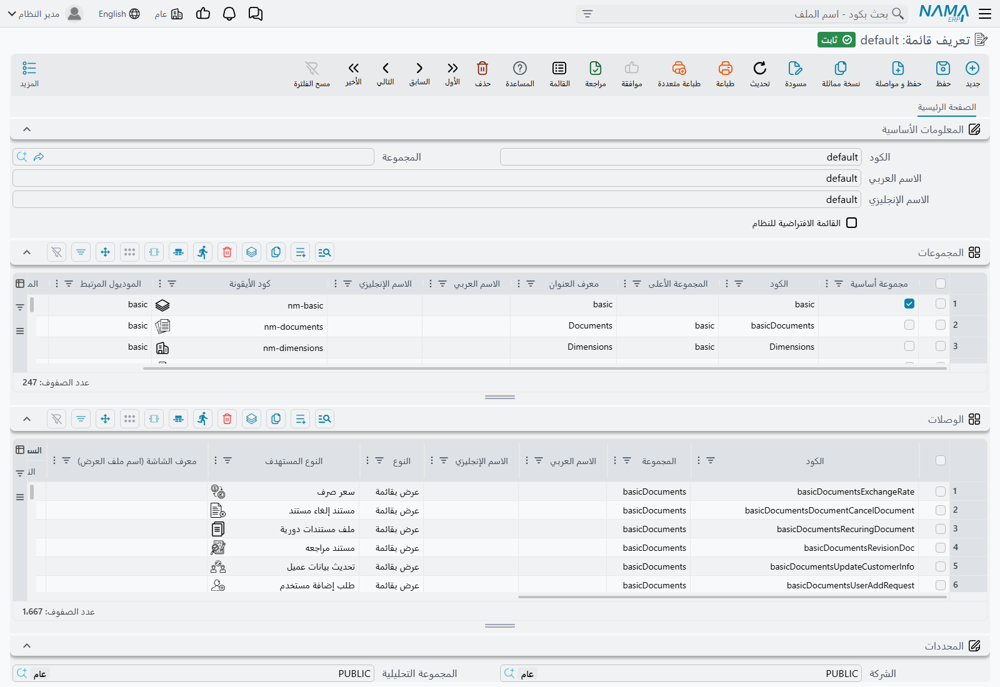
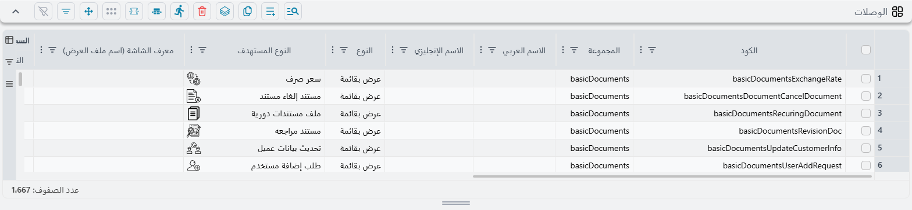
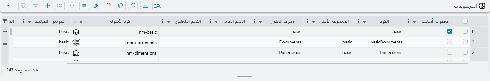

# كيف تُبنى القائمة

القائمة على جانب الشاشة تبدو شجرة، فيتوقع الناس أن يعدّلوها كما تُعدَّل الشجرة — يسحبون مجلدًا إلى
هنا، ويُسقطون وصلة هناك. وهي لا تُخزَّن على هذا النحو إطلاقًا.

القائمة سجل واحد يحمل **جدولين مسطّحين**: أحدهما يسرد المجلدات، والآخر يسرد الوصلات. ولا يعرف أيٌّ من
الجدولين شيئًا عن الشكل. أما الشجرة التي تراها فيُعاد بناؤها في كل مرة تُرسم فيها القائمة، بمطابقة
أكواد نصية بين الجدولين. وحين تستقر هذه الفكرة تكفّ الشاشة عن أن تبدو غريبة وتبدأ في أن تبدو بديهية.

::: info أين تجدها
**إدارة النظام ← تخصيص شكل النظام ← تعريف قائمة.**
:::

## سجل واحد وجدولان

افتح القائمة التي تأتي مع النظام — كودها `default` — تجد تبويبًا واحدًا فيه جدولان، تحت حقول الكود
والاسم المعتادة.

جدول **المجموعات** يحمل المجلدات، وجدول **الوصلات** يحمل المداخل التي تفتح شيئًا. وعلى تطبيق قياسي
يحمل الجدولان نحو 250 سطرًا و1700 سطر على الترتيب، وهذا أول ما يستحق أن يُعرف: السجل كبير، وستعمل
داخله ببحث الجدول نفسه لا بالتمرير.

## ثلاثة مستويات، لا رابع لها

كل مجموعة إمّا **مجموعة أساسية** وإمّا مجموعة فرعية، وخانة الاختيار المسمّاة **مجموعة أساسية** هي التي
تحسم أيّهما.

- **المجموعة الأساسية** مجلد من المستوى الأعلى — المبيعات، الحسابات، إدارة النظام. ولا أب لها.
- والمجموعة الفرعية تسمّي أباها في **المجموعة الأعلى**، ولا بد أن يكون ذلك الأب مجموعة أساسية.
- والوصلة تسمّي بدورها المجموعة الفرعية التي تنتمي إليها في عمود **المجموعة** — وهو والمجموعة الأعلى
  يؤديان الدور نفسه في الجدولين — وتلك المجموعة يجب ألّا تكون أساسية.

فالشكل إذن مثبّت على ثلاثة مستويات بالضبط: **مجموعة أساسية ← مجموعة فرعية ← وصلة**. لا رابع لها.
وتوجيه مجموعة فرعية إلى مجموعة فرعية أخرى لا ينتج شجرة أعمق — بل لا يُرسم ذلك الفرع أصلًا، لأن النظام
حين يبني الشجرة لا ينظر إلا مستوى واحدًا إلى أسفل.

::: warning الكود المكتوب خطأً لا يعطي رسالة خطأ — بل يختفي السطر
قبل أن تُفحص القائمة بحثًا عن الأخطاء، تُنظَّف في صمت. وجزء من هذا التنظيف يحذف كل مجموعة لا تطابق
**المجموعة الأعلى** فيها أي مجموعة، وكل وصلة لا تطابق **المجموعة** فيها أي مجموعة.

والنتيجة أن الخطأ المطبعي في أيٍّ من العمودين لا ينتج رسالة «المجموعة غير موجودة» التي تتوقعها. تضغط
حفظ، فينجح الحفظ، ويكون السطر قد اختفى ببساطة. فإن كان سطر أضفته للتوّ قد اختفى بعد الحفظ، فابدأ
بالنظر في المجموعة التي أشار إليها — فهي السبب في الغالب الأعم.
:::

## ما تستطيع الوصلة فتحه

لكل وصلة **نوع**، وهذا الاختيار يحدد أيّ الأعمدة المجاورة يُنتظر منك ملؤه. أما البقية فتكون معطَّلة،
فالشاشة تقودك.

| النوع | ما تملؤه | ما يحصل عليه المستخدم |
|---|---|---|
| **عرض بقائمة** | النوع المستهدف | قائمة تلك السجلات — الحالة اليومية |
| **سجل جديد** | النوع المستهدف | سجل جديد فارغ جاهز للكتابة فيه |
| **سجل** | مرجع | سجل بعينه، يُفتح مباشرة |
| **تقرير** | مرجع | تقرير واحد، عند شاشة مدخلاته |
| **مجموعة تقارير** | مرجع | مجموعة تقارير تُعرض فهرسًا يمكن تصفّحه |
| **كل التقارير** | *لا شيء* | تتوسّع إلى وصلة لكل مجموعة تقارير |
| **لوحة** | مرجع | لوحة واحدة |
| **مجموعة لوحات** | مرجع | كل لوحات المجموعة، كلٌّ في وصلة مستقلة |
| **AutoDashBoards** | *لا شيء* | تتوسّع إلى مجموعات اللوحات الآلية |
| **مفضلة مستخدم** | *لا شيء* | مفضلة المستخدم المسجَّل دخوله، تُحقَن هنا |
| **رابط** | الرابط | عنوان ويب خارجي، يُفتح في تبويب جديد |
| **رابط داخلي** | الرابط | شاشة داخل نما ليست قائمة سجلات |

و**مرجع** أداة من شقّين: تختار النوع أولًا ثم السجل نفسه. والعمود المجاور له، **النوع**، هو الشقّ
الأول من هذا الزوج لا إعدادًا مستقلًا.

والثلاثة التي لا تأخذ شيئًا — كل التقارير، وAutoDashBoards، ومفضلة مستخدم — تستحق نظرة ثانية. فكلٌّ
منها سطر واحد يتوسّع إلى وصلات كثيرة عند رسم القائمة، فمجلد المفضلة الذي يجده كل مستخدم سطر واحد في
هذا الجدول، لا سطر لكل مستخدم.

::: tip قائمة أم سجل جديد — هناك افتراضي على مستوى النظام كله
هل يفتح مدخل الملف الأساسي قائمةً أم سجلًا جديدًا فارغًا؟ يُحسم هذا مرة واحدة للنظام كله في الإعدادات
العامة، ضمن [إعدادات المظهر](/ar/platform/global-config/global-config-appearance)، بإعدادين منفصلين:
واحد للملفات الأساسية وآخر للمستندات. ويُطبَّق الإعدادان أثناء بناء القائمة، فتغيير أيٍّ منهما لا أثر
له حتى يُعاد بناء القائمة.
:::

## الأعمدة الأربعة التي تجعل الوصلة أكثر من مجرد رابط

إلى جانب الهدف، تحمل كل وصلة أربعة إعدادات اختيارية لا ينتبه إليها أكثر الناس، وفيها يكمن التخصيص
الطريف.

**معرف الشاشة** — والعمود يُقرأ *معرف الشاشة (اسم ملف العرض)* — يفتح قائمة عرض باسم محدد بدل القائمة
القياسية. وهكذا يظهر النوع الواحد عدة مرات في القائمة، في كل مرة بأعمدة مختلفة وفلترة مختلفة، والنظام
نفسه يفعل ذلك في عشرات المواضع.

**المعايير** تضيّق ما تعرضه القائمة. وجِّه وصلة إلى فواتير المبيعات بمعايير «هذا الفرع فقط»، فتصير تلك
الوصلة قائمة فواتير خاصة بالفرع.

**قالب القيم الافتراضية** يملأ السجل الجديد لحظة فتحه. ومع نوع «سجل جديد» يتحول هذا بوصلة واحدة إلى
«فاتورة مبيعات جديدة، مضبوطة سلفًا على فرع القاهرة» — انظر
[قوالب القيم الافتراضية](/ar/platform/default-values-templates).

**فلترة الحقول** تقيّد ما تعرضه حقول الاختيار على الشاشة المفتوحة.

ولا تستعمل القائمةُ الجاهزة أيًّا من هذه الأربعة. هي موجودة من أجلك أنت.

## التسمية

في الجدولين عمودا **الاسم العربي** و**الاسم الإنجليزي**، وكلاهما يُترك فارغًا عادة — بل في كل سطر
تقريبًا من القائمة الجاهزة.

وهذا مقصود، لأن العنوان يتدرّج في ثلاث خطوات:

1. الاسم العربي أو الإنجليزي المكتوب على السطر، إن وُجد؛
2. وإلا فـ**معرف العنوان** — اسم صيغة يترجمها النظام أصلًا، فيتبع العنوانُ لغةَ القارئ دون أن تكتبه
   مرتين. وأيسر طريق إلى معرف صالح أن تنسخه من سطر جاهز يقول ما تريده؛
3. وإلا — **للوصلات وحدها** — عنوان يُستنتج من الهدف: اسم النوع بالجمع في حالة القائمة، وبالمفرد في
   حالة السجل الجديد، والكود والاسم في حالة سجل بعينه.

والخطوة الثالثة هي السبب في أن وصلةً تشير إلى فواتير المبيعات لا تحتاج عنوانًا البتة: هي مسمّاة
«فواتير المبيعات» بالفعل، بلغة المستخدم أيًّا كانت، وتتبع أي تغيير يطرأ على تلك الترجمة.

واكتب اسمًا تفقد ذلك. فيصير السطر يُقرأ بالنص نفسه في اللغتين إلى الأبد، وهو ما تريده أحيانًا ولا
تريده في الغالب.

::: warning المجموعات ليس لها خطوة ثالثة
المجلد الذي لا اسم له ولا معرف عنوان لا عنوان له إطلاقًا. فأعطِ كل مجموعة تنشئها اسمًا باللغتين أو
معرف عنوان.
:::

## الترتيب هو ترتيب السطور

لا يوجد عمود «ترتيب» في أيٍّ من الجدولين، ولا حاجة إليه. **فترتيب السطور في الجدول هو ترتيب القائمة.**
تظهر المجموعات الأساسية بترتيبها في جدول المجموعات، والمجموعات الفرعية بترتيبها في الجدول نفسه،
والوصلات بترتيبها في جدول الوصلات. ولا يُعاد ترتيب شيء عند رسم القائمة.

فتحريك وصلة إلى أعلى القائمة معناه تحريك سطرها إلى أعلى الجدول.

## الأيقونات

في الجدولين عمود **Icon Code**، ويجوز تركه فارغًا في كليهما. فالمجلدات ترجع إلى أيقونة مجلد والوصلات
إلى أيقونة عامة، فحتى القائمة التي لم تُضبط فيها أيقونة واحدة تبدو مقصودة.

## تسهيلان على هذه الشاشة

**إدراج سطر ينسخ السطر الذي قبله.** أضف سطرًا إلى جدول الوصلات فيصلك حاملًا سلفًا مجموعةَ السطر السابق
ونوعَه ونوعَه المستهدف. فإضافة عشر وصلات إلى مجلد واحد سطر واحد من الكتابة وتسعة تعديلات صغيرة.

**وعمودا المجموعة والمجموعة الأعلى يقترحان ما يصلح.** فعلى الوصلة تُعرض عليك المجموعات الفرعية الموجودة
في السجل، وعلى المجموعة تُعرض المجموعات الأساسية. والقائمتان مبنيّتان مما في الجدولين هذه اللحظة،
فالمجموعة التي أضفتها قبل قليل معروضة عليك بالفعل.

## كيف تجد وصلة دون أن تنقّب عنها

القائمة الكاملة تحمل ما يزيد على ألف وصلة، فلا أحد يتنقل فيها بفتح المجلدات. و**Ctrl + U** يفتح القائمة
والمؤشر في مربع بحثها، وكتابة بضعة أحرف تفلترها.

والبحث أكثر تسامحًا مما يبدو. فهو يطابق العنوان العربي والعنوان الإنجليزي واسم الشاشة التي خلف الوصلة
في آن واحد، فيستطيع المستخدم العربي أن يكتب كلمة إنجليزية فيجد الوصلة — بل يحتمل كتابة العربية على لوحة
مفاتيح إنجليزية، وهي طريقة أكثر الناس في الكتابة على عجل.

::: tip النتائج تتوقف عند 25
نتائج البحث محدودة بخمس وعشرين وصلة. فعلى كلمة واسعة — «فاتورة»، «تقرير» — أنت ترى أول خمس وعشرين
نتيجة لا كلَّها. اكتب كلمة أخرى أو اثنتين لتضييق البحث بدل افتراض أن البقية غير موجودة.
:::

ولا يُخلط بينه وبين **Ctrl + K** الذي يبحث عن *السجلات* لا عن وصلات القائمة.

والقائمة نفسها يمكن عرضها بثلاث طرق — شجرةً، أو تنقّلًا متدرّجًا، أو شجرةً مركَّزة — والاختيار لكل شخص
وكل متصفح على حدة، ويُحفظ بين الزيارات. فمن بدت قائمته غريبة في مشاركة شاشة يكون قد اختار وضعًا آخر في
الأغلب.

## ما لا تستطيع فعله هنا

لا توجد خانة إظهار أو إخفاء. فلا المجموعة ولا الوصلة تحمل علامة «غير نشط»، ولا يحملها سجل القائمة نفسه.
ولإخراج شيء من القائمة إمّا أن تحذف سطره وإمّا أن تحجبه عن دور — انظر
[من يرى أي قائمة](/ar/platform/menus/menu-visibility).

كذلك لا يوجد نوع هدف يشغّل إجراءً. فوصلة القائمة تفتح شيئًا؛ ولا تنفّذ شيئًا أبدًا.

## قبل أن تغيّر شيئًا

كل ما سبق يصف كيف تُبنى القائمة. وهو **لا** يصف كيف تخصّص القائمة التي يراها مستخدموك — فتعديل القائمة
الجاهزة مباشرة ليس هو الطريق، والسبب يستحق القراءة قبل أن تبدأ الكتابة.

تشرحه صفحة [تغيير القائمة](/ar/platform/menus/menu-update).

## انظر أيضًا

- [تغيير القائمة](/ar/platform/menus/menu-update) — الطريق الآمن للتخصيص، ولماذا هو الطريق
- [من يرى أي قائمة](/ar/platform/menus/menu-visibility) — الإسناد والإخفاء، ولماذا لم يظهر التغيير
  بعد
- [ملفات الصلاحيات](/ar/platform/security/security-profiles) — تقليم القائمة لكل دور دون بناء قائمة
  أصلًا
