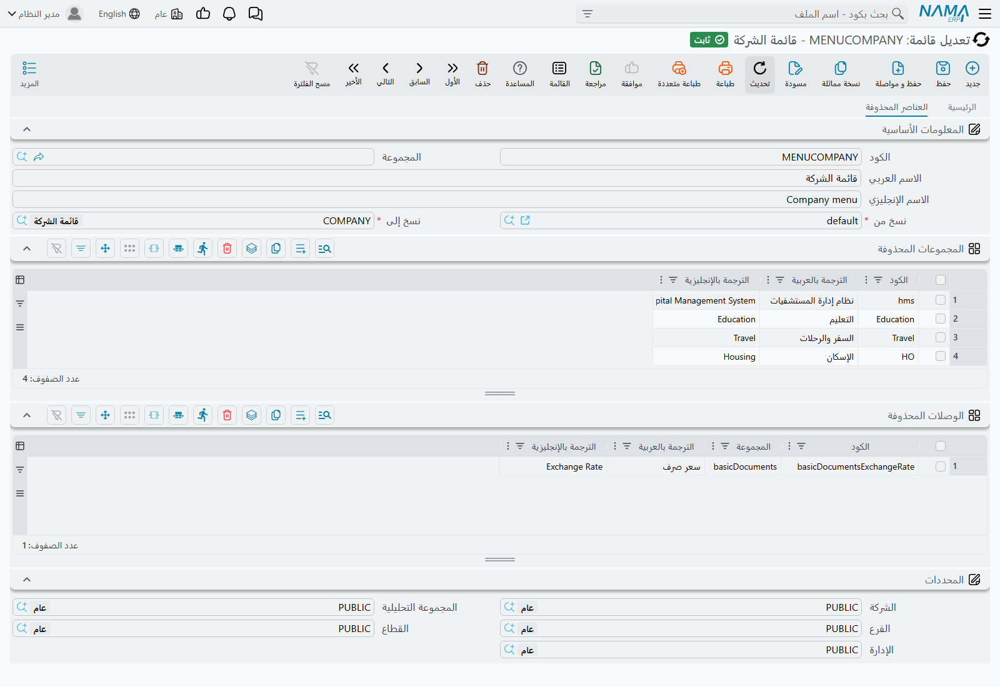
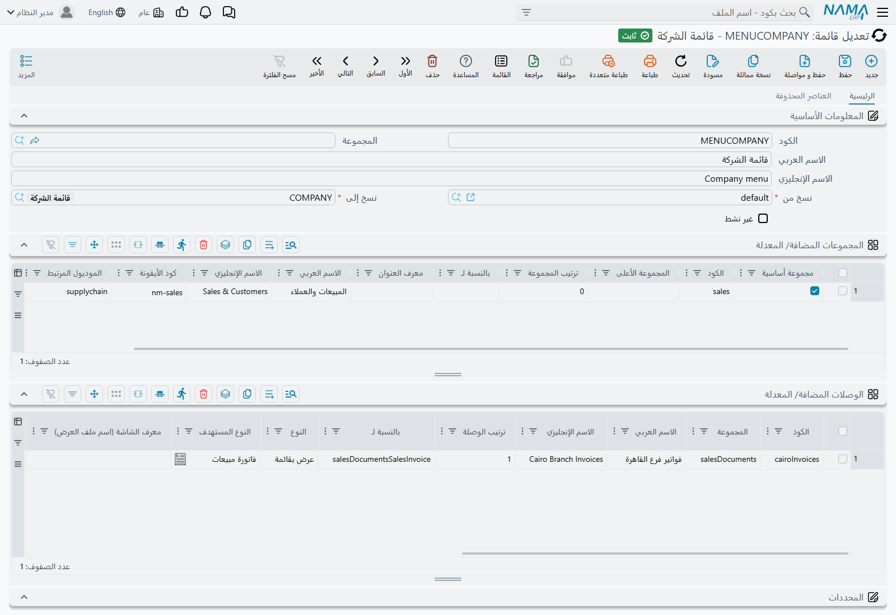

# تغيير القائمة

عاجلًا أو آجلًا يطلب أحدهم إعادة ترتيب القائمة. أسقِط الوحدات التي لا تستعملها الشركة، وسمِّ
«المبيعات» بالاسم الذي يناديها به فريق المبيعات فعلًا، وضع الشاشات الثلاث التي يعيش عليها الجميع في
الأعلى بدل أربعة مجلدات إلى أسفل.

كل ذلك مدعوم. لكن الطريقة البديهية — أن تفتح القائمة التي تأتي مع النظام وتبدأ التعديل — هي الطريقة
الوحيدة التي لا تصمد، وهي تفشل في صمت وبعد وقت طويل. وهذه الصفحة تشرح لماذا، وما البديل.

## لماذا لا يجوز تعديل القائمة الجاهزة

القائمة التي تأتي مع نما سجل كأي سجل، كودها `default`. ولا شيء يمنعك من فتحها وإعادة ترتيبها، وكل ما
تفعله سيعمل على أتم وجه.

إلى أن يعيد أحدهم بناءها. وعندها لا يُدمج السجل ولا يُرقَّع ولا يُوفَّق بينه وبين الجديد — **بل
يُفرَّغ ويُبنى من الصفر**، فتذهب كل مجموعة ووصلة وتسمية وترتيب وأيقونة أضفتها. لا إنذار، ولا رسالة
تأكيد تذكر القائمة، ولا شيء في أي مكان يسجّل أن القائمة كانت مخصَّصة.

والخطر الحقيقي في *توقيت* إعادة البناء. فهي ليست إجراءً إداريًا نادرًا:

- **الأدوات المساعدة ← Regenerate UI** تعيد بناءها، وهذا على الأقل شيء واضح أنك ضغطته.
- و**Regenerate Screens**، على شاشة معدّل الشاشات أو شاشة إعدادات النظام، تعيد بناءها كذلك.
- و**Reset To System Defaults**، على شاشة معدّل الشاشات أو عرض قائمة مخصصة، تعيد بناءها هي الأخرى.

فزميل يرتّب تخطيط شاشة لا علاقة لها بالأمر، ويضغط زرًّا لا يذكر القوائم من قريب ولا بعيد، قد يمحو عمل
أسبوع كامل على القائمة. وقد تمرّ شهور بين التخصيص وضياعه، فيصير الربط بينهما شبه مستحيل بعد وقوعه.

::: warning والأمر نفسه ينطبق على اختصارات لوحة المفاتيح
سجل الاختصارات الجاهز يُعاد بناؤه بالإجراء نفسه تمامًا، وبالنتيجة نفسها تمامًا. فالاختصارات المخصَّصة
المكتوبة فيه تضيع هي الأخرى.
:::

## الطريق المعتمد: تعديل قائمة

بدل تعديل القائمة الجاهزة، تصف تغييراتك بوصفها **قائمة فروق** وتدع النظام يطبّقها على **قائمة ثانية**.
وهذا ما وُضعت له شاشة **تعديل قائمة**.

::: info أين تجدها
**إدارة النظام ← تخصيص شكل النظام ← تعديل قائمة.**
:::

يحمل سجل تعديل القائمة ثلاثة أشياء:

- **نسخ من** — وهي القائمة الجاهزة `default` في المعتاد؛
- **نسخ إلى** — قائمة ثانية فارغة تنشئها أنت؛
- و**الفروق** — ما يُحذف، وما يُضاف، وما يتغيّر.

وحفظه ينسخ المصدر، ويطبّق فروقك على النسخة، ويكتب النتيجة في القائمة الهدف. ثم توجّه مستخدميك إليها.

::: tip الاسمان العربيان يصفان ما يجري أدقّ من الإنجليزيين
الحقلان على الشاشة العربية يُقرآن «نسخ من» و«نسخ إلى» — وهذا بالضبط ما يحدث. أما على الشاشة الإنجليزية
فهما "Source Menu" و"Target Menu"، وهما الحقلان نفسهما.
:::

ولأن المخزَّن هو الفروق لا النتيجة، فإعادة البناء لا تكلّفك شيئًا. فكل تعديل قائمة يُعاد تطبيقه آليًا
عقب إعادة بناء القائمة الجاهزة مباشرة، فتُعاد تغييراتك فوق القائمة الجديدة. **ما عُبِّر عنه في تعديل
قائمة يبقى؛ وما كُتب في القائمة الجاهزة لا يبقى.** وهذه الجملة وحدها هي كل سبب وجود هذه الشاشة.

والنظام لن يدعك تخطئ كذلك: فتعديل القائمة **يرفض أن يستهدف القائمة الجاهزة**، ويرفض أن تكون القائمة
نفسها مصدرًا وهدفًا في آن.

## كيف تُعِدّه

### 1. أنشئ القائمة الهدف

افتح **تعريف قائمة**، واضغط جديد، وأعطِها كودًا واسمًا — `COMPANY` و«قائمة الشركة» يفيان بالغرض —
واحفظها والجدولان فارغان. لا تحتاج إلى أي محتوى: هي على وشك أن تُملأ نيابةً عنك.

### 2. أنشئ تعديل القائمة

افتح **تعديل قائمة**، واضغط جديد، واضبط **نسخ من** على `default` و**نسخ إلى** على السجل الذي أنشأته
للتوّ.

### 3. حدّد ما يُحذف

التبويب الثاني، **العناصر المحذوفة**، فيه جدولان — **المجموعات المحذوفة** للمجلدات و**الوصلات
المحذوفة** للمداخل. اكتب كودًا أو اخترْه في أيٍّ منهما فلا تُنسخ تلك المجموعة أو الوصلة.

وحذف *مجموعة* هو الحركة الاقتصادية. أخرِج مجموعة أساسية فيخرج معها كل ما تحتها. فأربعة سطور هنا — فروع
المستشفيات والتعليم والسفر والإسكان — أخرجت 32 مجلدًا و174 وصلة من القائمة النهائية.

::: tip لست مضطرًا إلى حفظ الأكواد
أعمدة الأكواد تبحث في القائمة المصدر وأنت تكتب، فتبحث عمّا تريد بدل أن تحفظ الأكواد عن ظهر قلب. ومع كل
اختيار يُملأ العنوانان العربي والإنجليزي بجواره لترى بنظرة واحدة ماذا اخترت — وهذان العمودان موضوعان
لتقرأهما أنت، ولا أثر لهما على شيء.
:::

### 4. حدّد ما يُضاف أو يتغيّر

التبويب الأول فيه جدولان آخران — **المجموعات المضافة/ المعدلة** و**الوصلات المضافة/ المعدلة** — والجدول
الواحد يؤدي الوظيفتين معًا. وكون السطر يضيف أو يعدّل يتوقف على الكود وحده:

- الكود الموجود في القائمة المصدر **يعدّل** تلك المجموعة أو الوصلة؛
- والكود غير الموجود **يضيف** واحدة جديدة.

والأعمدة هي أعمدة [شاشة تعريف القائمة](/ar/platform/menus/menu-structure) نفسها، فإن كنت تعرف كيف تصف
وصلة هناك فأنت تعرف كيف تصفها هنا.

واختيار كود موجود يملأ بقية السطر من المصدر، فتغيير شيء واحد في وصلة قائمة لا يعني إعادة كتابة الباقي.

::: warning السطر المعدَّل يُستبدل، لا يُرقَّع
كل عمود في السطر يُكتب في النتيجة، بما فيه ما تركته فارغًا. فإن اخترت وصلة موجودة لتغيّر اسمها وكان
عمود Icon Code فارغًا في سطرك، خرجت الوصلة في القائمة النهائية بلا أيقونة.

والعادة السليمة أن تراجع السطر كله بعد اختيار الكود، لا العمود الذي جئت لتغيّره وحده.
:::

### 5. حدّد موضع ما أضفته

تنزل السطور الجديدة في آخر مجلدها ما لم تقل غير ذلك، وعمودان يقولان غير ذلك:

- **بالنسبة لـ** — كود مجموعة أو وصلة أخرى تجلس بجوارها.
- **ترتيب المجموعة** / **ترتيب الوصلة** — كم تبعد عن ذلك المرتكز. وبمفرده، دون «بالنسبة لـ»، يُحسب
  الترتيب من بداية المجلد الذي سمّيته.

واترك الاثنين فارغين لمجموعة فرعية جديدة فتنزل مباشرة بعد مجموعتها الأعلى، وهو ما كنت تريده على أي حال.

### 6. احفظ، ثم وجّه المستخدمين إلى القائمة الجديدة

الحفظ هو ما يطبّق كل شيء — لا زرَّ منفصلًا ولا شيء تشغّله بعده. افتح القائمة الهدف تجدها ممتلئة تمامًا.

ثم أسندها: على مستخدم، أو على ملف صلاحيات، أو على الشركة. وتغطّي صفحة
[من يرى أي قائمة](/ar/platform/menus/menu-visibility) ترتيب الرجوع إلى هذه المواضع الثلاثة، ولماذا لن
يرى أحد القائمة الجديدة قبل أن يعيد تحميل الصفحة.

## ما يستحق أن تعرفه قبل أن تعتمد عليه

**القائمة الهدف يُعاد بناؤها من الصفر في كل مرة.** فكما أن القائمة الجاهزة ليست مكانًا لكتابة التغييرات،
كذلك هدف تعديل القائمة — يُفرَّغ ويُملأ من جديد عند كل حفظ. وكل ما تضيفه إليها بيدك يضيع. كل التغييرات
محلّها سجل تعديل القائمة.

**والحفظ مرتين لا يغيّر شيئًا.** فكل حفظ يبدأ من جديد من نسخة طازجة من المصدر، فإعادة الحفظ آمنة وتعطي
النتيجة نفسها بدل أن تتراكم.

**والقائمة المصدر لا تُمَسّ أبدًا.** فالقائمة الجاهزة تبقى كما سُلِّمت تمامًا، وهذا ما يجعل إعادة
بنائها آمنة.

**ووصلات الإصدار الجديد لا تصلك من تلقاء نفسها.** فحين تضيف الترقية شاشات إلى القائمة الجاهزة، تظل
قائمتك الهدف تعرض ما بُنيت به حتى يُعاد تطبيق تعديل القائمة — إمّا بحفظه، وإمّا بإعادة توليد الشاشات
التي تتبع أغلب الترقيات. ومن الحكمة أن تعيد حفظ تعديلات القوائم بعد كل ترقية كعادة ثابتة.

**وحذف تعديل القائمة لا يلغي أثره**، ولا يلغيه تعليم **غير نشط**. كلاهما يمنع تطبيقه مستقبلًا؛ ولا يعيد
أيٌّ منهما القائمة الهدف إلى ما كانت عليه. وللتراجع عن تغيير، عدّل سجل تعديل القائمة واحفظه من جديد —
فالهدف يُبنى من المصدر في كل مرة، وحذف سطر يحذف أثره حقًّا.

**وتعديل قائمة نشط واحد لكل قائمة هدف.** فإن احتجت إلى تغييرات عدة أشخاص فمحلّها السجل نفسه. والسجل
الثاني النشط الموجَّه إلى الهدف نفسه مرفوض، والرسالة تسمّي السجل الذي يستعمله بالفعل.

## متى لا تحتاج إلى شيء من هذا

إن كان كل ما تريده أن ترى مجموعة من الناس قدرًا أقل من القائمة، فلست بحاجة إلى قائمة ثانية أصلًا. فملف
الصلاحيات يستطيع السماح بوصلات ومجلدات كاملة أو حجبها بالكود، وهو أقل عملًا بكثير من صيانة قائمة خاصة
بك — تغطّيه صفحة [ملفات الصلاحيات](/ar/platform/security/security-profiles).

ابنِ قائمة خاصة بك حين يكون الشكل نفسه هو ما ينبغي أن يختلف: مجلدات مختلفة، وأسماء مختلفة، وترتيب
مختلف، ووصلات تفتح قوائم مفلترة سلفًا. وقلّم بالصلاحيات حين يكون الشكل سليمًا ولا يحتاج بعض الناس إلا
أن يروا أقلّ منه.

## انظر أيضًا

- [كيف تُبنى القائمة](/ar/platform/menus/menu-structure) — المجموعات والوصلات والأهداف والأعمدة التي
  ستملؤها هنا
- [من يرى أي قائمة](/ar/platform/menus/menu-visibility) — إسناد القائمة بعد إنجازها
- [ملفات الصلاحيات](/ar/platform/security/security-profiles) — إخفاء الوصلات لكل دور
