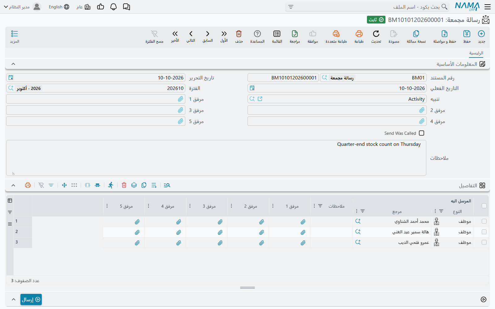
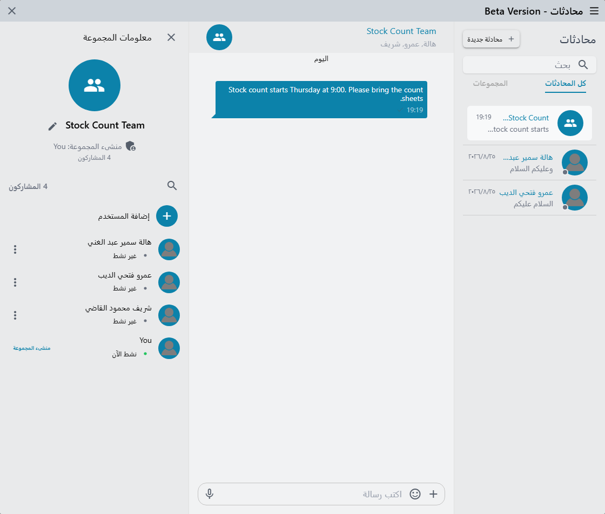

# الرسائل المجمعة ورسائل واتساب والمحادثات الداخلية

معظم الرسائل في نما يرسلها [تعريف تنبيهات](/ar/platform/notifications/notifications-system): يحدث شيء لسجل ما، فيقرر التعريف من يُبلَّغ وعبر أي قناة. تشرح هذه الصفحة الشاشات المحيطة بهذا المحرك — تلك التي يفتحها الناس حين يريدون إرسال شيء بأنفسهم، أو حين يحتاجون إلى ضبط ما يخرج عبر واتساب — ثم المحادثات التي تتيح للزملاء التواصل داخل النظام.

| الشاشة | القائمة | الغرض منها |
|---|---|---|
| **رسالة مجمعة** (Bulk Message) | الأساسيات ← الملاحظات ← رسالة مجمعة | إرسال رسالة واحدة إلى قائمة تختارها من العملاء أو الموردين أو الموظفين أو جهات الاتصال |
| **WhatsApp Message Configuration** | إدارة النظام ← أخري ← WhatsApp Message Configuration | الاتصال بحساب واحد لدى مزود واتساب |
| **WhatsApp Message** | إدارة النظام ← أخري ← WhatsApp Message | ما تقوله رسالة واتساب واحدة، وكم مرة يجوز إرسالها |
| **رسالة خطأ** (Error Message) | الأساسيات ← الملاحظات ← رسالة خطأ | سجل برسائل التكرار (Replication) الفاشلة — وليست شيئاً ترسله |
| **محادثات** | أيقونة المحادثات في الشريط العلوي | محادثات مباشرة وجماعية بين المستخدمين |

ولشاشتين قريبتين صفحتان مستقلتان: [الإعلانات العامة](/ar/platform/notifications/general-announcements) للوحة إعلانات الشركة، و[تنبيهات تيليجرام](/ar/platform/notifications/telegram) لتيليجرام.

## الرسالة المجمعة: رسالة واحدة وقائمة مستلمين

يريد فريق التسويق إبلاغ أربعين عميلاً بانتقال صالة العرض. لا أحد يريد كتابة أربعين بريداً، ولا يجمع هؤلاء العملاءَ شيءٌ تستطيع المعايير إيجاده. الحل هو **الرسالة المجمعة**: مستند أسطره هي المستلمون.

يتطلب الإعداد جزأين:

1. **تعريف تنبيهات يدوي للرسالة المجمعة.** أنشئ [تعريف تنبيهات](/ar/platform/notifications/notifications-system) نوع السجل الذي يراقبه — الحقل المسمى **نوع الملف/المستند** في تلك الشاشة — هو **رسالة مجمعة**، وعلّم على **يدوياً**. اكتب قالب البريد أو الرسالة القصيرة أو واتساب كما تفعل في أي تعريف. وفي جدول **المستهدفين** أضف سطراً من نوع حقل يشير إلى عمود المستلم في الأسطر، لتذهب الرسالة إلى كل شخص مدرج. والتعريف قابل لإعادة الاستخدام: نص «انتقال صالة العرض» ونص «مواعيد العطلة» الشهر القادم تعريفان، يُختار أيهما عند الحاجة.
2. **الرسالة المجمعة نفسها.** اختر ذلك التعريف في حقل **تنبيه** — لا تعرض القائمة إلا التعريفات المعدّة كما في الخطوة 1 — واملأ الأسطر. لكل سطر **المرسل اليه** (عميل أو موظف أو مورد أو جهة اتصال أو عميل محتمل أو فرصة في إدارة علاقات العملاء)، و**ملاحظات**، وخمس خانات مرفقات؛ وفي الرأس خمس خانات مرفقات أخرى.

احفظ المستند، ثم اضغط **إرسال**. يعمل التعريف مرة واحدة على الرسالة المجمعة وتدخل الرسائل الطابور كأي تنبيه آخر؛ وتسجّل خانة **Send Was Called** أنها أُرسلت. إذا لم يصل شيء، فالأسباب هي المعتادة — انظر قسم «لماذا لم يصل التنبيه» في [تعريفات التنبيهات](/ar/platform/notifications/notifications-system).

::: tip رسالة لكل سطر
القالب الذي يقرأ الأسطر يجب أن يمر عليها في حلقة، وإلا استُخدم السطر الأول فقط. يعرض [سؤال وجواب التنبيهات](/ar/platform/notifications/notification-fq) نمط `{loop(lines)}`.
:::

الضغط على **إرسال** وحقل **تنبيه** فارغ يُرفض بالرسالة:

«لا يمكن ترك حقل التنبيه فارغاً»

## واتساب: الإعدادات والرسالة

يخرج واتساب من نما عبر سجلين يعملان معاً. خطوات كل مزود — الحسابات والرموز ومعرّفات النسخ وإعدادات المقسم — في [إعداد الرسائل القصيرة وواتساب](/ar/platform/notifications/sms-and-whatsapp)؛ وهذا القسم هو الجزء المشترك بين كل المزودين.

### WhatsApp Message Configuration

سجل واحد لكل حساب لدى مزود:

| الحقل | معناه |
|---|---|
| **مزود الخدمة** | الخدمة التي يتبعها الحساب |
| **Public Id / API Endpoint** و**Secret / Access Token** | بيانات دخول الحساب كما يصدرها المزود |
| **Public IDs by Sender** | أرقام إرسال إضافية على الحساب نفسه — انظر قسم الإرسال من هواتف الموظفين في [إعداد الرسائل القصيرة وواتساب](/ar/platform/notifications/sms-and-whatsapp) |
| **استعلام تصحيح رقم الهاتف** | استعلام يعيد كتابة رقم المستلم بالصيغة التي يتوقعها المزود |
| **إرسال مرة واحدة فقط** | لا تُرسل الرسالة نفسها، للسجل نفسه وبالتنبيه نفسه، إلى الرقم نفسه مرتين أبداً |

**إرسال مرة واحدة فقط** هو الحماية من أن يتلقى العميل رسالة الفاتورة نفسها كلما عُدّلت الفاتورة. والتكرار يُرفض بالرسالة:

«لا يمكنك إرسال التنبية {0} برسالة {1} مرة أخرى حيث تم إرسالها من قبل»

### WhatsApp Message

تحدد **WhatsApp Message** *ما* يُرسل. فهي تسمّي **الإعدادات** التي تستخدمها، ثم يسمّي تعريفُ التنبيهات أو تعريفُ الموافقة رسالةَ واتساب التي يستخدمها. للشاشة صفحة لكل عائلة من المزودين، لأن المزودين يطلبون أشياء مختلفة، لكن الحقول المشتركة هي:

| الحقل | معناه |
|---|---|
| **Message Type** | **Template** (قالب معتمد لدى المزود يُملأ بالمدخلات) أو **نص** أو **Media** |
| **Template Name** و**Language Code** | القالب المعتمد ولغته، لرسائل القوالب |
| **المدخلات** | سطر لكل متغير في القالب؛ وكل **قالب المدخل** قالب يقرأ السجل، فيصبح `{customer.name1}` اسم العميل |
| **Text Message** | النص، للرسائل النصية — وهو قالب أيضاً |
| **Media Message** | جزءان: نوع الملف (File أو Image أو Video أو Audio) و**Media URL**، وهو قالب يعطي عنوان الملف. يجب أن يكون العنوان متاحاً من الإنترنت |
| **الوقت المسموح لتكرار الرسالة بالثوانى** | فترة تهدئة: لا يرسل السجل نفسه إلى الرقم نفسه مرة أخرى قبل مرور هذا العدد من الثواني |
| **تنبيه تغير حالة الرسالة** | تعريف تنبيهات يدوي يعمل حين يبلّغ المزود أن حالة الرسالة تغيرت (وصلت، قُرئت، رُدّ عليها…) |

فترة التهدئة هي الخيار المناسب لـ«لا تراسل العميل مرتين خلال خمس دقائق لأن شخصين حفظا الطلب». والرسالة التي تأتي قبل أوانها تُرفض بالرسالة:

«هذه الرسالة قد تم إرسالها إلى {0} فى الوقت {1} يمكنك إعادة إرسالها فى الوقت {2}»

## رسالة خطأ: سجل وليست رسالة

تقع **رسالة خطأ** بجوار الرسالة المجمعة في القائمة، لكن لا أحد يكتبها. كل سجل فيها رسالة تكرار واردة فشلت وطُلب من النظام الاحتفاظ بها: يحمل **رسالة الخطأ** و**وصف الخطأ** والسجل الذي كانت تخصه و**منشيء المستند** الذي عملت باسمه و**نوع الرسالة** و**كود موقع التكرار**. وإذا فشلت الرسالة نفسها مرة أخرى، يُحدَّث سجلها الموجود بدلاً من تكراره.

أيّ حالات الفشل يُحتفظ بها يُحدَّد في جدول [Error Message Logging Configurations](/ar/platform/fields-and-entities-settings/fields-settings-integrations#Error-Message-Logging-Configurations). إذا كانت القائمة فارغة دائماً، فذلك الجدول فارغ.

## المحادثات الداخلية

المحادثات للأسئلة السريعة التي لا تستحق بريداً: «هل طلب جدة جاهز؟» ومعه رابط الطلب. وهي خلف أيقونة المحادثات في الشريط العلوي (تلميحها **محادثات**)، وعليها شارة حمراء بعدد الرسائل غير المقروءة. وعنوان النافذة يُقرأ *Beta Version*.

### من يستطيع المحادثة

لا تظهر الأيقونة إلا للمستخدمين المسموح لهم بالمحادثة. الخيار **منع الوصول إلى المحادثات اللحظية** — في **الإعدادات** الخاصة بالمستخدم أو في **ملف الصلاحيات** الخاص به — يخفيها، ويجب أن تكون ميزة **المحادثات اللحظية** مفعّلة على النظام. والأشخاص الذين تستطيع بدء محادثة معهم هم بقية المستخدمين الذين يستطيعون الدخول ومسموح لهم بالمحادثة؛ فالمحادثة بين **المستخدمين** لا الموظفين.

### بدء محادثة

- **محادثة جديدة** تفتح **بدء محادثة جديدة**. انقر مستخدماً فتكون في محادثة مباشرة معه — المحادثة القائمة إن كنتما تحدثتما من قبل.
- **إنشاء مجموعة جديدة** تتيح لك التعليم على عدة مستخدمين، ثم الضغط على **أنشئ**، وإعطاء المجموعة **اسم المجموعة**. وتصبح أنت **منشىء المجموعة**.

لقائمة المحادثات تبويبان، **كل المحادثات** و**المجموعات**، ومربع بحث يجد المحادثات بالاسم ويبحث أيضاً في نصوص الرسائل؛ والنقر على رسالة موجودة ينقلك إليها.

### إدارة مجموعة

افتح رأس المحادثة لترى **معلومات المجموعة**: المنشئ، وعدد **المشاركون**، ومن هو **نشط الآن**، و**عرض الأعضاء**.

| الإجراء | من يستطيعه |
|---|---|
| تغيير اسم المجموعة | المنشئ والمسؤولون |
| **إضافة المستخدم** | المنشئ والمسؤولون |
| **إزالة المستخدم** | المنشئ والمسؤولون — ليس على المنشئ أبداً، ولا على نفسك |
| **تعيين كمسؤول** / **إزالة المسؤول** | المنشئ |

يرى كل من في المجموعة سطراً حين يُضاف أحد أو يُزال. والعضو الذي أُزيل لا يستطيع الكتابة بعد ذلك؛ ويرى مكان مربع الرسالة:

«لا يمكنك إرسال أو استقبال رسائل لأنك لم تعد عضواً في هذه المجموعة»

لا يوجد خيار «مغادرة المجموعة»: من ينبغي أن يغادر يزيله أحد المسؤولين.

### كتابة الرسائل

- **النص** — حتى 10,000 حرف، مع منتقي الرموز التعبيرية.
- **الملفات** — **مرفق** يرسل ملفاً أو أكثر. تظهر الصور والفيديو كصور داخل المحادثة (والمتعدد منها يُجمع في ألبوم تتصفحه)، ولكل ملف **تنزيل**. وحين ترسل عدة ملفات مع نص، يصبح النص تعليقاً على أولها.
- **رسالة صوتية** — والمربع فارغ، يسجّل زر الميكروفون رسالة صوتية في المتصفح. يجب السماح للمتصفح باستخدام الميكروفون.

لا يمكن تعديل الرسائل ولا حذفها ولا الرد عليها ولا إعادة توجيهها.

**الإشارات** تبدأ بـ `@`. في المجموعة تعرض القائمة **الأعضاء**؛ وتعرض أيضاً **الأنواع** — اختر نوع سجل ثم ابحث عن سجل، فتحمل الرسالة رابطاً إلى ذلك السجل. النقر على رابط السجل يفتحه في تبويب جديد؛ والنقر على الإشارة إلى شخص يفتح محادثة مباشرة معه. والإشارة لا تنبّه أحداً من خارج المحادثة.

العلامات بجوار رسائلك تبيّن إلى أين وصلت كل رسالة: ساعة أثناء الإرسال، وعلامة رمادية حين يستلمها الخادم، وعلامتان زرقاوان حين تُقرأ، وعلامة حمراء إذا فشلت.

تصل الرسائل الجديدة فوراً ما دام النظام مفتوحاً، والمستخدمون الذين لديهم تطبيق نما للجوال يتلقون أيضاً إشعاراً على هواتفهم باسم المرسل وبداية الرسالة.

### رسائل قد تظهر لك

هذه الرسائل تأتي من المحادثات نفسها وليس لها ترجمة عربية، لذا تظهر بالإنجليزية على الشاشات العربية أيضاً.

| الرسالة | السبب | ما العمل |
|---|---|---|
| *WebSocket not connected!* | انقطع الاتصال المباشر بالخادم | حدّث الصفحة؛ وإذا تكرر ذلك، فالاتصال بين المتصفح والخادم (وكثيراً ما يكون خادماً وسيطاً) هو الذي يغلقه |
| *Message too long (max 10,000 characters)* | النص تجاوز الحد | قسّمه، أو أرسله ملفاً |
| *Microphone access failed* | رفض المتصفح الميكروفون | اسمح بالميكروفون للموقع في إعدادات المتصفح |
| *You are not a member of this conversation* | أُزلت من المجموعة وهي مفتوحة | اطلب من أحد مسؤولي المجموعة إضافتك من جديد |
