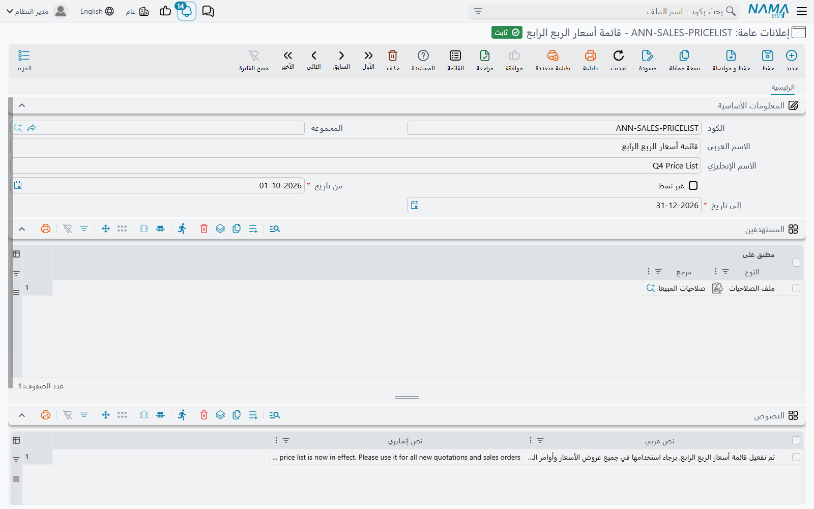
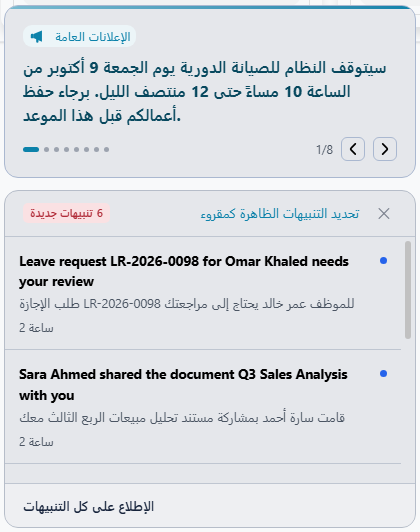
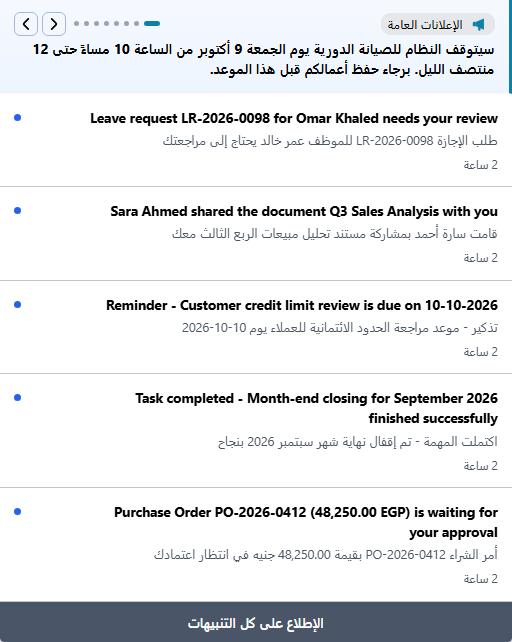

# الإعلانات العامة (General Announcements)

التنبيه أمر شخصي: يخبر مستخدمًا واحدًا بأن فاتورته *هو* تمت الموافقة عليها أو أن مهمته *هو* تأخرت. لكن بعض الأخبار لا تخص سجلًا بعينه — المكتب يغلق مبكرًا يوم الخميس، قائمة الأسعار تتغير الشهر القادم، النظام سيتوقف للصيانة مساء الجمعة. **الإعلان العام** هو لوحة إعلانات الشركة لهذا النوع من الأخبار. تكتب النص مرة واحدة، وتحدد من يراه وبين أي تاريخين، فيظهر لهؤلاء المستخدمين بجوار تنبيهاتهم — في واجهة الويب وفي تطبيقات الموبايل — دون تعريف تنبيه ولا نموذج ولا حدث خلفه.



## كتابة إعلان

افتح **إدارة النظام ← أخري ← إعلانات عامة** وأضف سجلًا. بجانب الكود والأسماء المعتادة، تسألك الشاشة ثلاثة أسئلة: *متى*، و*لمن*، و*ماذا*.

**متى.** الحقلان **من تاريخ** و**إلى تاريخ** مطلوبان، وهما معًا فترة النشر. يظهر الإعلان من اليوم الأول إلى اليوم الأخير شاملًا الطرفين، ويختفي من تلقاء نفسه في اليوم التالي لـ **إلى تاريخ** — فلا يحتاج أحد أن يتذكر إزالته. إعلان عن جرد يوم 31 ديسمبر يمكن إدخاله في أكتوبر بقيمة **من تاريخ** تساوي 1 ديسمبر؛ فيبقى صامتًا حتى ذلك اليوم.

**لمن.** جدول **المستهدفين** يسرد من يرى الإعلان. في كل سطر مرجع واحد **مطبق على**، ويمكن أن يشير إلى أحد ثلاثة أشياء:

| مطبق على | بالإنجليزية | من يرى الإعلان |
|---|---|---|
| مستخدم | User | ذلك المستخدم وحده |
| مجموعة | Group | كل مستخدم **المجموعة** في سجله هي تلك المجموعة |
| ملف الصلاحيات | Security Profile | كل مستخدم له ملف الصلاحيات ذاك |

السطور تُجمَع: إعلان فيه سطر لملف صلاحيات المبيعات وسطر للمستخدم *أحمد* يصل إلى فريق المبيعات كله وإلى أحمد. والمستخدم الذي ينطبق عليه أكثر من سطر يرى الإعلان مرة واحدة فقط.

::: tip اترك جدول المستهدفين فارغًا ليصل الإعلان للجميع
الإعلان الذي لا يحتوي على أي سطر في المستهدفين يظهر **لكل** المستخدمين. هذه هي الحالة المعتادة لأخبار الشركة العامة، ولذلك لا يوجد اختيار "كل المستخدمين" — فقط اترك الجدول فارغًا.
:::

**ماذا.** جدول **النصوص** يحمل الرسالة، وفي كل سطر **نص عربي** و**نص إنجليزي**. المستخدم الذي يعمل بالعربية يقرأ النص العربي، والذي يعمل بالإنجليزية يقرأ الإنجليزي. وإذا أدخلت أحدهما فقط قرأه الجميع أيًّا كانت لغتهم — ولذلك يحتاج السطر إلى واحد منهما على الأقل، وترفض الشاشة حفظ سطر ليس فيه أيٌّ منهما.

كل سطر في الجدول شريحة مستقلة. إعلان واحد عن العام الجديد يمكن أن يحمل ثلاثة سطور — مواعيد الإجازة، وآخر موعد لتسليم المصروفات، وتاريخ الجرد — ويتنقل القارئ بينها واحدًا واحدًا. والإعلان المحفوظ دون أي سطر نصوص لا يظهر إطلاقًا.

علِّم على **غير نشط** لسحب الإعلان قبل **إلى تاريخ** دون حذفه.

## ما الذي يراه القارئ

تظهر الإعلانات بجوار التنبيهات، في المكانين اللذين ينظر إليهما المستخدم أصلًا.

بعد الدخول مباشرة، تُفتح اللوحة التي تعرض التنبيهات الجديدة والإعلانات في أعلاها:



وبعد ذلك تجد الإعلانات نفسها أعلى القائمة التي تُفتح من الجرس في الشريط العلوي:



عند وجود أكثر من شريحة، تبين النقاط عددها وأيها المعروض الآن، والسهمان ينتقلان للسابق والتالي. وفي قائمة الجرس تتبدل الشرائح أيضًا من تلقاء نفسها كل بضع ثوانٍ إلى أن تضغط سهمًا أو نقطة. والنص الطويل يُمرَّر داخل مساحته الخاصة بدلًا من أن يدفع التنبيهات إلى أسفل.

وبخلاف التنبيه، لا يستطيع القارئ أن يعلِّم الإعلان كمقروء أو يغلقه. يبقى ظاهرًا لكل من يستهدفهم حتى تنتهي فترته أو تجعله غير نشط.

::: info متى يصل التغيير إلى المستخدمين
الإعلان الجديد أو المعدَّل يظهر للمستخدم عند دخوله التالي أو عند إعادة تحميل الصفحة — ولا يظهر فجأة أثناء جلسة مفتوحة. وكذلك عند سحب الإعلان: من كان يراه على الشاشة يظل يراه حتى إعادة التحميل التالية.
:::

## تنسيق النص

واجهة الويب تعرض النص بصيغة HTML، فالإعلان ليس مقصورًا على جملة عادية. بضعة وسوم تكفي لإبراز الجزء المهم:

```html
<b>صيانة مجدولة</b> — سيتوقف النظام يوم
<span style="color:#b91c1c">الجمعة 16 أكتوبر من 22:00 إلى 23:00</span>.
برجاء حفظ أعمالكم قبل هذا الموعد.
```

العناوين والقوائم والروابط والألوان والصور تعمل بالطريقة نفسها. اجعل الإعلان موجزًا: مساحة الإعلان صغيرة، وما يزيد عنها يحتاج إلى تمرير.

::: warning لا تمنح هذه الشاشة إلا لمن تثق به
لأن النص يُعرض بصيغة HTML كما كُتب تمامًا، فكل ما يُكتب هنا يعمل في متصفح كل مستخدم يستهدفه الإعلان. امنح الصلاحية على شاشة الإعلانات العامة لمديري النظام فقط، ولا تلصق وسومًا من مصدر لا تعرفه.
:::

## لماذا لا يظهر الإعلان

راجع الشروط بالترتيب الذي يفحصها به النظام:

1. السجل محفوظ ومعتمد وليس مسودة.
2. **غير نشط** غير معلَّم.
3. اليوم يقع داخل الفترة — في **من تاريخ** أو بعده، وفي **إلى تاريخ** أو قبله.
4. جدول **النصوص** فيه سطر واحد على الأقل.
5. إما أن جدول **المستهدفين** فارغ، أو أن أحد سطوره يسمي المستخدم أو **المجموعة** في سجله أو ملف صلاحياته.
6. المستخدم دخل النظام أو أعاد تحميل الصفحة بعد حفظ الإعلان.

أما إذا رُفض الإعلان عند الحفظ، فالسبب إحدى هاتين الرسالتين:

| الرسالة | السبب | ما العمل |
|---|---|---|
| «إلى تاريخ يجب أن يكون أكبر من أو يساوي من تاريخ» | **إلى تاريخ** أقدم من **من تاريخ**. | صحِّح الفترة. |
| *Arabic text or English text must be entered* | سطر في جدول **النصوص** ليس فيه أيٌّ من النصين. هذه الرسالة ليس لها نص عربي، فتظهر بالإنجليزية على الشاشات العربية أيضًا. | أدخل أحد النصين في ذلك السطر، أو احذف السطر. |

وحين يكون الخبر عن سجل أو حدث بعينه — فاتورة تتجاوز حدًّا، أو موافقة تنتظر — استخدم [تعريف تنبيه](/ar/platform/notifications/notifications-system) بدلًا من الإعلان؛ فهو الذي يصل إلى الشخص المناسب في اللحظة المناسبة، وبالبريد الإلكتروني والرسائل القصيرة أيضًا.
