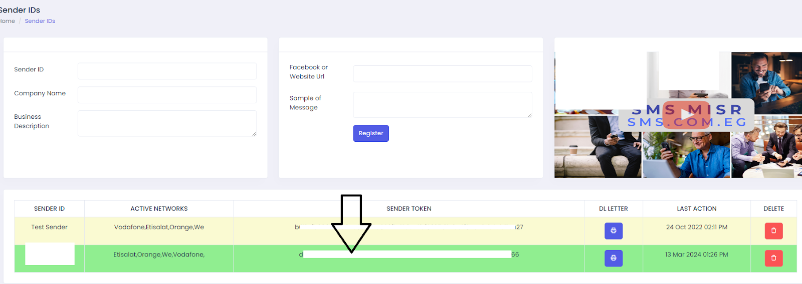
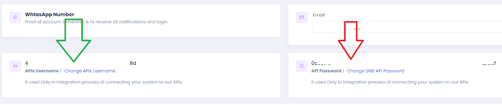
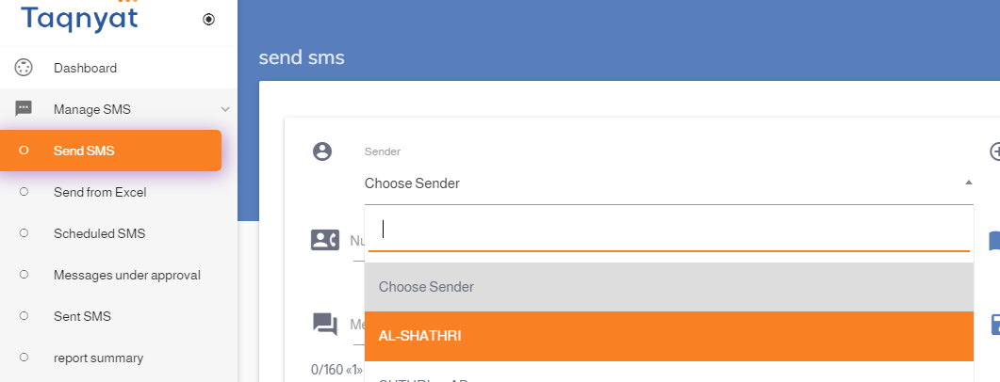
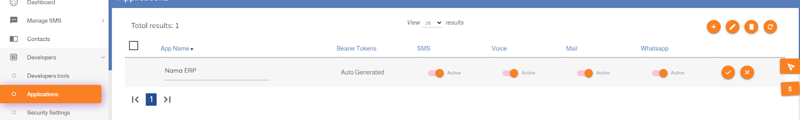
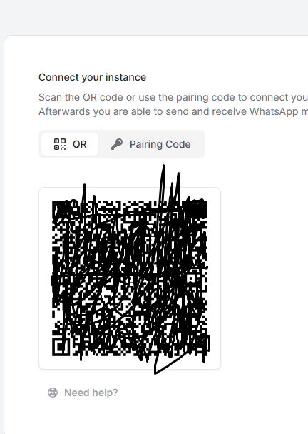
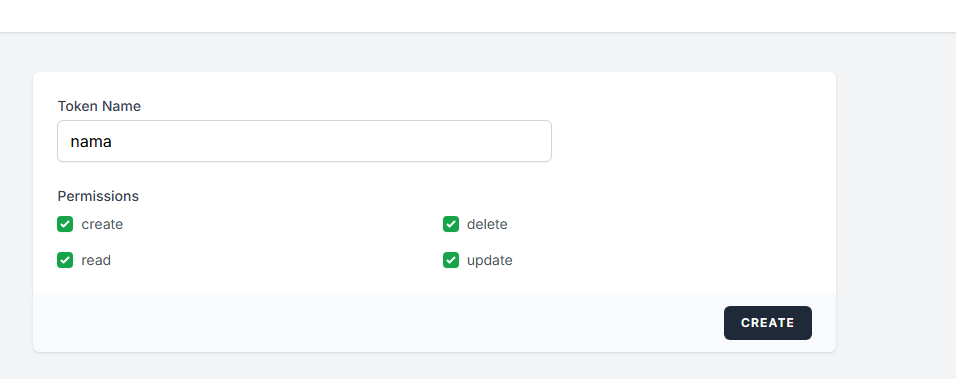
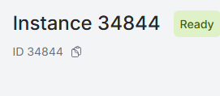
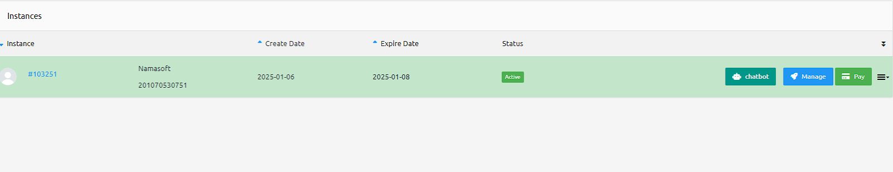
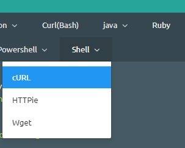

# إعداد الرسائل القصيرة (SMS) و WhatsApp في نظام نما ERP

يدعم نظام نما ERP إرسال الرسائل عبر SMS و WhatsApp إلى المستخدمين والعملاء والموردين وغيرهم.
لتفعيل هذه الميزة، قم بتهيئة الإعدادات المناسبة من شاشة **الإعدادات العامة** (Global Configuration).

## مزود SMS: SMS Misr ([smsmisr.com](https://smsmisr.com/))

* **مزود الخدمة**: `SMS Misr`
* **Sender Token**: احصل عليه من [smsmisr.com/Client/senderid](https://smsmisr.com/Client/senderid)
  
* **API Username** و **API Password**: احصل عليهما من [smsmisr.com/Client/Settings](https://smsmisr.com/Client/Settings)
  

---

## مزود SMS: Taqnyat ([taqnyat.sa](https://portal.taqnyat.sa))

* **مزود الخدمة**: `Taqneyat`
* **Sender**:
  ادخل إلى [portal.taqnyat.sa](https://portal.taqnyat.sa)، انتقل إلى **Send SMS**، وانسخ اسم المرسل من القائمة المنسدلة.
::: tip
💡 استخدم أداة Inspect في متصفح Chrome لنسخ القيمة بدقة.
:::
  
* **Password (Bearer Token)**:
  انتقل إلى **Developers > Application**، اضغط أيقونة ➕، أدخل اسمًا، ثم اضغط علامة ✔️. انسخ الـ **Bearer Token** الناتج.
  

---

## مزود SMS: Vodafone Egypt

* **مزود الخدمة**: `Vodafone Egypt`
* **User Name**: معرّف الحساب (Account ID)
* **Password**: كلمة مرور API
* **Sender**: اسم المرسل
* **Other Settings**: المفتاح السري (Secret Key)
* **استعلام التصحيح** (للتأكد من صيغة رقم الهاتف الصحيحة):

  ```sql
  select case when {to} like '2%' then {to} else concat('2',{to}) end
  ```

::: tip
✅ بعد حفظ الإعدادات، سيتمكن نظام نما ERP من إرسال الإشعارات والرسائل عبر المزود المحدد. تأكد من صحة بيانات الاعتماد ومعرّفات المرسل مع مزود الخدمة.
:::

---

# تكامل WhatsApp

## تكامل WhatsApp عبر WAAPI.app

لتفعيل إرسال الرسائل عبر WhatsApp باستخدام منصة [waapi.app](https://waapi.app)، اتبع الخطوات التالية:

---

### خطوات الإعداد

1. **إنشاء الحساب وربط واتساب**

  * قم بإنشاء Instance جديدة على [waapi.app](https://waapi.app)
  * سجّل الدخول إلى WhatsApp عبر مسح رمز QR
    
::: tip
    ⚠️ **يجب** مسح رمز QR باستخدام الهاتف الذي عليه حساب WhatsApp الفعّال.
::: 

2. **الحصول على API Token**

  * انتقل إلى [صفحة API Tokens](https://waapi.app/user/api-tokens)
  * أدخل اسمًا مناسبًا، ثم اضغط "Create"
  * سيتم عرض الـ Token في نافذة منبثقة — انسخه وضعه في حقل **كلمة المرور** في إعدادات Nama
    

3. **الحصول على Instance ID**

  * انتقل إلى [صفحة Instances](https://waapi.app/account/instances)
  * انسخ **معرّف الـ Instance**
  * ضعه في حقل **اسم المستخدم** أو **الإعدادات الأخرى** في إعدادات الرسائل القصيرة في Nama
    

---

### إعدادات Nama ERP

في شاشة إعدادات الرسائل:

* **مزود الخدمة**: `waapi.app WhatsApp Integration`
* **اسم المستخدم** أو **Other Settings**: معرّف الـ Instance (Instance ID)
* **كلمة المرور**: رمز الـ Token

---

## التكامل مع WhatsApp باستخدام ultramsg.com

لإرسال رسائل WhatsApp من نظام نما ERP باستخدام [ultramsg.com](https://ultramsg.com)، اتبع الخطوات التالية:

### الخطوة 1: إنشاء وربط الـ Instance

* سجّل الدخول إلى [لوحة تحكم UltraMsg](https://user.ultramsg.com/).
* أنشئ **Instance** جديدًا وقم بربطه بحساب WhatsApp عن طريق مسح رمز QR.

### الخطوة 2: الدخول إلى إعدادات الـ Instance

* بعد الربط، انتقل إلى [لوحة المستخدم في UltraMsg](https://user.ultramsg.com/).
* اختر الـ **Instance** الخاص بك، ثم اضغط على **Manage** (إدارة).



### الخطوة 3: الحصول على الـ Instance ID والرمز (Token)

* ستجد **Instance ID** في رابط المتصفح، مثلًا:
  `https://user.ultramsg.com/app/instances/instance.php?id=103251`
  في هذا المثال، الـ Instance ID هو `103251`.

* من قسم اختبار الواجهة، اختر **Shell (cURL)** لعرض مثال الاستخدام.



* انسخ **Instance ID** و**Token** من النموذج الظاهر.


### الخطوة 4: الإعداد داخل نظام نما

* استخدم **Instance ID** كاسم المستخدم (Username) أو كمُعرف للخدمة.
* استخدم **Token** ككلمة مرور (Password) للمصادقة.


## تكامل WhatsApp عبر WaPilot

لتفعيل إرسال رسائل WhatsApp من نظام Nama ERP باستخدام [wapilot.net](https://wapilot.net)، اتبع الخطوات التالية:

---

### خطوات الإعداد

1. **إنشاء حساب وربط واتساب**

   * قم بإنشاء حساب على [app.wapilot.net](https://app.wapilot.net)
   * أنشئ **Instance** جديدًا وقم بربطه بحساب WhatsApp عن طريق مسح رمز QR

2. **الحصول على Instance ID**

   * من لوحة التحكم، انتقل إلى قائمة الـ Instances
   * انسخ **Instance ID** الخاص بك

3. **الحصول على API Token**

   * من إعدادات الحساب أو صفحة API، قم بإنشاء أو نسخ **API Token**

---

### إعدادات Nama ERP

في شاشة إعدادات رسائل الواتساب:

* **مزود الخدمة**: `WaPilot`
* **اسم المستخدم (Public ID)**: معرّف الـ Instance (Instance ID)
* **كلمة المرور (Secret)**: رمز الـ API Token

::: tip
يمكن استخدام WaPilot أيضًا كمزود للرسائل القصيرة (SMS) من خلال شاشة إعدادات الرسائل القصيرة، حيث يتم إرسال الرسائل عبر WhatsApp بدلاً من SMS التقليدي.
:::

---

## إرسال الواتساب من هواتف الموظفين (المرسل الديناميكي)

تتيح هذه الميزة إرسال رسائل WhatsApp من هواتف الموظفين بدلاً من رقم ثابت واحد. على سبيل المثال، عندما يُرسل النظام رسالة لعميل، يمكن أن تظهر الرسالة من رقم هاتف مندوب المبيعات المسؤول عن هذا العميل، مما يتيح للمندوب متابعة المحادثة مباشرة من هاتفه الشخصي.

::: tip
هذه الميزة متاحة لجميع مزودي خدمة WhatsApp المدعومين في النظام.
:::

---

### إعداد أرقام متعددة في إعدادات WhatsApp

في شاشة **إعدادات رسائل WhatsApp**، يوجد جدول **Public IDs by Sender** يتيح تعريف عدة أرقام (Instances) لنفس الإعدادات:

| الحقل | الوصف | مطلوب |
|-------|-------|-------|
| **Sender ID** | معرّف المرسل (مثل رقم الهاتف أو كود الموظف) | نعم |
| **Public ID** | معرّف الـ Instance الخاص بهذا الرقم | نعم |
| **Secret** | الرمز السري - يمكن تركه فارغاً ليُقرأ من الحقل الرئيسي | لا |

::: tip
إذا تُرك حقل **Secret** فارغاً في أي سطر، سيستخدم النظام القيمة الموجودة في الحقل الرئيسي (Secret) في رأس الشاشة.
:::

---

### تحديد المرسل المفضل في الإشعارات والموافقات

في شاشة **تعريف الإشعار** أو **تعريف الموافقة**، يوجد حقل **المرسل المفضل لواتساب** (WhatsApp Preferred Sender) يدعم صيغة Tempo للقيم الديناميكية.

#### أمثلة على صيغة المرسل المفضل:

| الصيغة | الوصف |
|--------|-------|
| `{salesRep.mobile}` | رقم هاتف مندوب المبيعات المرتبط بالسجل |
| `{createdByUser.mobile}` | رقم هاتف المستخدم الذي أنشأ السجل |
| `{customer.accountManager.mobile}` | رقم هاتف مدير حساب العميل |

::: info كيف يعمل النظام
1. عند إرسال رسالة WhatsApp، يحسب النظام قيمة **المرسل المفضل** باستخدام صيغة Tempo
2. يبحث النظام عن هذه القيمة في جدول **Public IDs by Sender**
3. إذا وُجد تطابق، يستخدم الـ Public ID والـ Secret من ذلك السطر
4. إذا لم يُوجد تطابق، يستخدم القيم الافتراضية من رأس الشاشة
:::

---

## تكامل WhatsApp عبر WaboxApp


لتفعيل إرسال رسائل WhatsApp من نظام Nama ERP باستخدام WaboxApp، اتبع الخطوات التالية:

---

### خطوات الإعداد

1. **تسجيل رقم الهاتف**
   قم بتسجيل رقم WhatsApp الخاص بالشركة على هاتف متصل دائمًا بالإنترنت.
   💡 يفضل استخدام محاكي أندرويد مثل [www.memuplay.com](https://www.memuplay.com) لتوفير اتصال دائم.

2. **إنشاء حساب في WaboxApp**

  * انتقل إلى [www.waboxapp.com](https://www.waboxapp.com)
  * أنشئ حسابًا جديدًا (يتطلب إدخال بيانات بطاقة ائتمان)

3. **إضافة رقم الهاتف إلى WaboxApp**

  * ادخل إلى [https://www.waboxapp.com/manager/accounts](https://www.waboxapp.com/manager/accounts)
  * اختر **Add New Phone Number**

4. **إعداد إضافة كروم الخاصة بـ WaboxApp**

  * حمّل الإضافة من متجر Chrome
  * انسخ **API Key** من موقع WaboxApp إلى الإضافة، ثم اضغط **Validate**

5. **ربط واتساب ويب**

  * افتح [web.whatsapp.com](https://web.whatsapp.com) باستخدام نفس متصفح كروم الذي يحتوي على الإضافة
  * امسح رمز QR من الهاتف

6. **الحصول على بيانات الاتصال**

  * من لوحة التحكم في WaboxApp، انسخ:

    * **API Token**
    * **رقم الهاتف بصيغة دولية** (مثال: `201065122360` بدلاً من `01065122360`)

7. **إعداد Nama ERP**

  * افتح شاشة إعدادات الرسائل القصيرة
  * أضف سطرًا جديدًا واختر المزود: `WaboxApp WhatsApp Integration`
  * أدخل:

    * **رقم الهاتف بصيغة دولية** في حقل *المرسل* أو *اسم المستخدم*
    * **API Token** في حقل *كلمة المرور*


::: tip ملاحظات مهمة

* يجب إبقاء الهاتف **يعمل دائمًا** واتصال الإنترنت مستمر.
* يجب إبقاء **WhatsApp Web مفتوحًا** في متصفح كروم.
* في حالة إغلاق أي من الطرفين، **لن تُرسل الرسائل**.
* WaboxApp يخصم مبلغًا من بطاقة الائتمان إذا تجاوزت **100 رسالة/شهر** (مرسلة أو مستقبلة).
* يفضل استخدام هذا المزود في حقل `مزود الرسائل المفضل` ضمن إعدادات التنبيهات والمهام المجدولة.
* استخدم الحقل `يُستعمل فقط إذا كان مضافًا في المرسل المفضل` في إعدادات مزود الخدمة (كما في الطلب `KKDRQ00577`) لتجنب استبدال مزود الرسائل دائمًا بـ WhatsApp.
* يجب أن يكون رقم الهاتف بصيغة دولية، أي يبدأ بـ **كود الدولة**.

:::

 
