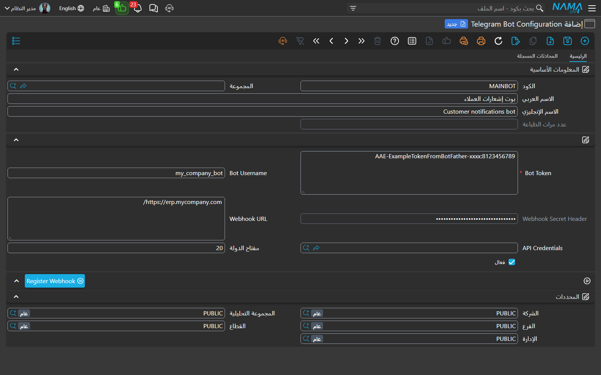
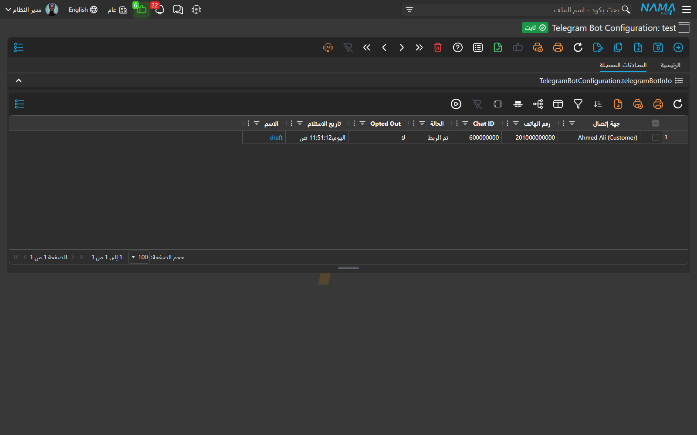
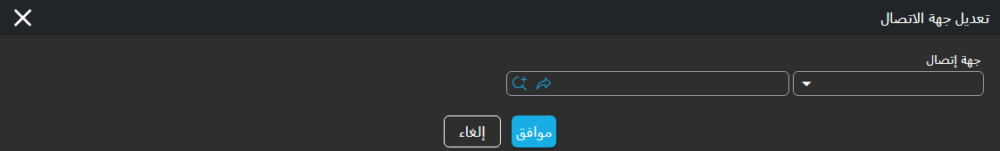
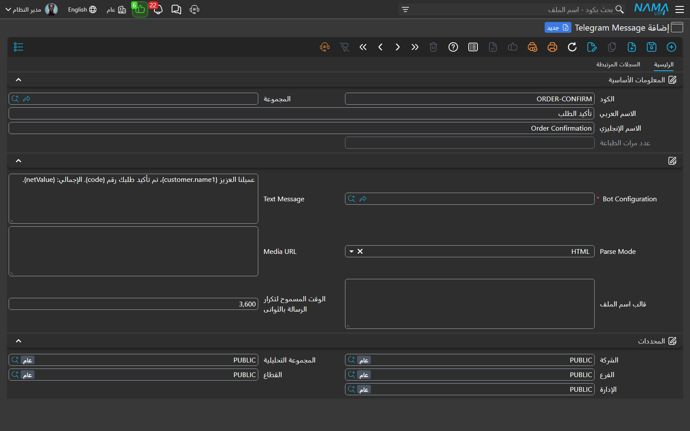

# التنبيهات عبر تليجرام (Telegram) في نظام نما

يستطيع نظام نما أن يرسل الفواتير وطلبات الاعتماد وتأكيدات الطلبات وأي تنبيه آخر مباشرةً إلى محادثة **تليجرام** الخاصة بالعميل أو الموظف، جنبًا إلى جنب مع قناتي الرسائل القصيرة والواتساب اللتين تعرفهما بالفعل. تليجرام مجاني وفوري ويسمح بإرسال نصوص منسّقة ومرفقات، لكنه يعمل بطريقة تختلف اختلافًا جوهريًا عن الرسائل القصيرة والواتساب، وفهم هذا الفرق هو مفتاح إعداده بشكل صحيح.

مع الرسائل القصيرة أو الواتساب يمكنك مراسلة أي رقم هاتف في أي وقت. تليجرام لا يسمح بذلك. فالـ **بوت (bot)** في تليجرام لا يستطيع أن يرسل رسالة إلا لشخص **بدأ المحادثة معه أولًا** ووافق على مشاركة رقم هاتفه. تخيّله مثل جرس الباب: على العميل أن يضغطه مرة واحدة ويعرّف بنفسه قبل أن يُسمح لك بإرسال أي شيء إليه. وبمجرد أن يفعل ذلك، يتذكّره نظام نما ويصبح قادرًا على مراسلته دائمًا بعد ذلك.

لذا فإن الإعداد كله يدور حول بناء دفتر عناوين صغير للأشخاص الذين اشتركوا وصيانته — يسمّي نظام نما كل مدخل فيه **محادثة مسجّلة (Registered Chat)**، وكل واحدة مرتبطة بعميل أو مورّد أو موظف حقيقي في قاعدة بياناتك. تشرح هذه الصفحة الرحلة كاملةً: إنشاء البوت، وترك الأشخاص يربطون أنفسهم، ومعالجة الروابط التي تحتاج تدخّلًا بشريًا، وأخيرًا توصيل الرسالة بتنبيهاتك.

## الصورة الكاملة

```
BotFather ← رمز البوت (Bot Token) ← إعداد بوت تليجرام ← تسجيل الويب هوك (Register Webhook)
                                                                    │
              العميل يفتح البوت ويضغط «مشاركة رقم هاتفي»
                                                                    │
                                            نما ينشئ محادثة مسجّلة
                                            ويربطها بالعميل
                                                                    │
   ينطلق التنبيه/الاعتماد ← نما يجد محادثة العميل المرتبطة ← تُسلَّم الرسالة
```

كل ما يلي يتبع هذا التسلسل بالترتيب.

## الخطوة 1 — إنشاء بوت على تليجرام

تُنشأ بوتات تليجرام عبر التحدث إلى **@BotFather** الخاص بتليجرام نفسه. من أي تطبيق تليجرام، افتح محادثة مع `@BotFather`، وأرسل `/newbot`، وأجب عن سؤاليه — اسم للعرض واسم مستخدم ينتهي بكلمة `bot` (مثل `my_company_bot`). يردّ عليك BotFather بـ **رمز البوت (Bot Token)**، وهو سلسلة طويلة تشبه `8123456789:AAE-ExampleTokenFromBotFather-xxxx`.

::: warning تعامل مع رمز البوت كأنه كلمة مرور
أي شخص يملك الرمز يستطيع الإرسال باسم البوت وقراءة كل ما يستقبله. احفظه سرًّا، وإن تسرّب يومًا فاستخدم أمر `/revoke` لدى BotFather لإصدار رمز جديد.
:::

## الخطوة 2 — إنشاء إعداد بوت تليجرام في نما

من القائمة الرئيسية ابحث عن **Telegram Bot Configuration** وأضف سجلًّا جديدًا. هذه الشاشة هي مكان إقامة البوت داخل نما.



| الحقل | ما تضعه فيه |
|---|---|
| **الكود / الاسم (Code / Name)** | أي كود واسم يساعدك على تمييز البوت لاحقًا — مثل `MAINBOT`، «بوت تنبيهات العملاء». |
| **Bot Token** | الرمز الذي أعطاك إياه BotFather. مطلوب. |
| **Bot Username** | اسم مستخدم البوت (`@username` بدون علامة `@`). يستخدمه العملاء للعثور على البوت وفتحه. |
| **Webhook Secret Header** | سرّ اختياري. عند ضبطه يتحقق منه نما مع كل تحديث وارد، بحيث لا يصل إلى نقطة اتصال البوت إلا تليجرام — لا أحد ينتحل صفته. اتركه ليولّده نما تلقائيًا. |
| **Webhook URL** | العنوان العام الذي يجب أن يتصل به تليجرام. اتركه فارغًا فيستخدم نما العنوان العام للموقع الذي تعمل عليه؛ واملأه فقط إذا كان عنوانك العام مختلفًا عن الظاهر في المتصفح. |
| **API Credentials** | سجل مستخدم/بيانات اعتماد اختياري لتوثيق نداءات تليجرام الواردة، بنفس طريقة توثيق باقي الويب هوك في نما. |
| **مفتاح الدولة (Country Calling Code)** | رمز الاتصال الدولي لبلدك، أرقامًا فقط — `20` لمصر، `966` للسعودية، `965` للكويت. يزيله نما من الرقم الذي يشاركه الشخص (والذي يصل دائمًا بالصيغة الدولية الكاملة) حتى يتمكّن من مطابقته مع الجوال المخزّن في سجل العميل أو المورّد أو الموظف. اتركه فارغًا فقط إذا كانت جوالات جهات اتصالك مخزّنة أصلًا بالصيغة الدولية الكاملة. |
| **فعال (Active)** | لتشغيل البوت. وعند إيقافه يتجاهل نما كل تحديث يستقبله البوت (فلا يستطيع أحد ربط نفسه أو إعادة الربط) ولا يرسل عبره أي رسالة — وهي طريقة نظيفة لإيقاف البوت مؤقتًا دون حذفه أو إلغاء تسجيل الـ Webhook الخاص به. |

## الخطوة 3 — تسجيل الويب هوك (Register Webhook)

البوت الجديد لا يعرف بعد أين يسلّم الرسائل التي يرسلها الناس إليه. وإخباره بذلك يتم بضغطة واحدة: تأكد أولًا أن **Active** مفعّل، ثم احفظ الإعداد، ثم اضغط زر الإجراء **Register Webhook** في أسفل الشاشة. يطلب نما من تليجرام أن يرسل كل تحديث مستقبلي إلى موقع نما لديك، ومن تلك اللحظة يصبح البوت فعّالًا. (وإذا كان البوت غير مفعّل يرفض نما التسجيل، وسترى *"The Telegram bot … is not active. Activate it before registering its webhook."*)

إذا تعذّر استنتاج العنوان تلقائيًا فسترى الرسالة *"Cannot determine the webhook URL. Fill the Webhook URL field, or open this screen from the public site address."* — عندها املأ حقل **Webhook URL** بعنوان موقعك العام وأعد التسجيل. تقوم بهذا مرة واحدة فقط لكل بوت (أو مرة أخرى إذا نقلت الموقع إلى عنوان جديد).

## الخطوة 4 — دع المستقبِلين يربطون أنفسهم

الآن يعرّف الأشخاص الذين تريد تنبيههم بأنفسهم للبوت. يفتح كل عميل أو موظف تليجرام، ويبحث عن بوتك باسم مستخدمه، ويفتحه ويضغط **Start** (الذي يرسل الأمر `/start`). فيردّ البوت:

> مرحباً! برجاء الضغط على الزر بالأسفل لمشاركة رقم هاتفك حتى نتمكن من ربط حسابك.

…ويعرض زرًّا واحدًا: **مشاركة رقم هاتفي**. وعندما يضغطه الشخص ويؤكّد، يسلّم تليجرام رقم هاتفه إلى نما، فيقوم نما تلقائيًا بأمرين:

1. ينشئ مدخل **محادثة مسجّلة (Registered Chat)** ضمن إعداد بوتك، مسجّلًا معرّف المحادثة (Chat ID) ورقم الهاتف ووقت الانضمام.
2. يبحث عن هذا الرقم بين عملائك ومورّديك وموظفيك، فإن كان لدى واحد منهم رقم جوال مطابق، ربط نما المحادثة بجهة الاتصال هذه ووسمها **تم الربط (Linked)** — فيصبح الشخص جاهزًا لاستقبال الرسائل دون أي عمل إضافي.

ولكي تتساهل المطابقة مع اختلاف صيغ كتابة الأرقام، يستخرج نما **الجزء المحلي** من الرقم المُشارَك ويطابق عليه. فتليجرام يسلّم دائمًا الرقم الدولي الكامل (مثل `201065837043`)؛ فيزيل نما **مفتاح الدولة (Country Calling Code)** الذي أعددته (`20`)، فيتبقّى الرقم المحلي (`1065837043`)، ثم يربط أول جهة اتصال ينتهي جوالها بهذا الرقم. وبذلك تُربَط جهة الاتصال نفسها سواء كان جوالها مخزّنًا بالصيغة الدولية الكاملة (`201065837043`) أو محليًّا بصفر بادئ (`01065837043`) أو كرقم محلي مجرّد (`1065837043`). وإن لم يبدأ الرقم المُشارَك بالمفتاح الذي أعددته — كأن يكون رقمًا أجنبيًّا فعلًا — يعود نما إلى مطابقة الرقم بالكامل. وإن لم يطابق أحد على الإطلاق (أو كان عميلًا جديدًا تمامًا)، تُحفظ المحادثة مع ذلك لكنها تبقى **Pending** بانتظار من يكمل الربط في الخطوة التالية.

## الخطوة 5 — مراجعة الروابط وإكمالها

افتح إعداد بوتك وانتقل إلى تبويب **المحادثات المسجلة (Registered Chats)**. يظهر هنا كل شخص بدأ البوت.



يخبرك كل صف بصاحب المحادثة وهل هي جاهزة:

| العمود | المعنى |
|---|---|
| **جهة إتصال (Contact)** | العميل أو المورّد أو الموظف الذي تخصّه هذه المحادثة. يبقى فارغًا حتى تُربط. |
| **رقم الهاتف (Phone Number)** | الرقم الذي شاركه الشخص. |
| **Chat ID** | معرّف تليجرام الداخلي للمحادثة. يستخدمه نما لتسليم الرسائل. |
| **الحالة (Status)** | **تم الربط (Linked)** — جاهزة للاستقبال. **Pending** — بانتظار تعيين جهة اتصال. (وتوجد أيضًا Rejected وBlocked للمحادثات التي استبعدتها عمدًا.) |
| **Opted Out** | **نعم** إذا حظر الشخص البوت أو أوقفه. لا يرسل نما أبدًا إلى محادثة منسحبة. |
| **تاريخ الاستلام (Received On)** | وقت انضمام المحادثة أول مرة. |

لإكمال محادثة **Pending**، أشّر على صفها، وافتح **Edit Contact**، واختر العميل أو المورّد أو الموظف الذي تخصّه. تتحوّل الحالة إلى **تم الربط** وتبدأ الرسائل بالتدفّق.



::: tip جهة اتصال واحدة، محادثة واحدة
لا يمكن ربط جهة الاتصال الواحدة إلا بمحادثة **واحدة** داخل إعداد البوت نفسه. فإن حاولت ربط جهة اتصال مرتبطة بالفعل بمحادثة أخرى، يرفض نما بالرسالة *"The selected contact is already linked to another registered chat in the same bot configuration"* — وهذا يمنع أن يستقبل العميل نفسه نسختين من كل رسالة عن طريق الخطأ.
:::

## الخطوة 6 — إنشاء رسالة تليجرام (Telegram Message)

**رسالة تليجرام** هي قالب ما سيُرسَل — الصياغة والتنسيق وأي مرفق. ابحث في القائمة عن **Telegram Message** وأضف سجلًّا جديدًا.



| الحقل | ما يفعله |
|---|---|
| **Bot Configuration** | أي بوت يرسل هذه الرسالة. مطلوب. |
| **Text Message** | نص الرسالة. يدعم صياغة القوالب نفسها المستخدمة في باقي نما، فيمكنك تضمين قيم السجل — `عميلنا العزيز {customer.name1}، تم تأكيد طلبك رقم {code}.` |
| **Parse Mode** | اختر **HTML** أو **Markdown** لجعل أجزاء من النص عريضة أو مائلة أو روابط؛ واتركه فارغًا للنص العادي. |
| **Media URL** | رابط اختياري لملف — فاتورة PDF، صورة — يُرسَل مع النص. يجب أن يكون العنوان قابلًا للوصول من الإنترنت. |
| **الوقت المسموح لتكرار الرسالة بالثواني (Allowed Repetition Time In Seconds)** | حارس ضد التكرار. إذا كانت الرسالة نفسها ستذهب إلى المحادثة نفسها مرة أخرى خلال هذا العدد من الثواني، تخطّاها نما. اتركه فارغًا للسماح بكل إرسال. |

## الخطوة 7 — الإرسال من تنبيهات أو موافقات

رسالة تليجرام وحدها لا تفعل شيئًا حتى تربطها بحدث. في **تعريف التنبيه (Notification Definition)** أو **تعريف الموافقة (Approval Definition)**، عيّن **رسالة تليجرام** بحيث ينطلق الإرسال عند وقوع الحدث — ترحيل فاتورة، طلب موافقة.

وهنا الجزء الحاسم، والسبب في أهمية كل عمل الربط أعلاه: **يسلّم نما رسالة تليجرام حسب جهة الاتصال، لا حسب رقم الهاتف.** فعندما يستهدف التنبيه عميلًا، يبحث نما عن محادثة هذا العميل **المرتبطة (Linked)** على البوت ويرسل إليها. أما إذا لم يبدأ العميل البوت قطّ، أو كانت محادثته لا تزال Pending، أو انسحب، فلن تخرج أي رسالة تليجرام — ببساطة لن يستقبلها العميل على هذه القناة حتى تُربط محادثته. وهذا مقصود: تليجرام قناة قائمة على جهات الاتصال، فلا يُراسَل أبدًا رقم هاتف مجرّد لا أحد خلفه.

## متى لا تُرسَل الرسالة

لأن التسليم يعتمد على اشتراك المستقبِل، قد يُتخطّى إرسال تليجرام لأسباب مشروعة. وعندها يسجّل نما نتيجة توضيحية بدل أن يفشل بصمت، لتعرف السبب دائمًا. تظهر هذه الرسائل بالإنجليزية على الشاشة العربية أيضًا:

| الرسالة | لماذا حدثت | ما العمل |
|---|---|---|
| *The recipient (contact {0}) is not registered with the Telegram bot {1}…* | جهة الاتصال المستهدَفة لم تبدأ البوت قطّ، فلا توجد محادثة للإرسال إليها. | اطلب من الشخص فتح البوت ومشاركة رقم هاتفه (الخطوة 4). |
| *The recipient {0} is not linked to a contact yet…* | توجد محادثة لكنها لا تزال **Pending**. | عيّن جهة اتصالها من تبويب المحادثات المسجلة (الخطوة 5). |
| *The recipient {0} has opted out of Telegram messages from bot {1}* | حظر الشخص البوت أو أوقفه. | لا شيء من جانبك — عليه هو إعادة تشغيل البوت. |
| *The message has already been sent to {0} at {1}, you can send it again at {2}* | حارس **الوقت المسموح للتكرار** منع نسخة مكرّرة. | انتظر حتى الوقت المعروض، أو خفّض حارس التكرار على الرسالة. |
| *The Telegram bot {0} is not active* | مفتاح **Active** الخاص بالبوت مغلق. | افتح إعداد بوت التليجرام وفعّل **Active**. |
| *Telegram message {0} has no bot configuration* | رسالة تليجرام تنقصها **Bot Configuration**. | افتح الرسالة وعيّن البوت. |

## سجل الرسائل

كل رسالة تخرج فعليًا من نما تُسجَّل، لتتمكّن من إثبات ما أُرسِل ومتى. افتح **رسالة تليجرام** وانظر إلى سجلاتها المرتبطة لترى كل تسليم — المحادثة التي ذهب إليها، ومعرّف رسالة تليجرام نفسه، والسجل الذي أطلقه، ولحظة الإرسال. وهو أول مكان تنظر فيه عندما يقول عميل «لم تصلني».