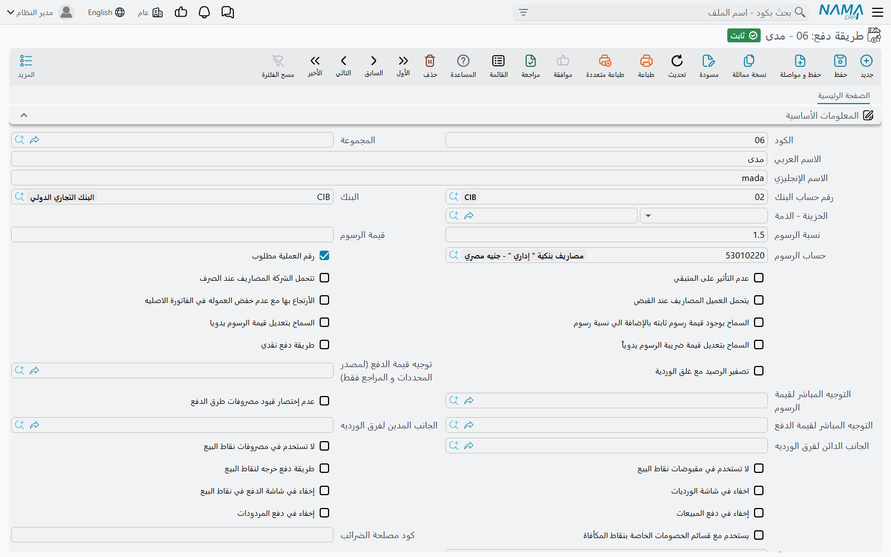
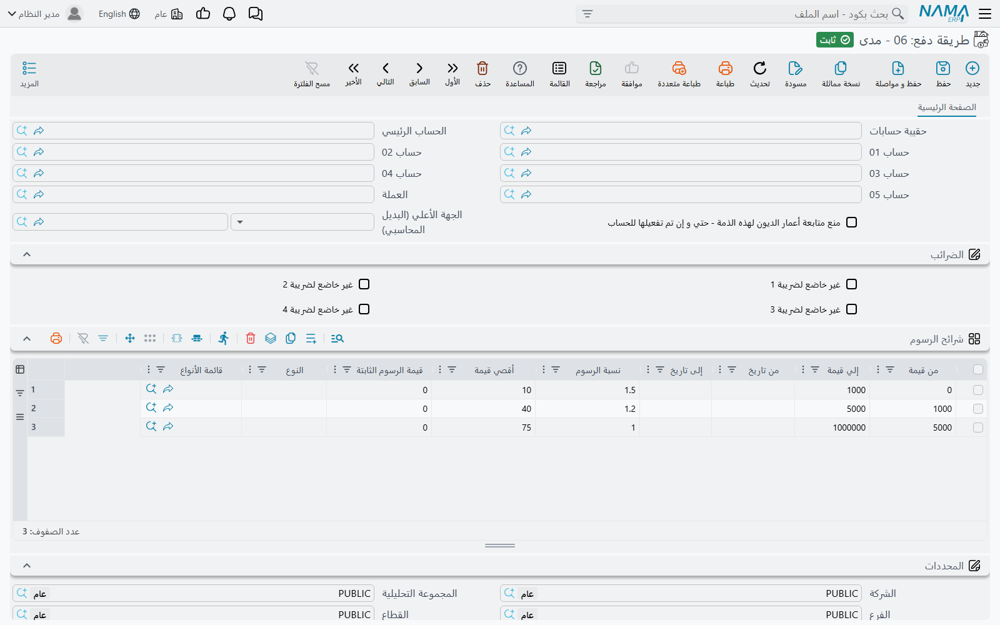
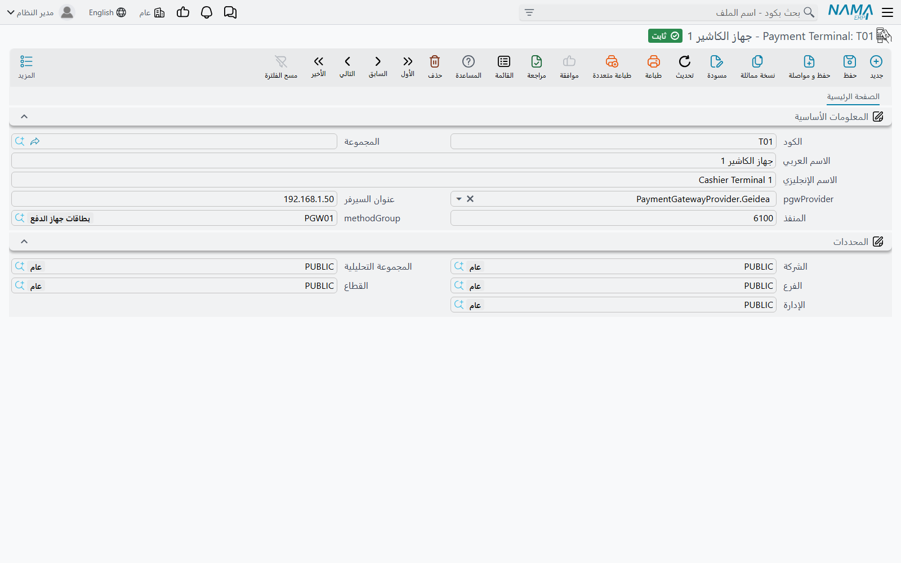
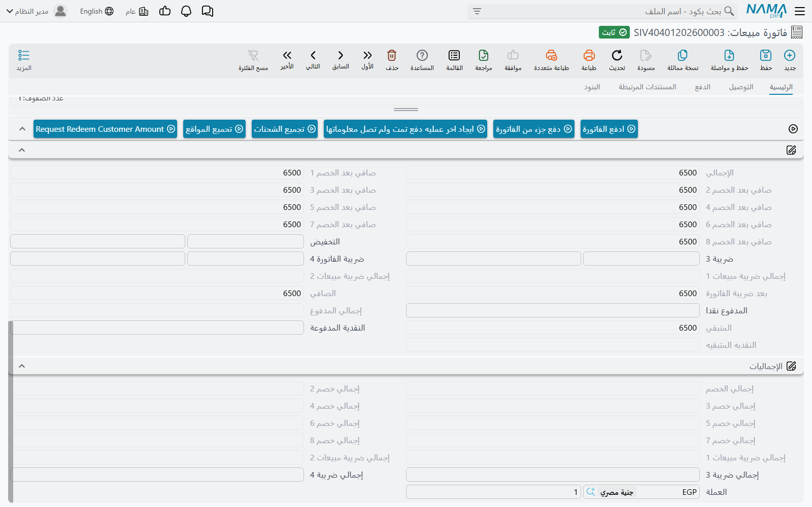
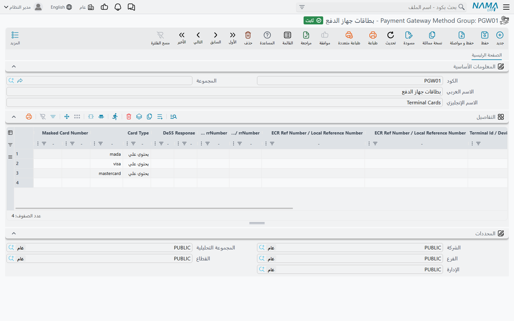

# طرق الدفع وأجهزة الدفع (Payment Terminals)

النقد، ومدى، وفيزا، والتحويل البنكي، وقسيمة المتجر: كلها عند العميل مجرد طرق للدفع، لكن المحاسبة تعاملها بشكل مختلف. فالنقد يدخل الخزينة، ودفعة البطاقة تصل إلى الحساب البنكي بعد يوم أو يومين ناقصة عمولة البنك، والتحويل قد يصل بلا عمولة أصلًا. **طريقة دفع** (Payment Method) هي السجل الذي يحمل هذه الفروق. كل سطر دفع في فاتورة أو سند أو إيصال نقطة بيع أو وردية يذكر طريقة دفع، والطريقة تحدد أين يذهب المبلغ في الحسابات، وما الرسوم التي تُخصم وأين تُسجَّل، وكيف تتصرف الطريقة على كاشير نقطة البيع.

أما **Payment Terminal** فهو جهاز البطاقات على الكاشير. حين يُربط مستند مبيعات بجهاز، يستطيع الكاشير أن يرسل المبلغ إلى الجهاز ويترك العملية المعتمدة تملأ سطر الدفع، بما فيه طريقة الدفع، بدل كتابته يدويًا.

الشاشات الثلاث في موديول الأساسيات تحت `الأساسيات ← الملفات`: **طريقة دفع**، و**Payment Terminal**، و**Payment Gateway Method Group**.

## أين يذهب المبلغ

المجموعة الأولى في الشاشة تحدد الحساب النقدي أو البنكي الذي ينتهي إليه الدفع بهذه الطريقة:

- **رقم حساب البنك** (Bank account) — لطريقة البطاقة أو التحويل، الحساب البنكي الذي يُضاف إليه المبلغ.
- **الخزينة - الذمة** (Safe Deposite - Subsidiary) — لطريقة لا تمر بحساب بنكي. قد تكون خزينة أو جهة أخرى أو حسابًا عاديًا.
- **البنك** (Bank) — البنك نفسه، للإشارة.

إذا امتلأ الحقلان معًا فالحساب البنكي هو المعتمد. وسطر الدفع في المستند يجعل الحساب الرئيسي لهذا الحساب البنكي أو الخزينة مدينًا، أو دائنًا في المردود.

وهناك ثلاثة توجيهات تغيّر هذا الافتراض. كل منها [جانب حسابي](/ar/platform/shared-master-files/accounting-side-config): قاعدة حساب وذمة ومحددات تُحفظ مرة وتُستخدم في أكثر من مكان.

- **التوجيه المباشر لقيمة الدفع** (Payment Value Direct Side) يحل محل الافتراض كليًا، فتُسجَّل قيمة الدفع حيث يحدد هذا التوجيه.
- **توجيه قيمة الدفع (لمصدر المحددات و المراجع فقط)** (Payment Value Side) يُبقي الحساب الافتراضي ويأخذ محددات السطر ومراجعه من هذا التوجيه. وكما يقول اسمه، لا يغيّر الحساب.
- **التوجيه المباشر لقيمة الرسوم** (Fees Value Direct Side) يفعل الشيء نفسه لسطر الرسوم المشروح أدناه.

أما مجموعة **حافظة الحسابات** (Subsidiary Accounts) في أسفل الشاشة فهي مجموعة الحسابات الخاصة بالطريقة، وهي المجموعة نفسها التي يحملها العملاء والبنوك والخزائن.

## الرسوم والعمولات

جهة تحصيل البطاقات تحتفظ عادةً بنسبة من كل دفعة. يحسب نما هذه الرسوم لكل سطر دفع ويسجّلها منفصلة عن الدفعة نفسها.

**نسبة الرسوم** (Fees Percentage) و**قيمة الرسوم** (Fees Value) تغطيان الحالة البسيطة: نسبة من السطر، أو مبلغ ثابت لكل سطر، أو الاثنان مجموعين. و**حساب الرسوم** (Fees Account) هو الحساب الذي تُسجَّل فيه الرسوم، ويصبح إجباريًا بمجرد ملء أي من الحقلين. فمثلًا طريقة مدى بنسبة 1.5% وحساب رسوم *مصروفات بنكية* تجعل رسوم دفعة قيمتها 2,000 تساوي 30.

وحين تعتمد الرسوم على المبلغ أو التاريخ أو المستند، استخدم جدول **شرائح الرسوم** (Fee Ranges) بدلًا من ذلك. كل سطر يمكن أن يحدد:

| العمود | معناه |
|---|---|
| **من قيمة** / **إلي قيمة** (From Value / To Value) | مبالغ الدفع التي ينطبق عليها السطر. اترك أي طرف فارغًا ليكون بلا حد. |
| **من تاريخ** / **إلى تاريخ** (From Date / To Date) | الفترة التي ينطبق فيها السطر، مقارنةً بتاريخ قيمة المستند. |
| **النوع** / **قائمة الأنواع** (Entity Type / Entity Type List) | أنواع المستندات التي ينطبق عليها السطر. اتركهما فارغين لكل المستندات. |
| **نسبة الرسوم** / **قيمة الرسوم الثابتة** (Fee Percentage / Fixed Fee Value) | الرسوم للدفعة المطابقة. |
| **أقصي قيمة** (Maximum Value) | حد أقصى للرسوم التي يحسبها السطر. |

تُفحص السطور من أعلى إلى أسفل، ويُستخدم أول سطر يطابق المبلغ والتاريخ ونوع المستند. وإن لم يطابق أي سطر تُطبَّق النسبة والقيمة الموجودتان في رأس الشاشة. والسطر عادةً يحمل نسبة أو قيمة ثابتة لا الاثنين. علّم **السماح بوجود قيمة رسوم ثابته بالإضافة الي نسبة رسوم** (Allow Fee Value And Percentage) للسماح بالاثنين في سطر واحد، وبذلك تُدخل تعريفة مثل «1% + ريال واحد».

**السماح بتعديل قيمة الرسوم يدويا** (Allow Edit Fees Value Manually) يتيح للمستخدم أن يغيّر الرسوم المحسوبة في المستند، وبمجرد كتابة رسوم غير صفرية يُحتفظ بها.

### من يتحمل الرسوم

في القبض، الرسوم عادةً تُنقص ما تستلمه الشركة فعلًا، فتُسجَّل مصروفًا على حساب الرسوم. وفي الصرف يكون الأمر بالعكس. وهناك خياران يغيّران ذلك:

- **يتحمل العميل المصاريف عند القبض** (Customer Pays Expenses In Receipt) — في سند القبض تُحمَّل الرسوم على الطرف الدافع بدل أن تكون مصروفًا على الشركة.
- **تتحمل الشركة المصاريف عند الصرف** (Company Pays Expenses In Payment) — في سند الصرف تكون الرسوم مصروفًا على الشركة، فيُجعل حساب الرسوم مدينًا.

افتراضيًا يسجّل السند الجانب النقدي أو البنكي صافيًا بعد الرسوم: سند قبض بـ 2,000 ورسوم 30 يجعل البنك مدينًا بـ 1,970. علّم **عدم إختصار قيود مصروفات طرق الدفع** (Expand Payment Method Effect) ليُسجَّل المبلغ كاملًا 2,000 على جانب البنك، مع الرسوم في سطر مقابل منفصل. فيظهر في القيد المبلغ الإجمالي والعمولة جنبًا إلى جنب كما في كشف البنك.

### ضريبة الرسوم

البنوك تحمّل ضريبة القيمة المضافة على عمولتها. مجموعة **ضريبة الرسوم** (Fees Tax) تحسبها:

- **Tax Plan** يأخذ النسبة من خطة ضريبية حسب الشركة والتاريخ. وإذا حُددت خطة ضريبية فهي المعتمدة.
- وإلا فتُطبَّق **نسبة ضريبة الرسوم** (Fees Tax Percentage) في الفترة بين **تطبيق ضريبة الرسوم من تاريخ** و**تطبيق ضريبة الرسوم إلى تاريخ**.
- **مدين ضريبة الرسوم** و**دائن ضريبة الرسوم** (Fees Tax Debit / Fees Tax Credit) هما التوجيهان اللذان تُسجَّل عليهما الضريبة، ولا يُنشأ قيد إلا إذا حُدد الاثنان.
- **عكس مدين ودائن ضريبة الرسوم في المردودات والمشتريات** يبدّل الجانبين في المردودات والمشتريات.
- **السماح بتعديل قيمة ضريبة الرسوم يدوياً** يتيح للمستخدم تغيير الضريبة المحسوبة.

## السلوك في المستندات

- **رقم العملية مطلوب** (Authorization Number Required) — لا يُحفظ سطر دفع بهذه الطريقة بلا **رقم العملية** (Authorization Number). فعّله لطرق البطاقات حتى يمكن مطابقة كل سطر مع كشف جهة التحصيل.
- **عدم التأثير على المتبقي** (Do Not Affect Remaining) — يُسجَّل السطر لكنه لا يُنقص المتبقي على الفاتورة. استخدمه لدفعة تُسجَّل للعلم فقط.
- **كود مصلحة الضرائب** (Tax Authority Code) — الكود الذي ترسله تكاملات الفاتورة الإلكترونية كوسيلة الدفع. وبالنسبة لهيئة الزكاة انظر [قاعدة وسيلة الدفع](/ar/modules/invoicing/zatca-guide).
- **يستخدم مع قسائم الخصومات الخاصة بنقاط المكأفاة** و**Reward Points Configuration** يربطان الطريقة ببرنامج الولاء. و**تستخدم لشراء و بيع نقاط الولاء** يحدد الطريقة المستخدمة عند شراء النقاط نفسها أو بيعها.

## النقد والورديات وكاشير نقطة البيع

هذه الإعدادات لا تهم إلا حيث تُستخدم الأدراج النقدية والورديات، في [ورديات الكاشير](/ar/modules/accounting/cashier-shifts) وفي [نقاط البيع](/ar/modules/pos/).

| الإعداد | ما يفعله |
|---|---|
| **طريقة دفع نقدي** (Cash Payment Method) | يجعل الطريقة نقدية، فتُحسب مع النقد في الدرج. لا تغيّره بعد استخدام الطريقة، فتغييره هو سبب رسالة *Payment method {0} repeated in multi line* عند غلق الوردية، المشروحة في [أسئلة نقاط البيع الشائعة](/ar/modules/pos/pos-faq). |
| **تصفير الرصيد مع غلق الوردية** (Reset Balance With Shift Close) | غلق وردية الكاشير يصفّر رصيد النظام لهذه الطريقة كله بدل ترحيله إلى الوردية التالية. |
| **الجانب المدين لفرق الورديه** / **الجانب الدائن لفرق الورديه** | أين يُسجَّل العجز أو الزيادة المكتشفة عند غلق الوردية لهذه الطريقة. |
| **اخفاء في شاشة الورديات** (Hide In Shifts) | يُخرج الطريقة من شاشات ورديات نقاط البيع. |
| **تعطيل الرصيد الفعلي في نقطة البيع** / **الرصيد الفعلي في نقطة البيع إجباري** | هل يُدخل الكاشير رصيدًا معدودًا لهذه الطريقة عند غلق الوردية، وهل هذا الرصيد إجباري. |
| **إخفاء في شاشة الدفع في نقاط البيع** (Hide In POS Payment Dialog) | يخفي الطريقة من شاشة الدفع في نقطة البيع، وتعليمه يعلّم الخيارين التاليين أيضًا. |
| **إخفاء في دفع المبيعات** / **إخفاء في دفع المردودات** | يخفي الطريقة في المبيعات فقط أو في المردودات فقط. |
| **لا تستخدم في مصروفات نقاط البيع** / **لا تستخدم في مقبوضات نقاط البيع** | يُبعد الطريقة عن شاشتي الصرف والقبض في نقطة البيع. |
| **طريقة دفع حرجه لنقاط البيع** (Critical Pos Payment Method) | لا يختار الطريقة إلا مستخدمو نقاط البيع الذين يحمل ملف صلاحياتهم **امكانية استعمال طرق الدفع الحرجة**. |
| **الأرتجاع بها مع عدم خفض العموله في الفاتورة الاصليه** (Must Be With Fees Percentage In Return) | مردود نقطة البيع يجب أن يردّ بهذه الطريقة نسبة من الإجمالي لا تقل عن نسبة ما دُفع بها في الفاتورة الأصلية. فإذا دُفع 60% من الفاتورة بمدى، يُرد 60% على الأقل من المردود بمدى. |
| **عدد الأيام قبل السماح بالمرتجع** (Days Before Allowing Return) | فاتورة نقطة البيع المدفوعة بهذه الطريقة لا تُرتجع قبل مرور هذا العدد من الأيام. ويجب أولًا تفعيل الإعداد العام **تفعيل عدد الأيام قبل السماح بالمرتجع حسب طريقة الدفع**. |
| **خصم نسبة من الفاتورة مع طريقة الدفع (في خصم الهيدر)** | نسبة خصم تمنحها نقطة البيع على الفاتورة كلها حين تُدفع بهذه الطريقة، كعرض بطاقة بنك مثلًا. |
| **الاختصار** (Keyboard Shortcut) | مفتاح، مع Ctrl أو Alt أو Shift اختياريًا، يختار الطريقة في شاشة الدفع بنقطة البيع. |

## أجهزة الدفع (Payment Terminals)

سجل **Payment Terminal** يمثل جهاز بطاقات واحدًا، وهو جزء من خاصية الترخيص **Payment Gateway** (`basic-payment-gateway`). وفي الواجهة العربية يظهر اسم القائمة وعنوان الشاشة بالإنجليزية. في الشاشة أربعة حقول بجانب الكود والاسم:

| الحقل | ما يفعله |
|---|---|
| **Provider** | **NearPay** أو **InterPay** أو **Geidea**. وحده NearPay يغيّر طريقة وصول نما إلى الجهاز، كما يأتي. |
| **عنوان السيرفر** (IP Address) | عنوان جهاز NearPay على شبكة المحل. |
| **المنفذ** (Port) | المنفذ الذي يستقبل عليه الجهاز. |
| **Method Group** | سجل **Payment Gateway Method Group** الذي يحوّل البطاقة التي استخدمها العميل إلى طريقة دفع. املأه دائمًا. |

### المستندات التي تستخدم الجهاز

يُختار الجهاز في المستند أو في الماكينة:

- **فاتورة مبيعات** (وفاتورة مبيعات مركز الخدمة) فيها حقل **Payment Terminal** في الرأس، وفي منطقة الدفع ثلاثة أزرار: **ادفع الفاتورة** (Pay Invoice)، و**دفع جزء من الفاتورة** (Pay Part Of Invoice)، و**ايجاد اخر عمليه دفع تمت ولم تصل معلوماتها** (Fetch Last Terminal Payment Transaction).
- أمر الصيانة وفاتورة الصيانة في موديول CRM فيهما الحقل والأزرار نفسها.
- **سند قبض** و**سند صرف** يعرضان زر **ادفع الفاتورة** فوق جدول طرق الدفع حين يكون **السماح بطرق الدفع المتعددة في سندات الصرف والقبض** مفعّلًا في إعدادات الحسابات. وحقل **Payment Terminal** فيهما ليس على الشاشة الافتراضية، فأضفه من [تعديل الشاشات](/ar/platform/screen-modifier/screen-modifier-edit-screen) قبل استخدام الزر.
- في **نقاط البيع** يُحدد الجهاز في **الماكينة** (Register)، والماكينة التي ليس لها جهاز تستخدم الجهاز المحدد في إعدادات نقاط البيع. والدفع بالبطاقة على الكاشير مشروح في [الدفع والتحصيل](/ar/modules/pos/pos-payment-and-tender).

### ماذا يحدث عند ضغط «ادفع الفاتورة»

1. يأخذ نما المبلغ: المتبقي على الفاتورة في **ادفع الفاتورة**، أو المبلغ الذي يدخله الكاشير في **دفع جزء من الفاتورة**، أو مبلغ السند في السندات. ولا يمكن أن يزيد مبلغ الدفع الجزئي على المتبقي.
2. يرسل المبلغ إلى الجهاز وينتظر حتى يمرّر العميل بطاقته أو يدخلها.
3. تعود العملية المعتمدة ببيانات البطاقة: نوع البطاقة، ورقم البطاقة المخفي، والشبكة، ومعرّفا الجهاز والتاجر، ورمز الاعتماد. يكتبها نما في سطر دفع، ويضع رمز الاعتماد في **رقم العملية**، ويعلّم السطر على أنه مدفوع من الجهاز.
4. يبحث نما في **Method Group** الخاص بالجهاز ويملأ **طريقة الدفع** في السطر من أول سطر يطابق البطاقة. ثم تتبع الرسوم والحسابات وكل ما في هذه الصفحة تلك الطريقة.

إذا انقطع الاتصال بعد أن دفع العميل وقبل وصول الرد، فلا تخصم من البطاقة مرة ثانية. اضغط **ايجاد اخر عمليه دفع تمت ولم تصل معلوماتها** ليسأل الجهاز عن نتيجة آخر عملية ويملأ السطر منها.

### مجموعات طرق بوابة الدفع (Payment Gateway Method Groups)

المجموعة تجيب عن السؤال: *هذه البطاقة كانت مدى، فأي طريقة دفع هي؟* كل سطر في جدول **التفاصيل** (Details) يذكر **طريقة الدفع** وبيانات البطاقة التي تختارها. ولكل بيان عمود للقيمة وعمود لقاعدة المطابقة:

- **PAN Number / ApprovalCode**
- **Merchant Id**
- **Scheme Id / Card Scheme Name**
- **Terminal Id / Device Serial No**
- **ECR Ref Number / Local Reference Number**
- **STAN Number / rrNumber**
- **De55 Response**
- **Card Type**
- **Masked Card Number**

قاعدة المطابقة هي **يحتوي علي** (Contains) أو **يبدأ بـ** (Starts With) أو **ينتهي بـ** (Ends With). وإذا تُركت القاعدة فارغة تُستخدم «يحتوي علي»، ولا فرق بين الحروف الكبيرة والصغيرة. والبيان الذي لا قيمة له يطابق كل البطاقات.

تُفحص السطور من الأعلى، ويفوز أول سطر تطابق كل بياناته المملوءة. والمجموعة المعتادة فيها سطر بنوع بطاقة `mada` يشير إلى طريقة *مدى*، وسطران لـ `visa` و`mastercard`، وسطر أخير بلا أي بيان يشير إلى طريقة عامة *بطاقات* ليلتقط كل ما عداها. وإن لم يطابق أي سطر يُملأ سطر الدفع بلا طريقة دفع، ويختارها الكاشير يدويًا.

### كيف يصل نما إلى الجهاز

#### Geidea وInterPay: برنامج PGW على جهاز الكاشير

أجهزة Geidea وInterPay يُوصل إليها عن طريق **برنامج PGW**، وهو برنامج صغير يُثبَّت على كمبيوتر الكاشير بنظام ويندوز. يتصل بجهاز البطاقات من جهة، ويستقبل طلبات نما على المنفذ `7842` على الكمبيوتر نفسه من الجهة الأخرى. ومع هذين المزوّدين لا يُستخدم عنوان السيرفر ولا المنفذ في سجل الجهاز، فنما يتصل دائمًا ببرنامج PGW على كمبيوتر الكاشير نفسه، ولذلك يحتاج كل كمبيوتر كاشير يقبل البطاقات إلى نسخته الخاصة. وتثبيت PGW وإعداده مشروح في [تثبيت برنامج جهاز البطاقات وإعداده](/ar/platform/payments/pgw-card-terminal-app)، وطريق الدفعة عبره في [رحلة الدفع بالبطاقة عبر PGW](/ar/platform/payments/pgw-card-payment-flow)، ورموز الرفض في [رموز رفض البطاقات](/ar/platform/payments/pgw-card-refusal-codes).

إذا لم يكن برنامج PGW يعمل يعرض المتصفح الرسالة *There is no connection on port 7842, please make sure that the PGW server is running.* ومعها رابط ملف التثبيت. وتذكر الرسالة أيضًا إعدادًا في كروم هو `chrome://flags/#block-insecure-private-network-requests`، ويجب تعطيله حتى يُسمح لصفحة قادمة من سيرفر نما بالاتصال ببرنامج على الكمبيوتر المحلي.

#### NearPay: جهاز أندرويد على شبكة المحل

أجهزة NearPay هي أجهزة أندرويد يعمل عليها تطبيق نما لنقاط البيع في وضع بوابة الدفع، ويُوصل إليها عبر الشبكة:

- اجعل **عنوان السيرفر** عنوان الجهاز على شبكة المحل. ويمكن ترك **المنفذ** فارغًا فيُستخدم `7843`. والعنوان المكتوب بالشكل `192.168.1.5:7843` يعمل أيضًا.
- حين يستطيع سيرفر نما الوصول إلى الجهاز، يرسل السيرفر الدفعة إليه، ويبلّغ الجهاز السيرفر بالنتيجة، وينتظرها المتصفح حتى 90 ثانية.
- حين يكون سيرفر نما خارج المحل، على السحابة مثلًا، لا يستطيع الوصول إلى جهاز على شبكة المحل. في هذه الحالة شغّل نما في المتصفح على الجهاز نفسه واجعل **عنوان السيرفر** `127.0.0.1` أو `localhost`، فيتصل المتصفح بتطبيق نقاط البيع على الجهاز نفسه مباشرة.
- إذا انتهت مهلة دفعة NearPay فاستخدم **ايجاد اخر عمليه دفع تمت ولم تصل معلوماتها** للحصول على النتيجة.

## رسائل قد تظهر لك

معظم هذه الرسائل ليس لها نص عربي في البرنامج، فتظهر بالإنجليزية على الشاشات العربية أيضًا.

| الرسالة | لماذا | ما تفعله |
|---|---|---|
| «حساب الرسوم لطريقة الدفع {0} مطلوب» | حسب السند رسومًا لهذه الطريقة من شرائح الرسوم، لكن الطريقة بلا **حساب الرسوم**. | املأ **حساب الرسوم** في طريقة الدفع، ثم أعد معالجة السند. |
| «يجب ادخال قيمة واحدة نسبة الرسوم {0} او  قيمة الرسوم {1}» | سطر في شرائح الرسوم فيه نسبة وقيمة ثابتة معًا. | أبقِ إحداهما، أو علّم **السماح بوجود قيمة رسوم ثابته بالإضافة الي نسبة رسوم**. |
| «السطر رقم {0} فارغ تماماً، يرجى حذفه أو ملء أي حقل فيه» | سطر في شرائح الرسوم بلا مبالغ ولا رسوم. | احذف السطر. |
| *You must enable (Enable Days Before Allowing Return In Payment Method) in global configuration before using the option (Days Before Allowing Return)* | مُلئ **عدد الأيام قبل السماح بالمرتجع** والإعداد العام غير مفعّل. | فعّل **تفعيل عدد الأيام قبل السماح بالمرتجع حسب طريقة الدفع** في الإعدادات العامة أولًا. |
| «يجب اختيار مفتاح» | الاختصار فيه Ctrl أو Alt أو Shift بلا مفتاح. | اختر المفتاح، أو أزل علامات Ctrl وAlt وShift. |
| «لا يمكن إرجاع فاتورة مدفوعة بطريقة {0} قبل مرور {1} يوم» | مردود نقطة بيع لفاتورة مدفوعة بطريقة فيها **عدد الأيام قبل السماح بالمرتجع**. | انتظر حتى تمر المدة، أو ردّ المبلغ بوسيلة أخرى تسمح بها سياستك. |
| *Required payment method  - {0}* | مردود نقطة البيع لا يردّ شيئًا بطريقة معلَّم عليها **الأرتجاع بها مع عدم خفض العموله في الفاتورة الاصليه** دُفعت بها الفاتورة الأصلية. | ردّ جزءًا من المردود على الأقل بتلك الطريقة. |
| *Invalid Payment percentage with method  - {0}* | المردود يردّ بتلك الطريقة نسبة أقل مما دُفع بها في الفاتورة الأصلية. | زد مبلغ تلك الطريقة في المردود. |
| «الرصيد الفعلي إجباري لطريقة الدفع {0}» | غلق وردية نقطة بيع بلا رصيد معدود لطريقة معلَّم عليها **الرصيد الفعلي في نقطة البيع إجباري**. | أدخل المبلغ المعدود لهذه الطريقة. |
| «برجاء إختيار payment terminal» | ضُغط **ادفع الفاتورة** أو **ايجاد اخر عمليه دفع تمت ولم تصل معلوماتها** في مستند بلا **Payment Terminal**. | اختر الجهاز في المستند. |
| *There is no uncompleted transaction* | ضُغط **ايجاد اخر عمليه دفع تمت ولم تصل معلوماتها** في متصفح لم يرسل أي دفعة إلى جهاز. | استخدم الزر في المتصفح نفسه الذي أرسل الدفعة. |
| *Purchase Transaction refused* | رفض الجهاز أو جهة التحصيل الدفعة. ويُضاف بعد الرسالة رمز الرد وسببه حين يعيدهما الجهاز. | اطلب بطاقة أخرى أو طريقة دفع أخرى. |
| *Purchase Transaction not completed successfully* | أعاد الجهاز ردًا بلا أي بيانات للعملية، كأن ألغى العميل الدفع مثلًا. | أعد محاولة الدفع. |
| *Payment terminal has no IP address* | سجل جهاز NearPay بلا **عنوان السيرفر**. | املأ عنوان الجهاز. |
| *Cannot reach the payment device on* متبوعة بعنوان الجهاز | لم يستطع نما الاتصال بجهاز NearPay. | تأكد أن الجهاز يعمل وعلى الشبكة نفسها وأن تطبيق نقاط البيع مفتوح في وضع بوابة الدفع. |
| *The payment device did not report a result. Use Fetch Last Terminal Payment Transaction to recover it.* | لم يرسل جهاز NearPay نتيجة خلال 90 ثانية. | اضغط **ايجاد اخر عمليه دفع تمت ولم تصل معلوماتها** قبل الخصم من البطاقة مرة أخرى. |
