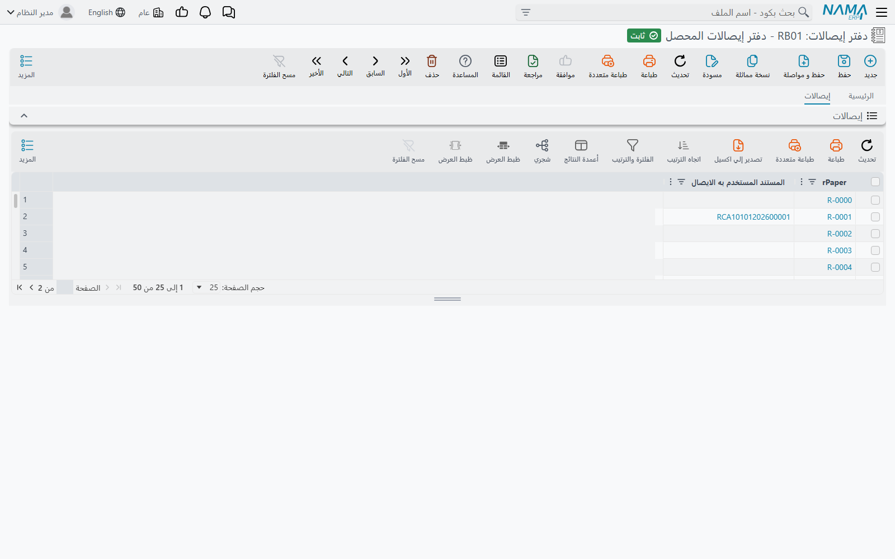
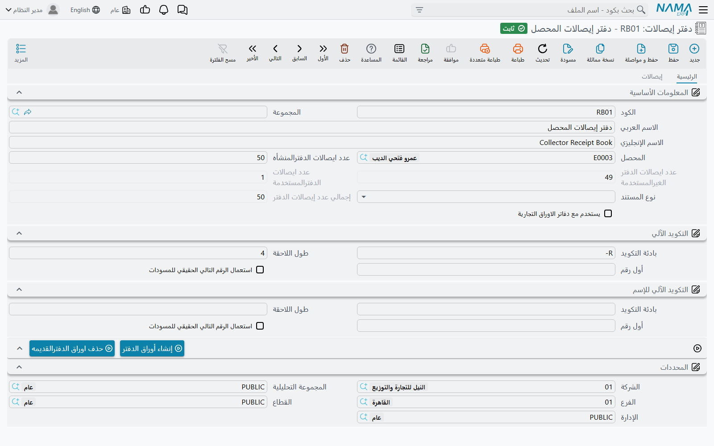
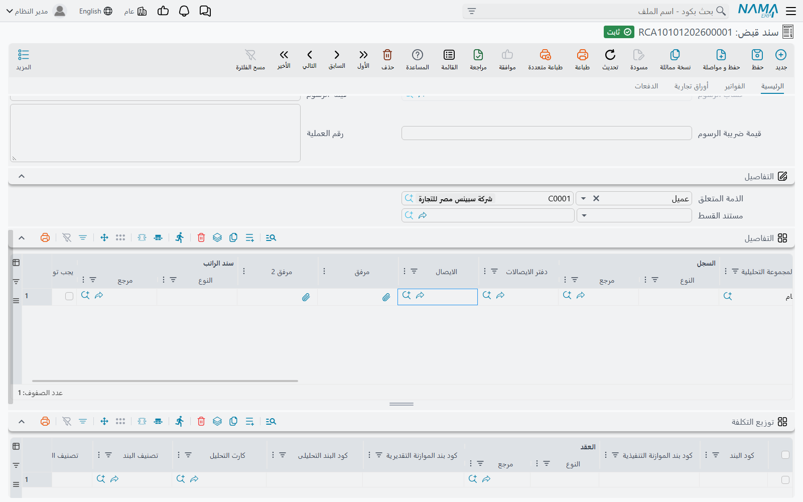

# دفاتر الإيصالات والإيصالات

المحصّل الذي يخرج إلى العملاء يحمل عادةً دفترًا من الإيصالات المطبوعة المرقّمة. وكل إيصال يسلّمه للعميل هو تعهّد بأن المبلغ سيصل إلى الشركة، ولذلك لا بد من ضبط الدفتر: ما الإيصالات الموجودة، ومع أي محصّل هي، وأيها استُخدم، وعلى أي سند. **دفتر إيصالات** (Receipt Book) هو نسخة النظام من هذا الدفتر، و**إيصال** (Receipt Paper) هو ورقة واحدة مرقّمة داخله.

بعد إدخال الدفتر، يذكر كل سند يسجّل تحصيلًا الورقةَ التي كُتب عليها. فيعلّم النظام هذه الورقة على أنها مستخدمة، ويرفض استخدامها مرة ثانية، ويحتفظ على الدفتر بعدد الأوراق المستخدمة وغير المستخدمة. فالغرض من هذه الشاشة هو ألا يضيع أثر أي إيصال مرقّم.

الشاشتان في موديول الأساسيات: `الأساسيات ← الملفات ← دفتر إيصالات` و`الأساسيات ← الملفات ← إيصال`.

## إعداد الدفتر

لنفترض أن الشركة طبعت دفترًا من 50 إيصالًا مرقّمة من `R-0101` إلى `R-0150` وسلّمته للمحصّل أحمد. افتح **دفتر إيصالات** جديدًا واملأ:

| الحقل | ما يفعله |
|---|---|
| **المحصل** (Collector) | الموظف الذي يحمل الدفتر. لا يعرض البحث إلا الموظفين المعلَّمين كمحصّلين. اتركه فارغًا لدفتر يستخدمه أي محصّل. |
| **عدد ايصالات الدفترالمنشأه** (Generated Receipts Count) | عدد أوراق الدفتر، أي 50 في المثال. |
| **نوع المستند** (Document Type) | يقصر الدفتر على نوع واحد من المستندات، مثل **سند قبض**. اتركه فارغًا للسماح بأي مستند. |
| **يستخدم مع دفاتر الاوراق التجارية** (Used With Commercial Papers Books) | علّمه لدفتر تُعطى إيصالاته مقابل الشيكات. يُستخدم هذا الدفتر عن طريق دفتر أوراق تجارية، لا على السندات مباشرة — انظر قسم «إيصالات مقابل الشيكات» أدناه. |

مجموعة **التكويد الآلي** (Automatic Coding) تحدد أرقام الإيصالات. **بادئة التكويد** (Prefix) هي البداية الثابتة، و**طول اللاحقة** (Suffix Length) هو عدد الأرقام بعدها، و**أول رقم** (Suffix First Number) هو بداية العدّ. في المثال: البادئة `R-` وطول اللاحقة `4` وأول رقم `101`، فتنتج `R-0101` ثم `R-0102` وهكذا حتى `R-0150`.

مجموعة **التكويد الآلي للإسم** (Name Auto Coding) تعمل بالطريقة نفسها لأسماء الإيصالات. اتركها فارغة إذا كان الكود كافيًا.

في المجموعتين لا يهم إلا البادئة وطول اللاحقة وأول رقم. أما الحقل الرابع **استعمال الرقم التالي الحقيقي للمسودات** فلا أثر له على الإيصالات المنشأة.

احفظ الدفتر ثم اضغط **إنشاء أوراق الدفتر** (Generate Receipt Papers). ينشئ النظام إيصالًا لكل ورقة، ينسخ إليه محصّل الدفتر ونوع مستنده وإعداد الأوراق التجارية ومحدداته. تظهر الإيصالات في صفحة **إيصالات** (Receipt Papers) في الدفتر، ويظهر بجانب كل إيصال المستند الذي استُخدم فيه لاحقًا.

::: warning الإنشاء مرة واحدة لكل دفتر
يُرفض الإنشاء ما دام في الدفتر أي إيصالات، برسالة «لإنشاء ايصالات لهذا الدفتر ,لابد من حذف ايصالاته القديمه». والدفتر المطبوع عدد ثابت من الأوراق على أي حال، فالدفتر الجديد يأخذ سجلًا جديدًا. ولإعادة إنشاء الدفتر نفسه، لأن العدد أو الترقيم كان خطأً مثلًا، اضغط أولًا **حذف اوراق الدفترالقديمه** (Delete Old Receipt Papers Of). ولا ينجح ذلك إلا ما دام لم يُستخدم أي إيصال منها.
:::

يمكنك أيضًا إضافة ورقة واحدة يدويًا من شاشة **إيصال** بتحديد **دفتر إيصالات** الخاص بها، وتتحدث عدّادات الدفتر بالطريقة نفسها.

## العدّادات الثلاثة

يحتفظ الدفتر بثلاثة أرقام تتحدث تلقائيًا:

- **إجمالي عدد إيصالات الدفتر** (Total Receipts Count) — عدد الإيصالات في الدفتر.
- **عدد ايصالات الدفترالمستخدمة** (Used Receipt Papers Count) — عدد ما كُتب منها على مستند محفوظ.
- **عدد ايصالات الدفتر الغيرالمستخدمة** (Unused Receipt Papers Count) — عدد ما بقي منها فارغًا.

تعرض قائمة دفاتر الإيصالات العددين المستخدم وغير المستخدم بجانب المحصّل، فيرى المشرف بنظرة واحدة من أوشكت إيصالاته على النفاد.

## استخدام الإيصال على السند

في رأس **سند قبض** و**سند صرف** حقلا **دفتر الايصالات** (Receipt Book) و**الايصال** (Receipt Paper). الأسرع أن تختار الإيصال مباشرة، لأن اختياره يملأ الدفتر تلقائيًا.

لا يعرض البحث إلا ما يناسب هذا السند:

- **دفتر الايصالات** يعرض الدفاتر التي ما زال فيها إيصالات غير مستخدمة، والمخصّصة لنوع هذا المستند أو غير المخصّصة لنوع، والتابعة لمحصّل السند أو غير التابعة لمحصّل.
- **الايصال** يعرض الإيصالات غير المستخدمة التي تطابق قاعدتي النوع والمحصّل نفسيهما، وغير المخصّصة للأوراق التجارية، والتابعة للدفتر المختار إن اختير دفتر.

عند حفظ السند يُعلَّم الإيصال **مستخدم** (Is Used)، ويشير حقل **المستند المستخدم به الايصال** (Document To Be used In) إلى السند، ويتحرك عدّادا الدفتر بواحد. وتغيير إيصال السند يحرّر الإيصال القديم، وحذف السند يحرّر إيصاله أيضًا، فيمكن استخدام الورقة مرة أخرى.

### سند واحد وعدة إيصالات

أحيانًا يورّد المحصّل مبلغًا واحدًا يغطي عدة عملاء أخذ كل منهم إيصاله. لهذه الحالة توجد في سطور سند القبض وسند الصرف عمودا **دفتر الايصالات** و**الايصال**، فيذكر كل سطر ورقته. وتنطبق الفحوص نفسها على كل سطر. ويأخذ السند الإيصالات إما في الرأس وإما في السطور لا في الاثنين، ولا يتكرر الإيصال نفسه في سطرين.

### المستندات الأخرى

كل أنواع المستندات تحمل الحقلين نفسيهما، لكن الشاشات الافتراضية لا تعرضهما إلا في سندي القبض والصرف. إن احتجت إليهما في مستند آخر فأضفهما من [تعديل الشاشات](/ar/platform/screen-modifier/screen-modifier-edit-screen)، فتنطبق عليهما القواعد نفسها.

## إيصالات مقابل الشيكات

حين يدفع العميل بشيك، تسلّمه بعض الشركات إيصالًا مرقّمًا بالشيك أيضًا. تأتي هذه الإيصالات من دفتر منفصل مربوط بسجل الشيكات لا بالسندات:

1. أنشئ دفتر الإيصالات مع تعليم **يستخدم مع دفاتر الاوراق التجارية**. تُعلَّم إيصالاته المنشأة **يستخدم مع الاوراق التجارية** (Used With Commercial Papers).
2. في **دفتر أوراق تجارية** (Commercial Paper Book) اجعل **دفتر الايصالات** هذا الدفتر. لا يُعرض هناك إلا الدفاتر المعلَّم عليها هذا الخيار.
3. في كل **ورقة تجارية** (Commercial Paper) من هذا الدفتر اختر **الايصال**. يعرض البحث الإيصالات غير المستخدمة من دفتر إيصالات الدفتر.

النوعان منفصلان: إيصال الأوراق التجارية لا يُستخدم على سند، والإيصال العادي لا يُستخدم على ورقة تجارية. وبعد استخدام أحد إيصالاته على ورقة، لا يمكن تغيير دفتر الإيصالات في دفتر الأوراق التجارية. ودورة الشيكات كاملة مشروحة في [الشيكات والأوراق المالية](/ar/modules/accounting/cheques-financial-papers).

## رسائل قد تظهر لك

| الرسالة | لماذا | ما تفعله |
|---|---|---|
| «لإنشاء إيصالات جديدة لهذا الدفتر، احذف إيصالاته القديمة أولًا» | ضُغط **إنشاء أوراق الدفتر** على دفتر فيه إيصالات بالفعل. | أنشئ دفترًا جديدًا للدفتر الجديد، أو احذف الإيصالات القديمة أولًا إن لم يُستخدم أي منها. |
| «الإيصال {0} مستخدم في {1}» | حذف إيصال، مباشرة أو عن طريق **حذف اوراق الدفترالقديمه**، وهو مكتوب بالفعل على مستند. | اترك الإيصال. ولتحريره غيّر المستند الذي يستخدمه أو احذفه. |
| «من فضلك اختر إيصالًا من دفتر الإيصالات {0}» | المستند يذكر دفتر إيصالات بلا إيصال. | اختر الإيصال، أو امسح الدفتر. |
| «الإيصال {0} مستخدم بالفعل» | الإيصال مكتوب بالفعل على مستند آخر. | اختر إيصالًا غير مستخدم. سجل الإيصال يبيّن المستند الذي استخدمه. |
| «دفتر الإيصالات {0} لا يحتوي على الإيصال {1}» | الدفتر والإيصال في المستند لا ينتميان لبعضهما. | امسح الدفتر واختر الإيصال من جديد، فيمتلئ الدفتر تلقائيًا. |
| «الإيصال أو دفتر الإيصالات مخصص لنوع مستند مختلف» | الدفتر أو الإيصال مقصور بحقل **نوع المستند** على نوع آخر من المستندات. | استخدم دفترًا مخصّصًا لنوع هذا المستند، أو امسح **نوع المستند** في الدفتر. |
| «الإيصال {0} لا يُستخدم إلا مع الأوراق التجارية» | استُخدم إيصال من دفتر أوراق تجارية على سند أو مستند آخر. | استخدم إيصالًا من دفتر عادي. |
| «الإيصال {0} لا يمكن استخدامه مع الأوراق التجارية» | وُضع إيصال عادي على ورقة تجارية. | استخدم الدفتر المحدد في دفتر الأوراق التجارية الخاص بالورقة. |
| «ضع الإيصال إما في رأس المستند وإما في سطوره، لا في الاثنين» | في السند إيصال في الرأس وإيصال في أحد السطور. | اجعل الإيصالات في مكان واحد فقط. |
| «الايصال {0} في السطر رقم {1} متكرر في السطر رقم {2}» | الإيصال نفسه في سطرين من السند. | اجعل لكل سطر إيصاله. |
