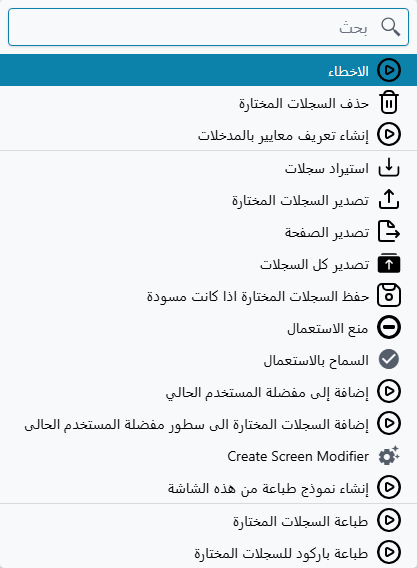

# منع استعمال سجل

صنف يُسحب من قائمة الأصناف. عميل يُوقف التعامل معه بعد خلاف على السداد. مخزن يُغلق، أو مركز تكلفة
يُدمج في غيره، أو مورد يتوقف عن العمل. السجل أدى دوره ولم يعد ينبغي استعماله من جديد.

حذفه ليس حلًا. كل مستند سبق أن أشار إليه سيفقد ما كان يشير إليه — الفواتير والحركات المخزنية والقيود
والتقارير جميعًا. المطلوب بدلًا من ذلك هو **تقاعد** السجل: يبقى في مكانه، وتبقى كل المستندات التي
تشير إليه سليمة، ويُمنع اختياره في أي شيء **جديد**. هذا بالضبط ما يفعله أمر **منع الاستعمال**، وهو
متاح على كل سجل في النظام.

## أين يوجد الأمر

لا يوجد حقل اختيار لهذا الغرض. لن تجد «منع الاستعمال» في أي مكان على شاشة السجل نفسه، ولا في أي
تبويب، ولا على أي كيان — الطريقة الوحيدة لضبطه هي قائمة **مزيد**، وقائمتا «مزيد» تعملان بشكل مختلف.

على **شاشة السجل نفسه** تعرض قائمة مزيد أحد الأمرين فقط، حسب حالة السجل الحالية: **منع الاستعمال**
على سجل ما زال مستعملًا، و**السماح بالاستعمال** على سجل متقاعد بالفعل. واختيار الأمر لا يفعل شيئًا
بذاته — فهو يضع علامة على السجل تمامًا كما لو كتبت في حقل، و**ما زال عليك الحفظ**. إن أغلقت الشاشة
دون حفظ فلم يحدث شيء.

على **شاشة القائمة** تعرض قائمة مزيد **الأمرين معًا**، دائمًا، في نهاية القائمة. وهما يعملان على
السطور التي أشّرت عليها، وبشكل فوري: تُحفظ السجلات وتُعالَج مباشرة، دون تأكيد إضافي ودون شيء تحفظه
بعدها.

| | على شاشة السجل نفسه | على شاشة القائمة |
|---|---|---|
| أي الأمرين يظهر | واحد منهما حسب حالة السجل | كلاهما، دائمًا |
| كم سجلًا يتأثر | السجل المفتوح أمامك | كل سطر أشّرت عليه |
| هل يحفظ بنفسه | لا — عليك الحفظ | نعم، فورًا |

::: warning على شاشة السجل لا يحدث شيء قبل الحفظ
هذا أكثر مواضع الخطأ شيوعًا. الضغط على **منع الاستعمال** في سجل مفتوح يضع العلامة ويترك الشاشة غير
محفوظة. فإن انتقلت بعدها إلى مكان آخر يبقى السجل مستعملًا ولا يعلم أحد بشيء. احفظ السجل.
:::

ولأن الأمرين جزء من المجموعة القياسية فهما موجودان على **كل** كيان في النظام — الملفات الرئيسية
والمستندات على السواء. راجع [الأزرار في كل شاشة](/ar/platform/screen-buttons) لبقية ما تقدمه قائمة
مزيد.

## كيف تعرف أن السجل متقاعد

افتحه وانظر إلى العلامات بجوار عنوان الشاشة، حيث تظهر **مسودة** و**مراجع**. السجل المتقاعد يحمل
علامة **ممنوع من الاستعمال**:

وهذه العلامة هي المؤشر المرئي الوحيد. لا شيء يميز السجل المتقاعد داخل القوائم — لا لون ولا أيقونة
ولا عمود — فإن أردت مراجعة ما تم تقاعده فرشّح القائمة على الحقل نفسه بدلًا من البحث عن علامة.

## ماذا يمنع التقاعد فعلًا

يستحق هذا الدقة، لأن كلمة «ممنوع» توحي بأوسع مما تعنيه.

المنع هو منع **أن يشير إليه سجل آخر**. فعند حفظ أي مستند تُفحص كل السجلات التي يسميها، وإن كان أحدها
متقاعدًا رُفض الحفظ برسالة تذكر السجل وتقول إن استعماله ممنوع. هذه هي الآلية كلها.

ويترتب على ذلك ثلاثة أمور، وكلها تفاجئ المستخدمين:

**المستندات القائمة لا تتأثر.** تقاعد صنف لا يرجع بأثر على ألفَي فاتورة تسميه بالفعل. تحتفظ بسطورها
وقيمها وقيودها، وتُطبع وتظهر في التقارير كما كانت تمامًا. التقاعد يخص ما سيحدث لاحقًا، لا ما حدث
بالفعل.

**السجل نفسه يبقى قابلًا للتعديل بالكامل.** فهو ليس مقفلًا ولا للقراءة فقط ولا مخفيًا عنك. ما زال
بإمكانك فتحه وتغيير اسمه وتصحيح بياناته وحفظه. التقاعد يمنع السجلات الأخرى من **الإشارة إليه**، ولا
يمنعك من صيانته.

**الفحص يتم عند حفظ المستند، لا أثناء الكتابة.** فقد يبني أحدهم فاتورة كاملة حول صنف متقاعد ولا
يكتشف ذلك إلا في النهاية. وهذا نادر عمليًا، لأن السجلات المتقاعدة تختفي كذلك من معظم شاشات الاختيار
— وهو الأمر التالي.

## إعدادان للعرض يعملان بشكل مختلف

تقاعد السجل يغيّر أماكن ظهوره، والمكانان اللذان قد يظهر فيهما يُضبطان بشكل منفصل — وبقيم افتراضية
متعاكسة. وهذا مما يربك المستخدمين، فيستحق أن يُقال صراحة.

**في شاشات اختيار المراجع — أي النوافذ التي تختار منها لملء حقل مرجع — تكون السجلات المتقاعدة مخفية
افتراضيًا.** وهذا هو السلوك الذي يجعل الميزة عملية في الاستعمال اليومي: فالموظف الذي يكتب الفاتورة
التالية لا يرى الصنف المسحوب أصلًا، فلا شيء يحتاج إلى شرح ولا خطأ يقع فيه.

**أما في شاشات القوائم فتظل السجلات المتقاعدة ظاهرة افتراضيًا.** وهذا مقصود أيضًا: فالقائمة هي المكان
الذي **تدير** منه السجلات، والسجل الذي لا تجده هو سجل لا تستطيع إعادة تفعيله أو تصحيحه أو مراجعته.

ويمكن تغيير الأمرين من **الإعدادات العامة** في تبويب **الأمان وتسجيل الدخول**، في مجموعة **أمان
السجلات**:

| الإعداد | ماذا يفعل عند تفعيله |
|---|---|
| عرض السجلات الممنوعة من الاستعمال في البحث | يعيد السجلات المتقاعدة إلى شاشات اختيار المراجع فتصبح قابلة للاختيار مجددًا |
| عدم عرض السجلات الممنوعة من الاستعمال في القوائم | يخفي السجلات المتقاعدة من شاشات القوائم أيضًا |

والإعدادان نفسهما موجودان على **ملف الأمان**، حيث يطبَّقان على المستخدمين الذين يحملونه. وملف الأمان
الذي يمنح أيًا منهما يتغلب على الإعداد العام — فهذه الإعدادات لا تفعل إلا توسيع ما يسمح به الإعداد
العام، ولا تضيّقه أبدًا.

وهناك مستوى ثالث أدق خاص بالقوائم. جدول **الصلاحيات الأساسية** في ملف الأمان يحوي عمود **عرض السجلات
الممنوعة من الاستعمال**، يُضبط لكل نوع كيان، وله ثلاث قيم: **عرض** و**إخفاء** و**كما في الإعدادات**.
والسطر المضبوط على عرض أو إخفاء يحسم الأمر لهذا النوع وحده؛ أما **كما في الإعدادات** — وهي القيمة
التي يبدأ عليها كل سطر — فتعيد القرار إلى إعداد ملف الأمان ثم إلى الإعداد العام. وبذلك يمكنك إخفاء
العملاء المتقاعدين من كل القوائم مع إبقاء الأصناف المتقاعدة ظاهرة، دون المساس بأي إعداد عام. راجع
[ملفات الأمان](/ar/platform/security/security-profiles.md).

## السماح لبعض المستخدمين رغم المنع

أحيانًا يحتاج سجل متقاعد أن يُسمى في مستند جديد لسبب وجيه، وهناك ثلاث طرق للسماح بذلك — بحسب الشخص،
وبحسب الحقل.

على سجل **المستخدم** وعلى **ملف الأمان**، في مجموعة المعلومات الأساسية، يقوم إعدادان بذلك:

| الإعداد | ماذا يسمح به |
|---|---|
| السماح باستعمال السجلات الممنوعة من الاستعمال في الادخال | تسمية سجل متقاعد في مستند لم تتم معالجته من قبل |
| السماح باستعمال السجلات الممنوعة من الاستعمال في التعديل | تسمية سجل متقاعد أثناء تعديل مستند تمت معالجته بالفعل |

والفرق بين الاثنين ليس في الحقل، بل في **المستند الذي تحفظه**. فالمستند الذي يُكتب لأول مرة يخضع
لإعداد الإدخال، والمستند الذي عولج بالفعل ويجري تعديله من جديد يخضع لإعداد التعديل.

::: tip لماذا قد تمنح صلاحية «في التعديل» وإن لم تمنح «في الادخال»
التقاعد يُفحص عند كل حفظ، بما في ذلك حفظ المستندات القديمة. لذا فإن فاتورة كُتبت العام الماضي وتسمي
صنفًا تقاعد الشهر الماضي سترفض الحفظ بمجرد أن يفتحها أحدهم ويغيّر فيها أي شيء — فالصنف المتقاعد ما
زال فيها، والفحص لا يعنيه أنه كان موجودًا من قبل.

فإن كان مستخدموك يعدّلون مستندات قديمة، فمنح **السماح باستعمال السجلات الممنوعة من الاستعمال في
التعديل** يتجنب هذا دون التساهل في شيء يخص المستندات الجديدة.
:::

والطريقة الثالثة تخص الحقل لا الشخص: جدول **السماح باستعمال السجلات الممنوعة من الاستعمال** في شاشة
إعدادات الحقول والكيانات يرفع المنع عن حقل بعينه في شاشة بعينها — وأشهر الأمثلة مستند المرتجع، الذي
يجب أن يستطيع تسمية الصنف المسحوب نفسه. هذا الجدول، ومزلق ترك نطاقه فارغًا، مشروح في
[رفع القيود المدمجة](/ar/platform/fields-and-entities-settings/fields-settings-relaxing-restrictions).

## منع الاستعمال في «بناءا علي»

بجوار الأمرين الأساسيين يوجد أمران أضيق: **منع الاستعمال في بناءا علي** و**السماح بالاستعمال في بناءا
علي**. ويظهران في قائمة مزيد على شاشة السجل بالطريقة نفسها، وهما موجودان **على المستندات فقط** —
فالعملاء والموردون والأصناف والحسابات والمخازن لا تحمل هذا الأمر.

وهو يمنع شيئًا واحدًا بعينه: استعمال ذلك المستند **مصدرًا** يُبنى عليه مستند آخر. فعرض سعر تحوّل
بالفعل إلى أمر بيع، أو أمر بيع تم تسليمه بالكامل، يمكن إغلاقه بهذه الطريقة — فيظل قابلًا للاختيار في
كل مكان آخر، وما زال يُفتح ويُطبع ويظهر في التقارير، لكن لا يستطيع أحد أن يبني عليه شيئًا جديدًا.

والأمران مستقلان عن بعضهما. فقد يكون المستند مستعملًا بحرية ومغلقًا أمام البناء عليه، أو متقاعدًا
تمامًا ومع ذلك مصدرًا صالحًا، أو الاثنين معًا، أو لا هذا ولا ذاك.

وهذا المنع يُطبَّق افتراضيًا عند معالجة المستند. وتحمل الإعدادات العامة إعدادًا واحدًا يوسّعه — **تفعيل
منع مستند بناءا على من الاستعمال عند حفظ المسودة**، في تبويب **المستندات والدفاتر** ضمن مجموعة **سلوك
المستندات والمسودات** — فيمتد الفحص نفسه إلى المسودات، فلا يمكن استعمال مستند مغلق مصدرًا حتى في
مستند يُحفظ كمسودة فقط.

## أين توجد الإعدادات

| الإعداد | الموضع |
|---|---|
| عرض السجلات الممنوعة من الاستعمال في البحث · عدم عرض السجلات الممنوعة من الاستعمال في القوائم | الإعدادات العامة ← الأمان وتسجيل الدخول ← أمان السجلات، وعلى كل ملف أمان |
| عرض السجلات الممنوعة من الاستعمال (لكل نوع كيان) | ملف الأمان ← جدول الصلاحيات الأساسية |
| السماح باستعمال السجلات الممنوعة من الاستعمال في الادخال / في التعديل | المستخدم ← المعلومات الأساسية، وملف الأمان ← المعلومات الأساسية |
| السماح باستعمال السجلات الممنوعة من الاستعمال (لكل حقل) | إعدادات الحقول والكيانات ← السماح باستعمال السجلات الممنوعة من الاستعمال |
| تفعيل منع مستند بناءا على من الاستعمال عند حفظ المسودة | الإعدادات العامة ← المستندات والدفاتر ← سلوك المستندات والمسودات |

والتقاعد يُسجَّل كأي تغيير آخر على السجل، فمن قام بالتقاعد ومتى يظهر في
[سجل التتبع](/ar/platform/audit-trail).
