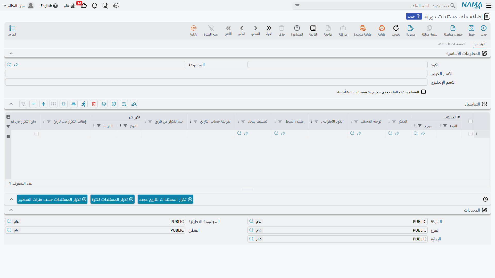

# المستندات الدورية

بعض المستندات تتكرر على إيقاع ثابت. فاتورة الإيجار التي تصدرها في أول كل شهر. رسوم الصيانة الربع سنوية. قيد اليومية الشهري للإهلاك. فاتورة مبيعات الاشتراك التي تُرسَل إلى العملاء أنفسهم كل ثلاثين يومًا. وإعادة كتابة هذه المستندات يدويًا في كل مرة — أو البحث عن نسخة الشهر الماضي لأخذ نسخة مماثلة منها — أمر ممل ويسهل نسيانه.

**المستند الدوري** هو ملف بسيط يلتقط مستندًا *واحدًا* كنموذج، إلى جانب القاعدة التي تحدد عدد مرات تكراره. تعرّفه مرة واحدة، فيتولّى نظام نما إصدار نسخ جديدة نيابةً عنك — إما تلقائيًا وفق جدول زمني، أو دفعة واحدة متى طلبت ذلك. تجده من **الأساسيات ← المستندات ← ملف مستندات دورية**.

## الفكرة في صورة واحدة

تخيّل المستند الدوري كختم مطاطي. توجّهه نحو مستند قائم — فاتورة إيجار الشهر الماضي مثلًا — وتصف الإيقاع: *كرّر كل شهر واحد، بدءًا من يناير، في أول الشهر*. وفي كل مرة يعمل فيها التكرار، يأخذ النظام **نسخة مماثلة** جديدة من ذلك النموذج (تمامًا كما لو استخدمت إجراء **نسخة مماثلة** على المستند بنفسك)، ثم يعدّل تواريخها لتناسب الفترة الجديدة، ثم يحفظها. أما النموذج نفسه فلا يُمَسّ؛ فهو مجرد قالب.

ولأن كل نسخة مُولَّدة مستند حقيقي مستقل، فإنها تسري في النظام سريانًا طبيعيًا — فلها كودها الخاص، وآثارها المحاسبية والمخزنية الخاصة، وموضعها الخاص في الفترة المالية.

## بناء التعريف

يتكوّن المستند الدوري في معظمه من جدول واحد. كل **سطر** يمثّل سلسلة تكرار منفصلة، فيمكن لتعريف واحد أن يقود عدة مستندات غير مترابطة في آنٍ معًا — مثلًا سطر لفاتورة الإيجار الشهرية وسطر آخر لفاتورة خدمة نظافة شهرية.

أهم الأعمدة في كل سطر:

| العمود | وظيفته |
|---|---|
| **المستند** (Document) | النموذج المراد نسخه. وهو مرجع لأي مستند قائم في النظام — فاتورة، أو قيد يومية، أو سند، وهكذا. إلزامي. |
| **طريقة حساب التاريخ** (Date Calculation Method) | كيف يُحتسب تاريخ النسخة الجديدة انطلاقًا من تاريخ التشغيل. انظر قسم «اختيار التاريخ» أدناه. إلزامي. |
| **يتكرر كل** (Repeat Every) — النوع + القيمة | الإيقاع: رقم مع **يوم / أسبوع / شهر / سنة**. فـ«شهر واحد» يعني أن تنتج السلسلة مستندًا واحدًا في الشهر على الأكثر. |
| **بدء التكرار من تاريخ** (Start Repeat From) / **إيقاف التكرار بعد تاريخ** (Stop After Date) | النافذة التي تكون فيها السلسلة نشطة. لا يُولَّد شيء لتاريخ قبل **بدء التكرار من تاريخ** أو بعد **إيقاف التكرار بعد تاريخ**. اتركهما فارغين لسلسلة مفتوحة المدة. |
| **الدفتر** (Book) / **توجيه المستند** (Term) | اختياريًا تفرض على النسخ المُولَّدة دفتر مستند وتوجيهًا محددين بدلًا من وراثتها من النموذج. ولا تعرض نافذة الاختيار إلا الدفاتر والتوجيهات الصالحة لنوع ذلك المستند. |
| **حفظ كمسودة** (Save as Draft) | عند تفعيله تُحفَظ كل نسخة **كمسودة** ليراجعها ويعتمدها أحد لاحقًا. وعند تركه فارغًا تُحفَظ النسخة وتُعالَج فورًا (مع احترام أي دورة موافقة على نوع ذلك المستند). |
| **منشئ السجل** (First Author) | اختياريًا يسجّل مستخدمًا محددًا بوصفه مُنشئ النسخ المُولَّدة. |
| **تصنيف سجل** (Record Category) | اختياريًا يضع على كل نسخة مُولَّدة تصنيف سجل. |
| **الكود الافتراضي** (Default Code) | مسمّى قصير يُعرّف هذه السلسلة. يوسم كل نسخة يُنتِجها هذا السطر ليتمكن النظام من التمييز بين سلسلة وأخرى (ولتتبّع النسخ رجوعًا إلى السطر الذي أنشأها). وإن تركته فارغًا ملأه النظام برقم السطر. |
| **نسخ الكود الافتراضي إلى الملاحظات** (Set Default Code to Remark) | ينسخ الكود الافتراضي إلى **ملاحظات** المستند المُولَّد، وهو مفيد لتمييز النسخ المتكررة بلمحة. |
| **منع التكرار في نفس التاريخ** (Prevent Recurring in Same Date) | صمّام أمان: إن وُجدت بالفعل نسخة لهذه السلسلة في التاريخ المستهدف، فتخطّاها. وهذا يستلزم تعبئة **الكود الافتراضي** — والنظام يفرض ذلك. |
| **منع التعديل** (Prevent Editing) | يقفل النسخ المُولَّدة ضد التعديل لاحقًا. |

### اختيار التاريخ

كل نسخة تحتاج إلى تاريخ قيمة وتاريخ إصدار. و**طريقة حساب التاريخ** تحدد كيف يُشتقّ هذان التاريخان من التاريخ الذي يعمل عليه التكرار:

- **تاريخ اليوم** (Today Date) — استخدم تاريخ التشغيل نفسه.
- **بداية الشهر** / **نهاية الشهر** (Month Start / Month End) — أول / آخر يوم في شهر تاريخ التشغيل.
- **بداية السنة** / **نهاية السنة** (Year Start / Year End) — أول / آخر يوم في سنة تاريخ التشغيل.

فمثلًا فاتورة إيجار مضبوطة على **بداية الشهر** وتُشغَّل في أي وقت خلال مارس تخرج بتاريخ 1 مارس، أيًّا كان اليوم الذي عمل فيه التكرار فعليًا.

::: warning يلزم وجود فترة مالية للتاريخ
لا بد أن يقع التاريخ المُولَّد داخل فترة مالية مُعرَّفة لشركة المستند — وإلا تعذّر على النظام حفظ النسخة وتوقف التشغيل بخطأ. فتأكد من أن السنة أو الفترة مفتوحة قبل عمل التكرار. انظر [التحكم في إقفال الفترات](/ar/platform/fiscal-period-control-guide.md).
:::

## كيف يقرر التشغيل ما الذي يُنشئه

حين يعمل التكرار لتاريخ معيّن، يمرّ على كل سطر ويطرح سلسلة أسئلة قصيرة قبل أن يُنتِج نسخة:

1. **هل التاريخ داخل النافذة؟** إن كان قبل **بدء التكرار من تاريخ** أو بعد **إيقاف التكرار بعد تاريخ**، فتخطّاه.
2. **هل توجد نسخة بالفعل لهذا التاريخ بالذات؟** إن كان **منع التكرار في نفس التاريخ** مفعّلًا ووُجدت نسخة، فتخطّاه.
3. **هل مضى وقت كافٍ منذ النسخة الأخيرة؟** إن كان **يتكرر كل** مضبوطًا، ينظر النظام إلى آخر نسخة أنتجتها هذه السلسلة ولا يُنشئ نسخة جديدة إلا إذا انقضت فترة الإيقاع. وهذا ما يمنع مهمة يومية من أن تُنتِج فاتورة *شهرية* ثلاثين مرة في الشهر.

فإذا اجتاز السطر الفحوص الثلاثة، ينسخ النظام النموذج، ويضبط تواريخه، ويطبّق تجاوزات الدفتر والتوجيه والتصنيف والمنشئ، ويوسمه بالكود الافتراضي للسلسلة وبرابط رجوعًا إلى هذا المستند الدوري، ثم يحفظه كمسودة أو يعالجه — بحسب **حفظ كمسودة**.

## طريقتان للتشغيل

### تلقائيًا، وفق جدول زمني

هذا هو الإعداد المعتاد، وهو السبب الذي يجعل معظم الناس ينشئون مستندًا دوريًا أصلًا. اقرن التعريف بـ**مهمة مجدولة** لتعمل من تلقاء نفسها:

1. افتح **مجدول المهام** وأنشئ مهمة.
2. اضبط **نوع الجدولة** على **مستند دوري**.
3. في حقل **المستند الدوري**، اختر تعريفك.
4. اختر موعد عمله — لسلسلة شهرية، «أول يوم من كل شهر عند منتصف الليل» خيار معتاد، لكن التشغيل اليومي يعمل بالكفاءة نفسها.

كل تشغيل يكرّر التعريف لتاريخ *ذلك اليوم*. وضوابط **يتكرر كل** و**منع التكرار في نفس التاريخ** على مستوى السطر هي ما يجعل الجدول المتكرر آمنًا: فحتى لو شغّلت المهمة كل ليلة، يظل سطر «شهر واحد» يُنتِج مستندًا واحدًا في الشهر. وللاطّلاع على الشرح الكامل لمجدول المهام — خيارات الجدولة، والتشغيل الفوري، وسجلات التنفيذ وتنبيهات الأخطاء — انظر [المهام المجدولة](/ar/platform/scheduled-tasks.md).

### يدويًا، دفعة واحدة

أحيانًا لا تريد الانتظار حتى موعد الجدول — بل تريد ملء سنة كاملة بأثر رجعي دفعة واحدة، أو إصدار نسخ هذا الربع الآن. يمنحك شريط الإجراءات أسفل شاشة المستند الدوري ثلاثة أزرار فورية تُنتِج دفعة من النسخ في الحال:

- **تكرار المستندات لفترة** (Recur Documents For Period) — أعطِ تاريخ بداية وتاريخ نهاية وفاصلًا زمنيًا (كل *ن* يوم/أسبوع/شهر/سنة)، أو عددًا ثابتًا من التكرارات، فيُنشئ النظام نسخة لكل تاريخ في ذلك المدى.
- **تكرار المستندات حسب فترات السطور** (recur Document For Details Periods) — يستخدم **بدء التكرار من تاريخ** و**إيقاف التكرار بعد تاريخ** و**يتكرر كل** الخاصة بكل سطر لاحتساب كل التواريخ وتوليدها دفعة واحدة.
- **تكرار المستندات لتاريخ محدد** (recur Documents) — أدخل حتى اثني عشر تاريخًا مفردًا واحصل على نسخة لكل منها.

وهذه مثالية للّحاق الأولي عند إعداد سلسلة لأول مرة، أو للتصحيحات العابرة. أما في العمل اليومي فتتولّى المهمة المجدولة العبء.

## إبقاء النسخ قابلة للتتبع

كل مستند يُنتِجه التكرار يُوسَم بالمستند الدوري (وبالسطر المحدد) الذي ولّده، فيبقى هناك دائمًا أثر واضح يعود إلى المصدر. ويمكنك رؤية كل ما ولّده التعريف في صفحة **المستندات المنشأة**. وهذا الأثر محمي أيضًا: **لا يمكنك حذف مستند دوري سبق أن ولّد نسخًا**، وهو ما يمنعك من قطع التاريخ دون قصد. وإن احتجت فعلًا إلى إزالته رغم ذلك، فعّل **السماح بحذف الملف حتى مع وجود مستندات منشأة منه** على التعريف لرفع هذا المنع.
