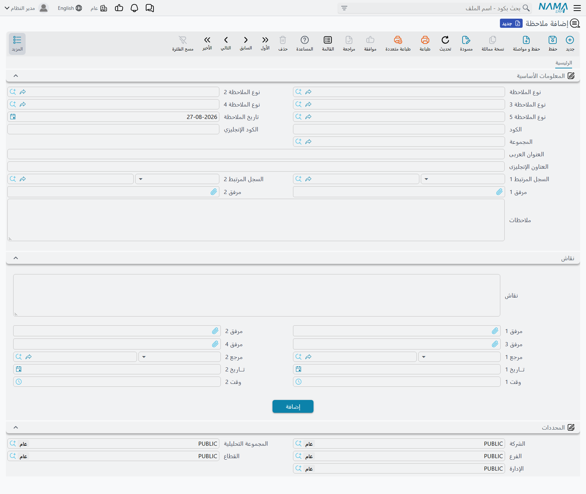
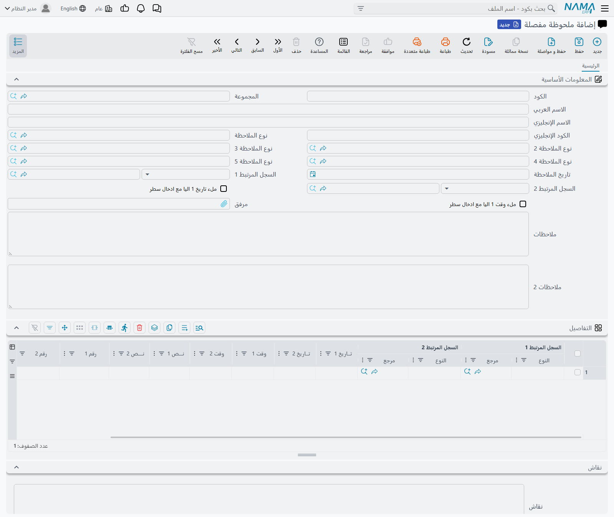
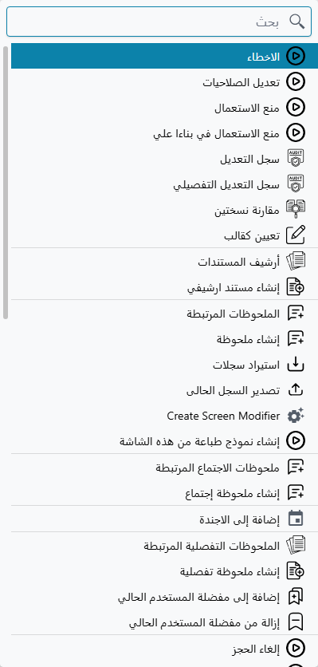
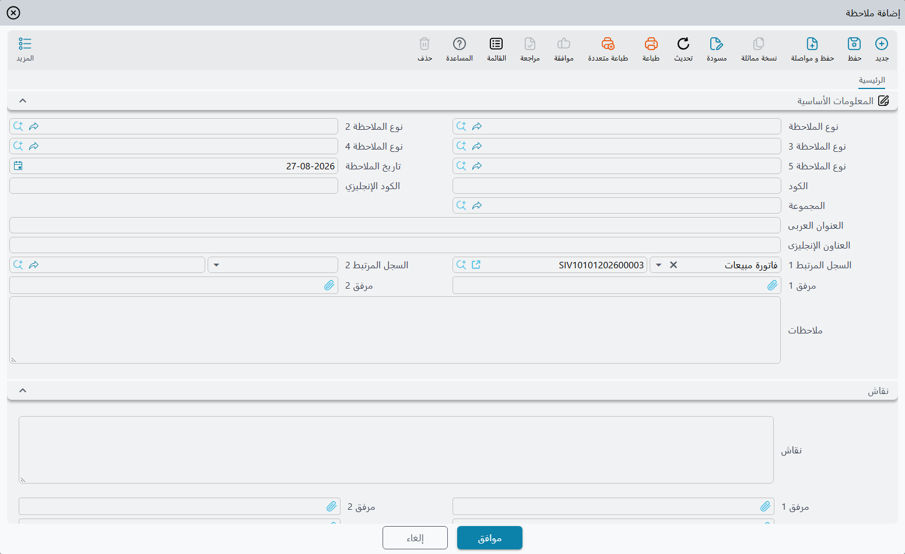
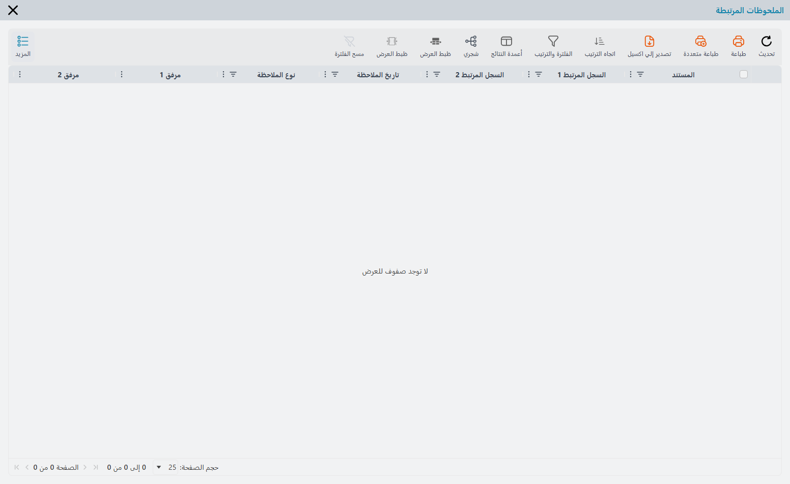
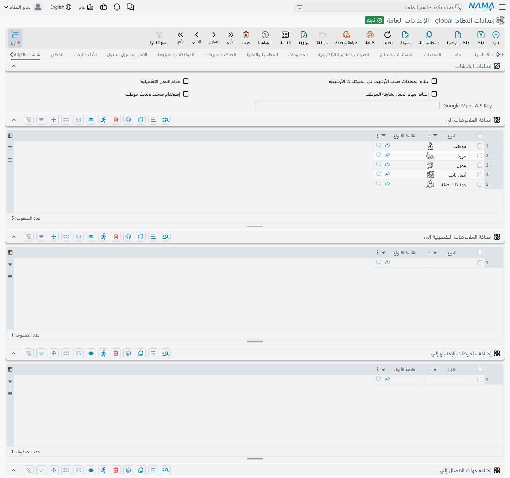
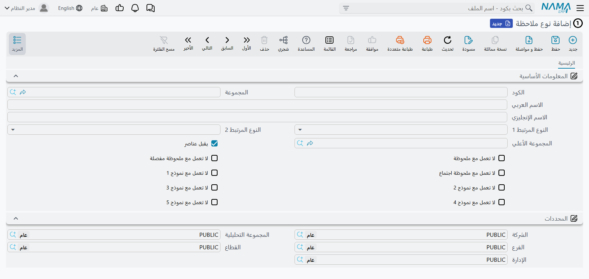
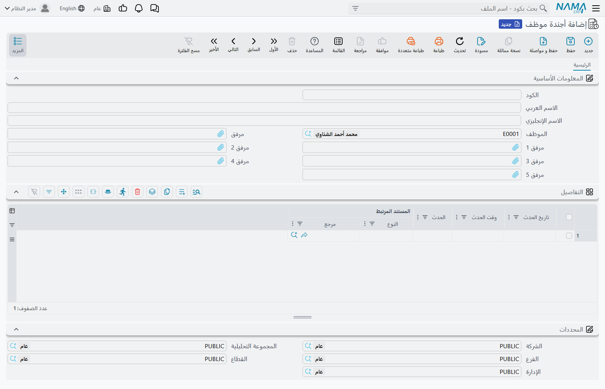
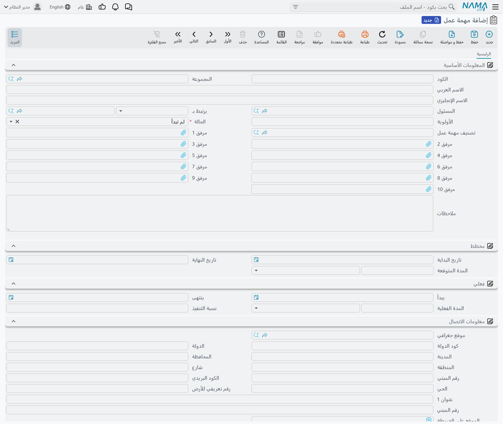

# الملحوظات والأجندة ومهام العمل

عاجلاً أو آجلاً يحتاج أحدهم أن يدوّن شيئاً على سجل. عميل اتصل بخصوص الفاتورة SIV-3417 ويطلب تأجيل
التسليم. قائمة أسعار مورّد لم تعد سارية، ويجب تنبيه المشتري قبل الطلبية القادمة. اجتماع قرر تجديد عقد،
وبعد ستة أشهر لن يتذكر أحد من الذي قرر.

لا شيء من ذلك يتسع له حقل. ولهذا يوفّر نظام نما ثلاثة مواضع لتدوينه — **الملحوظات**، و**الأجندة**،
و**مهام العمل** — وهي متاحة على كل سجل في النظام دون أي إعداد مسبق.

::: info حقل «ملاحظات» شيء آخر
معظم المستندات والملفات الرئيسية بها بالفعل مربع **ملاحظات** على شاشتها — حقل نص حر يُعد جزءاً من
المستند ويُحفظ معه. وليس هذا موضوع هذه الصفحة.

أما **سجل الملحوظة** فهو سجل قائم بذاته، له كوده وتاريخه وتصنيفه ومرفقاته وجدوله، ويُشير إلى المستند
دون أن يكون جزءاً منه. فالمستند الواحد يحتمل أي عدد من الملحوظات، كتبها أشخاص مختلفون في أيام مختلفة،
ولا تغيّر واحدة منها المستند نفسه.
:::

## ثلاثة أنواع من الملحوظات هي في الحقيقة نوع واحد

يقدّم النظام **ملاحظة** و**ملحوظة مفصلة** و**ملحوظات اجتماع**. ويجدر أن تعرف من البداية أنها ليست
ثلاث خصائص مختلفة بثلاثة سلوكيات مختلفة، بل تحمل المعلومات نفسها تماماً: الحقول نفسها، ومستويات
التصنيف نفسها، والمرفقات نفسها، والارتباط نفسه بالسجل. إنها ثلاثة أدراج منفصلة على هيئة واحدة.

والفارق الحقيقي بينها هو ما تراه على الشاشة، وكيفية تفعيل كل منها:

| | ملاحظة | ملحوظة مفصلة | ملحوظات اجتماع |
|---|---|---|---|
| جدول لإدخال البنود سطراً سطراً | لا | نعم | نعم |
| التاريخ يُملأ تلقائياً بتاريخ اليوم | نعم | لا | لا |
| مربع وصف ثانٍ، ومرفق رئيسي | لا | نعم | نعم |
| زوج خاص بها من أوامر قائمة «المزيد» | نعم | نعم | نعم |
| قائمة خاصة بها في الإعدادات العامة | نعم | نعم | نعم |

والقاعدة العملية إذن: استعمل **ملاحظة** للتدوينة القصيرة — فقرة وتاريخ وتصنيف وانتهى الأمر. واستعمل
**ملحوظة مفصلة** أو **ملحوظات اجتماع** حين تكون التدوينة ذات *أجزاء* — عدة نقاط، لكل نقطة تاريخها
ووقتها ونصها ورقمها ومرفقها. أما الاختيار بين هذين الاثنين فهو مسألة عُرف داخل المنشأة لا مسألة
إمكانيات. ومعظم الجهات تستعمل ملحوظات الاجتماع لمحاضر الاجتماعات، والملحوظة المفصلة لما عداها، وتفصل
بينهما حتى تظل القائمتان مقروءتين.

تحمل الملحوظة كوداً شأن أي ملف رئيسي، و**تاريخ الملاحظة**، وحتى خمسة مستويات من التصنيف
(**نوع الملاحظة** حتى **نوع ملاحظة 5**)، ومرفقين، ومربع **ملاحظات** للوصف، ومرجعين عامّين —
**السجل المرتبط 1** و**السجل المرتبط 2** — وهما ما يربطها بالسجل الذي تتحدث عنه. كما تحمل المحددات
المعتادة، فيمكن ترشيح الملحوظات حسب الشركة والفرع والإدارة كأي سجل آخر.

أما النسختان المفصلة والاجتماعية فتضيفان الجدول:

يستوعب كل سطر سجلّين مرتبطين، وتاريخين، ووقتين، ونصّين، ورقمين، ومرفقين. وأعمدة الجدول عامة عن قصد —
فهي مسماة **تاريخ 1** و**نص 1** و**رقم 1** وهكذا — لأن الجدول مُعدّ لإعادة تسميته في كل جهة
عبر [محرر الشاشات](/ar/platform/screen-modifier/) بما يطابق ما تسجّله فعلاً.

::: tip ختم الوقت تلقائياً
مفتاحان في رأس الشاشة — **ملء تاريخ 1 اليا مع ادخال سطر** ونظيره الخاص بالوقت — يضعان تاريخ اليوم
والوقت الحالي في عمودَي السطر الأولين لحظة إضافة السطر. وفي محضر اجتماع، أو في سجل مكالمات متتابع،
يوفّر ذلك كتابة متكررة عند كل إدخال.
:::

## تدوين ملحوظة على سجل

لست مضطراً أبداً لمغادرة السجل الذي تنظر إليه. افتح أي شاشة، واضغط **المزيد**، فتجد الأوامر هناك —
الأوامر السبعة نفسها على كل شاشة في المنتج، من فاتورة مبيعات إلى صنف إلى موظف.

وهي تأتي أزواجاً: أمر **إنشاء …** يكتب ملحوظة جديدة، وأمر **… المرتبطة** يعرض عليك ما كُتب من قبل.
وبينهما يقع **إضافة إلى الاجندة**، وله فقرة خاصة أدناه.

واختيار **إنشاء ملحوظة** يفتح شاشة الملحوظة في نافذة فوق السجل الذي كنت فيه:

**ويصل حقل «السجل المرتبط 1» مملوءاً سلفاً بالسجل الذي جئت منه** — وهذه هي فائدة البدء من قائمة
«المزيد» بدلاً من شجرة القوائم. اكتب الوصف، وصنّف الملحوظة إن كانت جهتك تستعمل أنواع الملاحظات، ثم
اضغط «موافق». تُغلق النافذة وتعود إلى الفاتورة، وهي لم تُمَس ولم تحتج حفظاً.

وما عدا ذلك في الشاشة اختياري. فليس في الملحوظة حقول إلزامية ولا تحققات خاصة بها، ومن ثمّ تُحفظ بلا
اعتراض ملحوظةٌ ليس فيها إلا الوصف.

## استعراض الملحوظات

أوامر **… المرتبطة** تفتح القائمة المناسبة في نافذة:

تبحث القائمة عن كل ملحوظة يشير فيها **السجل المرتبط 1 أو السجل المرتبط 2** إلى السجل الذي أنت عليه —
فالملحوظة المقيّدة على السجل في أيٍّ من الحقلين تظهر.

وللنافذة شريط أدوات خاص بها، وزرّ **شجري** فيه يعيد تجميع القائمة حسب نوع الملاحظة. وهذا ما يجعل
التصنيف جديراً بالملء: فمع استعمال الأنواع، يقرأ سجلٌ عليه أربعون ملحوظة كبضعة مجلدات لا كجدار مسطح
من الصفوف.

### إظهار الملحوظات داخل شاشة السجل نفسه

اللجوء إلى قائمة «المزيد» في كل مرة مقبول للملحوظة العارضة. أما السجلات التي تكون فيها الملحوظات جزءاً
من العمل اليومي — العملاء والعقود وأوامر الخدمة — فيمكن أن تظهر القائمة فيها **كتبويب داخل شاشة
السجل** نفسها، ظاهرة دائماً وبلا حاجة إلى قائمة.

ويُفعَّل ذلك مركزياً لا لكل مستخدم على حدة. ففي **الإعدادات العامة**، في تبويب **شاشات الكيانات**،
تضم مجموعة **إضافات الشاشات** قائمةً لكل نوع من أنواع الملحوظات:

أضف كياناً إلى **إضافة الملحوظات إلي** فتنبت في كل شاشة من ذلك النوع تبويبة **الملاحظات** تعرض
ملحوظاته. ويفعل **إضافة الملحوظات التفصيلية إلي** و**إضافة ملحوظات الإجتماع إلي** الشيء نفسه للنوعين
الآخرين. انظر [إعدادات شاشات الكيانات](/ar/platform/global-config/global-config-entity-screens)
للاطلاع على التبويب كاملاً.

::: warning التبويبة تظهر على الشاشة القياسية فقط
تُضاف التبويبة الإضافية إلى الشاشة التي يأتي بها المنتج. فإن كان الكيان قد أُعطي شاشة مصممة خصيصاً له
عبر محرر الشاشات، فلن تُضاف التبويبة إليها — والملحوظات موجودة على كل حال وما زالت متاحة من قائمة
«المزيد»، لكن التبويبة لن تظهر. فإن فعّلت هذا ولم تر تبويبة، فهذا أول ما ينبغي فحصه.
:::

وشاشة **الموظف** حالة خاصة: فهي تحمل دائماً الملحوظات المفصلة وملحوظات الاجتماع المرتبطة، بلا أي إعداد.

## تصنيف الملحوظات — أنواع الملاحظات

أنواع الملاحظات هي ما يحوّل كومة التدوينات إلى شيء قابل للبحث. وهي ملفات رئيسية عادية، تُعدّ من
**الأساسيات ← الملاحظات**، ومنها خمسة مستويات مستقلة حتى تستطيع الجهة أن تصنّف على أكثر من محور في آن
واحد — الموضوع في المستوى الأول والإدارة في المستوى الثاني مثلاً.

المستوى الأول **شجرة**: فللنوع أبٌ، ومن ثمّ يمكنك بناء *شكوى ← تسليم ← تأخير*. أما المستويات الأربعة
الباقية فقوائم مسطحة تشير ببساطة إلى المستويات فوقها، واختيار نوع في مستوى يضيّق المعروض في المستوى
الذي يليه.

وثلاثة إعدادات في النوع جديرة بالفهم، لأنها تحدد أين يمكن استعماله:

**يقبل عناصر** يحدد ما إذا كان النوع قابلاً للاختيار أصلاً. فلا يُعرض في حقل «نوع الملاحظة» إلا
الأنواع المؤشَّر عليها بهذا — إذ وُجدت فروع الشجرة لتنظيم الأوراق لا لتُختار هي نفسها. فإن أنشأت نوعاً
ثم لم تجده في الحقل، فهذا هو السبب.

**النوع المرتبط 1** و**النوع المرتبط 2** يقيّدان ما يمكن ربط الملحوظة به. اضبط «النوع المرتبط 1» على
«عميل» في نوع اسمه *إيقاف ائتماني*، فيصبح اختيار ذلك النوع في ملحوظة فارغة قاصراً بحقل «السجل المرتبط
1» على العملاء. ولاحظ أن هذا لا يسري إلا والحقل ما يزال فارغاً — والملحوظة المبدوءة من قائمة «المزيد»
يصلها «السجل المرتبط 1» مملوءاً، فلا يبقى للقيد ما يعمل عليه.

**ومفاتيح «لا تعمل مع»** — *لا تعمل مع ملحوظة*، و*لا تعمل مع ملحوظة مفصلة*، و*لا تعمل مع ملحوظة اجتماع* — تحذف النوع من واحدة من الشاشات الثلاث. وبهذا تُبقي مجموعة تصنيفات محاضر الاجتماعات بعيدة عن
قائمة الملاحظات العادية والعكس، فلا تعرض كل شاشة إلا التصنيفات التي تناسبها.

## الأجندة

**إضافة إلى الاجندة** في قائمة «المزيد» هو أمر «عُد إلى هذا لاحقاً». وهو يفعل شيئاً مختلفاً تماماً عن
أوامر الملحوظات، ويحسن أن تعرفه قبل استعماله.

لكل موظف **أجندة موظف** — سجل واحد يحمل قائمة متصلة من القيود المؤرَّخة. وأمر «إضافة إلى الاجندة»
يجد أجندتك، ويلحق بها سطراً يشير إلى السجل الذي كنت تنظر إليه، ثم **يفتح أجندتك على الشاشة**. أي أنك
تُنقل بعيداً عن السجل الذي كنت فيه، لا أن تُعرض عليك نافذة فوقه.

يصل السطر الجديد وليس فيه إلا **المستند المرتبط**. اكتب **تاريخ الحدث** — وهذا إلزامي، فلن تُحفظ
الأجندة بدونه — وأضف **وقت الحدث** ووصفاً لما ينبغي عمله، ثم احفظ. وإن كانت لديك تعديلات غير محفوظة
على السجل الذي جئت منه فتصرّف فيها أولاً؛ إذ تُفتح الأجندة كسجل غير محفوظ وعليك أنت حفظه.

والأجندة إذن دفتر مؤرَّخ: تاريخ، ووقت، وما حدث أو ما يجب عمله، والسجل المعني. وهي ليست تقويماً ولا
تلاحقك — فلا تذكير ولا تنبيه ولا إشعار عند حلول موعد قيد، والقيود لا تُعلَّم بأنها أُنجزت. تقرأ
أجندتك بفتحها. وإن أردت أن تُنبَّه، فذلك يُبنى على حدة عبر [إشعار](/ar/platform/notifications/)
تقوده [مهمة مجدولة](/ar/platform/scheduled-tasks).

كما أن الأجندة تنمو بلا حدّ — فكل «إضافة إلى الاجندة» تلحق بالسجل نفسه بدلاً من بدء سجل جديد كل أسبوع
أو كل شهر. وفي أجندة كثيرة الاستعمال يحسن حذف السطور التي فرغت منها، أو ترشيح الجدول حسب التاريخ،
بدلاً من التمرير الطويل.

## مهام العمل

**مهمة العمل** هي العضو الوحيد في هذه العائلة الذي يختلف اختلافاً حقيقياً. فهي ليست تدوينة على سجل،
بل وحدة عمل مُسنَدة إلى شخص، لها خطة وحالة ونسبة إنجاز. وموضعها **الأساسيات ← الملفات ← مهمة عمل**،
وخلافاً للملحوظات ليس ثمة أمر في قائمة «المزيد» يُنشئها.

الشاشة ثلاثة أقسام. تحمل **المعلومات الأساسية** الاسمَ، و**المسئول** وهو الموظف صاحب المهمة،
و**الأولوية**، و**الحالة**، وتصنيفاً اختيارياً، وحتى عشرة مرفقات، و**يرتبط بـ** وهو السجل الذي تخص
المهمةُ. وحقل «يرتبط بـ» ضيّق عن قصد: فمهمة العمل تُربط بـ**موظف أو عميل أو مورّد**، ولا شيء غير ذلك.
فهو ليس مرجع «اربطني بأي شيء» الذي تملكه الملحوظات.

وتتنقل **الحالة** بين *لم تبدأ* ← *قيد التنفيذ* ← *منتهي*، ومعها *ملغي* للعمل الذي أُسقط. وتبدأ
المهمة الجديدة عند «لم تبدأ». وثمّة خمس قيم احتياطية (*أخرى 1* إلى *أخرى 5*) للجهات التي تحتاج حالات
إضافية خاصة بها.

ثم التاريخان نفسهما مرتين: تحمل **مخطط** تاريخَي البدء والانتهاء اللذين قصدتهما، وتحمل **فعلي** ما
حدث بالفعل، ومع كل منهما **مدة** تبقى متسقة مع التاريخين — غيّر التاريخين تُعَد حساب المدة، واضبط
المدة يتبعها تاريخ الانتهاء. و**نسبة التنفيذ** في جانب «فعلي» هي موضع تسجيل التقدم؛ ولا يشتقّها شيء،
بل يكتبها إنسان.

### توزيع المهمة على عدة أشخاص

يسمّي حقل «المسئول» مالكاً واحداً، وهذا يكفي معظم الأعمال. أما حين تكون المهمة مشتركة فشغّل **مهام
العمل التفصيلية** في الإعدادات العامة (**شاشات الكيانات ← إضافات الشاشات**، وهي المجموعة نفسها التي
تضم قوائم الملحوظات)، فتنبت في شاشة المهمة صفحة **تفاصيل** إضافية تحوي جدول **المنفذين**. ويسمّي كل
صف موظفاً بساعاته المخططة والفعلية، وتكلفته المخططة والفعلية، ونسبة إنجازه هو — فتُكلَّف المهمة لكل
شخص على حدة بدلاً من تكليفها جملةً واحدة.

والمفتاح المجاور، **إضافة مهام العمل لشاشة الموظف**، يضع في شاشة الموظف تبويبة **مهام عمل** تسرد كل
ما هو مسؤول عنه. وبالاثنين معاً تصير مهام العمل عرضاً خفيفاً لحِمل العمل لكل شخص.

## أين تجد هذا كله في القوائم

كل ما سبق متاح من وحدة **الأساسيات** دون المرور بسجل:

| الشاشة | مسار القائمة |
|---|---|
| ملاحظة، ملحوظة مفصلة، ملحوظات اجتماع | الأساسيات ← الملاحظات |
| نوع ملاحظة 1 حتى 5 | الأساسيات ← الملاحظات |
| أجندة موظف | الأساسيات ← الملاحظات |
| مهمة عمل، تصنيف مهمة عمل | الأساسيات ← الملفات |

وفتحها بهذه الطريقة يعطيك شاشة القائمة كاملة — الفلاتر والأعمدة والتصدير والعمليات الجماعية — وهي
الطريقة التي تراجع بها كل ملحوظة مفتوحة من نوع معيّن، أو كل مهمة عمل لم تنتهِ، بدلاً من النظر في
ملحوظات سجل واحد.

والملحوظات وقيود الأجندة ومهام العمل سجلات عادية في كل ما عدا ذلك: يعدّلها ويحذفها كل من له صلاحية
عليها، ويشملها [سجل التعديل](/ar/platform/audit-trail)، وتخضع لصلاحيات السجلات وللمحددات كأي شيء آخر
في النظام. وانظر [الأزرار الموجودة في كل شاشة](/ar/platform/screen-buttons) لبقية ما تقدّمه قائمة
«المزيد».
