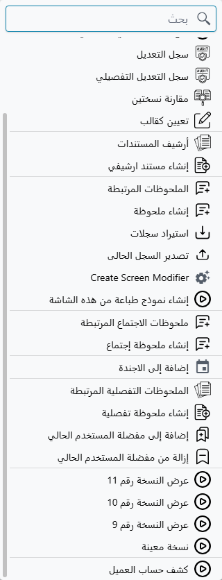
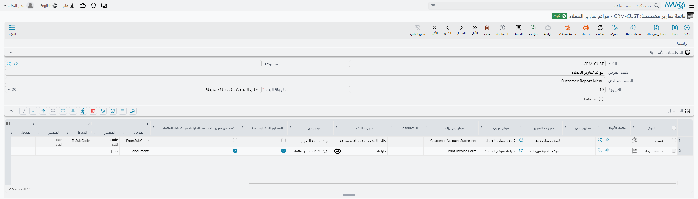

# قائمة تقارير مخصصة (Custom Report Menu)

مستخدم يفتح فاتورة مبيعات على الشاشة، ويريد كشف حساب هذا العميل، أو قائمة تعبئة هذه الفاتورة. بلا مساعدة يكون
الطريق طويلاً: يترك الشاشة، ويفتح قائمة التقارير، ويبحث عن التقرير الصحيح بين العشرات، ثم يعيد كتابة اسم
العميل أو رقم المستند في مدخلات التقرير — ويأمل ألا يكون أخطأ في الكتابة.

**قائمة التقارير المخصصة** تلغي هذا كله. فهي تضيف مداخل من عندك إلى قائمة **المزيد (⋮)** في شاشة تحرير الكيان
أو شاشة قائمته، وكل مدخل يبدأ تقريراً مدخلاته معبّأة سلفاً من السجل الذي ينظر إليه المستخدم. نقرة واحدة،
وسياق صحيح، وبلا إعادة كتابة.

وهذه من أكثر التخصيصات انتشاراً في المنتج: ففي إعدادات العملاء المحفوظة لدى نما يوجد **191 مدخلاً موزعة على
80 موقعاً من 192**. فإذا كان الموقع قد جرى إعداده أصلاً فالأرجح أن فيه بعضاً منها.

::: info لا تغيّر زر الطباعة
المداخل المخصصة تجلس بجوار عناصر قائمة «المزيد» الموجودة أصلاً، ولا تحل محل ما يفعله زر الطباعة ولا تغيّره.
فاختيار نموذج الطباعة له آلية مستقلة تماماً.
:::

## شكل السجل

افتح **إدارة النظام ← التقارير ← قوائم تقارير مخصصة** تجد شاشة برأس قصير وجدول واحد. الرأس يحمل بيانات هوية
السجل — الكود والمجموعة والاسم العربي والاسم الإنجليزي — إضافةً إلى ثلاثة إعدادات مهمة:

- **الأولوية (Priority)** — موضع مداخل هذا السجل بالنسبة إلى مداخل السجلات الأخرى.
- **طريقة البدء (Launch Type)** — الطريقة الافتراضية لفتح التقارير، يستعملها كل سطر لم يحدد طريقته الخاصة.
- **غير نشط (Inactive)** — يوقف السجل كله.

وما عدا ذلك يحدث في جدول **السطور**. كل سطر هو مدخل قائمة واحد. والسجل الواحد قد يحمل مدخلاً واحداً أو عشرين،
وطريقة التجميع متروكة لك: بعض المواقع تُبقي سجلاً لكل وحدة، وبعضها سجلاً لكل عائلة تقارير. والشيء الوحيد الذي
يقرره التجميع فعلاً هو أن كل السطور تشترك في أولوية الرأس وفي إعداد «غير نشط».

::: warning السجل بلا سطور لا يفعل شيئاً
الرأس وحده ليس مدخل قائمة. فإذا كان الجدول فارغاً تُخُطِّي السجل كله.
:::

## توجيه المدخل إلى شاشة

أول مهمة للسطر أن يقول **أين** يظهر المدخل. وهناك ثلاثة أعمدة لذلك، وهي طريقتان بديلتان للإجابة عن السؤال
نفسه:

- **النوع (Entity Type)** — شاشة واحدة بعينها، فاتورة المبيعات مثلاً.
- **قائمة الأنواع (Entity List)** — قائمة بشاشات بعينها، حين يكون المدخل نفسه منطقياً في عدة مستندات.
- **مطبق على (Applicable For)** — مجموعة عريضة بدل تسمية الأنواع: **كل الشاشات** أو **المستندات** أو
  **الملفات**.

يجوز أن تملأ «النوع» و«قائمة الأنواع» معاً، ويجوز أن تستعمل «مطبق على» وحده — لكن لا يجوز الجمع بين الطريقتين.
والخلط بينهما يُرفض عند الحفظ برسالة تطلب منك ملء أحد الحقلين وحده أو الحقلين الآخرين.

ولا بد لكل سطر أن يسمي هدفه بإحدى الطريقتين. فالسطر الذي تُترك أعمدته الثلاثة فارغة يُحفظ بلا اعتراض ولا يظهر
في أي شاشة، وهذا أشهر أسباب عدم العثور على مدخل جديد.

### شاشة التحرير أم شاشة القائمة أم كلتاهما

**عرض في (Show In)** يحدد قائمة «المزيد» التي ينضم إليها المدخل:

| عرض في | أين يظهر المدخل |
|---|---|
| *(فارغ)* | شاشة التحرير فقط |
| المزيد بشاشة التحرير (Edit View More) | شاشة التحرير فقط |
| المزيد بشاشة عرض قائمة (List View More) | شاشة القائمة فقط |

ويستحق هذا التفاوت أن يُحفظ: ترك «عرض في» فارغاً لا يعني «الاثنتين» بل يعني «شاشة التحرير». فالمدخل الذي
ينبغي أن يظهر والمستخدم ينظر إلى قائمة الفواتير لا بد أن يقول **المزيد بشاشة عرض قائمة** صراحةً. ولأن السطر
يحمل قيمة واحدة لهذا الحقل، فالمدخل الذي تريده في الموضعين يحتاج سطرين، واحداً لكل موضع.

## تسمية المدخل

العنوان الذي يقرؤه المستخدم يأتي من أول ما يكون مملوءاً مما يلي:

1. **Resource ID** — مفتاح ترجمة موجودة في النظام. إن ملأته غلب كل ما عداه، وتبع العنوان لغة واجهة المستخدم
   تلقائياً.
2. **عنوان عربي (Arabic)** و**عنوان إنجليزي (English)** في السطر — العنوان بكل لغة.
3. **الاسم العربي والاسم الإنجليزي** في رأس السجل، ويُستعملان حين يترك السطر عمودَي العنوان فارغين.

فإذا كان السجل يحمل مدخلاً واحداً كان الأنظف أن تُحسِن تسمية الرأس وتترك عنواني السطر فارغين. وإذا كان يحمل
عدة مداخل فاملأ عناوين السطور.

## اختيار التقرير وطريقة فتحه

**تعريف التقرير (Report Definition)** مطلوب في كل سطر، وهو التقرير الذي يبدأه المدخل.

و**طريقة البدء (Launch Type)** تحدد كيف يُفتح. قيمة السطر هي الغالبة، فإن تركها السطر فارغة استُعملت قيمة
الرأس. والخيارات الخمسة تنقسم على محورين: هل يُسأل المستخدم عن المدخلات أولاً، وأين تظهر النتيجة:

| طريقة البدء | ما يراه المستخدم |
|---|---|
| بدء في نافذة منبثقة (Direct in popup) | يعمل التقرير فوراً وتظهر النتيجة في نافذة منبثقة فوق الشاشة الحالية |
| بدء في نافذه جديدة (Direct in new page) | يعمل التقرير فوراً وتظهر النتيجة في تبويب متصفح جديد |
| طلب المدخلات في نافذه منبثقة (Parameters in popup) | تسأل نافذة منبثقة عن مدخلات التقرير أولاً ثم تعرض النتيجة |
| طلب المدخلات في نافذة جديدة (Parameters in new page) | تُطلب مدخلات التقرير في تبويب متصفح جديد |
| طباعة (Print) | يُنتَج التقرير ملف PDF ويُرسَل إلى الطباعة دون عرض شيء على الشاشة |

و«البدء المباشر» لا يعني أن التقرير بلا مدخلات، بل يعني أن المستخدم لا يُسأل عنها: تُملأ المدخلات التي ربطتها
من السجل، ويأخذ ما عداها قيمه الافتراضية في التقرير. واستعمل إحدى طريقتَي «طلب المدخلات» حين يكون أمام المستخدم
اختيار حقيقي، كفترة تاريخية لا يستطيع السجل توفيرها.

أما طريقة **الطباعة** فهي المناسبة لأشياء من نوع «اطبع إذن الخروج لهذا التسليم»: تُنتج ملف PDF وتسلّمه إما إلى
خادم الطباعة من نما وإما إلى مسار الطباعة في المتصفح، حسب طريقة إعداد الطباعة لذلك المستخدم.

## تغذية التقرير من السجل

هذا هو ما يجعل إعداد الخاصية مجدياً. لكل سطر تسعة مواضع للمدخلات، وكل موضع زوج من عمودين:

- **المدخل (Parameter)** — اسم المدخل كما هو معرَّف في التقرير.
- **المصدر (Field)** — من أين تأتي قيمته في السجل الذي ينظر إليه المستخدم.

جانب المصدر يكون عادةً حقلاً من حقول السجل الحالي — العميل، الفرع، تاريخ المستند. وهناك أيضاً قيمة خاصة هي
**`$this`** ومعناها السجل نفسه لا حقل من حقوله. والإعداد الشائع جداً بموضع واحد هو هذا بعينه: المدخل `document`
والمصدر `$this` — فيتسلّم التقرير المستند كاملاً ويقرأ منه ما يحتاجه.

ولا شيء يتحقق من هذه الأسماء نيابةً عنك. فاسم المدخل الذي لا يطابق أي مدخل في التقرير يُتجاهل ببساطة عند
التشغيل، ويعود التقرير إلى القيمة الافتراضية لذلك المدخل — فينتج غالباً نتيجة فارغة أو غير مفلترة لا رسالة خطأ.
فإذا عمل المدخل وأعاد بيانات خاطئة فأول ما ينبغي مراجعته هو خطأ إملائي في اسم المدخل.

وحين يُبدأ المدخل من **شاشة القائمة** تُرسَل ثلاث قيم دائماً فوق ما ربطته أنت: معرّفات السطور المعنية، وسياق
السجل، ونوع الكيان. فالتقرير المصمَّم ليُبدأ من قائمة يستطيع قراءة معرّفات السطور دون أي إعداد منك.

## التشغيل من شاشة القائمة

هناك عمودان لا يعنيان إلا المداخل التي تظهر في شاشة القائمة.

**السطور المختارة فقط (Selected Records Only)** يحصر المدخل في السطور التي أشّر عليها المستخدم بدلاً من كل ما
في الصفحة المعروضة. وهذا هو المطلوب في كل ما ينتج مخرجاً لكل سطر تقريباً.

و**دمج في تقرير واحد عند الطباعة من شاشة القائمة (Combine In One Report When Printing From List View)** يحدد
معنى «عدة سطور». فإذا أشّرت عليه سُلِّمت السطور إلى تشغيل واحد للتقرير فينتج مستند واحد يشملها جميعاً، وهو
الخيار الطبيعي للملخصات والكشوف المجمّعة. وإذا تركته بلا تأشير بدأ المدخل التقرير مرة لكل سطر: عشر فواتير
مختارة تعني عشرة تشغيلات منفصلة، وهو المطلوب في «اطبع كلاً من هذه» لكنه يغرق الشاشة إذا اختار المستخدم مئتي سطر.

## ترتيب المداخل

قد يسهم أكثر من سجل بمداخل في الشاشة نفسها — سجل مربوط بفاتورة المبيعات تحديداً، وآخر مطبق على كل الشاشات.
و**الأولوية** في الرأس تحدد ترتيب ظهورها، **والأعلى أولاً**.

أما السجلات المتساوية في الأولوية فتُترك بلا ترتيب محدد بينها، فإن كان تسلسل مداخلك مهماً فأعطِ كل سجل أولوية
مختلفة بدل أن تتركها كلها على القيمة نفسها.

## إيقاف مدخل

**غير نشط** في الرأس يزيل السجل كله من كل القوائم. وهو يُنسَخ أيضاً إلى كل سطر في كل مرة يُحفظ فيها السجل،
فعمود «غير نشط» داخل الجدول ليس مفتاحاً مستقلاً — فما تضبطه فيه تُكتب فوقه قيمة الرأس عند الحفظ التالي. فإذا
احتجت إلى إيقاف مدخل واحد مع بقاء جيرانه فإما أن تحذف السطر وإما أن تنقله إلى سجل مستقل.

## من يرى المدخل

تُبنى المداخل لكل المستخدمين من البيانات المشتركة نفسها بلا أي فلترة بالصلاحيات. فالمستخدم الذي لا يملك حق
تشغيل التقرير يرى مدخل القائمة رغم ذلك، ويحصل على رسالة خطأ حين ينقره — إذ يتم التحقق من الصلاحية في تلك
اللحظة لا قبلها.

فقائمة التقارير المخصصة ليست وسيلة لإخفاء تقرير عن أحد. تحكّم في الوصول من التقرير نفسه، واعتبر مدخل القائمة
اختصاراً لا أكثر.

## لماذا لا يظهر المدخل الجديد

هذه تُوقِع الجميع تقريباً في المرة الأولى.

::: warning القائمة تُحمَّل مرة واحدة عند تسجيل الدخول
مجموعة المداخل المخصصة كاملةً تُرسَل إلى المتصفح عند تسجيل دخول المستخدم، ولا تُقرأ مرة أخرى ما دامت الجلسة
مستمرة. فأضِف سجلاً، أو أشّر على «غير نشط»، أو غيّر عنواناً — لن يتغير شيء في شاشة مفتوحة بالفعل ولا في أي
جلسة بدأت قبل تغييرك. سجّل الخروج ثم الدخول لتراه، واطلب من مستخدميك أن يفعلوا المثل قبل أن يبلّغوا عن عطل.
:::

فإن لم يُجدِ تسجيل الدخول من جديد فراجع الأسباب الثلاثة التي تُنتج مدخلاً غير مرئي بصمت: السطر بلا «نوع» ولا
«قائمة أنواع» ولا «مطبق على»؛ أو «عرض في» فارغ في مدخل مقصود لشاشة القائمة؛ أو سجل الرأس «غير نشط» أو بلا سطور
أصلاً.

## مثال متكامل

موزّع يريد إتاحة «طباعة قيد اليومية» مباشرةً على مستنداته المحاسبية.

1. أنشئ سجل قائمة تقارير مخصصة. أعطه كوداً وسمّه *مطبوعات المحاسبة*، واضبط **الأولوية** على 10، واترك **طريقة
   البدء** في الرأس على *طباعة*.
2. أضف سطراً واحداً. في **قائمة الأنواع** اذكر أنواع المستندات التي ينبغي أن يظهر فيها. اضبط **تعريف التقرير**
   على تقرير طباعة قيد اليومية. واملأ **عنوان عربي** و**عنوان إنجليزي** بالعنوان الذي يقرؤه المستخدم.
3. تجاوز إعداد الرأس في هذا السطر بضبط **طريقة البدء** الخاصة به على *بدء في نافذه جديدة*، ليرى المستخدم
   النتيجة ويقرر بنفسه أيطبعها أم لا.
4. في موضع المدخل الأول اضبط **المدخل** على الاسم الذي يتوقعه التقرير — `document` — واضبط **المصدر** على
   `$this`.
5. اترك **عرض في** فارغاً، لأن هذا المدخل يخص شاشة التحرير.
6. احفظ، وسجّل الخروج ثم الدخول، وافتح أحد تلك المستندات، تجد المدخل في قائمة المزيد (⋮).

::: info تبويب إضافي قد لا تراه
على خوادم التطبيق الداخلية في نما تُظهر هذه الشاشة تبويباً ثانياً يُستعمل لفهرسة التخصيص داخلياً. وهو لا يؤثر
في سلوك مدخل القائمة إطلاقاً، ولا يظهر في التركيبات العادية.
:::