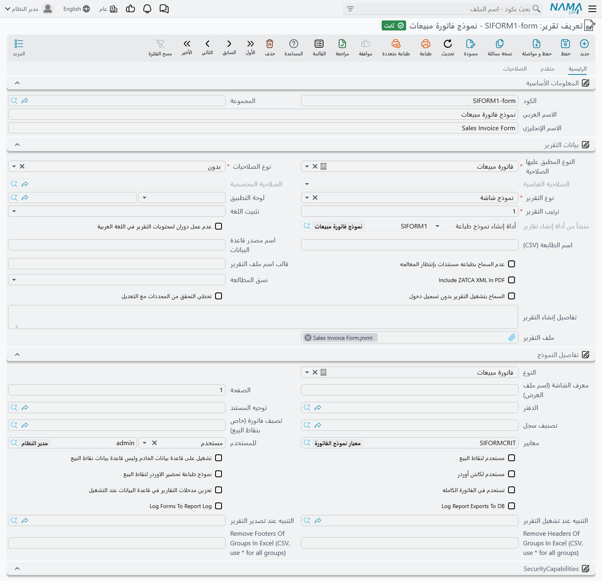

# أي نموذج طباعة سيخرج

اضغط **طباعة** على فاتورة مبيعات فلن يسألك النظام شيئاً. لا تظهر قائمة بالتصميمات، ولا نافذة
«اختر النموذج» — إما أن يخرج مستند وإما لا يخرج شيء. وهذا الصمت مقصود: الخادم يستنتج بنفسه أي نموذج
واحد يخص هذا السجل وهذا المستخدم وهذه اللحظة، ثم يشغّله.

ولهذا السبب تتشابه شكاوى الطباعة كلها. *«طُبع التصميم القديم»*، *«تُطبع عندي ولا يخرج شيء عند محاسب
الفرع»*، *«طُبعت مرة واحدة والآن الزر لا يفعل شيئاً»*. لا شيء من ذلك عطل في الطابعة، بل كل واحدة منها
قاعدة من قواعد الاختيار. والغرض من هذه الصفحة أن تستطيع — انطلاقاً من العَرَض — أن تسمّي القاعدة
المسؤولة.

**نموذج الطباعة** هو تعريف تقرير نوعه (`Report Type`) **نموذج شاشة (Form)**، وحقل **النوع
(Form Entity)** فيه محدد بنوع السجل الذي يطبعه. وكل ما يلي يشرح كيف يختار النظام بين هذه النماذج.

## قبل أن يُسأل الخادم أصلاً

هناك تحققان يجريان في المتصفح قبل أن يُدرس أي نموذج.

الأول أن السجل لا بد أن يكون محفوظاً. اضغط طباعة على سجل فيه تعديلات غير محفوظة، أو على شاشة لم
تُحفظ بعد، فتظهر الرسالة *«لا يمكن طبع السجل قبل حفظ التغيرات»*. لم يجرِ أي اختيار أصلاً؛ احفظ ثم
اضغط طباعة من جديد.

والثاني أن المتصفح يسأل الخادم سؤالاً أبسط بكثير من «أي نموذج؟» — يسأله: *«هل يوجد نموذج أصلاً لهذا
السجل ولهذه الصفحة؟»*. فإن كان الجواب لا، رأى المستخدم *«لا يوجد نموذج طباعة مناسب للسجل»* وتوقف
الأمر عند هذا الحد. وهذا الجواب يُحفظ في الذاكرة طوال جلسة الدخول، مرتبطاً بنوع السجل والصفحة
والمطالعة. فإذا أضفت نموذجاً لمستخدم قيل له للتو إنه لا يوجد ما يُطبع، وجب على ذلك المستخدم تسجيل
الخروج والدخول من جديد قبل أن يلتفت النظام إلى النموذج الجديد. وهذه نقطة تُربك كثيرين أثناء التطبيق:
النموذج سليم، والإعداد سليم، ومتصفح المستخدم ما زال يكرر جواباً أُعطي له قبل ساعة.

## أي النماذج تُعد مرشحة أصلاً

بفرض وجود نموذج، يبدأ الخادم بجمع كل النماذج المسجلة على نوع السجل. وحقلان يحددان العضوية:

- **النوع (Form Entity)** — نوع السجل الذي يطبعه النموذج. فنموذج مسجل على فاتورة المبيعات لن يكون
  مرشحاً أبداً لأمر بيع، مهما كان تصميمه.
- **الصفحة (Form Page)** — تقييد اختياري بصفحة (تبويب) واحدة من شاشة السجل. اتركه فارغاً فيُعرض
  النموذج من كل الصفحات، واملأه فلا يُعرض إلا من الصفحة المطابقة. والمطابقة متساهلة: تقبل مفتاح
  الترجمة للصفحة، أو عنوانها العربي، أو عنوانها الإنجليزي، أو ترتيبها على الشاشة بدءاً من ١. ولهذا
  يعمل `2` كما يعمل عنوان الصفحة الظاهر.

وتُفلتر القائمة كذلك على محددات المستخدم نفسه، تماماً كأي قائمة ملفات أخرى. فالنموذج التابع لشركة لا
يراها المستخدم ليس مرشحاً عنده، وهذا أحد الأسباب الخفية لاختلاف التصميم المطبوع بين مستخدمَين من
المستند نفسه.

## الفلتر القاطع — النموذج الذي يسقط فيه ليس مرشحاً من الأساس

الخطوة التالية ليست تفضيلاً بل استبعاداً. يُقارن كل نموذج متبقٍ بالسجل الذي سيطبعه، ويُحذف النموذج
كلما ناقض قيدٌ يحمله بيانات السجل:

| حقل النموذج | يسقط النموذج عندما |
|---|---|
| **الدفتر (Form Book)** | يحدد النموذج دفتر مستندات والسجل تابع لدفتر آخر. |
| **توجيه المستند (Form Term)** | يحدد النموذج توجيهاً والسجل يحمل توجيهاً مختلفاً. |
| **تصنيف السجل (Form Doc Category)** | يحدد النموذج تصنيف سجل ويختلف تصنيف السجل عنه. |
| الشركة والقطاع والفرع والإدارة ومجموعة التحليل | يحدد النموذج أحدها ويختلف ما في السجل عنه. |

والقاعدة التي يجدر حفظها أن **القيد الفارغ لا يقيّد شيئاً**. فالنموذج الذي لا دفتر له ولا توجيه ولا
محددات ينافس على كل سجلات نوعه، والنموذج المحدد بدفتر لا ينافس إلا على مستندات ذلك الدفتر. وهذه هي
الآلية التي تقف خلف «كل شركة تطبع تصميم فاتورتها الخاص»: أنت لا تضبط نموذجاً افتراضياً لكل شركة، بل
تضع الشركة على النموذج وتترك الفلتر يقوم بالباقي.

::: warning القيد يحذف النموذج ولا يؤخّره
لا يوجد بديل احتياطي. إن كان النموذج الوحيد لديك لفاتورة المبيعات محدداً بالدفتر `SI-A` وطبع
المستخدم مستنداً من الدفتر `SI-B`، فالنتيجة ليست «يطبع النموذج الآخر» بل *«لا يوجد نموذج طباعة مناسب
للسجل»*.
:::

## ترتيب تجربة الناجين

ما تبقى يُرتَّب الآن، والترتيب مهم لأن البحث يتوقف عند أول نموذج يجتاز اختبارات القسم التالي.

1. **النماذج غير النظامية تسبق النظامية.** النموذج الذي يأتي مع نما موسوم بأنه **نظامي (System)**،
   وما ينشئه المطبِّق ليس كذلك. فما إن تنشئ نموذج فاتورتك حتى يتقدم على النموذج الجاهز في كل سجل
   يصلح له كلاهما — ولست بحاجة إلى تعطيل النموذج النظامي.
2. **وداخل كل مجموعة يحسم ترتيب التقرير (Report Order).** الأقل يأتي أولاً. أعطِ نموذجك العام رقماً
   كبيراً والحالات الخاصة أرقاماً صغيرة، لتأخذ الحالات الخاصة فرصتها أولاً.

## أول نموذج يجتاز الاختبارات هو الفائز

يمشي الخادم الآن على القائمة المرتبة من أعلاها ويأخذ **أول** نموذج تتحقق فيه كل هذه الشروط:

- **المعايير (Form Criteria)** — تعريف معايير يُقيَّم على السجل نفسه. وهذه هي الأداة المناسبة لـ
  «الفواتير التي تتجاوز ١٠٠٬٠٠٠ تُطبع على نموذج الترويسة»: الشرط يسكن في النموذج لا في المستند.
- **للمستخدم (For User)** — الحقل متساهل عمداً فيما يُوضع فيه: يقبل **مستخدماً**، أو **دور صلاحيات**،
  أو [مجموعة ملفات](/ar/platform/master-groups). وجّهه إلى دور صلاحيات فيحصل كل من يحمل ذلك الدور على
  النموذج، ووجّهه إلى مجموعة ملفات فيحصل عليه كل مستخدم داخلها. واتركه فارغاً فيخدم النموذج الجميع.
- **المحددات** — المحددات الخمسة نفسها، لكن هنا كمطابقة لا كفلتر، وبتساهل أكبر قليلاً: المحدد المركب
  الموضوع على النموذج والذي *يحتوي* محدد السجل يُعد مطابقاً، فالنموذج المحدد بمجموعة فروع يغطي كل فرع
  داخلها.
- **كود الوصلة (Menu Code)** — النموذج الذي يحمل كود وصلة لا يُؤخذ إلا إذا وصل طلب الطباعة حاملاً
  الكود نفسه. ومعظم النماذج تترك هذا الحقل فارغاً.

أول نموذج يجتاز هذه الأربعة هو الذي يُطبع. لا يُنظر فيما تحته، ولا يُعرض على المستخدم شيء ليختار
منه. وإن لم يجتزها **أي** نموذج انتهت الطباعة بالرسالة *«لا يوجد نموذج طباعة مناسب للسجل»* رغم وجود
مرشحين. وهذا الفرق يستحق التذكر وأنت تحدّق في نموذج يبدو مضبوطاً تماماً: قد يكون قد استُبعد بالفلتر
القاطع، وقد يكون قد تُخطي في اختبارات المطابقة الأولى — وفي الحالة الثانية وحدها كانت هناك نماذج
أخرى ما تزال خلفه.

## أن يُختار النموذج شيء وأن يُطبع شيء آخر

قد يفوز النموذج بالاختيار ولا يخرج منه شيء. فكل ما يلي يُفحص بعد اختيار النموذج، ولكل منه رسالته.

**هل يملك المستخدم حق الطباعة أصلاً؟** الطباعة صلاحية على نوع السجل في
[دور الصلاحيات](/ar/platform/security/security-profiles) الخاص بالمستخدم. فإذا كانت **الطباعة
(Can Print)** على *Disabled* لم يُطبع أي نموذج إطلاقاً.

**هل السجل مسودة؟** المسودات ممنوعة افتراضياً — فالمسودة المطبوعة لا تُميَّز عن المستند المطبوع في
عين من يستلمها. وثلاثة مواضع منفصلة ترفع هذا المنع، وهنا يخطئ الدعم غالباً:

- الخيار العام **السماح بطباعة المسودات** في
  [التقارير والطباعة](/ar/platform/global-config/global-config-reports)، و
- الخيار نفسه على [دفتر المستندات](/ar/platform/document-books) الذي ينتمي إليه السجل، و
- الخيار نفسه على **توجيه المستند** الذي يحمله السجل.

فالدفتر والتوجيه، كل منهما وحده، يتجاوز الإعداد العام. ولهذا فإن «نحن لا نسمح بطباعة المسودات» قد
تكون صحيحة على مستوى الإعداد العام ولا تكون كل الحقيقة: يكفي دفتر واحد مؤشَّر فيه الخيار لتُطبع
مستنداته كمسودات. فإذا طُبعت مسودة وأنت تظن أن ذلك ممنوع، افحص الدفتر والتوجيه قبل أن تشك في الإعداد
العام. أما السجلات المنتظرة موافقة فيحكمها خيار مستقل هو **السماح بطباعة السجلات في انتظار
الموافقة**. وفوق ذلك كله يجب ألا يحمل دور صلاحيات المستخدم **منع طباعة المسودات**. وحين يُغلق هذا
الباب تظهر الرسالة *«لا يمكن طباعة سجل مسودة»*.

**هل طُبع من قبل؟** كل سجل يحمل **عدد مرات الطباعة**. فما إن يتجاوز الصفر حتى تحتاج الطباعة التالية
إلى أن تكون **الطباعة (Can Print)** على *More Than One* — أما مع *One* فتنجح الطباعة الأولى وتُرفض
كل محاولة بعدها. وهذا هو جواب «طُبعت مرة واحدة والآن ترفض»، وهو مقصود عادةً: فبضمّه إلى *منع
التعديل/الحذف بعد الطباعة* تصير الفاتورة الرسمية نهائية.

**هل هناك سقف؟** **أقصى عدد مرات طباعة** في دور الصلاحيات يضع رقماً لذلك، والرفض يذكر لك الحساب:
*«أقصى عدد مرات طباعة للنوع SalesInvoice هو ٣، والسجل SI-000412 تم طباعته ٣ مرة»*. وتفصيلان يحددان
أي رقم يُقارن. فحين يحصل المستخدم على صلاحيات عبر
[تفويض الصلاحيات](/ar/platform/security/security-delegation) تُؤخذ سقوف الأدوار التي حصل عليها بهذا
الطريق في الحسبان أيضاً. وحين يكون الخيار العام **احتساب عدد مرات الطباعة لكل مستخدم** مفعلاً، فالرقم
المقارَن ليس عدد مرات طباعة السجل بل كم مرة طبع **هذا المستخدم** **هذا السجل** — فمستند طُبع خمس مرات
يظل قابلاً للطباعة عند من لم يطبعه قط.

**هل ما زال المستند تحت المعالجة؟** يمكن أن يحمل النموذج الخيار **عدم السماح بطباعه مستندات بإنتظار
المعالجه**. ومع تأشيره لا يمكن طباعة السجل ما دام أي من
[طلبات الأعمال](/ar/platform/background-processing/business-requests) الخاصة به معلقاً أو فاشلاً،
والرسالة عندها *«Printing un processed document not allowed»* (تظهر بالإنجليزية). وهذا هو القيد
الوحيد الذي يخص النموذج لا المستخدم، وهو التفسير الصحيح حين يستطيع المستخدم نفسه طباعة فواتير الأمس
ولا يستطيع طباعة الفاتورة المحفوظة قبل ثلاثين ثانية — أو، وهو الأحرج، تلك التي فشلت معالجتها وبقيت في
قائمة الفاشل منذ حين.

**أي صيغ مخرجات مسموحة لهذا المستخدم؟** يمكن لدور الصلاحيات أن يقصر المستخدم على صيغ بعينها، فيُرفض
عنده تصدير ينجح عندك.

## طباعة أكثر من تصميم في ضغطة واحدة

ما دام لا يوجد اختيار معروض، فالنموذج الفائز هو بالتعريف التصميم الوحيد الذي طلبه المستخدم. والطريق
الوحيد المدعوم لإخراج تصميم ثانٍ من الضغطة نفسها هو **النماذج المرتبطة (Related Forms)** على النموذج
الفائز: يُشغَّل كل نموذج مرتبط كطباعة إضافية ضمن العملية نفسها، في التمريرة الأولى فقط. وهكذا تُبنى
«فاتورة مع إذن تسليم» أو «نسخة العميل مع نسخة المخزن».

ويجدر القول بوضوح ما الذي لا وجود له، لأن المطبِّقين يبحثون عنه: لا يوجد في نما إعداد لعدد النسخ
إطلاقاً، ولا علامة مائية للمسودات، ولا وسم «نسخة» على إعادة الطباعة. النسخ الإضافية تأتي من النماذج
المرتبطة، أو من الطباعة سطراً سطراً من شاشة القائمة، أو من إعداد النسخ في تعريف الطابعة نفسه. وإن
لزم أن تبدو إعادة الطباعة مختلفة عن الأصل، فابنِ ذلك في تصميم النموذج نفسه اعتماداً على عدد مرات
طباعة السجل.

## ما الذي تخلّفه الطباعة وراءها

الطباعة الناجحة ليست صامتة في البيانات.

- **عدد مرات الطباعة** في السجل يزيد واحداً. يُكتب في خطوة مستقلة بذاتها، وهو العلامة الوحيدة على أن
  السجل طُبع من قبل.
- يظهر إجراء **طباعة** في [سجل التعديلات](/ar/platform/audit-trail) الخاص بالسجل، مسمّياً النموذج
  المستخدم. وهذه أسرع طريقة للإجابة عن «أي تصميم استلمه العميل فعلاً؟» بعد وقت طويل — وحين تُحتسب
  الطباعة لكل مستخدم فهذه هي القيود التي يُقاس عليها السقف.
- يُطلق تنبيه من نوع **طباعة**، فيستطيع
  [تعريف التنبيهات](/ar/platform/notifications/notifications-system) أن يترصد الطباعة كما يترصد
  الحفظ.
- وحين يكون الخيار `Log Forms To Report Log` مؤشَّراً على النموذج تُضاف الطباعة إلى سجل التقارير مع
  عمليات تشغيل التقارير العادية.

## كيف تصل المخرجات إلى الورق

بعد أن يُشغَّل النموذج تسلك النتيجة أحد طريقين، والطريق المستعمل يغيّر شكل العطل حين يحدث.

**عبر تطبيق الطباعة المباشرة.** حين يكون الخيار العام **الطباعة باستخدام خادم Nama** مفعلاً، أو حين
يكون المستخدم مضبوطاً على **طباعة مباشرة (باستخدام خادم الطباعة)**، يسلّم المتصفح المهمة إلى تطبيق
الطباعة الصغير العامل على جهاز المستخدم نفسه، فيرسلها مباشرة إلى طابعة مسمّاة — الطابعة التي يذكرها
النموذج في **اسم الطابعة (CSV)** — فيصل الإيصال إلى طابعة المنفذ دون ظهور أي نافذة. وإن لم يكن ذلك
التطبيق يعمل ظهرت للمستخدم رسالة طويلة تطلب تشغيل خادم الطباعة مع رابط تنزيله. وتلك الرسالة تعني أن
النموذج اختير وأُنتج بنجاح تام، وأن الخطوة الأخيرة وحدها هي التي فشلت.

**عبر المتصفح.** وإلا فتُجلب المخرجات كتنزيل عادي. وافتراضياً تُحمَّل في إطار مخفي يُزال بعد ثوانٍ،
ولهذا لا يظهر شيء سوى نافذة الطباعة؛ ومع تفعيل الخيار العام **فتح الطباعة في نافذة المتصفح** تُفتح في
نافذة حقيقية ويطبع المستخدم من نافذة طباعة المتصفح نفسه. أما ظهور نافذة الطباعة من عدمه فيتبع إعداد
الطباعة المباشرة للمستخدم. وحين تُنتج عدة طبعات دفعة واحدة — نماذج مرتبطة، أو طباعة سطراً سطراً من
قائمة — تُرسل على دفعات بينها فاصل قصير، فتأخذ الدفعة الكبيرة لحظة ملحوظة حتى تكتمل.

ويسير أمران إضافيان في الطريق نفسه. فحين يكون الخيار العام **استعمال لوجو شركة السند عند طباعة نموذج
الشاشة** مفعلاً تُمرَّر شركة السجل نفسه إلى النموذج، وهذا ما يتيح لكل شركة في المجموعة أن تطبع
ترويستها من تصميم واحد مشترك. وحين يكون **طباعة المستندات مع الحفظ دائما** مفعلاً للمستخدم أو عاماً،
يجري كل ما سبق من تلقاء نفسه عقب أول حفظ للمستند — وهي معلومة تنفع حين يصر المستخدم أنه لم يضغط
طباعة قط.

وإرسال السجل بالبريد يسلك الطريق نفسه: التحقق نفسه من وجود نموذج، والاختيار نفسه، والقيود نفسها، مع
إرفاق الناتج برسالة بدل إرساله إلى طابعة.

## طباعة قائمة بدل سجل

الطباعة من شاشة القائمة اختيار مختلف بالبنية نفسها. المرشحون هنا هي التعريفات التي نوعها **نموذج
قائمة (List)** لا **نموذج شاشة (Form)**، ولأنه لا يوجد سجل واحد بعينه فلا تنطبق قيود مستوى السجل
إطلاقاً — لا فحص مسودة، ولا عدد مرات طباعة، ولا سقف، ولا إجراء طباعة في سجل تعديلات أي سجل. فالمستخدم
الذي لا يستطيع طباعة المستند فرادى قد يستطيع طباعة المستندات نفسها من القائمة.

وهناك طريق ثالث يستغني عن المتصفح كلياً: إجراء [مسار كيان](/ar/platform/entity-flows/introduction-to-entity-flows)
يستطيع طباعة نموذج من خادم التطبيق إلى طابعة يراها ذلك الخادم، وهكذا تُضبط الطباعة غير المراقَبة —
ملصق عند بوابة، أو قائمة تجميع في مخزن. وهو يختار النموذج بالطريقة نفسها التي يختار بها زر الطباعة،
مع فارق واحد: يختاره بلا صفحة إطلاقاً، فلا يكون مرشحاً له إلا النماذج التي تركت **الصفحة (Form
Page)** فارغة.

## من العَرَض إلى القاعدة المسؤولة

| ما يبلّغ عنه المستخدم | أين تنظر |
|---|---|
| *«لا يمكن طبع السجل قبل حفظ التغيرات»* | تعديلات غير محفوظة على الشاشة. احفظ أولاً. |
| *«لا يوجد نموذج طباعة مناسب للسجل»* مع وجود نموذج | الفلتر القاطع: هل يحدد النموذج دفتراً أو توجيهاً أو تصنيفاً أو محدداً لا يطابقه السجل؟ ثم اختبارات المطابقة: المعايير و**للمستخدم** والمحددات. |
| لا شيء يُطبع، بينما نجحت عند زميل | محددات المستخدم نفسه (قد يكون النموذج غير مرئي له)، أو **للمستخدم**، أو جلسة قديمة — اطلب منه الخروج والدخول من جديد. |
| نموذج أُنشئ للتو ولا يُعرض | الجواب المحفوظ في الجلسة عن «هل يوجد نموذج؟». تسجيل خروج ودخول. |
| طُبع التصميم الخطأ | الترتيب. النموذج غير النظامي يسبق النظامي دائماً، وتحت ذلك **ترتيب التقرير** بالأقل أولاً. أعطِ النموذج الخاص رقماً أقل، أو قيّد العام بدفتر أو معايير ليُستبعد. |
| التصميم صحيح والترويسة لشركة أخرى | الشركة الموضوعة على النموذج، والخيار العام الذي يمرر شركة السجل إلى النموذج. |
| يعمل من صفحة ولا يظهر من أخرى | **الصفحة (Form Page)** على النموذج. |
| *«لا يمكن طباعة سجل مسودة»* | **السماح بطباعة المسودات** عاماً، وعلى الدفتر، وعلى التوجيه — وكذلك دور صلاحيات المستخدم. |
| طُبعت مسودة وما كان ينبغي | المواضع الثلاثة نفسها. الدفتر أو التوجيه يتجاوز الإعداد العام وحده. |
| طُبع مرة ثم رفض | **الطباعة (Can Print)** على *One*، وعدد مرات الطباعة تجاوز الصفر. |
| *«أقصى عدد مرات طباعة …»* | **أقصى عدد مرات طباعة** في دور الصلاحيات، وهل الطباعة تُحتسب لكل مستخدم. |
| *«Printing un processed document not allowed»* | خيار **عدم السماح بطباعه مستندات بإنتظار المعالجه** على النموذج، وطلبات الأعمال المعلقة أو الفاشلة للسجل. |
| كنا نتوقع تصميمين فخرج واحد | **النماذج المرتبطة** على النموذج الفائز — وهي الآلية الوحيدة. |
| لا يُطبع شيء مع رسالة عن خادم الطباعة | النموذج اشتغل؛ تطبيق الطباعة على جهاز المستخدم غير عامل. |
