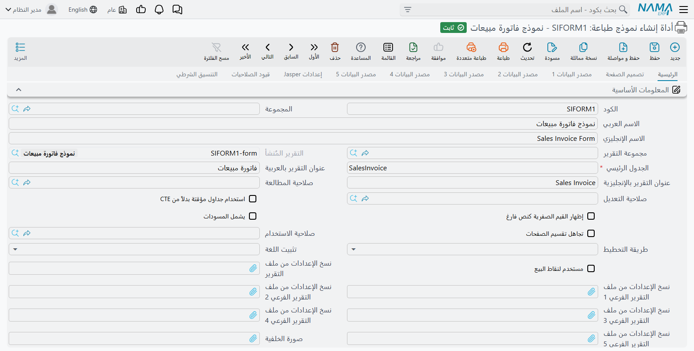
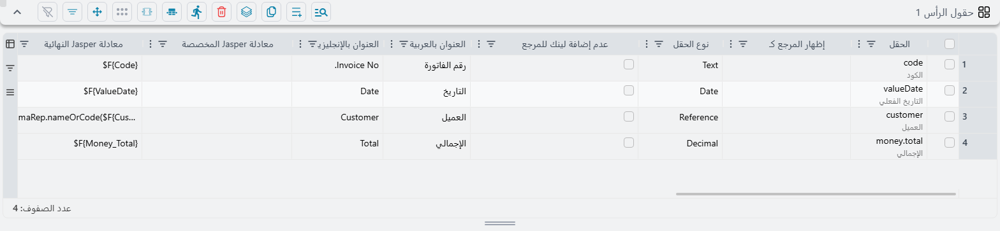
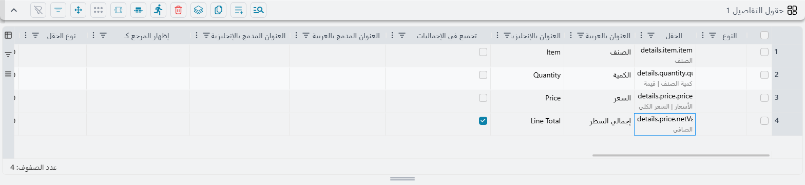
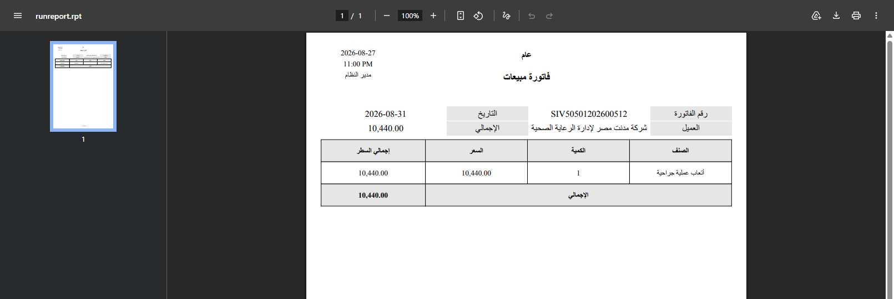
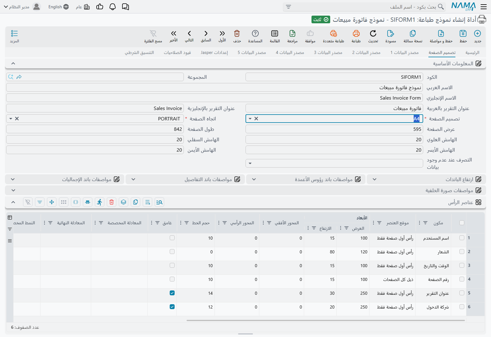

# أداة إنشاء نماذج الطباعة (Printing Form Wizard)

كل منشأة تحتاج في النهاية إلى فاتورتها هي. لا الفاتورة التي يأتي بها النظام جاهزة، بل واحدة تحمل
ترويسة الشركة، وترتيب أعمدتها هي، وإجمالياتها هي، وباللغة التي يقرؤها عملاؤها. وقد جرت العادة أن
يُسلَّم هذا العمل إلى من يُحسن رسم ملف تقرير Jasper، ثم يُنتظر.

وأداة إنشاء نماذج الطباعة هي البديل. تصف الصفحة المطبوعة بوصفها قائمة حقول — هذه الأربعة في الأعلى،
وهذه الأعمدة الأربعة في الوسط، وهذا العمود يُجمع — فيبني لك نما النموذج القابل للطباعة. بلا أداة
تصميم، وبلا ملف تُحمّله، وبلا مبرمج.

::: info أين تجدها
**إدارة النظام ← التقارير ← أداة إنشاء نماذج الطباعة.**
:::

## ماذا تُنتج، ومتى

الأداة ليست النموذج. الأداة هي وصف النموذج، و**الحفظ هو ما يبني النموذج الحقيقي** — تعريف تقرير يحمل
كود الأداة مُذيَّلًا بـ `-form`، وهو ما يُطبع فعلًا.

ويحدث ذلك مع كل عملية حفظ. ليس ثمة زر «توليد» ولا شيء تضغطه بعدها، لأن ليس ثمة ما يُنتظر: فما إن ينتهي
الحفظ حتى يكون النموذج قد أُعيد بناؤه، ومن يضغط «طباعة» بعدها يحصل على النسخة الجديدة.

::: warning فشل البناء يُفشل الحفظ
لأنهما يجريان معًا، فإن النموذج الذي يتعذّر بناؤه يُسقط معه عملية الحفظ. وسيُقال لك إن **الحفظ** فشل
— لا إن **البناء** فشل. فإذا رُفض الحفظ وبدت الحقول كلها سليمة، فاتّهم التصميم لا البيانات.

:::

## بناء نموذج من أوله إلى آخره

يبني الشرح التالي نموذج فاتورة مبيعات عاملًا: كتلة علوية فيها رقم الفاتورة والتاريخ والعميل
والإجمالي، وجدول بسطور الفاتورة تحته إجمالي.

### ١. افتح سجلًا جديدًا

اضغط **جديد**. تصل الشاشة **نصف ممتلئة سلفًا**، وهذا مقصود — A4، وعموديّ، وجدول علوي بعشرة أعمدة،
وارتفاعات وألوان قياسية، وستة سطور موجودة فعلًا في جدول **عناصر الرأس** في التبويب الثاني.

وهذه السطور الستة هي أثاث أعلى الصفحة المطبوعة: المستخدم، والشعار، والتاريخ والوقت، ورقم الصفحة،
وعنوان التقرير، والشركة. اتركها وشأنها ما لم ترد تغيير هذا الأثاث. فكثيرون يضيفونها مرة أخرى بأيديهم
فيخرج كل شيء مكرَّرًا.

### ٢. املأ الأساسيات

في تبويب **الرئيسية**، ضمن **المعلومات الأساسية**:

| الحقل | ماذا تضع فيه |
|---|---|
| **الكود** | كود النموذج. النموذج المولَّد يأخذ هذا الاسم، فاختر ما تعرفه لاحقًا. |
| **الاسم١ / الاسم٢** | الاسم العربي والاسم الإنجليزي. |
| **الجدول الرئيسي** | المستند الذي يطبعه هذا النموذج — فاتورة مبيعات، أو سند قبض، أو إذن تسليم. وهو الحقل الوحيد هنا الذي لا يمكن تركه فارغًا. |
| **عنوان التقرير بالعربي / بالإنجليزي** | العنوان المطبوع أعلى الصفحة. اتركهما فارغين تُطبع الصفحة بلا عنوان. |

::: tip الاسم الإنجليزي يصير اسم الملف
حين يطبع أحدهم هذا النموذج، يُسمّى الملف الذي ينزل على متصفحه باسم **الاسم٢**. فـ«Sales Invoice Form»
ينزل مستندًا مفهومًا، و«SIFORM1» ينزل لغزًا.
:::

### ٣. صِف الكتلة العلوية

جدول **حقول الرأس 1** هو الكتلة المعنونة أعلى الصفحة المطبوعة — والسطر الواحد هنا هو مربّع معنون
هناك. وللفاتورة:

| على الحقل | العنوان الإنجليزي | العنوان العربي |
|---|---|---|
| الكود | Invoice No. | رقم الفاتورة |
| التاريخ الفعلي | Date | التاريخ |
| العميل | Customer | العميل |
| الإجمالي | Total | الإجمالي |

::: warning الجدول لا يزيد من تلقاء نفسه
يُفتح بسطر واحد فارغ، وملء ذلك السطر لا يضيف غيره. وكل سطر إضافي يأتي من **إضافة سطر جديد** في شريط
أدوات الجدول نفسه، أو دفعةً واحدة من زر **اختيار حقول الرأس 1** أسفله. وهذه تُوقع الجميع مرة.
:::

### ٤. اترك المواضع فارغة

في كل سطر أعمدة للموضع والحجم، والإغراء أن تملأها. لا تفعل — لا في نموذجك الأول.

فإذا تُركت فارغة انسابت المربعات وحدها: الرأس عشرة أعمدة، ويأخذ كل حقل عمودين لعنوانه وثلاثة
لقيمته. وخمسة في عشرة تعني **مربّعين معنونين في كل سطر مطبوع**، فتخرج الحقول الأربعة أعلاه كتلةً
منسّقة في صفّين دون أن تضع أنت واحدًا منها.

وحين تريد شكلًا مختلفًا فغيّر الشكل لا الإحداثيات — وسّع الرأس إلى اثني عشر عمودًا، أو ضيّق عرض
العنوان والقيمة الافتراضيين. أمّا وضع المربعات يدويًا فهو للمسة الأخيرة، لا للمسوّدة الأولى.

### ٥. صِف السطور

تحت مجموعة **عنوان الجدول 1** يقع **حقول التفاصيل 1** — جدول سطور المستند. الفكرة نفسها، سطر لكل
عمود مطبوع:

| على الحقل | العنوان الإنجليزي | العنوان العربي |
|---|---|---|
| الصنف | Item | الصنف |
| الكمية | Quantity | الكمية |
| السعر | Price | السعر |
| إجمالي السطر | Line Total | إجمالي السطر |

وأعرض الأعمدة اختيارية هنا أيضًا. فإن تُركت فارغة اقتسمت الأعمدة الصفحة بالتساوي.

وللحصول على سطر الإجمالي أسفل الجدول، علّم **تجميع في الإجماليات** على عمود إجمالي السطر. هذه
العلامة هي الشيء الوحيد الذي يُنتجه.

### ٦. احفظ، ثم اطبع

اضغط **حفظ**، ثم افتح مستندًا حقيقيًا من النوع نفسه واضغط **طباعة**. يخرج النموذج — بلا قائمة اختيار
ولا خيار يُعرض عليك، لأن نما يحدّد نموذجًا واحدًا بعينه لذلك المستند ويشغّله.

::: tip لا شيء تعاينه
ليس على هذه الشاشة إجراء تشغيل أو معاينة. ولرؤية عملك تفتح مستندًا حقيقيًا وتطبعه، أو تُنزّل ملف
النموذج الخام من كتلة الإجراءات. فبناء النموذج والنظر إليه نشاطان مختلفان هنا.
:::

::: warning «لا يوجد نموذج للطباعة»، على مستند صنعتَ له نموذجًا لتوّك
مسألة هل لهذه الشاشة نموذج قابل للطباعة تُحسم مرة واحدة وتبقى محفوظة بقية جلسة المتصفح. فإذا كان
أحدهم قد فتح المستند وضغط «طباعة» **قبل** أن تنشئ النموذج، فسيظل يُقال له إنه لا يوجد ما يُطبع مهما
أعاد المحاولة. وإعادة تحميل الصفحة تحلّها.
:::

## خمسة من كل شيء

النمط الذي استعملته للتوّ يتكرّر خمس مرات. **حقول الرأس 1** إلى **5**، ولكلٍّ منها **عنوان الجدول
N** و**حقول التفاصيل N** و**حقول الترتيب N** تحتها.

وتُطبع متداخلة — الكتلة العلوية الأولى، ثم الجدول الأول، ثم الكتلة الثانية، ثم الجدول الثاني، وهكذا
نزولًا في الصفحة. فإذن التسليم الذي فيه كتلة بيانات العميل، ثم قائمة الأصناف، ثم كتلة توقيع، ثم قائمة
أرقام تسلسلية، هو زوجان من هذه، لا واحد معقّد.

وكل جدول تفاصيل فيه شيء يصير جدولًا مستقلًا في الصفحة المطبوعة، يُجلب على حدة. أمّا الفارغة فلا تكلّف
شيئًا ولا تطبع شيئًا، فلا داعي لتنظيفها.

::: tip الخيارات المضبوطة في الصفحة تخصّ الرأس
الألوان والتظليل المتناوب وإعدادات التنسيق في تبويب تصميم الصفحة تُشكّل الكتلة العلوية. أمّا جداول
التفاصيل فتُبنى جداول قائمة بذاتها وتأخذ مظهرها من أعمدتها هي ومن التنسيقات التي تربطها بها. فإذا
ضبطت خيار تظليل متناوب وخرجت السطور سادة، فهذا هو السبب.
:::

## الترتيب

**حقول الترتيب N** ترتّب سطور الجدول المقابل، ويمكن أن تبقى فارغة — فتخرج السطور عندئذٍ بترتيبها
الطبيعي، وهو في أغلب المستندات ترتيب إدخالها.

فإن أضفت سطرًا فاملأ الحقل الذي يرتّب عليه. فالسطر نصف الممتلئ يمنع الحفظ.

## إعداد الصفحة

التبويب الثاني، **تصميم الصفحة**، هو موضع وصف الورقة المطبوعة نفسها: مقاس الورق واتجاهه، والهوامش،
وارتفاع كل نطاق، وخطوط وألوان عناوين الأعمدة وسطور التفاصيل والملخص.

وشيئان هناك يستحقّان المعرفة. **ماذا تفعل عند عدم وجود بيانات** يقرّر ما يفعله النموذج حين لا يكون في
المستند ما يُطبع — صفحة فارغة، أو لا شيء إطلاقًا. وجدول **عناصر الرأس** هو أثاث السطور الستة من
الخطوة الأولى، وإليه تذهب لإزالة الشعار، أو نقل رقم الصفحة، أو إسقاط اسم الشركة من أعلى الصفحة.

## تحديد متى يُستعمل النموذج

قد يكون لنوع المستند الواحد عدة نماذج — فاتورة كاملة، ونسخة تسليم، وملخّص — ولا بد لشيء أن يقرّر
أيّها يُطبع.

وثلاثة حقول في مجموعة **تفاصيل النموذج** تشارك في هذا القرار:

| الحقل | ماذا يفعل |
|---|---|
| **ترتيب النموذج** | يرتّب هذا النموذج بين نظرائه للمستند نفسه. |
| **صفحة النموذج** | يربط النموذج بتبويب شاشة بعينه، للمستندات التي لشاشاتها أكثر من تبويب. |
| **طباعة كقائمة** | يجعل النموذج يطبع قائمة بالسجلات المختارة بدل مستند واحد. |

أمّا كل ما عدا ذلك ممّا يحدّد **أيّ** نموذج يحصل عليه مستخدم بعينه — قصْره على دفتر مستندات واحد، أو
توجيه واحد، أو مجموعة مستخدمين، أو المستندات المطابقة لمعايير معيّنة — فيُضبط على **تعريف التقرير
المولَّد**، لا هنا. افتح النموذج الذي أنتجته الأداة واضبطه هناك.

وصفحة [كيف يختار نما النموذج الذي يُطبع](/ar/platform/reports/printed-form-selection) تغطّي هذا
القرار كاملًا، وهي ما تُقرأ حين يخرج النموذج الخطأ.

## إنشاء نموذج من الشاشة التي تنظر إليها

كل ما سبق يبني نموذجًا من العدم. وأنت في الغالب لا تحتاج إلى ذلك، لأن النموذج الذي تريده موجود على
الشاشة أصلًا — فقد قرّر أحدهم قبلك أي الحقول يهمّ في تلك الفاتورة، وبأي ترتيب، ومجموعًا كيف، وبأي
أعمدة ظاهرة في الجداول. وهذا الترتيب **هو** التصميم.

ولذلك سيقرؤه نما لك. فمن أي شاشة تحرير أو قائمة، تعرض قائمة **المزيد** إجراء **إنشاء نموذج طباعة من
هذه الشاشة**، فيعود إليك سجل أداة يصف الشاشة التي أمامك. احفظه ليصير لديك نموذج قابل للطباعة.

وهذا أسرع طريق إلى نموذج عامل، وهو في الشاشات التي هُذّبت من قبل **أفضلها** عادةً — إذ تخرج الصفحة
المطبوعة مطابقة لما اعتاد المستخدمون رؤيته.

### اختيار قدر ما تأخذه من الشاشة

للمستندات تبويبات، وليس على النموذج أن يغطّيها كلها. ولذلك تُسأل أولًا في شاشات التحرير، عبر **صفحات
النموذج**:

| الخيار | ماذا تحصل عليه |
|---|---|
| **كل الصفحات في نموذج واحد** | كل التبويبات مطويّة في نموذج واحد. وهو الافتراضي، والجواب الصحيح لأغلب المستندات. |
| **الصفحة الحالية فقط** | التبويب الذي كان مفتوحًا وحده. |
| **الصفحة الرئيسية فقط** | التبويب الأول وحده. |
| **كل صفحة في نموذج منفصل** | نموذج لكل تبويب — عدة نماذج تُنشأ دفعة واحدة. |

والخيار الأخير يستحق المعرفة في المستند الذي تبويباته أوراق مختلفة فعلًا: فاتورة تجارية من التبويب
الرئيسي، وقائمة تعبئة من تبويب الأصناف، وشهادة من تبويب آخر. ويُفتح كل نموذج مكتمل في تبويب متصفح
خاص به، فتذهب مباشرة إلى ما يحتاج تعديلًا.

أمّا شاشة القائمة فلا تسأل شيئًا. تأخذ الأعمدة التي رتّبتها، بالترتيب الذي رتّبتها به، وتبني نموذجًا
يطبع السجلات المختارة قائمةً.

### ما الذي ينتقل، وبماذا يخبرك

لا يُترك القارئ يخمّن ما حدث:

- **الحقول المجمّعة في الشاشة تصير كتلة الرأس.** وتُفكّك الحقول المركّبة إلى أجزائها، وتُتجاهل الأزرار.
- **كل جدول في الشاشة يصير واحدًا من جداول التفاصيل الخمسة**، بترتيب ظهوره، ويحتفظ الجدول بعنوانه.
- **العناوين لا تنتقل إلا حيث غيّرها أحد.** فالحقل الذي ما زال يحمل عنوانه القياسي يُترك فارغًا في
  النموذج، فيأخذ الترجمة المعتادة بأي لغة طُبع النموذج. غيّر اسم عمود في الشاشة يتبعك التغيير، واتركه
  فلا يُثبَّت شيء.
- **وكل ما تعذّر أخذه يُسمّى لك.** فحقول الشاشة التي لا مقابل مطبوع لها، وأعمدة القائمة التي تعرض
  قالبًا لا قيمة بسيطة، وأي جدول بعد الخامس — كلها تعود تنبيهاتٍ تُعدّد ما استُبعد بالضبط، فالنموذج
  الناقص يخبرك بما نقصه.

### تشغيله مرة أخرى

للنموذج المولَّد كود متوقَّع — مبنيّ من الشاشة ونوع المستند الذي تتبعه — ولذلك فإن تشغيل الإجراء مرة
ثانية يُحدّث النموذج نفسه بدل أن يخلّف لك نسخًا مكرّرة.

::: danger إعادة التشغيل تُلغي ما هذّبته بيدك
لأنه يعيد البناء من الشاشة، فإنه يُفرغ أولًا كل جداول الحقول وعناوين الجداول. فتضيع عناوين الأعمدة
وأعراضها وإجمالياتها وترتيبها ممّا أضفته بعد ذلك بيدك. استعمله **لبدء** نموذج، ومتى هذّبت نموذجًا
فواصل تهذيبه في الأداة بدل إعادة توليده.
:::

::: info تحتاج صلاحية إنشاء نماذج الطباعة
لا يظهر مدخل القائمة إلا لمن له حق إنشاء نموذج طباعة. فإذا لم يره أحدهم في شاشة تراه أنت فيها، فهذا
هو السبب.
:::

## اطّلع أيضًا على

- [كيف يختار نما النموذج الذي يُطبع](/ar/platform/reports/printed-form-selection) — قواعد الاختيار،
  وما الذي يمنع طباعة نموذج
- [دليل أداة إنشاء التقارير](/ar/platform/reports/report-wizard-guide) — الأداة الشقيقة، للتقارير لا
  للمستندات المطبوعة
- [تنسيقات التقارير](/ar/platform/reports/report-styles) — خطوط وألوان وحدود قابلة لإعادة الاستعمال
  لحقول الأداتين
