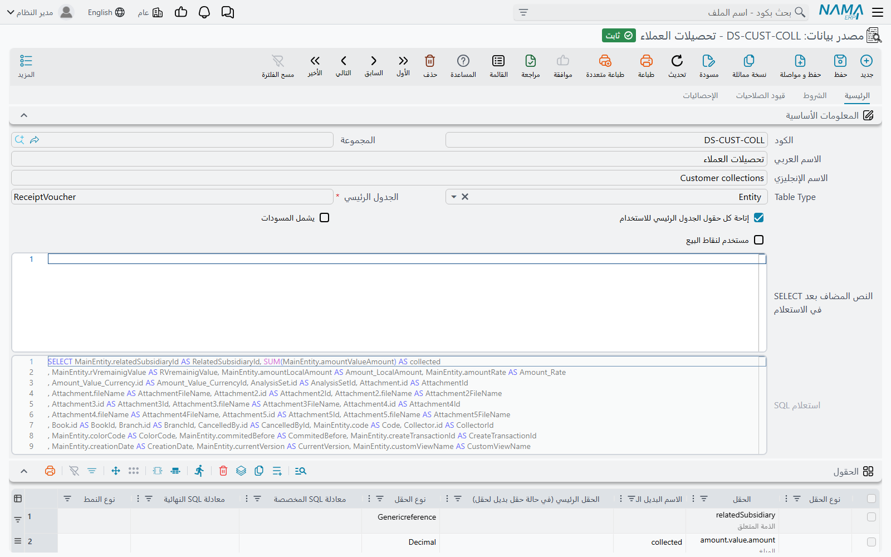
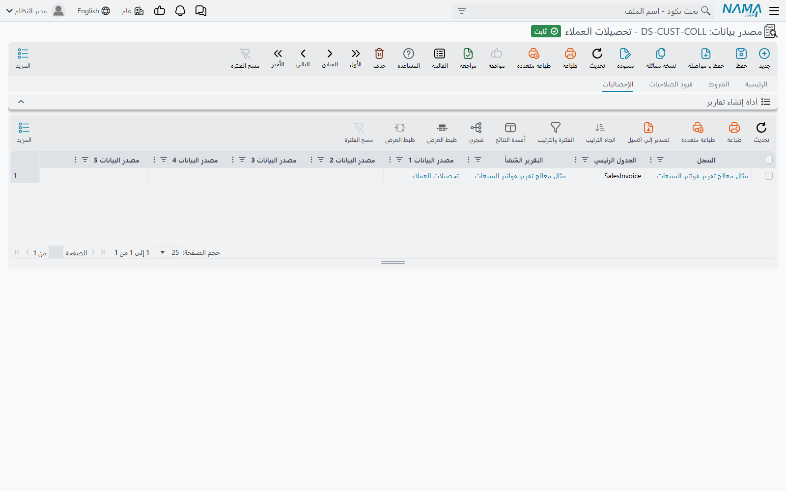

# مصادر البيانات (Data Source)

يحتاج التقرير عاجلًا أو آجلًا إلى رقم لا يتفرّع من جدوله الرئيسي. فكشف حساب العميل يبدأ من الفواتير
لكنه يريد أيضًا تحصيلات كل عميل. وتقرير المخزون يبدأ من الأصناف لكنه يريد أيضًا الكمية الباقية في
أوامر الشراء المفتوحة. ولا تصل إلى هذه الأرقام بتتبّع مسار حقل من الجدول الرئيسي، لأنها تأتي من جدول
آخر له فلاتره ومجاميعه الخاصة.

والحل هو **مصدر بيانات**: استعلام محفوظ يُبنى بالشاشة نفسها والجداول نفسها التي في أداة إنشاء
التقارير، ويستطيع التقرير أن يربطه ويقرأ منه. اعتبره تقريرًا صغيرًا بلا تصميم — يحدّد *أيّ السطور*
و*أيّ الأعمدة*، ويترك العرض للتقرير الذي يستخدمه. تبنيه مرة واحدة، ويربطه بعد ذلك أيّ عدد من
التقارير.

الشاشة في **إدارة النظام ← التقارير ← مصدر بيانات**. ومصدر البيانات لا يُشغَّل وحده أبدًا وليس له
مدخل في قائمة التقارير. وإنما يعمل داخل **أداة إنشاء تقرير** أو **أداة إنشاء نموذج طباعة**، ولكلٍّ
منهما خمس صفحات لمصدر البيانات (**مصدر البيانات 1** … **مصدر البيانات 5**). أما كيف يربط التقرير
مصدر البيانات ويطابقه ويفلتره فمشروح في قسم «الوصول إلى بيانات ليست في الجدول الرئيسي» من
[دليل أداة إنشاء التقارير](/ar/platform/reports/report-wizard-guide). وهذه الصفحة تشرح السجلّ نفسه.

::: info لوحات المعلومات لا تستخدم هذه الشاشة
«مصدر البيانات بالأداة» في عنصر لوحة المعلومات سجلّ مختلف هو **أداة إنشاء عنصر لوحة**، ويشرحه
[دليل وحدة ذكاء الأعمال](/ar/platform/bi/bi-module-guide). أما سجلّ مصدر البيانات فلا يُربط إلا بأداة
إنشاء تقرير أو أداة إنشاء نموذج طباعة.
:::

## بناء مصدر بيانات

مثال عملي: تريد تقرير كشف حساب للعملاء مبنيًا على فواتير المبيعات، وبجانب فواتير كل عميل إجمالي
تحصيلاته.

1. افتح **مصدر بيانات**، واضغط **جديد**، وأعطه كودًا واسمًا. الاسم هو ما يراه صانع التقرير عنوانًا
   للفرع في منتقي الحقول، فاجعله يقول ما يحويه — «تحصيلات العملاء» لا «DS1».
2. اضبط **Table Type** و**الجدول الرئيسي** تمامًا كما تفعل في أداة إنشاء التقارير — وهنا جدول مستند
   التحصيل.
3. في **الحقول** اذكر الأعمدة التي يرجعها مصدر البيانات: العميل والمبلغ. واجعل **نوع التجميع في SQL**
   على المبلغ **Sum**، فيرجع مصدر البيانات سطرًا واحدًا لكل عميل بإجماليه.
4. أضف أيّ فلاتر ثابتة (فرع واحد فقط، دفتر واحد فقط) في **Where Lines** في صفحة **الشروط**.
5. احفظ. يبني مصدر البيانات استعلامه ويعرضه للقراءة فقط في **استعلام SQL**.

ثم اختر هذا السجلّ في التقرير في صفحة **مصدر البيانات 1**، وأضف سطر ربط يزاوج بين حقل العميل في
مصدر البيانات وحقل العميل في التقرير. ومن تلك اللحظة يصبح إجمالي التحصيل متاحًا في منتقي حقول
التقرير بالبادئة `$dataSource1.` متبوعة بمسار الحقل.

## الصفحة الرئيسية

| الحقل | ماذا يفعل |
|---|---|
| **Table Type** / **الجدول الرئيسي** (Main Table) | الجدول الذي يقرأ منه الاستعلام، تمامًا كما في [أداة إنشاء التقارير](/ar/platform/reports/report-wizard-guide#Table-Type). والجدول الرئيسي إلزامي. |
| **إتاحة كل حقول الجدول الرئيسي للاستخدام** | مُعلَّمة افتراضيًا. كل حقول الجدول الرئيسي متاحة للتقارير التي تربط مصدر البيانات هذا، لا الحقول المذكورة في **الحقول** وحدها. أزل العلامة لتقصر التقارير على الحقول المذكورة. |
| **يشمل المسودات** | اتركها بلا علامة فتُستبعد السجلات المسودة من النتيجة. علّمها لتُقرأ المسودات أيضًا. |
| **مستخدم لنقاط البيع** | علّمها فقط لمصدر بيانات مخصّص لتقرير أو نموذج يعمل في نقاط البيع. ويجب أن تطابق إعداد الخيار نفسه في كل أداة تربطه، وإلا تعذّر بناء تقرير تلك الأداة. |
| **النص المضاف بعد SELECT في الاستعلام** | نص يوضع مباشرة بعد `SELECT` في الاستعلام المولَّد، مثل `DISTINCT` أو `TOP 1`. |
| **استعلام SQL** | الاستعلام الذي ينتجه مصدر البيانات، ويُملأ عند الحفظ. للقراءة فقط. انسخه إلى SQL Server Management Studio حين تحتاج أن ترى ما يرجعه مصدر البيانات فعلًا. |

والجداول تحت الرأس تعمل كنظيراتها في أداة إنشاء التقارير، بأزرار **Select Fields** ومحرّرات معادلات
SQL نفسها:

- **الحقول** — الأعمدة التي يرجعها. سطر واحد على الأقل إلزامي، حتى مع تعليم **إتاحة كل حقول الجدول
  الرئيسي للاستخدام**. أعطِ العمود المحسوب **الاسم البديل المخصص**، فبه يختاره صانع التقرير.
- **المدخلات** — قيم يحتاجها مصدر البيانات من الخارج. ليس لمصدر البيانات شاشة تشغيل خاصة به، فلا
  يطرح هذه الأسئلة بنفسه أبدًا، وعلى كل تقرير يربطه أن يجيب عن كل واحد منها. انظر قسم «على التقرير أن
  يجيب عن المدخلات» أدناه.
- **حقول الترتيب** — ترتيب السطور المرجَعة. ومصدر البيانات الذي له حقول ترتيب لا يُربط إلا كاستعلام
  فرعي (انظر الرسائل أدناه).
- **الأسماء البديلة للجداول** — أسماؤك المختصرة للربطات التي يجريها الاستعلام، كما في أداة إنشاء
  التقارير.
- **Union Tables** — جداول إضافية تُقرأ بجانب الجدول الرئيسي بقائمة الحقول نفسها، ويحدّد عمود
  **Union Handling** ما يساهم به كل جدول، كما هو مشروح في قسم «التقرير عن عدّة جداول في وقت واحد» من
  [دليل أداة إنشاء التقارير](/ar/platform/reports/report-wizard-guide).

## صفحة الشروط

**Static Where Condition** و**Static Having Condition** نصّا SQL حرّان يُضافان إلى جزأي `WHERE` و
`HAVING` في الاستعلام، ويُكتبان بصيغة الحقول `@{…}@` المستعملة في كل معادلات الأداة. ويعرض حقل
**Final** تحت كل منهما الشرط بعد تحويل مسارات الحقول إلى أعمدة حقيقية. أما **Where Lines** فهو صورة
الجدول من الفكرة نفسها: حقل ومعامل وقيمة ثابتة أو حقل آخر، دون كتابة SQL. والثلاثة تُطبَّق في كل مرة
يُقرأ فيها مصدر البيانات، أيًّا كان التقرير الذي يقرؤه.

## صفحة قيود الصلاحيات

الجدول نفسه الذي في قيود الصلاحيات بأداة إنشاء التقارير. يقصر السطور على ما يحقّ لمن يشغّل التقرير أن
يراه — سجلاته هو، أو سجلات شركته أو فرعه، أو السجلات التي يملك صلاحية عرضها. وينتقل هذا القيد إلى كل
تقرير يربط مصدر البيانات.

## أيّ التقارير تستخدم مصدر البيانات هذا

تعرض صفحة **الإحصائيات** قائمة **أداة إنشاء تقرير** التي تربط مصدر البيانات هذا في أيٍّ من صفحاتها
الخمس. أما أدوات إنشاء نماذج الطباعة التي تربطه فلا تظهر في هذه القائمة.

راجع هذه القائمة قبل أن تغيّر مصدر بيانات. فالتقرير الذي بنته أداة إنشاء التقارير يحتفظ بالاستعلام الذي
ولّده عند آخر حفظ، فلا يكون لتعديل مصدر البيانات أثر على التقرير حتى تفتح أداة إنشاء ذلك التقرير
وتحفظها من جديد. والتعديل الذي يضيف مدخلًا لا يجيب عنه التقرير يظهر رفضًا عند حفظ تلك الأداة — لا عند
حفظ مصدر البيانات.

## على التقرير أن يجيب عن المدخلات

المدخل في مصدر البيانات قيمة يحتاجها من الخارج — «التحصيلات حتى أي تاريخ؟» — ولا يستطيع تقديمها إلا
التقرير. في صفحة مصدر البيانات في التقرير، أضف سطرًا في **سطور الفلترة لمصدر البيانات** يزاوج بين
**مدخل (مصدر البيانات)** (أي **Generated Parameter Name** للمدخل) وبين **مدخل (التقرير)** — أحد أسئلة
التقرير نفسه — أو **الحقل (التقرير)**. فيجيب القارئ عن سؤال التقرير مرة واحدة، وتصل الإجابة إلى مصدر
البيانات أيضًا.

والتقرير الذي يربط مصدر البيانات ويترك أحد مدخلاته بلا إجابة لا يُحفظ، وتذكر رسالة الرفض المدخلات
المتبقية.

## رسائل قد تظهر لك

تظهر هذه الرسائل عند حفظ **أداة إنشاء تقرير** أو **أداة إنشاء نموذج طباعة** التي تربط مصدر البيانات،
لا عند حفظ مصدر البيانات نفسه. ولأولاها فقط ترجمة عربية، والباقي يظهر بالإنجليزية في الشاشات العربية
أيضًا.

| الرسالة | السبب | ماذا تفعل |
|---|---|---|
| «يجب اختيار الاوبش {0} لأن مصدر البيانات {1} يستخدم حقول ترتيب» | لمصدر البيانات **حقول ترتيب**، وهي لا تعمل إلا حين يُقرأ مرة لكل سطر من سطور التقرير. | علّم **استخدام مصدر البيانات 1 كاستعلام فرعي** (أو رقم الصفحة المقابلة)، أو امسح حقول الترتيب من مصدر البيانات. |
| *There are one or more parameter with ids ({0}) are not handled* | لمصدر البيانات مدخلات لا يجيب عنها أيّ سطر فلترة في صفحته بالتقرير. | أضف سطر فلترة لكل مدخل مذكور. |
| *You should define data source field or data source parameter* | سطر فلترة لا يذكر **الحقل (مصدر البيانات)** ولا **مدخل (مصدر البيانات)**، أو يذكرهما معًا. | املأ واحدًا منهما فقط. |
| *You should define reporting wizard field or reporting wizard parameter* | سطر ربط أو فلترة لا يذكر حقلًا من التقرير ولا مدخلًا منه، أو يذكرهما معًا. | املأ واحدًا منهما فقط. |
| *Could not find parameter with name {0}* | سطر ربط أو فلترة يشير إلى مدخل في التقرير لا يعرّفه جدول **المدخلات** في التقرير. | صحّح الاسم، أو أضف المدخل إلى التقرير. |
| *The field {0} must be selected* | سطر فلترة يقارن حقلًا من مصدر البيانات بـ*حقل* من التقرير، وهذه المقارنة لا تكون إلا حين يُقرأ مصدر البيانات مرة لكل سطر من سطور التقرير. | علّم **استخدام مصدر البيانات 1 كاستعلام فرعي** (أو رقم الصفحة المقابلة)، أو قارن بمدخل من التقرير بدلًا من ذلك. |
| *{0} should be false when {1} is true* | خيارا **استخدام مصدر البيانات كاستعلام فرعي** و**إظهار كل القيم** معلَّمان معًا في الصفحة نفسها، وهما طريقتان متعاكستان لربط مصدر البيانات. | أزل العلامة عن أحدهما. |
| *{0} should be have same size of {1}* | صفحتان من صفحات مصدر البيانات عليهما علامة **إظهار كل القيم**، لكن عدد سطور الربط فيهما مختلف. | اجعل عدد سطور الربط في الصفحتين واحدًا، أو علّم إظهار كل القيم في صفحة واحدة فقط. |
| *When wizard usedInPOS is true, {0} ({1}) must also have usedInPOS=true* | الأداة معلَّم عليها **مستخدم لنقاط البيع** ومصدر البيانات ليس كذلك. | علّم الخيار في مصدر البيانات، أو اربط مصدر بيانات آخر. |
| *When wizard usedInPOS is false, {0} ({1}) must also have usedInPOS=false* | مصدر البيانات معلَّم عليه **مستخدم لنقاط البيع** والأداة ليست كذلك. | أزل العلامة من مصدر البيانات، أو اربط مصدر بيانات لا يخصّ نقاط البيع. |

وتُفحص جداول **الحقول** و**المدخلات** و**Where Lines** في مصدر البيانات بالقواعد نفسها التي تُفحص بها
في أداة إنشاء التقارير، فرسالة الرفض على هذه الجداول هي نفسها هناك.
