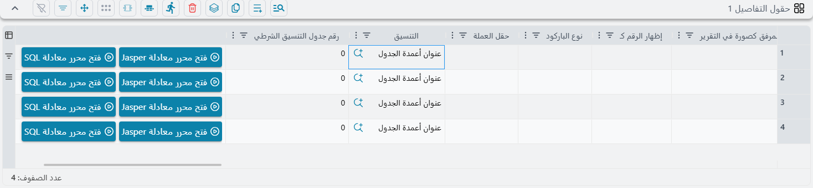
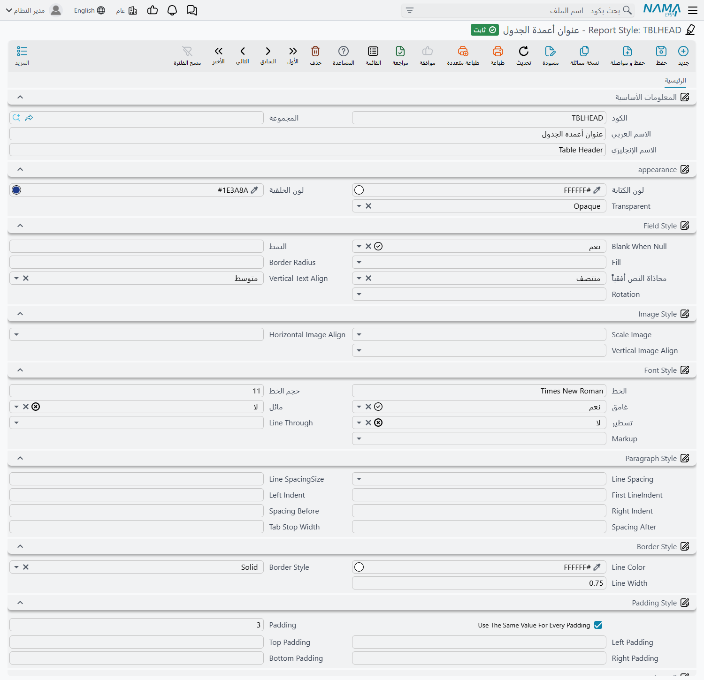

# تنسيقات التقارير (Report Styles)

بناء تقرير أو نموذج طباعة عن طريق الأداة يعني وضع عشرات الحقول، وكل حقل منها يحتاج إلى لون وخط ومحاذاة
وإطار. ضبط ذلك كله على كل حقل على حدة عمل بطيء في المرة الأولى ومُرهِق في المرة الثانية — خاصةً حين يطلب
مدير الحسابات أن يكبر سطر الإجماليات نقطة واحدة في نماذج الفواتير الأحد عشر كلها.

**تنسيق التقرير (Report Style)** يحل هذه المشكلة. هو ملف أساسي صغير يحمل مظهراً كاملاً واحداً — لون الكتابة
ولون الخلفية، اسم الخط وحجمه، الغامق والمائل والتسطير، محاذاة النص والصور، مسافات الفقرة، خط الإطار
والحشو — تحت كود تختاره أنت، `T01` مثلاً. بعد ذلك تشير حقول الأداة إلى هذا الكود بدلاً من تنسيق كل حقل
بمفرده. تُعدِّل التنسيق مرة واحدة فيتغير معه كل حقل يشير إليه.

## أين يعمل التنسيق وأين لا يعمل

هذه أهم نقطة ينبغي معرفتها قبل إنشاء أي تنسيق، لأن الخطأ فيها يضيّع يوم عمل.

تنسيق التقرير يقرأه شيئان اثنان فقط: **أداة إنشاء التقارير (Report Wizard)** و**أداة إنشاء نماذج الطباعة (Printing Form
Wizard)**. هاتان الأداتان تبنيان تصميم التقرير بنفسيهما، حقلاً حقلاً، مما أدخلته في سطورهما — وأثناء ذلك
تقرآن التنسيق المرتبط بكل سطر وتطبّقانه.

أما ما عدا ذلك فيتجاهل السجل تماماً. التقرير الذي صُمِّم تصميمه خارج نما ثم رُفِع في تعريف تقرير يحمل تنسيقه
داخل الملف المرفوع نفسه، والنظام لا يرجع إلى تنسيقات التقارير مطلقاً عند تشغيله. فإذا أنشأت تنسيقاً باسم
`Header Blue` وتوقعت أن تتحول فاتورتك المصممة يدوياً إلى الأزرق فلن يحدث شيء — لا لأن التنسيق خاطئ، بل لأن تلك
الفاتورة لم تُبنَ من أداة أصلاً وليس فيها سطر تربط التنسيق به.

::: warning التنسيق ليس ثيمة عامة
لا توجد شاشة في النظام تقول «طبّق هذا التنسيق على هذا التقرير». الطريق الوحيد الذي يصل به التنسيق إلى الورقة هو
اختياره في سطر من سطور الأداة. فإذا لم تجد عمود «Style» في الشاشة التي تعمل عليها فهذا التقرير لا يستطيع
استخدام التنسيقات أصلاً.
:::

قد يبدو هذا القيد ضيقاً، لكن الخاصية مستخدمة فعلاً حيث تنطبق. في إعدادات العملاء المحفوظة لدى نما تشير
**26 من نحو 150 نموذج طباعة** إلى أنماط تقارير بالكود. والمواقع التي تستخدمها تميل إلى بناء مجموعة صغيرة
تعيد استعمالها في كل مكان — مجموعة `T01` و`T02` و`T03` ومعها نسخ داكنة منها، أو تنسيقان لإيصال نقطة البيع،
أحدهما لحقول الرأس والآخر لحقول التفاصيل.

## كيف يُربَط التنسيق بحقل في الأداة

أنت لا تربط التقرير بالتنسيق، بل تربط التنسيق بكل جزء من أجزاء التقرير. وهناك أربعة مواضع يظهر فيها حقل مرجع
التنسيق، وأيّها تراه يتوقف على الأداة الذي تعمل فيه:

1. **سطور الحقول.** كل سطر حقل في جدول الأداة له **Style** و**Summary Style**. الأول ينسّق الحقل نفسه أينما
   طُبع، والثاني ينسّق ملخّصه — أي الإجمالي أو العدد في نهاية المجموعة أو نهاية التقرير — فتستطيع طباعة سطور
   التفاصيل بخط عادي مقاس 10 وطباعة الإجماليات غامقة على خلفية مظللة دون إنشاء حقلين منفصلين.
2. **سطور حقول رأس نموذج الطباعة.** هذه تطبع عنواناً وقيمة جنباً إلى جنب، فتحمل مرجعين — **Label Style**
   و**Value Style**. والترتيب الشائع هو تنسيق عنوان غامق رمادي وتنسيق قيمة أسود عادي، يُطبَّقان على كل حقول الرأس
   حتى تستقيم الكتلة كلها بصرياً.
3. **مكوّنات الرأس.** الكتل التي تضيفها إلى رأس النموذج — عنوان، شعار، نص حر — لكل منها **Style** واحد.
4. **سطور التنسيقات الشرطية.** هنا تقرن التنسيق بـ **Condition Expression**، فيُطبَّق التنسيق حيث يتحقق الشرط فقط.
   بهذا تُظهر الأرصدة السالبة بالأحمر أو السطور المتأخرة على شريط أصفر: يحتفظ الحقل بتنسيقه المعتاد، ويتجاوزه
   التنسيق الشرطي عند تحقق الشرط. والنصفان مطلوبان معاً في هذا السطر — تنسيق بلا شرط أو شرط بلا تنسيق يُرفض عند
   الحفظ.

الإشارة إلى التنسيق نفسه من عشرين سطراً لا تكلّف شيئاً. يُصدِره النظام مرة واحدة في التصميم المولَّد، وتشير كل
السطور إلى تلك النسخة الواحدة.

## ماذا يحدث إذا تركت التنسيق فارغاً

حقول الأداة صالحة للاستعمال تماماً بلا تنسيق، فهناك تنسيق افتراضي مدمج. الحقل الذي لا تنسيق له يُطبع بمحاذاة
أفقية في الوسط، ومحاذاة رأسية في المنتصف، بخط مقاس 10، أسود على أبيض، **وبلا إطار**.

وهذه النقطة الأخيرة تستحق وقفة، لأنها تُنتج نتيجة قلّما يتوقعها أحد. فالحقل الذي **له** تنسيق، إذا تُرك
Line Width في ذلك التنسيق فارغاً، يعود إلى القيمة **0.5** — أي إطار رفيع. ومعنى ذلك أن ربط تنسيق فارغ تماماً بحقل
ما لا يتركه كما هو، بل يرسم حوله صندوقاً رفيعاً لم يكن موجوداً. فإذا أردت تنسيقاً يضبط الخط فقط ولا تريد ظهور
إطارات، فاضبط Line Width على 0 صراحةً.

والجداول التي تستخدم التنسيقات الشرطية تصل إلى النتيجة نفسها من مدخل مختلف: تأخذ مظهراً أساسياً مبنياً من
إعدادات شريط التفاصيل في الأداة نفسه — ألوان الشريط، وخط Times New Roman بمقاس 10 أو بمقاس الشريط، وإطار
0.5 — ثم تتجاوزه أنماطك الشرطية حيثما تحقّقت.

## إنشاء تنسيق

تنسيقات التقارير موجودة في **إدارة النظام ← التقارير ← Report Styles**. الشاشة صفحة واحدة: بيانات الملف
الأساسي في الأعلى — الكود والمجموعة والاسم العربي والاسم الإنجليزي — ثم مجموعات التنسيق، ثم المحددات. و**الكود**
هو الأهم في الاستعمال اليومي، لأنه ما تراه وتختاره في بحث Style داخل الأداة. فأعطِ التنسيقات أكواداً تصف
وظيفتها (`Header`، `Totals`، `T02-Dark`) بدلاً من أرقام متسلسلة.

لا شيء في هذه الشاشة يخضع لتحقق سوى تفرّد الكود. والألوان تُكتب بصيغة سداسية عشرية على هيئة `#RRGGBB` —
مثل `#1E3A8A` و`#FFFFFF`. أما اللون المكتوب خطأً أو الخط غير المثبَّت على الخادم فيُقبل بهدوء عند الحفظ ولا
يظهر أثره إلا عند تشغيل تقرير يستخدم التنسيق.

::: info الواجهة العربية
معظم مسميات هذه الشاشة لم تُترجم بعد وتظهر بالإنجليزية حتى وإن كان بقية النظام بالعربية — بما في ذلك اسم
الشاشة نفسه في القائمة، فهو يظهر **Report Styles**. لذلك يذكر المرجع التالي المسمى الإنجليزي لكل حقل.
:::

### appearance

| الحقل | ما يفعله | القيم / الافتراضي |
|---|---|---|
| Foreground Color | لون الكتابة | `#RRGGBB` — الافتراضي أسود |
| Background Color | لون الخلفية خلف النص | `#RRGGBB` — الافتراضي أبيض |
| Transparent | هل تُرسم الخلفية أصلاً أم لا | Opaque، Transparent — الافتراضي Opaque |

اختيار Transparent يجعل ما خلف الحقل — لون شريط أو إطار — يظهر من ورائه، وهو المطلوب عادةً لعنوان يجلس فوق
شريط رأس ملوّن.

### Field Style

| الحقل | ما يفعله | القيم / الافتراضي |
|---|---|---|
| Blank When Null | لا يطبع شيئاً إذا كانت القيمة فارغة | Default، TRUE، FALSE — الافتراضي TRUE |
| Pattern | تنسيق تنسيق الأرقام والتواريخ، مثل `#,##0.00` أو `dd/MM/yyyy` | نص حر |
| Fill | كيفية ملء مساحة الخلفية | Default، Solid |
| Border Radius | يجعل زوايا صندوق الحقل مستديرة | رقم |
| Horizontal Text Align | موضع النص عرضياً داخل الصندوق | Left، Center، Right، Justified — الافتراضي Center |
| Vertical Text Align | موضع النص رأسياً داخل الصندوق | Top، Middle، Bottom، Justified — الافتراضي Middle |
| Rotation | يدير النص داخل صندوقه — مفيد لعناوين الأعمدة الضيقة | None، Left، Right، UpsideDown |

### Image Style

هذه الثلاثة تنطبق حين يطبع سطر الأداة صورة لا نصاً — شعاراً أو صورة صنف أو توقيعاً.

| الحقل | ما يفعله | القيم |
|---|---|---|
| Scale Image | كيف تُلائَم الصورة المساحة المخصصة لها | Default، Clip، FillFrame، RetainShape، RealHeight، RealSize |
| Horizontal Image Align | موضع الصورة عرضياً داخل الصندوق | Left، Center، Right |
| Vertical Image Align | موضع الصورة رأسياً داخل الصندوق | Top، Middle، Bottom |

`RetainShape` هو الخيار الآمن للشعارات، فهو يُلائم الصورة داخل الصندوق دون تشويه نسبها. و`FillFrame` يمطّها
لتملأ الصندوق تماماً، و`Clip` يقصّ ما لا يتّسع.

### Font Style

| الحقل | ما يفعله | القيم / الافتراضي |
|---|---|---|
| Font | اسم عائلة الخط كما هي مثبَّتة على الخادم تماماً | نص حر — الافتراضي Times New Roman |
| Font Size | الحجم بالنقاط | رقم — الافتراضي 10 |
| Toggle Bold | تشغيل الغامق أو إيقافه | Default، TRUE، FALSE |
| Toggle Italic | تشغيل المائل أو إيقافه | Default، TRUE، FALSE |
| Toggle Underline | تشغيل التسطير أو إيقافه | Default، TRUE، FALSE |
| Line Through | تشغيل الشطب أو إيقافه | Default، TRUE، FALSE |
| MarkUp | كيف يُفسَّر محتوى نص الحقل | None، styled، html، rtl |

ترك أحد المفاتيح الأربعة على **Default** ليس كضبطه على FALSE. فـ Default معناها «الوراثة»، أي أن الحقل يبقى
على ما يعطيه إياه التصميم المحيط به، بينما FALSE تُطفئ الخاصية فعلياً.

اسم الخط نص عادي، ويُبحث عنه في **الخادم** لا في جهاز المستخدم. فالخط الذي يظهر جميلاً في متصفحك لن يظهر في
المخرجات المطبوعة ما لم يكن مثبَّتاً على خادم التطبيق، فالأولى الالتزام بالخطوط التي تستعملها تقاريرك بالفعل.

### Paragraph Style

هذه تتحكم في شكل كتلة النص داخل الحقل، ولا يظهر أثرها إلا في الحقول الطويلة بما يكفي لالتفاف السطور —
الملاحظات والعناوين والشروط والأحكام.

| الحقل | ما يفعله |
|---|---|
| First LineIndent | إزاحة السطر الأول من الفقرة |
| Left Indent | إزاحة كل السطور من جهة اليسار |
| Right Indent | إزاحة كل السطور من جهة اليمين |
| Spacing Before | مسافة فارغة فوق الفقرة |
| Spacing After | مسافة فارغة تحت الفقرة |
| Tab Stop Width | عرض علامة الجدولة |

### Border Style

| الحقل | ما يفعله | القيم / الافتراضي |
|---|---|---|
| Line Color | لون الإطار | `#RRGGBB` — الافتراضي أسود |
| Border Style | نوع الخط المرسوم | Solid، Dashed، Dotted، Double |
| Line Width | سُمك الخط؛ اضبطه على 0 لإلغاء الإطار | رقم — الافتراضي 0.5 |

### Padding Style

الحشو هو المسافة المتنفَّسة بين الإطار والنص. وبدونه يلتصق النص بحواف الصندوق وتبدو الجداول المطبوعة مزدحمة.

| الحقل | ما يفعله |
|---|---|
| Use The Same Value For Every Padding | يبدّل بين قيمة واحدة مشتركة وأربع قيم منفصلة |
| Padding | القيمة الواحدة المطبَّقة على الجهات الأربع |
| Left Padding و Top Padding و Right Padding و Bottom Padding | القيم الأربع المنفصلة |

الحقول الستة معروضة معاً، لكن النظام لا يستعمل إلا نصفها. فإذا أشّرت على **Use The Same Value For Every
Padding** قرأ **Padding** وحده وتجاهل الحقول الأربعة المنفصلة — فتأكد أن Padding يحمل قيمة فعلاً قبل أن تؤشّر
عليه. وإذا تركت المربع بلا تأشير قرأ الحقول الأربعة المنفصلة وتجاهل Padding.

## مجموعة عملية

معظم المواقع لا تحتاج تنسيقات كثيرة. ومجموعة بداية صالحة لنموذج طباعة تتكون من أربعة سجلات:

- **`Label`** — نصف العنوان في كل حقل رأس. غامق، بلا إطار، بحشو صغير.
- **`Value`** — نصف القيمة. بوزن عادي، بلا إطار، وبالحشو نفسه حتى تستقر العناوين والقيم على خط أساس واحد.
- **`TableHeader`** — عناوين أعمدة جدول التفاصيل. غامق، كتابة بيضاء على خلفية داكنة (اترك Transparent على
  Opaque حتى تُطبع الخلفية فعلاً)، في الوسط، بإطار Solid بسُمك 0.5.
- **`Total`** — يُربط بوصفه **Summary Style** على أعمدة المبالغ. غامق، وأكبر من سطور التفاصيل بنقطة أو نقطتين.

ابنِ هذه الأربعة، واربطها بنموذج واحد، واطبعه، ثم عدّل سجلات التنسيقات بدلاً من تعديل النموذج. وهذا هو مغزى
الخاصية كلها: النموذج التالي الذي تبنيه يعيد استخدام الأكواد الأربعة نفسها فيخرج بالمظهر ذاته دون أي عمل
تنسيق إضافي.

ولمعرفة كيفية إعداد سطور الأداة نفسها راجع
[دليل أداة إنشاء التقارير](/ar/platform/reports/report-wizard-guide). أما [أداة إنشاء نماذج الطباعة](/ar/platform/reports/printing-form-wizard-guide)، وهي أكثر المواضع
استخدامًا لتنسيقات التقارير، فلها صفحتها.