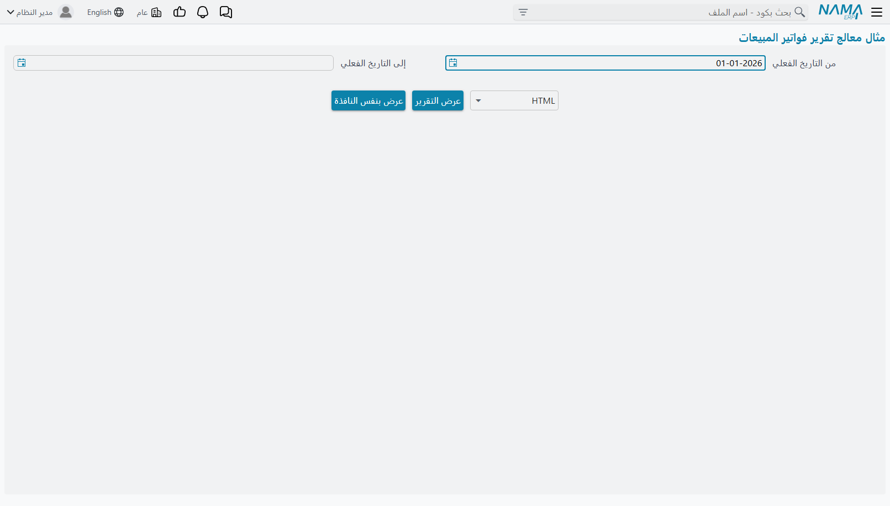
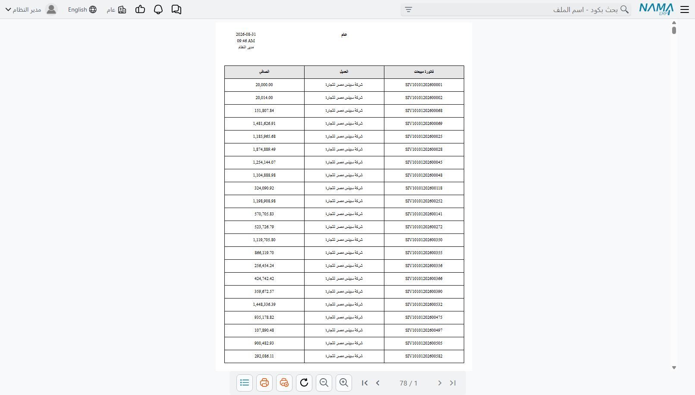

# دليل أداة إنشاء التقارير (Report Wizard)

يوفّر نظام Nama ERP وسيلة سهلة وفعالة لإنشاء تقارير احترافية بسرعة عبر أداة "إنشاء التقارير" (Report Wizard).

تمكنك هذه الأداة من إنشاء التقارير عن طريق اختيار الجدول الرئيسي، ثم تحديد الحقول المطلوبة وإضافة الفلاتر بطريقة بسيطة وسريعة، كما سيتم شرحه بالتفصيل من خلال الأمثلة.

::: info أين تجدها
**إدارة النظام ← التقارير ← أداة إنشاء التقارير.**
:::

تتشارك أداة إنشاء التقارير أكثر شاشتها مع [أداة إنشاء نماذج الطباعة](/ar/platform/reports/printing-form-wizard-guide). فمصادر البيانات وقائمة الحقول وإعداد الصفحة والتنسيقات والتنسيق الشرطي تعمل في الأداتين على نحو واحد — وصفحة [أداتا إنشاء التقارير ونماذج الطباعة](/ar/platform/reports/report-and-form-wizards) تغطّي هذا النصف المشترك، وما يلي هنا هو ما يخصّ التقارير وحدها.

## إنشاء تقرير بسيط لعرض فواتير المبيعات

لإنشاء تقرير يعرض بيانات فواتير المبيعات مثل كود الفاتورة، اسم العميل، تاريخ الفاتورة، وصافي قيمة الفاتورة، اتبع الخطوات التالية:

1. قم بإنشاء تقرير جديد باستخدام أداة إنشاء التقارير، وحدد له كود واسم مناسب.
2. في حقل **الجدول الرئيسي**، اختر `فاتورة مبيعات` من شاشة البحث.
3. في جدول **الحقول**، أضف السطور التالية:

  * `this` لعرض كود السند مع رابط لفتح تفاصيل الفاتورة.
  * `customer` لعرض اسم العميل مع رابط لفتح تفاصيل العميل.
  * `money.netValue` لعرض صافي قيمة الفاتورة.
4. في جدول **المدخلات**، أضف سطرًا واحدًا يحتوي على الحقل `valueDate` لتحديد الفترة الزمنية.

::: tip

* يمكنك استخدام زر **Select Fields** لعرض واجهة اختيار الحقول بطريقة مرئية دون الحاجة لكتابة أسمائها يدويًا.
* عند كتابة جزء من اسم الحقل (بالعربية أو بالإنجليزية)، يمكنك الضغط على السهم للأسفل لعرض الحقول المقترحة.
:::

::: details JSON for direct import

```json
{
  "mainTable": "SalesInvoice",
  "fields": [
    { "fieldId": "this" },
    { "fieldId": "customer" },
    { "fieldId": "money.netValue" }
  ],
  "parameters": [
    {
      "fieldId": "valueDate",
      "filterType": "Between"
    }
  ]
}
```
:::

بعد الحفظ، اضغط على زر **عرض التقرير**، ستظهر لك شاشة شبيهة بالتالي:



اختر فترة زمنية مناسبة (من تاريخ - إلى تاريخ) واضغط على زر **عرض التقرير**، سيظهر التقرير بالشكل التالي:



كما تلاحظ، تم إنشاء تقرير بفلاتر زمنية وأعمدة منظمة بشكل احترافي، مع ظهور شعار الشركة، تاريخ ووقت التشغيل، واسم المستخدم تلقائيًا.

## شرح تفصيلي لحقول وجداول أداة إنشاء التقارير

في هذا القسم نستعرض شرحًا دقيقًا لكل الحقول المستخدمة في أداة إنشاء التقارير، مع توضيح وظيفة كل حقل وكيفية تأثيره على التقرير الناتج.

### `Report Group`

عند حفظ ملف أداة إنشاء التقرير، يتم تلقائيًا إنشاء ملف تقرير جديد في النظام.
يمكنك استخدام هذا الحقل لتحديد المجموعة التي سيتم تصنيف التقرير ضمنها، مما يساعد في تنظيم التقارير بحسب الأقسام أو الوظائف.

---

### `Table Type`

يساعدك هذا الحقل على تسهيل اختيار الجدول الرئيسي (`Main Table`) للتقرير من خلال تصنيف الجداول المتاحة. يحتوي على القيم التالية:

* **`Entity`**
  يتيح لك اختيار أي نوع كيان موجود في النظام، مثل:

  * فاتورة مبيعات `SalesInvoice`
  * سند صرف `PaymentVoucher`
  * العميل `Customer`
  * المورد `Supplier`
  * الموظف `Employee`
  * الحسابات `Account`
    وغيرها من الكيانات الرئيسية في النظام.

* **`Detail Line`**
  يتيح لك اختيار أحد جداول السطور المرتبطة بالكيانات، مثل:

  * `SalesInvoiceLine`: تفاصيل سطور فاتورة المبيعات
  * `CustomerContactInfo`: جهات الاتصال بملف العميل

* **`System Table`**
  يتيح لك اختيار جداول نظامية داخلية مثل:

  * `ItemDimensionsQty`: يعرض كميات الأصناف في المخازن المختلفة
  * `FAPropertiesEntry`: يعرض خصائص الأصول الثابتة

* **`Virtual Entity` (الكيان الافتراضي)**
  يتيح لك اختيار أحد الكيانات الافتراضية التي عرّفها المستخدم بنفسه عبر استعلام SQL مخصص (مثل اتحاد جدولين بـ `UNION` أو ضم عدة جداول مع تعبيرات حسابية). تظهر هذه الكيانات في قائمة الجدول الرئيسي تماماً مثل الكيانات الحقيقية، مع نفس آلية اختيار الحقول والترجمات والمراجع التلقائية للكيانات (Reference Fields).

  لتعريف كيان افتراضي جديد أو فهم كيفية إعداد خرائط الأعمدة وآلية الاستنباط (Bootstrap)، راجع [دليل الكيانات الافتراضية](/ar/platform/virtual-entity-guide).

---

### `عنوان التقرير بالعربية` و `عنوان التقرير بالإنجليزية`

تُستخدم هذه الحقول لتحديد عنوان التقرير الظاهر في أعلى التقرير النهائي، وتظهر القيمة وفقًا للغة المستخدم.
إذا كانت واجهة المستخدم بالعربية، سيظهر العنوان العربي، وإذا كانت بالإنجليزية، فسيظهر العنوان الإنجليزي.

---

### `Layout Method`

يحدد هذا الحقل الطريقة التي سيتم بها وضع الحقول والمدخلات داخل التقرير الناتج. يحتوي على الخيارات التالية:

* **`يدوي (Manual)`**
  تتيح لك تحديد الخصائص يدوياً لكل حقل ومدخل مثل الموضع والعرض والارتفاع من خلال الجداول داخل ملف إنشاء التقرير.

* **`From Uploaded File`**
  تسمح برفع ملف Jasper مسبق الصنع (امتداد `.jrxml`) واستخدام خصائص الحقول والمواضع الموجودة به داخل التقرير.

* **`From Editor`**
  تتيح لك استخدام محرر بصري لتنسيق الحقول وتحديد مواقعها داخل التقرير. يمكن فتح المحرر من خلال زر `Open Editor`.

---

## المدخلات — الأسئلة التي يطرحها التقرير قبل أن يعمل

التقرير يغطّي مجموعة من السجلات، ولذلك فأول ما يفعله هو أن يسأل قارئه: أي مجموعة تريد؟ كل سؤال يظهر
في شاشة التشغيل هو سطر واحد في جدول **المدخلات**، والأسئلة تُطرح بنفس ترتيب السطور.

وهناك ثلاث طرق لوصف المدخل، والطريقة التي تختارها تتوقف على مكان القيمة التي سيحدّها المدخل.

**وجّهه إلى حقل.** اكتب مسار الحقل في عمود **الحقل** — `valueDate` أو `customer` أو
`money.netValue`. تستنتج الأداة نوع البيانات وحدها، وتبني عنصر الإدخال المناسب له (منتقي تاريخ، أو
مرجع للعميل، أو خانة رقمية)، وتضيف الشرط المقابل إلى استعلام التقرير. وهذه هي الحالة الغالبة.

**وجّهه إلى عمود أضفته بالفعل.** اترك عمود **الحقل** فارغًا، واكتب في **User Alias (In Case SQL
Expression)** الاسم البديل لأحد سطور جدول **الحقول**. عندها يحدّ المدخل ذلك العمود — بما في ذلك عمود
حسبته بنفسك.

**امنحه معادلته الخاصة.** املأ **معادلة SQL المخصصة** في سطر المدخل، فيحدّ المدخل نتيجة المعادلة بدل
عمود مخزّن. واستخدم عمود **النوع** لتخبر الأداة بنوع القيمة، إذ لا يوجد حقل تستنتجه منه.

::: tip زر Select Parameters Fields
يفتح زر **Select Parameters Fields** واجهة اختيار الحقول المرئية نفسها التي يستخدمها جدول **الحقول**،
فنادرًا ما تحتاج إلى كتابة مسار حقل يدويًا.
:::

### نوع الفلتر يحدّد شكل السؤال لا الشرط فقط

يحدّد **نوع الفلتر** طريقة مقارنة إجابة القارئ بالبيانات — «يساوي» و«لا يساوي» و«أكبر من» و«أقل من»
و«يحتوي علي» و«في» و«يقع ما بين قيمتين» وغيرها. وإن تركته فارغًا اختارت الأداة نوعًا يناسب نوع الحقل.
وهو يحدّد كذلك ما يراه القارئ على الشاشة:

- «في» و«ليس في» تحوّلان الخانة الواحدة إلى قائمة اختيار متعدّد، ويتحكّم عندها **نوع عرض القائمة** في
  طريقة عرض هذه القائمة.
- «يحتوي علي» و«لا يحتوي على» و«يبدأ بـ» و«ينتهي بـ» تعطي خانة نص حر وتطابق جزءًا من القيمة.
- الأنواع التي تحمل «باعتبار ال null» — مثل «يساوي (باعتبار ال null)» و«أكبر من (باعتبار ال null)» —
  تبقي السجلات التي قيمتها فارغة بدل استبعادها، وهو فارق مهم في الحقول الاختيارية.
- «به قيمة أم لا» لا تطلب قيمة أصلًا، بل تعرض اختيارًا ثلاثيًا: السجلات التي بها قيمة فقط، أو التي
  بلا قيمة فقط، أو كل السجلات — وتبدأ عند *كل السجلات*، أي أن التقرير غير محدود حتى يقرّر القارئ غير
  ذلك. أما «به قيمة أم لا - للإجمالي» فتجري الاختبار نفسه على إجمالي العمود بدل قيمة كل سطر.
- أما «يقع ما بين قيمتين» فيختلف بما يكفي ليستحق فقرة خاصة.

### «يقع ما بين قيمتين» يطرح سؤالين لا سؤالًا واحدًا

إذا جعلت **نوع الفلتر** «يقع ما بين قيمتين» فلن تنشئ الأداة مدخلًا واحدًا بل مدخلين: «من» و«إلى».
وتبني عنوانيهما من **العنوان بالعربية** و**العنوان بالإنجليزية** مسبوقين بـ«من» و«إلى» (`From` و`To`
في الواجهة الإنجليزية)، فيصير السطر الواحد في الجدول خانتين في شاشة التشغيل.

وكل ما يأتي في سطر المدخل مزدوجًا إنما جاء من أجل هذا:

- **القيمة الافتراضية** تملأ خانة «من»، و**القيمة الافتراضية (تعمل مع Between)** تملأ خانة «إلى».
  والتوأمان المرتبطان بالنوع يعملان بالطريقة نفسها — **القيمة الافتراضية لحقل التاريخ** وتوأمها، وكذلك
  التاريخ والوقت والوقت وحقل المرجع.
- **Generated Parameter Name** ينتهي به الأمر حاملًا الاسمين معًا مفصولين بفاصلة — ففي مدخل «يقع ما
  بين قيمتين» على تاريخ القيمة يقرأ `FromvalueDate,TovalueDate`. هذه الفاصلة ليست خطأً، بل هي الطريقة
  التي تشير بها بقية الأداة إلى نصفي المدخل.
- علّم **عرض كنطاق تاريخ** في مدخل «يقع ما بين قيمتين» على حقل تاريخ، فتحلّ محل الخانتين المنفصلتين
  أداة واحدة لاختيار المدى من تاريخ إلى تاريخ.

::: info Generated Parameter Name تكتبه الأداة عنك
أنت لا تملأ عمود **Generated Parameter Name** بنفسك؛ تكتبه الأداة عند الحفظ من مسار الحقل (أو من
الاسم البديل) ومن نوع الفلتر: فمدخل على `customer` بفلتر «يساوي» يصير `customer_Equals`. وكلما احتاج
موضع آخر في الشاشة إلى الإشارة إلى مدخل باسمه، احفظ أولًا واقرأ الاسم من هذا العمود بدل تخمينه.
:::

### القيم الافتراضية، ومنها ما يتحرّك مع الزمن

يحمل سطر المدخل عمود قيمة افتراضية لكل نوع قيمة: **القيمة الافتراضية** للنص، و**القيمة الافتراضية
لحقل المرجع** للمرجع، و**القيمة الافتراضية لحقل التاريخ**، وقيمة التاريخ والوقت، وقيمة الوقت — ولكل
منها توأمه «(تعمل مع Between)». املأ العمود الذي يناسب نوع مدخلك، وعند الحفظ تدمج الأداة ما ملأته في
**القيمة الافتراضية**.

كما تفهم **القيمة الافتراضية** مجموعة من الرموز المتحرّكة، تُحسب لحظة فتح شاشة التشغيل لا لحظة بناء
التقرير، فيظلّ تقرير كُتب في يناير يفتح على الفترة الصحيحة في ديسمبر.

| الرمز | ما يتحوّل إليه |
|---|---|
| `$today()` و `$now()` | تاريخ اليوم / اللحظة الحالية |
| `$monthStart()` و `$monthEnd()` | أول وآخر يوم في الشهر الحالي |
| `$previousMonthStart()` و `$previousMonthEnd()` | الشهر السابق |
| `$nextMonthStart()` و `$nextMonthEnd()` | الشهر التالي |
| `$yearStart()` و `$yearEnd()` | أول وآخر يوم في السنة الحالية |
| `$previousYearStart()` و `$previousYearEnd()` و `$nextYearStart()` و `$nextYearEnd()` | السنة السابقة / التالية |
| `$quarterStart()` و `$quarterEnd()` | الربع الحالي |
| `$halveStart()` و `$halveEnd()` و `$thirdStart()` و `$thirdEnd()` | نصف السنة الحالي / ثلث السنة الحالي |
| `$todayPlusDays(7)` و `$todayMinusDays(7)` | عدد من الأيام بعد اليوم أو قبله |
| `$todayPlusWeeks(2)` و `$todayMinusWeeks(2)` | المثل بالأسابيع |
| `$todayPlusMonths(3)` و `$todayMinusMonths(3)` | المثل بالشهور |
| `$todayPlusYears(1)` و `$todayMinusYears(1)` | المثل بالسنوات |

وأكثر ما يفضّله القرّاء هو الجمع بين `$monthStart()` في **القيمة الافتراضية** و`$today()` في **القيمة
الافتراضية (تعمل مع Between)**، فيفتح التقرير على الشهر حتى تاريخه في كل مرة يُشغَّل فيها.

### إلزام القارئ بالإجابة

**إجبارى** يمنع تشغيل التقرير حتى يُملأ هذا المدخل. أما **Required Group** فهو الصيغة الأليَن: اكتب
النص نفسه في **Required Group** لعدّة مدخلات، فيصير على القارئ أن يملأ *واحدًا منها على الأقل* — وهو
مفيد حين يكون التقرير أثقل من أن يعمل بلا حدود، ولكن هناك ثلاث أو أربع طرق معقولة لحصره.

### بقية أعمدة سطر المدخل

- **إظهار بداخل التقرير** يطبع القيمة التي اختارها القارئ داخل التقرير نفسه، فتقول النسخة المطبوعة أي
  فترة وأي فرع تغطّي.
- **القيم المسموح بها** يحوّل المدخل إلى قائمة اختيارات ثابتة تُكتب مفصولة بفواصل. ويعطي **Arabic
  Allowed Values** و**English Allowed Values** لتلك الاختيارات عناوين مقروءة بكل لغة — بالعدد نفسه
  والترتيب نفسه.
- **نوع المرجع** يجعل المدخل بحثًا في نوع السجل الذي تختاره، ويحدّ **Filter** ما يعرضه هذا البحث.
  وكتابة `@sysfilter@` داخل **Filter** تنوب عن الفلتر الذي كانت الأداة ستطبّقه وحدها، فتضيف إليه بدل
  أن تستبدله.
- **Source Parameter** يغذّي مدخلًا من مدخل آخر: سمِّ فيه مدخلًا، فيتوقّف هذا المدخل عن سؤال القارئ
  ويأخذ قيمة الآخر. وإن كان المصدر من نوع «يقع ما بين قيمتين» فاكتب الاسمين المفصولين بفاصلة. ثم
  يلتقط **Source Property** خاصية واحدة من تلك القيمة بدل السجل كله.
- **طريقة العرض**، مع **Parameters Position** و**عدد المدخلات في الصف** في المجموعة أعلى الجدول، تنظّم
  ترتيب الخانات في شاشة التشغيل.

## المدخلات المخصصة — سؤال لا يجيب عنه الاستعلام

قد يحتاج التقرير أحيانًا إلى سؤال القارئ عن شيء ليس فلترًا على حقل أصلًا: حدٌّ يقارن به، أو معامل
يضرب فيه، أو مفتاح يقرأه عمود محسوب. ولهذا وُجد **نوع المدخل = مخصص**.

المدخل المخصص سؤال ولا شيء غير ذلك. تضع الأداة خانته في شاشة التشغيل، وتحترم **إجبارى** و**القيم
المسموح بها** و**نوع المرجع** و**Filter** وأعمدة القيمة الافتراضية تمامًا كما تفعل مع أي مدخل عادي —
ثم **لا تضيف أي شرط إطلاقًا** إلى استعلام التقرير. فلا شيء يحدث حتى تستعمل أنت القيمة في موضع ما.

وبناء واحد منها يتم في ثلاث خطوات:

1. أضف سطرًا إلى **المدخلات**، واترك عمود **الحقل** فارغًا، واجعل **نوع المدخل** «مخصص»، وامنح السطر
   اسمًا في **User Alias (In Case SQL Expression)** — فهذا الاسم هو ما سيُشتقّ منه اسم المدخل. ثم
   اضبط **النوع** على نوع القيمة التي تريدها (نص، رقم، تاريخ، وهكذا)، واكتب له عنوانًا عربيًا
   وإنجليزيًا.
2. احفظ، ثم أعد فتح السجل، واقرأ عمود **Generated Parameter Name**. هذا هو الاسم الذي ستستعمله في
   الخطوة التالية — وتذكّر أنه اسمان مفصولان بفاصلة إن اخترت «يقع ما بين قيمتين».
3. استعمله. وهناك موضعان يقبلان اسم مدخل:
   - **سطر شرط.** في صفحة **الشروط (Conditions)** أضف سطرًا إلى **Where Lines**، وضع الحقل الذي تريد
     اختباره في **LHS Field Id**، واختر **Operator**، واكتب اسم المدخل المولَّد في **Special Value**.
     صار التقرير الآن محدودًا بإجابة القارئ.
   - **معادلة.** اكتب `$P{اسم_المدخل_المولَّد}` داخل **معادلة SQL المخصصة** أو **Static Where
     Condition** أو **Static Having Condition**، فتدخل إجابة القارئ مباشرة في الحساب.

::: warning الاسم يجب أن يطابق
تُطابَق قيمة **Special Value** مع المدخلات التي بنتها الأداة بالفعل. فإن لم تطابق أيًّا منها لم يُسأل
القارئ عن شيء، وقارن الشرط بقيمة فارغة — فانسخ الاسم من **Generated Parameter Name** بدل كتابة ما
تظنّه صحيحًا.
:::

## أعمدة تحسبها بنفسك

ليس كل عمود موجودًا كحقل مخزّن. فهامش الربح، والفرق بين كميتين، ونصّ مركّب من ثلاثة حقول — كل هذا
تكتبه أنت، وللأداة موضع أصيل له: **سطر في جدول الحقول يُترك فيه عمود «الحقل» فارغًا.**

ولا يُقبل هذا السطر إلا إذا حمل شيئًا تستطيع الأداة أن تحوّله إلى عمود: **معادلة SQL المخصصة**، أو
**معادلة Jasper المخصصة**، أو **Union Handling**. فإن تركت هذه كلها فارغة كذلك فشل الحفظ، لأنه لا
يوجد ما يُختار.

### كتابة المعادلة

داخل **معادلة SQL المخصصة** تشير إلى الحقول بأن تحيط مسار الحقل بـ `@{` و `}@`. تحلّ الأداة كل مسار
منها، وتحضر ما يلزم للوصول إلى الحقل، ثم تضع مكانه العمود الحقيقي:

```
(@{in.base.primeQty.value}@ - @{out.base.primeQty.value}@)
```

ولن تكتب أبدًا أسماء جداول أو أسماء بديلة — تسمية الحقل تكفي، والحقل الذي تشير إليه داخل معادلة فقط
لا يلزم أن يظهر كعمود مستقل في التقرير.

ويفتح زر **Open SQL Expression Editor** فوق الجدول هذه المعادلة في محرّر كامل، بشجرة الحقول نفسها
التي يستخدمها المنتقي، فتدرج المسارات بالنقر بدل كتابتها.

### تسمية النتيجة وتنسيقها

هناك عمودان آخران يهمّان في السطر المحسوب:

- **الاسم البديل المخصص** يسمّي العمود. امنح كل سطر محسوب اسمًا بديلًا، فهو الطريق الذي تشير به
  المدخلات وحقول الترتيب والمعادلات الأخرى إلى هذا العمود.
- **نوع النمط** يحدّد كيف تُعامَل النتيجة وتُنسَّق: «نص» أو «تاريخ» أو «وقت» أو «Date Time» أو «رقم»
  أو «عملة» أو «الكمية». وإن تركته فارغًا وكانت معادلتك تذكر حقلًا واحدًا على الأقل، نسخت الأداة
  تنسيق *أول* حقل أشرت إليه — فتضبط **نوع النمط** على «نسخ من حقل» وتملأ **حقل النمط** بذلك الحقل.
  فالفرق بين حقلَي كمية يخرج منسّقًا ككمية دون أن تفعل شيئًا، بينما المعادلة التي لا تذكر أي حقل
  تحتاج إلى ضبط **نوع النمط** يدويًا.

وما عدا ذلك يتصرّف السطر كأي عمود عادي: **العنوان بالعربية** و**العنوان بالإنجليزية**، والعرض،
والتنسيق، والتنسيق الشرطي، والحدود.

### الإجماليات والتجميع والأعمدة المخفية

- **نوع التجميع في SQL** — «Sum» أو «Count» أو «Distinct Count» أو «Avg» أو «Min» أو «Max» — يجمع
  التقرير في سطر واحد لكل توليفة من الأعمدة غير المجمَّعة. وإن ضبطته على عمود محسوب طُبِّق التجميع على
  معادلتك كلها.
- **تجميع في الإجماليات** يضيف إجماليًا عامًا للعمود في نهاية التقرير. وهو ينتج إجماليًا للأعمدة
  الرقمية فقط؛ أما على عمود نصّي أو تاريخي فلا أثر للعلامة.
- **إخفاء** يبقي العمود خارج التقرير المطبوع ويبقيه داخل الاستعلام. وهذه هي طريقة الترتيب أو الفلترة
  أو الحساب اعتمادًا على شيء لا ينبغي أن يراه القارئ.

### معادلة لكل نطاق (Band)

يستطيع العمود الواحد أن يطبع معادلة مختلفة بحسب موضعه في التقرير. اضغط **Open Jasper Expression
Editor** على سطر الحقل، فتعرض النافذة قائمة **Expression For** فيها: **Details Field Expression**،
و**Group 1 Header Expression** حتى **Group 5 Footer Expression**، و**Summary**. اكتب معادلة أمام كل
بند يعنيك، فيستعمل التقرير تلك المعادلة في ذلك النطاق، ويعود إلى قيمة العمود العادية في كل بند تركته
فارغًا.

وبهذا يعرض العمود قيمة السطر نفسه في نطاق التفاصيل، ويعرض نسبة أو معدّلًا أو تجميعًا مختلفًا في ذيول
المجموعات. وتعرض النافذة نفسها دالّة (**Sum** و**Count** و**Average** و**Lowest** و**Highest**
و**Distinct Count** و**Standard Deviation** و**Variance** و**First**) ومستوى إعادة الحساب
(**Report** و**Page** و**Column** و**Group 1** … **Group 5**)، فتبني التجميع بدل أن تكتبه.

## الوصول إلى بيانات ليست في الجدول الرئيسي

يبدأ التقرير من جدول رئيسي واحد، ومعظم ما تحتاجه يتفرّع منه كمسار حقل عادي. لكن بعض الأرقام لا يمكن
الوصول إليها بهذه الطريقة أصلًا — إجمالي من نوع مستند لا علاقة له، أو رصيد يجب تجميعه على حدة، أو رقم
ينتجه استعلام بناه شخص آخر من قبل. ولهذا وُجدت صفحات **مصدر البيانات** الخمس.

مصدر البيانات سجلّ استعلام قائم بذاته. تربطه بالتقرير في صفحة **مصدر البيانات 1** … **مصدر البيانات
5**، وتخبر الأداة كيف تنطبق سطوره على سطور التقرير، ومن تلك اللحظة تصير حقوله متاحة للتقرير كأي حقول
أخرى.

### البادئة `$dataSource1.`

بمجرد ربط مصدر البيانات يظهر في منتقي الحقول كفرع مستقل يحمل اسم مصدر البيانات. اختر حقلًا تحت هذا
الفرع، فتكتب الأداة المسار مسبوقًا ببادئة تقول من أي مصدر بيانات جاء:

```
$dataSource1.totalDebit
$dataSource3.lastVisitDate
```

والرقم هو رقم الصفحة — `$dataSource1.` للصفحة الأولى و`$dataSource5.` للخامسة. وتعمل هذه المسارات
في كل موضع يعمل فيه مسار الحقل العادي: كسطر في **الحقول**، وكسطر في **المدخلات** حتى يستطيع القارئ
الفلترة على أعمدة مصدر البيانات نفسها، وكحقل ترتيب، وفي سطور المجموعات، وداخل `@{…}@` في معادلة
مخصصة. ولا شيء آخر يميّزها — فالبادئة تخبر الأداة فقط في أي استعلام تبحث.

### مطابقة مصدر البيانات بسطور التقرير

تحمل كل صفحة مصدر بيانات جدولين، لكلٍّ منهما عمله.

**جدول الربط (Linking Lines)** هو الذي تُطابَق به سطور مصدر البيانات بسطور التقرير — أي أن تقول «نفس
العميل» أو «نفس الصنف ونفس المخزن». يزاوج كل سطر بين **الحقل (مصدر البيانات)** وبين إما **الحقل
(التقرير)** — حقل في الجدول الرئيسي للتقرير — وإما **مدخل (التقرير)**، أي إجابة القارئ على أحد أسئلة
التقرير. ويأتي **المعامل** افتراضيًا «يساوي»، وهو المطلوب إلا إذا كنت تطابق مدى.

وعلّم **اعتبار القيم الفارغة متساوية** في سطر ربط حين يجوز أن يكون أحد الطرفين فارغًا. فبدونه لا
يطابق السطر الذي قيمته فارغة في أي من الطرفين شيئًا على الإطلاق؛ ومعه يُعامَل الفراغ كقيمة قائمة
بذاتها، فيطابق الفراغ الفراغ.

**جدول الفلاتر (Filter Lines)** يحدّ مصدر البيانات نفسه قبل أن تحدث المطابقة، فيرجع أقل ويرجع أسرع.
ويزاوج سطر الفلتر بين **الحقل (مصدر البيانات)** أو **مدخل (مصدر البيانات)** وبين قيمة مأخوذة من
التقرير — حقلًا كانت أو مدخلًا.

::: tip المدخلات على حقول مصدر البيانات تنفذ إلى الداخل
إذا أضفت سطرًا في **المدخلات** يبدأ عمود **الحقل** فيه بـ `$dataSource2.`، دفعت الأداة هذا الشرط إلى
داخل استعلام مصدر البيانات الثاني نفسه بدل الفلترة بعد ذلك. فيرى القارئ سؤالًا واحدًا، ويعود مصدر
البيانات محدودًا سلفًا.
:::

### استخدام مصدر البيانات كاستعلام فرعي

يُحسب مصدر البيانات افتراضيًا مرة واحدة ثم يُربط بالتقرير. وإذا علّمت **استخدام مصدر البيانات 1
كاستعلام فرعي** حُسب لكل سطر من سطور التقرير على حدة، مع تطبيق سطور الربط بداخله كفلاتر. وهذا هو
الخيار الذي تلجأ إليه حين يجب إعادة حساب مصدر البيانات في سياق كل سطر — كرصيد حتى تاريخ كل مستند —
وهو الخيار الذي تتركه وشأنه فيما عدا ذلك، لأن الحساب مرة واحدة أرخص بكثير.

## إظهار كل القيم

لا يستطيع مصدر البيانات افتراضيًا إلا أن يضيف إلى سطور موجودة في التقرير أصلًا. ابدأ من فواتير
المبيعات، واربط مصدر بيانات للتحصيلات، فالعميل الذي دفع ولم تُصدَر له فاتورة قط لن يظهر في التقرير —
إذ لا يوجد سطر فاتورة يتعلّق به التحصيل.

وخانة **إظهار كل القيم حتي مع عدم وجودها في الجدول الرئيسي (1)** … **(5)** في صفحة مصدر البيانات
المقابلة ترفع هذا القيد. علّمها فتتوقف الأداة عن تعليق مصدر البيانات على التقرير، وتجمع بدلًا من ذلك
كل توليفة مميّزة من قيم الربط من *الطرفين* معًا — سطور التقرير وسطور مصدر البيانات — وتجعل هذه القائمة
المجمّعة عمودًا فقريًا للتقرير، ثم تعلّق عليه بيانات التقرير وبيانات مصدر البيانات بعد ذلك.

والنتيجة العملية هي ما يعد به الاسم: **يظهر سطر لكل قيمة موجودة في أي من الطرفين.** فالعميل الذي له
فواتير ولا تحصيلات له يظهر، وأعمدة التحصيل عنده فارغة. والعميل الذي له تحصيلات ولا فواتير له يظهر
*أيضًا*، وأعمدة الفواتير عنده فارغة. ولا يستطيع أي من الطرفين أن يُخفي سطرًا عن الآخر.

وهذا ما يجعل تقارير كشوف الحساب وتقارير المقارنة ممكنة — كل ما هو على شاكلة «أرني كل الحسابات، تحرّكت
في الفترة أو لم تتحرّك»، و«الأرصدة الافتتاحية بجانب حركة الفترة»، و«الموازنة بجانب الفعلي». وبدونها
تفقد هذه التقارير بهدوء نفس السطور التي كان القارئ يبحث عنها.

ويترتب على طريقة عملها أمران:

- **سطور الربط هي ما يُبنى منه العمود الفقري.** فمصدر بيانات علّمت له **إظهار كل القيم** ولا سطور ربط
  له لا يجد ما يصطفّ عليه، فاملأ سطور الربط أولًا.
- **«اعتبار القيم الفارغة متساوية» يثبت جدواه هنا.** فحين يجوز أن تكون قيمة الربط فارغة في أحد
  الطرفين — قيد غير موزّع، أو حركة بلا فرع — علّم **اعتبار القيم الفارغة متساوية** في سطر الربط ذاك،
  فتُعامَل القيم الفارغة في الطرفين كقيمة واحدة وتقع في سطر واحد بدل سطرين.

## التقرير عن عدّة جداول في وقت واحد

بعض الأسئلة تمتدّ عبر أنواع مستندات لا يجمع بينها بناء واحد. فسؤال «كل ما تحرّك من هذا الصنف هذا
الشهر» يجب أن ينظر في الصرف والاستلام والتحويل والتسوية؛ و«كل ما لنا من أموال» يمتدّ عبر أنواع عدّة من
المستندات. وبدل تقرير لكل نوع، يتيح جدول **Union Tables** لتقرير واحد أن يقرأها كلها ويعرض النتيجة
كقائمة واحدة.

أضف سطرًا لكل جدول إضافي في **Union Tables** وسمِّه في عمود **Union Table**. يبقى الجدول الرئيسي على
حاله، وتُقرأ جداول الاتحاد إلى جانبه. ويُستعلَم كل جدول بقائمة الحقول نفسها والفلاتر نفسها والمدخلات
نفسها، ثم تُكدَّس النتائج — فلا شيء يُدمَج ولا شيء يُحذف تكرارُه، ويظهر سطر من الجدول الرئيسي وسطر
مطابق له في الشكل من جدول اتحاد كلاهما.

### كل عمود يجب أن يعني شيئًا في كل جدول

هذا التكديس لا يمكن إلا إذا أمكن إنتاج كل عمود من كل جدول، وهذه هي القاعدة الواحدة التي تفاجئ الناس.
فعند الحفظ تفحص الأداة كل سطر حقل أمام الجدول الرئيسي *وأمام* كل جدول اتحاد. فإن كان مسار الحقل موجودًا
في بعضها دون بعض توقّف الحفظ وسمّى لك الحقل والجدول الذي يخلو منه.

وهذه ليست عقبة تلتفّ حولها، بل هي السؤال الذي تحتاج الأداة أن تجيب عنه: *ماذا ينبغي أن يعرض هذا العمود
للسطور الآتية من ذلك الجدول؟* وتجيب أنت عنه في عمود **Union Handling**.

### Union Handling

اختر سطر الحقل واضغط **Open Union Handling Editor**. تسرد النافذة كل جدول مشارك — الجدول الرئيسي وكل
جدول اتحاد — وتدعك تختار لكل جدول كيف يُنتَج هذا العمود:

| المعالجة | ما يقدّمه ذلك الجدول للعمود |
|---|---|
| **Normal** | حقل الجدول نفسه بهذا الاسم. وهذا هو الوضع الافتراضي، وهو الذي يوقف الحفظ إن لم يكن للجدول حقل بهذا الاسم. |
| **Zero — No Value** | لا شيء: صفر للعمود الرقمي، وفراغ لما عداه. وهي الإجابة الصحيحة حين لا ينطبق المعنى على ذلك الجدول أصلًا. |
| **Negated** | قيمة الجدول نفسه بإشارة معكوسة. وهكذا يحمل عمود واحد الداخل موجبًا والخارج سالبًا. |
| **Different Field** | حقل آخر من ذلك الجدول تختاره في النافذة. ويجب أن يكون من نوع الحقل الأصلي نفسه، وإلا نبّهتك الأداة وأوقفت الحفظ. |
| **Custom Equation** | معادلة تكتبها لذلك الجدول وحده، بصيغة `@{…}@` نفسها المستعملة في أي معادلة مخصصة. |

ويستحقّ خيار **Negated** وقفة، فهو سبب استعمال الاتحاد بهذه الكثرة. ضع حقل الكمية في عمود واحد،
واجعله **Normal** في جداول الاستلام و**Negated** في جداول الصرف، فيصير للتقرير عمود حركة واحد بإشارة
صحيحة يُجمَع جمعًا سليمًا عبرها كلها — بدل عمودين يطرح القارئ أحدهما من الآخر بعينه.

ويعمل التجميع على الاتحاد كله لا على كل جدول على حدة: فإن حمل أي عمود **نوع التجميع في SQL**، جمعت
الأداة أو عدّت أو توسّطت على النتيجة المجمّعة، فيكون الإجمالي إجمالي كل ما قرأه التقرير.

### ترك اختيار الجداول المقروءة للقارئ

تقرير اتحاد يقرأ ثمانية أنواع من المستندات ليس دائمًا ما يريده القارئ؛ فقد لا يعنيه منها إلا نوعان.
وجدول **تضمين الجداول بشرط من خلال مدخلات** في الصفحة الرئيسية يحوّل ذلك إلى سؤال في شاشة التشغيل.

كل سطر في الجدول هو خانة اختيار واحدة. ضع الجداول التي يحكمها في **جدول 1** … **جدول 10**، واكتب له
**عنوان المدخل عربي** و**عنوان المدخل انجليزي** — واتركهما فارغين فتبني الأداة العنوان بنفسها من أسماء
الجداول التي أدرجتها — وحدّد حالته الابتدائية بخانة **عدم تضمين الجدول افتراضيا**: إن تركتها فارغة
بدأت خانة الاختيار معلَّمة وقُرئت تلك الجداول، وإن علّمتها بدأت الخانة فارغة ولم تُقرأ.

وعند التشغيل يرى القارئ خانة اختيار لكل سطر، والجداول التي خلف خانة أزال علامتها لا تقدّم شيئًا
للنتيجة. ويستطيع السطر الواحد أن يحكم عدّة جداول، ولك أن تضيف من السطور بعدد ما تحتاج من مجموعات.

## تحويل الكميات حسب وحدة القياس المختارة

في تقارير المخزون، تُخزَّن الكميات عادةً بوحدة القياس الأساسية للصنف، لكن المستخدم قد يرغب في عرضها بوحدة أخرى (وحدة البيع، وحدة الشراء، إلخ). توفّر أداة إنشاء التقارير خياران متكاملان لتحقيق ذلك.

### الخيار الأول: إضافة بارامتر `UOMConversion`

يضيف هذا البارامتر قائمة منسدلة في شاشة تشغيل التقرير تتيح للمستخدم اختيار وحدة القياس، ويقوم تلقائيًا بإضافة الـ joins اللازمة.

١. تأكد أن التقرير يحتوي على حقل من جدول `InvItem` (مثل `item.code`) — هذا شرط مسبق لتفعيل البارامتر.
٢. في جدول **المدخلات** (Parameters)، أضف سطرًا جديدًا واترك عمود **الحقل** فارغًا، ثم اختر `Parameter Type = UOMConversion`.
٣. احفظ التقرير.

عند الحفظ يُضاف تلقائيًا:

* بارامتر `UOM` في ملف JRXML بقيم `baseUnit, reportingUnit1, defaultPurchaseUnit, defaultSalesUnit`.
* `LEFT JOIN UOM AS PrimaryUOM ON PrimaryUOM.id = <InvItem>.prim$P!{UOM}_id`
* `LEFT JOIN PrimaryItemUOMLine AS UL ON UL.invItem_id = <InvItem>.id AND UL.uom_id = <InvItem>.prim$P!{UOM}_id`

### الخيار الثاني: تحويل قيمة حقل كمية إلى الوحدة المختارة

بعد إضافة بارامتر `UOMConversion`، يمكنك تفعيل التحويل على أي حقل كمية بشكل مستقل.

١. تأكد من توفر الشرطين: بارامتر `UOMConversion` موجود + حقل من `InvItem` في التقرير.
٢. في سطر الحقل المراد تحويله (مثل `inBasePValue` أو تعبير مخصّص)، علّم خانة **«استعمال مدخل الوحدة لتحويل الكمية»**.
٣. احفظ التقرير.

يتحوّل تعبير الـ SELECT للحقل إلى `(SUM(الحقل)) / UL.rateToBase`، ويُضاف `UL.rateToBase` تلقائيًا إلى `GROUP BY`.

::: tip
لو لم يتوفر الشرطان (بارامتر `UOMConversion` + حقل `InvItem`)، تُتجاهل الخانة بصمت ولن يحدث أي تحويل.
:::

::: details JSON for direct import

```json
{
  "mainTable": "QtyTransLine",
  "fields": [
    {
      "fieldId": "in.base.primeQty.value",
      "customSqlExpression": "(@{in.base.primeQty.value}@-@{out.base.primeQty.value}@)",
      "useUOMParameterForQtyConversion": true
    },
    { "fieldId": "itemTransRef.item" }
  ],
  "parameters": [
    {
      "userAlias": "PrimaryUOM",
      "parameterType": "UOMConversion"
    },
    {
      "fieldId": "commonData.valueDate",
      "filterType": "Equals"
    }
  ]
}
```
:::

