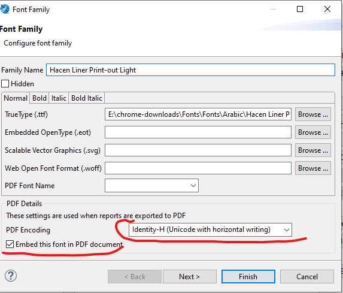

# دليل Jasper Reports الشامل لنظام Nama ERP

كل تقرير وكل نموذج طباعة يخرج من نظام نما هو تصميم JasperReports: ملف تصميم خلفه استعلام SQL وأمامه مجموعة من المدخلات يملؤها المستخدم. وهذه الصفحة مكتوبة لمن يبني هذه التصاميم ويصونها — للمنفّذ الذي عليه أن يجعل الفاتورة المطبوعة مطابقة لترويسة العميل، ولموظف الدعم الذي عليه أن يعرف لماذا لم تطابقها.

وهناك طريقان للوصول إلى تقرير. **أداة إنشاء تقرير (Report Wizard)** تبني لك التصميم من جدول رئيسي وقائمة حقول وبضعة جداول إعداد، ولا تفتح أنت ملف التصميم أصلاً. أو ترسم التصميم بنفسك في **Jaspersoft Studio** وترفعه، فتملك تحكماً كاملاً في كل حزمة وكل تعبير وكل صفحة. الأداة تغطي معظم احتياجات التقارير اليومية؛ أما التصميم المرسوم يدوياً فهو ما تلجأ إليه حين يجب أن يخرج المستند بشكل بعينه لا غير. وكلا الطريقين ينتهي إلى تعريف تقرير من النوع نفسه، فمعظم ما يلي ينطبق أياً كان الطريق الذي سلكته.

وحيثما رأيت تعبير Groovy في هذه الصفحة فهو استدعاء لمساعد التقارير الذي يتيحه نما داخل كل تقرير. أما الفهرس الكامل لتلك الاستدعاءات — الأسماء، والتواريخ، والأسعار، والروابط، والأمان، ورموز QR، ومدخلات `$P{}` الجاهزة التي يتلقاها كل تقرير — ففي [مرجع تعبيرات NamaRep](/ar/platform/reports/reports-namarep-reference). هذه الصفحة تشرح المهام، وتلك الصفحة تسرد الاستدعاءات.

## أين تسكن التقارير

كل ما يتعلق بتعريفات التقارير تجده تحت **إدارة النظام ← التقارير**:

| الشاشة | ما تحتويه |
|---|---|
| **مجموعة تقارير** | التجميعات التي تحدد تحت أي قائمة يظهر التقرير، ومن ثَمّ من الذي سيعثر عليه. |
| **تعريف تقرير** | التقرير نفسه — ملف التصميم المرفوع، وكوده، ومجموعته، وتقاريره الفرعية وموارده. هنا يُسجَّل التصميم المرسوم يدوياً حتى يستطيع المستخدمون تشغيله. |
| **أداة إنشاء تقرير** | طريق «ابنِ لي إياه»: اختر جدولاً، واختر حقولاً، واحفظ، فيُولَّد لك تعريف تقرير. |
| **أداة إنشاء نموذج طباعة** | الفكرة نفسها، لكن لنماذج الطباعة بدل تقارير القوائم. |
| **مصدر بيانات** | كتلة استعلام قابلة لإعادة الاستخدام يسحب منها تقرير الأداة أعمدة إضافية. |
| **كيان افتراضي** | جملة SQL محفوظة تتصرف كأنها جدول — انظر [الكيانات الافتراضية](/ar/platform/virtual-entity-guide). |
| **Report Style** | تنسيقات مسمّاة تتشاركها التقارير، بدل أن يحمل كل تصميم خطوطه وحدوده الخاصة. |
| **قائمة تقارير مخصصة** | قائمة تقارير تبنيها بيدك، حين لا يكون الترتيب المبني على المجموعات هو ما تريد. |

وإذا أخبرك مستخدم أن تقريراً «غير موجود» فهنا أول ما تبحث: التقرير موجود غالباً، لكن مجموعته تضعه في قائمة لا يراها ذلك المستخدم.

::: tip البناء بالأداة بدلاً من ذلك
إن لم تكن ستَرسم التصميم بيدك فابدأ من [دليل أداة إنشاء التقارير](/ar/platform/reports/report-wizard-guide) — فهو يمشي بك خطوة خطوة في بناء تقرير من الشاشة، حقلاً حقلاً. ثم عُد إلى هنا لما لا تغطيه الأداة: المدخلات المكتوبة يدوياً، والتقارير الفرعية، وأحجام الصفحات، والخطوط، وقيود الأمان.
:::

## وضع شعار الشركة على التقرير

الشعار أول ما يطلبه الجميع، ولا يحتاج استعلاماً ولا إعداداً — فالنظام يسلّمه لكل تقرير يطلبه.

1. عرّف مدخلاً باسم `loginLegalEntityLogo` من النوع `java.lang.Object` أو `java.io.InputStream`.
2. أضف عنصر صورة إلى التصميم.
3. اجعل تعبير الصورة هو `$P{loginLegalEntityLogo}`.

هذا كل شيء. فعند تشغيل التقرير يصل إلى ذلك المدخل شعارُ الشركة التي سجّل المستخدم دخوله بها. وهناك أربعة شعارات إضافية بالطريقة نفسها — من `loginLegalEntityLogo2` إلى `loginLegalEntityLogo5` — وبها تضع المنشآت التي تحتاج علامة ثانية، كشهادة جودة أو شعار امتياز، تلك العلامة على الصفحة.

أما أيّ شركة يؤخذ شعارها حين يكون المستند تابعاً لشركة غير شركة المستخدم فيُحدَّد في الإعداد العام، في تبويب [التقارير والطباعة](/ar/platform/global-config/global-config-reports).

### أي صورة أو مرفق آخر

للصورة التي ليست الشعار — توقيع مختوم محفوظ على السجل، أو شهادة ممسوحة ضوئياً — استجلب المرفق بمعرّفه وسلّم الناتج لعنصر الصورة:

```groovy
NamaRep.getFile($F{attachmentId})
// أو
NamaRep.getAttachment($F{attachmentId})
```

## التقارير الفرعية والموارد الإضافية

يستطيع التقرير أن يضمّن تقريراً آخر داخله. وبهذا يطبع إذنُ التسليم أسطرَه من تصميم وشروطَه وأحكامَه من تصميم آخر، ويطبع كشفُ الحساب كتلة ملخّص مختلفة لكل فرع.

سجّل التقرير الفرعي على تعريف التقرير، ثم اربطه بالتصميم:

1. أعطِ التقرير الفرعي **معرّف تقرير فرعي** على تعريف التقرير. وهو نص حر — أنت من يختاره.
2. في التصميم، عرّف مدخلاً **بهذا الاسم بالضبط**.
3. اجعل فئة ذلك المدخل `java.lang.Object`.
4. استخدم المدخل تعبيراً للتقرير الفرعي.

::: warning عرّفه `java.lang.Object` لا `java.io.InputStream`
ما يضعه النظام في ذلك المدخل تقريرٌ مُصرَّف جاهز، لا الملف الخام. والمدخل المعرَّف `java.io.InputStream` يفشل عند التعبئة برسالة خطأ في الأنواع لا تدل على السبب بشيء. وكل تقرير يأتي مع المنتج يعرّف مدخلات تقاريره الفرعية `java.lang.Object`.
:::

والموارد الإضافية — صورة يستخدمها التصميم، أو ملف يحتاجه — تعمل بالطريقة نفسها: سجّل المورد على تعريف التقرير، وعرّف مدخلاً بالاسم نفسه وبالفئة `java.lang.Object`، وأشر إليه حيث يحتاجه التصميم.

## سؤال المستخدم: مدخلات التقرير

المدخلات هي ما يملؤه المستخدم قبل تشغيل التقرير، وهي نفسها القيم التي يقرؤها استعلام SQL. يُعرَّف المدخل مرة واحدة في التصميم ويؤدي المهمتين معاً.

### مدخلات التحديد المتعدد (القوائم)

أحياناً لا تكفي قيمة واحدة — فالمستخدم يريد خمسة موظفين، أو كل الفروع إلا اثنين. ويستطيع المدخل أن يقبل قائمة:

1. اضبط الخاصية `list = true`.
2. ولكل ما ليس مرجعاً إلى سجل، اضبط كذلك `listType` (مثلاً `java.util.Date`).
3. ولطباعة ما اختاره المستخدم، عرّف مدخلات نصية مرافقة يملؤها النظام تلقائياً:
   - `<parameterName>_csv` — القيم المترجمة مفصولة بفواصل
   - `<parameterName>_codecsv` — الأكواد
   - `<parameterName>_name1csv` — الأسماء العربية
   - `<parameterName>_name2csv` — الأسماء الإنجليزية
4. و`doNotAutoShowList = true` يمنع سرد القيم المختارة تلقائياً على التقرير.
5. و`listDisplayType` يحدد الأداة التي يراها المستخدم:
   - `Default` — إدخال التحديد المتعدد القياسي، وهو المستخدَم عند حذف الخاصية
   - `Dropdown` — تظهر القيم المختارة شرائحَ قابلة للإزالة داخل الإدخال، وتُفتح قائمة الخيارات الكاملة في قائمة منسدلة قابلة للبحث. وهو الخيار الصحيح حين تكون مجموعة القيم كبيرة
   - `Chips` — تظهر كل القيم المسموحة شرائحَ قابلة للنقر، ويُبدَّل التحديد بالنقر. وهو الخيار الصحيح لعدد قليل من الخيارات تريدها ظاهرة دون فتح شيء

```xml
<parameter name="MultiEmployee" class="java.util.List">
    <property name="entityType" value="Employee"/>
    <property name="list" value="true"/>
    <property name="listDisplayType" value="Chips"/>
</parameter>
```

::: details مثال أوسع — مدخلا قائمة
```xml
<!-- قائمة سجلات -->
<parameter name="MultiEmployee" class="java.util.List">
    <property name="entityType" value="Employee"/>
    <property name="arabic" value="الموظفين"/>
    <property name="english" value="Employees"/>
    <property name="property" value="code"/>
    <property name="list" value="true"/>
    <property name="doNotAutoShowList" value="false"/>
</parameter>
<parameter name="MultiEmployee_csv" class="java.lang.String" isForPrompting="false"/>

<!-- قائمة قيم عادية -->
<parameter name="MultiDate" class="java.util.Date">
    <property name="english" value="Dates"/>
    <property name="arabic" value="التواريخ"/>
    <property name="defaultValue" value="$monthStart()"/>
    <property name="list" value="true"/>
    <property name="listType" value="java.util.Date"/>
</parameter>
<parameter name="MultiDate_csv" class="java.lang.String" isForPrompting="false"/>
```
:::

### مدخلات نطاق التاريخ

مدخلا «من تاريخ» و«إلى تاريخ» منفصلين يعملان بلا مشكلة، لكنهما يشغلان صفَّين ولا شيء على الشاشة يخبر المستخدم أنهما مرتبطان. وخاصية `showAsDateRange` تعطي المستخدم منتقيَ نطاق واحداً بينما يحتفظ الاستعلام بمدخلَي التاريخ الحقيقيين اللذين يحتاجهما.

تتعاون ثلاثة مدخلات:

1. **مدخل تحكّم** — نصي، بخاصية `showAsDateRange = true`. هذا ما يراه المستخدم، ولا يحمل قيمة خاصة به.
2. **مدخل «من تاريخ»** بخاصية `isForPrompting="false"`، يسمّيه مدخل التحكّم في `fromDateId`.
3. **مدخل «إلى تاريخ»** بخاصية `isForPrompting="false"`، يسمّيه مدخل التحكّم في `toDateId`.

وعندما يختار المستخدم نطاقاً تُكتب التواريخ المختارة في المدخلين الأساسيين. ومن وجهة نظر الاستعلام لم يتغير شيء — فأنت تشير إلى `$P{FromValueDate}` و`$P{ToValueDate}` تماماً كأي مدخل تاريخ آخر.

```xml
<parameter name="FromValueDate" class="java.util.Date" isForPrompting="false">
    <property name="arabic" value="من التاريخ الفعلي"/>
    <property name="english" value="From Value Date"/>
</parameter>

<parameter name="ToValueDate" class="java.util.Date" isForPrompting="false">
    <property name="arabic" value="إلى التاريخ الفعلي"/>
    <property name="english" value="To Value Date"/>
</parameter>

<parameter name="ValueDate" class="java.lang.String">
    <property name="showAsDateRange" value="true"/>
    <property name="fromDateId" value="FromValueDate"/>
    <property name="toDateId" value="ToValueDate"/>
    <property name="arabic" value="التاريخ الفعلي"/>
    <property name="english" value="Value Date"/>
</parameter>
```

ثم في الاستعلام:

```sql
WHERE valueDate >= $P{FromValueDate}
  AND valueDate <= $P{ToValueDate}
```

أو بصيغة between:

```sql
where $X{[BETWEEN],valueDate,FromValueDate,ToValueDate}
```

ولا يظهر المنتقي ما لم تتحقق ثلاثة أمور: أن يكون مدخل التحكّم من النوع `java.lang.String`، وأن يضبط مدخلا التاريخ `isForPrompting="false"` حتى لا يظهرا مطالبتين منفصلتين بجانب المنتقي، وأن تطابق قيمتا `fromDateId` و`toDateId` اسمَي المدخلين بالضبط.

### مرجع خصائص المدخلات

#### الخصائص الأساسية

- **`list`** — `true`/`false`، يفعّل التحديد المتعدد
- **`listType`** — مطلوب لكل ما ليس مرجعاً (مثلاً `java.util.Date`)
- **`listDisplayType`** — الأداة التي يُعرَض بها مدخل القائمة: `Default` أو `Dropdown` أو `Chips`
- **`showAsDateRange`** — `true`/`false`، يعرض مدخلاً نصياً كمنتقي نطاق موحّد؛ يُستخدم مع `fromDateId` و`toDateId`، وتفصيله في قسم «مدخلات نطاق التاريخ» أعلاه
- **`fromDateId`** / **`toDateId`** — اسما مدخلَي التاريخ الأساسيين عند تفعيل `showAsDateRange`
- **`layout`** — كيف تُرتَّب المطالبة: `alone` أو `spanned` أو `normal` أو `spanned2`
- **`required`** — `true`/`false`، يجعل المطالبة إلزامية
- **`requiredGroup`** — يجمع مدخلات يجب ملء واحد منها على الأقل
- **`hijri`** — `true`/`false`، يطالب بتاريخ هجري
- **`nama-id`** — معرّف داخلي تستخدمه أداة إنشاء التقارير، ولا تضبطه أنت بيدك

#### الاقتراحات في الحقول النصية

- **`suggestionquery`** — استعلام SQL يغذّي الإكمال التلقائي. عمودان يعنيان الكود مع عرض عربي؛ وثلاثة أعمدة تعني الكود والعربي والإنجليزي.

```sql
SELECT DISTINCT TOP 25 revisionId, revisionName
FROM ItemRevision
WHERE invItem_id = {fItem}
  AND (revisionId LIKE '%' + {revision} + '%'
       OR revisionName LIKE '%' + {revision} + '%')
```

#### اختيار سجل

- **`entityType`** — ما الذي يختار المستخدم منه
- **`property`** — أي حقل من السجل المختار يصل إلى الاستعلام: `code` أو `name1` أو `name2` أو `startDate`

#### القوائم المنسدلة

- **`enumType`** — مجموعة الخيارات المعروضة
- **`allowedValues`** — القيم المسموحة مفصولة بفواصل، وتُعرض قائمة منسدلة
- **`allowedValuesAr`** / **`allowedValuesEn`** — التسميات العربية والإنجليزية لتلك القيم، مفصولة بفواصل وبالترتيب نفسه

```xml
<parameter name="entityType" class="java.lang.String">
    <property name="enumType" value="EntityTypeDF"/>
    <property name="allowedValues" value="Employee,Supplier"/>
    <property name="allowedValuesAr" value="موظف,مورد"/>
    <property name="allowedValuesEn" value="Employee,Supplier"/>
</parameter>
```

#### تضييق ما يستطيع المستخدم اختياره

- **`filter`** — بالصيغة `field,operator,value[,relation]`. وتُفصل الفلاتر المتعددة بفواصل منقوطة، والعلاقة الافتراضية `AND`، و`${parameterId}` يشير إلى مدخل آخر، فيضيّق مدخلٌ نطاقَ مدخل آخر.

العوامل:

```
Equal, EqualOrEmpty, NotEqual, NotEqualOrEmpty,
GreaterThan, GreaterThanOrEmpty, GreaterThanOrEqual, GreaterThanOrEqualOrEmpty,
LessThan, LessThanOrEmpty, LessThanOrEqual, LessThanOrEqualOrEmpty,
StartsWith, StartsWithOrEmpty, NotStartsWith, NotStartsWithOrEmpty,
EndsWith, EndsWithOrEmpty, NotEndWith, NotEndWithOrEmpty,
Contains, ContainsOrEmpty, NotContain, NotContainOrEmpty,
OpenBracket, CloseBracket, In
```

```
forType,Equal,Department,AND;isLeaf,Equal,true
documentType,Equal,ReceiptVoucher
forType,Equal,${subsidiaryType}
```

#### القيم الافتراضية

- **`defaultValue`** — نص يُقرأ بحسب نوع المدخل: التاريخ بصيغة `dd-MM-yyyy`، والوقت بصيغة `yyyy-MM-dd'T'HH:mm:ss.SSS`، والمرجع بصيغة `id:entityType:code`.

::: details دوال القيم الافتراضية الديناميكية
```
$now()                  $today()
$monthStart()           $monthEnd()
$yearStart()            $yearEnd()
$quarterStart()         $quarterEnd()
$thirdStart()           $thirdEnd()
$halveStart()           $halveEnd()
$previousMonthStart()   $previousMonthEnd()
$nextMonthStart()       $nextMonthEnd()
$previousYearStart()    $previousYearEnd()
$nextYearStart()        $nextYearEnd()
$currentFiscalPeriod()  $currentUser()
$currentEmployee()
$todayPlusDays(n)       $todayPlusWeeks(n)
$todayPlusMonths(n)     $todayPlusYears(n)
```
:::

وهذه الدوال تخص `defaultValue` وحدها. و`$currentUser()` على وجه الخصوص يملأ قيمة افتراضية — وليست قيمة تستطيع قراءتها بـ `$P{}` من داخل التقرير.

وللقيمة الافتراضية متعددة القيم، افصل بينها بـ `@A=@X`:

```
id:entityType:code@A=@Xid:entityType:code@A=@X...
```

#### الإظهار والإخفاء والتحقق

- **`NamaRep.canDisplay($P{param})`** — استخدمه في `printWhenExpression` ليختفي العنصر عن المستخدمين غير المسموح لهم برؤية موضوع ذلك المدخل
- **`no-mirror = true`** — يمنع انعكاس العنصر في التصاميم من اليمين إلى اليسار
- **`fromParam`** — يربط مدخل «إلى» بمدخل «من» المقابل له
- **`fromParamMaxGapInDays`** — أوسع مدى مسموح للمستخدم بين التاريخين

```xml
<parameter name="toDate" class="java.util.Date">
    <property name="arabic" value="إلى تاريخ"/>
    <property name="english" value="To Date"/>
    <property name="fromParam" value="fromDate"/>
    <property name="fromParamMaxGapInDays" value="30"/>
</parameter>
```

#### التسميات وما بقي

- **`arabic`** / **`english`** — تسميتا المطالبة
- **`resource`** — مفتاح ترجمة، حين يجب أن تأتي التسمية من ملفات الترجمة
- **`src`** — إعادة استخدام خاصية معرَّفة على مدخل آخر
- **`ignore`** — إبقاء المدخل خارج المطالبة كلياً
- **`type`** — معالجة خاصة للقيم الفارغة، أو نوع المقارنة في مقارنات التاريخ بعوامل `>` و`<`

## تحديد ما يراه كل مستخدم

التقرير الذي يستعلم من قاعدة البيانات مباشرةً يتجاوز كل صلاحيات المستخدم، ما لم تُعِد أنت تلك الصلاحيات إلى الاستعلام بنفسك. وهذا ما وُجدت له قيود الأمان: مدخل مخفي قيمته جزء من SQL يصف ما يُسمح لهذا المستخدم بالذات برؤيته، يُدرَج في جملة `WHERE` عندك.

لنفترض أنك تريد تقرير حسابات مصفّى بحسب منشئ كل سجل، وبحسب صلاحيات العرض والتعديل، وكذلك بحسب الشركة أو القطاع أو الفرع أو أي مُحدد آخر على الحساب.

#### ١. عرّف مدخلاً مخفياً باسم SECURITY_CONSTRAINTS

أنشئ مدخل `String` معلَّماً بـ **Not For Prompting**، وتعبير قيمته الافتراضية:

```groovy
NamaRep.security()
  .fieldEntityType("Account")
  .tableAlias("acc")
  .capabilities("firstAuthor", "viewCapability", "usageCapability",
                "updateCapability", "legalEntity", "branch",
                "sector", "department", "analysisSet")
```

- `.fieldEntityType("Account")` — أي نوع من السجلات يجري تصفيته
- `.tableAlias("acc")` — الاسم المستعار الذي يحمله جدول ذلك السجل في استعلامك
- `.capabilities(...)` — ما الذي يُصفّى به. فـ `firstAuthor` يقصر النتيجة على السجلات التي أنشأها المستخدم؛ و`viewCapability` و`updateCapability` و`usageCapability` تطبّق الصلاحيات المقابلة؛ و`legalEntity` و`branch` و`sector` و`department` و`analysisSet` تطبّق المحددات التنظيمية

#### ٢. أدرجه في الاستعلام

يحمل المدخل نص SQL خاماً، فيُدرَج بـ `$P!{}` — وعلامة التعجب هي التي تخبر Jasper بلصق النص بدل ربطه كقيمة:

```sql
SELECT a, b, c
FROM Account acc
LEFT JOIN Table2 t2 ON t2.id = acc.someId
WHERE acc.code <> 'abc'
  AND $P!{SECURITY_CONSTRAINTS}
```

#### ٣. أكثر من جدول

ابنِ جزءاً لكل جدول واربطها بـ `AND`:

```groovy
NamaRep.security()
  .fieldEntityType("Account")
  .tableAlias("Account")
  .capabilities("firstAuthor", "viewCapability")
+ " AND " +
NamaRep.security()
  .fieldEntityType("FiscalYear")
  .tableAlias("FiscalYear")
  .capabilities("legalEntity", "branch", "sector")
```

::: tip أنت من يعرّفه — وليس تلقائياً
لا شيء يحقن مدخل الأمان في تقرير مرسوم يدوياً نيابةً عنك. والتقرير الخالي منه يعرض كل صف يُرجعه الاستعلام، لكل من يستطيع تشغيل التقرير. أما التقارير المبنية بأداة إنشاء التقارير فتُطبَّق عليها التصفية نفسها خلف الكواليس.
:::

## مشاركة تقرير مع شخص بلا حساب

رابط التقرير عادةً يشترط على من يستقبله تسجيل الدخول. وهذا لا ينفع مع عميل يستقبل فاتورة بالبريد، فيمكن تحويل رابط التقرير إلى رابط لا يحتاج مصادقة:

```groovy
NamaRep.repLinkByCode($P{REPORT_PARAMETERS_MAP}, "ARG000046-report")
  .p("Code_Equals").ref($F{entityType}, $F{id})
  .toNoAuthResultLink()
```

أما البنّاء الذي خلف ذلك — تمرير المدخلات والمراجع، ونسخ مدخلات التقرير الحالي — فموثّق في [مرجع تعبيرات NamaRep](/ar/platform/reports/reports-namarep-reference).

::: tip نشر نموذج مطبوع ليجلبه العميل بنفسه
الرابط العام لا ينفع ما لم يكن لديك ما ترسله إليه. فحدِّد النموذج المطبوع الذي يعرضه الرابط العام في [أعدادات الحقول و الشاشات](/ar/platform/fields-and-entities-settings/fields-settings-integrations) — فهناك تقول أي تصميم يفتحه رابط الفاتورة العام، فينزّل العميلُ التابعُ لرابط في بريد أو لرمز QR النموذجَ الذي قصدته بالضبط دون حساب.
:::

## خلط أحجام الصفحات في مستند واحد

لتصميم التقرير الواحد حجم صفحة واحد. وحين يحتاج مستند واحد حجمين فعلاً — صفحة غلاف A4 يتبعها جدول عريض A3 — فالحل هو **تقرير Book**: هيكل محتواه سلسلة أجزاء، كل جزء تقرير قائم بذاته بحجم صفحته الخاص.

1. ابدأ بتقرير رئيسي من النوع **Book Report**.
2. أعطه استعلام SQL بسيطاً يُرجع الحقول التي تحتاجها الأجزاء للتمييز بينها.
3. استخدم **Add Part to Content** لإضافة كل تقرير فرعي جزءاً.
4. أعطِ كل جزء **Print When Expression** حتى لا تُطبع إلا الأجزاء التي تنطبق على هذا المستند.
5. عرّف المدخلات التي تحتاجها الأجزاء ومرّرها إلى كل جزء.

والنتيجة المعتادة قالب من جزأين — جزء A4 وجزء A3 — يُختار بشرط على حقل ملاحظات المستند، ولكل جزء أن يحتوي تقاريره الفرعية.

## الخطوط وإخراج PDF العربي

يأتي نظام نما وفيه **Times New Roman** مسجَّلاً للنص العربي، وهو ما يحصل عليه التقرير ما لم تقل غير ذلك. ولاستخدام أي خط آخر — Cairo أو Amiri أو Droid Arabic Naskh — يجب تحزيم الخط وتثبيته على الخادم، لأن ملف PDF لا بد أن يحمل الخط معه.

وهناك أيضاً [فيديو يمشي بك في هذه الخطوات](https://youtu.be/n08xmWekB1s).

### ١. أضف الخط في Jaspersoft Studio

افتح **Jaspersoft Studio**، واذهب إلى `Window > Preferences`، ثم `Jaspersoft Studio > Fonts`، وانقر **Add**.

### ٢. اضبط خصائص الخط

في مربع حوار **Font Family**:

- اختر ملف الخط `.ttf` أو `.otf`، أو الملفات
- ضع علامة على **Embed this font in PDF documents**
- اضبط **PDF Encoding** على `Identity-H`



ثم انقر **Finish**.

### ٣. صدّر الخط ملفَ JAR

بعد إضافة الخط، انقر **Export** واحفظ ملف `.jar` المولَّد.

### ٤. انشر ملف JAR

انسخ ملف `.jar` المصدَّر إلى مجلد `tomcat/lib` وأعد تشغيل خدمة **Tomcat**. وإلى أن تُعيد التشغيل، ترجع التقارير التي تطلب الخط الجديد إلى ما هو مثبَّت أصلاً.

::: tip الخطوط على أجهزة نقاط البيع
أجهزة نقاط البيع تعرض إيصالاتها بنفسها، فلا بد أن يصلها الخط هي أيضاً. ارفع ملف JAR نفسه إلى حقل **Jasper Fonts** («خطوط خاصة ب Jasper») في شاشة **إعدادات واجهة نقاط البيع الجديده** (Pos UI Settings).

والرفع لا يدفع الخط إلى أي جهاز بذاته: فكل جهاز نقطة بيع يلتقطه في مزامنة البيانات الرئيسية التالية، ويكتبه في مجلد `jasper-fonts-extension` عنده، ويبدأ استخدامه فوراً — أو عند إعادة تشغيل المشغّل التالية إن كان الملف الحالي قيد الاستعمال. لذلك بعد تحديث أجهزة نقاط البيع إلى إصدار يدعم امتداد الخطوط، أعد حفظ سجل إعدادات واجهة نقاط البيع ليكون لديها ما تلتقطه، ثم امهلها دورة مزامنة قبل أن تفحص جهازاً.
:::

### ٥. استخدم الخط

عيّن عائلة الخط الجديدة لعناصر النص في التصميم. فيُضمَّن الخط في ملف PDF، ويظهر العربي صحيحاً أينما فُتح الملف.

## كم يُسمح للتقرير أن يعمل

التقرير الذي لا ينتهي يُبقي اتصالاً بقاعدة البيانات مفتوحاً، وبالكثرة يجعل النظام غير مستجيب للجميع. والحارس ضد ذلك حدٌّ زمني على الاستعلام نفسه: **اقصى مدة بالثواني لتنفيذ استعلامات التقارير** في الإعداد العام، ضمن [الأداء والبحث](/ar/platform/global-config/global-config-performance). فاستعلام التقرير الذي يتجاوز الحد توقفه قاعدة البيانات، ويحصل المستخدم على رسالة خطأ بدل انتظار لا ينتهي.

وهذا الحد يُضبط عادةً أكرم من بقية حدود الاستعلامات، لأن تقرير نهاية الشهر يستغرق دقائق بحق. فإن بدأت التقارير تتوقف بعد تغيير ما فهذا أول ما تفحصه؛ وإن كان الخادم يئنّ تحت حِمل التقارير فتضييقه هو الرافعة الآمنة.

ويمكنك كذلك تسجيل المدة التي استغرقها كل تقرير، وبأي مدخلات، بتفعيل تسجيل أداء التقارير — وخياراته في تبويب [التقارير والطباعة](/ar/platform/global-config/global-config-reports). وهذا السجل هو ما يحوّل «التقرير بطيء» إلى «التقرير بطيء عند مجموعة مدخلات بعينها».

## كتابة التعبيرات

كل ما تستطيع استدعاءه من داخل تعبير في التقرير — الأسماء والترجمة، والتواريخ الهجرية، وتفقيط الأرقام، واستخراج الأسعار، والروابط الراجعة إلى النظام، ومنشئات السجلات، وروابط الموافقة، ورموز QR، والقائمة الكاملة لمدخلات `$P{}` الجاهزة — مفهرس في [مرجع تعبيرات NamaRep](/ar/platform/reports/reports-namarep-reference).
