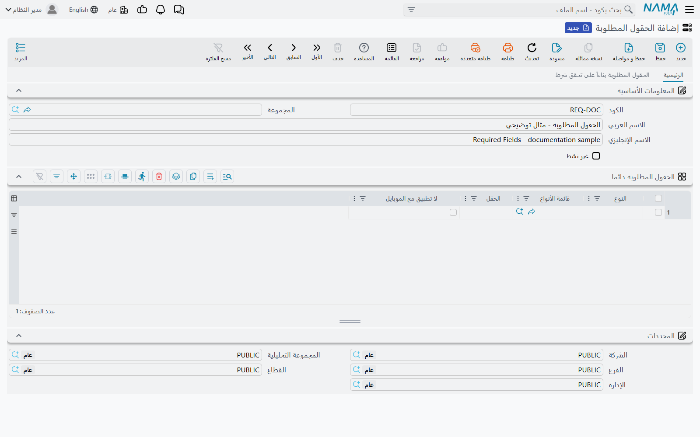
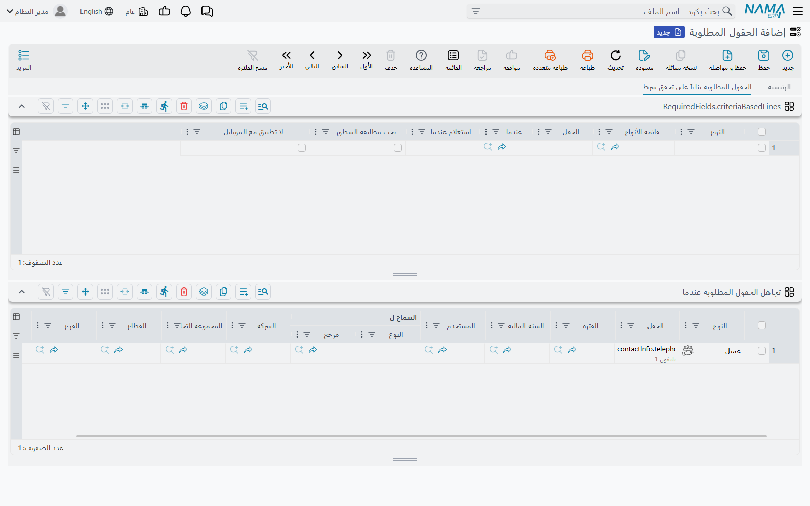

# الحقول المطلوبة

كل شاشة في النظام تعرف مسبقاً الحقول التي لا تستغني عنها. فاتورة المبيعات تحتاج عميلاً، والقيد
يحتاج تاريخاً، ولا يوجد إعداد يغيّر ذلك. لكن ما لا يعرفه النظام هو ما لا تستغني عنه **مؤسستك أنت**:
أن ملف العميل بلا رقم هاتف لا ينفع إدارة التحصيل، وأن المراجعين يشترطون رقم مستند يدوي على كل سند
صرف، وأن أمر البيع المصنَّف تصديراً لا بد أن يحمل ميناء الوصول.

شاشة **الحقول المطلوبة** هي المكان الذي تضيف فيه هذه القواعد. تسمّي النوع، وتسمّي الحقل، ومن تلك
اللحظة يصير الحقل إلزامياً — يُرفض الحفظ بدونه، وبنفس الرسالة التي يستخدمها النظام لحقوله الإلزامية
الأصلية. بلا برمجة، وبلا إعادة تشغيل، وعلى كل المستخدمين.

تصل إليها من **إدارة النظام ← تخصيص شكل النظام ← الحقول المطلوبة**. وهي ملف رئيسي عادي: كود، واسم،
وعلامة **غير نشط** تُطفئ السجل كله، وثلاثة جداول. ويمكنك إنشاء ما شئت من السجلات — فالنظام يقرأ كل
سجل نشط ويدمج قواعده مع غيره، فمن الطبيعي أن تحتفظ بسجل لكل إدارة أو لكل مشروع بدل قائمة واحدة
ضخمة.

## الجداول الثلاثة، وأيها تريد

للشاشة صفحتان. صفحة **الرئيسية** تحمل جدولاً واحداً هو **الحقول المطلوبة دائما**. والصفحة الثانية،
**الحقول المطلوبة بناءاً على تحقق شرط**، تحمل الجدولين الآخرين: جدول الشروط في أعلاها، وتحته
**تجاهل الحقول المطلوبة عندما**.

| الجدول | استخدمه عندما |
|---|---|
| الحقول المطلوبة دائما | الحقل إلزامي، وانتهى الأمر. بلا شروط وبلا استثناءات. |
| الحقول المطلوبة بناءاً على تحقق شرط | الحقل إلزامي **فقط** في حالات بعينها — نوع مستند معيّن، أو عميل معيّن، أو قيمة اختيرت في حقل آخر على نفس السجل. |
| تجاهل الحقول المطلوبة عندما | تريد رفع قاعدة من أي من الجدولين أعلاه عن فرع أو شركة أو فترة أو مجموعة مستخدمين بعينها. |



والجداول الثلاثة تبدأ بنفس أعمدة التحديد، وسلوكها واحد في كل مكان:

| العمود | ماذا يفعل |
|---|---|
| النوع (Entity Type) | الشاشة التي تنطبق عليها القاعدة — عميل، فاتورة مبيعات، موظف. |
| قائمة الأنواع (Entity Type List) | قائمة محفوظة من الأنواع، فيغطي السطر الواحد عدة شاشات دفعة واحدة. |
| الحقل (On Field) | الحقل الذي تجعله إلزامياً. اختر النوع أولاً فيقترح لك العمود أسماء الحقول المتاحة، فنادراً ما تضطر لكتابة اسم من الذاكرة. |
| لا تطبيق مع الموبايل (Do Not Apply With Mobile App) | ضع علامة لاستثناء السجلات المُنشأة من تطبيق نما للموبايل. وتبقى القاعدة سارية فيما عدا ذلك. |

يمكنك ملء **النوع**، أو **قائمة الأنواع**، أو الاثنين معاً — والسطر الذي يحمل الاثنين ينطبق على
النوع المسمّى **وعلى** كل نوع في القائمة.

## الحقول المطلوبة دائما

هذا هو الجدول الذي ستستعمله في أغلب الأحوال، وهو الأفضل سلوكاً، لأن القاعدة المكتوبة فيه لا ترفض
الحفظ فحسب، بل تجعل الحقل إلزامياً بحق: فيُسجَّل الحقل إلزامياً في تعريف السجل نفسه، فتعرضه الشاشة
كما تعرض أي حقل إلزامي آخر، ويجري التحقق منه في كل موضع يتحقق فيه النظام من الحقول الإلزامية — بما
في ذلك السجلات القادمة من استيراد أو من تكامل خارجي.

لنقل إن إدارة التحصيل عندك تلاحق عملاء لم يُدخل أحد أرقام هواتفهم. سطر واحد — **النوع** `Customer`
و**الحقل** `contactInfo.telephone1` — وتنتهي المشكلة من منبعها في نفس الدقيقة.

::: warning السطر الذي لا نوع له ينطبق على كل الشاشات
إن تركت **كلاً** من النوع وقائمة الأنواع فارغاً فالقاعدة لا تُهمَل، بل تصير *عامة*، فيصبح الحقل
إلزامياً في **كل** شاشة في النظام تصادف أن فيها حقلاً بهذا الاسم. وسطر عام على `description1` يجعل
هذا الحقل إلزامياً في مئات الشاشات، أغلبها لم تفتحه في حياتك. وقد يكون هذا مرادك أحياناً، لكنه في
الغالب خطأ يظهر بعد أيام في صورة «لم يعد أحد قادراً على الحفظ». فسمِّ النوع إلا إذا كنت قد قررت
غير ذلك عن عمد.
:::

::: tip يصل إلى الملاحظات أيضاً
قائمة الاقتراحات في هذا الجدول تشمل حقول كتلة **الملاحظات** الموجودة على كل سجل — نص الملاحظة
نفسه، ومرفقاتها الأربعة، وحقلَي المرجع فيها، وتواريخها وأوقاتها. فاشتراط نص الملاحظة يمنع إضافة
ملاحظة فارغة، واشتراط المرفق الأول يوجب أن تأتي الملاحظة بملف. راجع
[الملاحظات والأجندة ومهام العمل](/ar/platform/remarks-and-agenda). وهذه القواعد لا تعمل إلا من هذا
الجدول — فجدول الشروط لا يعرضها أصلاً.
:::

## الحقول المطلوبة بناءاً على تحقق شرط

القواعد التي لا تسري إلا أحياناً محلّها الصفحة الثانية. وكل سطر فيها يسمّي النوع والحقل كما سبق، ثم
يجيب على سؤال *متى؟* بإحدى طريقتين.



| العمود | ماذا يفعل |
|---|---|
| عندما (When) | معيار محفوظ. فلا يصير الحقل إلزامياً إلا في السجلات التي يطابقها المعيار. |
| استعلام عندما (When Query) | استعلام يجيب بنعم أو لا عن السجل الجاري حفظه. نفس الأثر، لكن مكتوباً استعلاماً بدل معيار محفوظ. |
| يجب مطابقة السطور (Lines Should Match) | لا معنى له إلا حين يكون الحقل داخل جدول — انظر أدناه. |

والحالة النموذجية هي أن تحدد قيمة على السجل مصير قيمة أخرى على نفس السجل. لنفترض أن أوامر البيع
عندك تحمل تصنيفاً في أحد حقول الوصف، وأن الأوامر المصنَّفة *تصدير* لا بد أن تسمّي ميناء الوصول.
سطر واحد: **النوع** `SalesOrder`، و**الحقل** `arrivingPort`، و**استعلام عندما**:

```sql
select case when {description5} = N'تصدير' then 1 else 0 end
```

هذه هي القاعدة كاملة. فأنت لا تكتب أبداً النصف الخاص بـ«هل الحقل ممتلئ؟» — النظام يتولاه عنك. وهذا
بالضبط هو الفرق بين هذا الجدول وبين
[التحقق بناءً على معايير](/ar/platform/criteria-based-validation)، حيث كان عليك أن تكتب استعلام
*عندما* واستعلام *يجب أن* بنفسك.

ويمكنك ملء **عندما** و**استعلام عندما** معاً، فيلزم حينها أن يستوفي السجل المعيار أولاً ثم
الاستعلام ثانياً. وإن تركتهما فارغين فلم يبق للسطر شرط، فيصير الحقل إلزامياً بلا قيد — وهذا هو عمل
جدول «الحقول المطلوبة دائما»، وفعله هنا يكلّفك العلامة على الشاشة بلا مقابل.

::: warning سطر الشروط الذي لا نوع له لا يفعل شيئاً على الإطلاق
السلوك العام الموصوف أعلاه في جدول «الحقول المطلوبة دائما» **غير موجود** في هذا الجدول. فالسطر الذي
لا يحمل نوعاً ولا قائمة أنواع يُهمَل في صمت — بلا خطأ وبلا تنبيه، والقاعدة التي ظننت أنك كتبتها لا
تعمل أبداً. فسمِّ النوع دائماً في هذا الجدول.
:::

### حين يكون الحقل داخل جدول

إن كان **الحقل** يشير إلى عمود في سطور المستند — `details.description1` مثلاً — فالتحقق يجري على كل
سطر من سطور المستند، و**يجب مطابقة السطور** هو ما يحدد أي السطور تلك.

فإن تركته بلا علامة، جعل المعيارُ أو الاستعلامُ المطابقُ للسجل الحقلَ إلزامياً في **كل** السطور.
وإن وضعت العلامة، فلن يجري التحقق إلا على السطور التي انتقاها المعيار أو الاستعلام فعلاً، وتُترك
البقية وشأنها. فتستطيع في فاتورة المبيعات أن تشترط رقماً مسلسلاً على السطور التي تحمل مجموعة أصناف
بعينها، بلا أن تطالب به في باقي سطور الفاتورة.

ورسالة الخطأ تذكر رقم السطر، فيعرف المستخدم أي صف يصلحه على وجه التحديد.

::: tip اشتراط الجدول نفسه
اجعل **الحقل** يشير إلى الجدول لا إلى أحد أعمدته — `details` بدل `details.item` — فتصير القاعدة
معناها «هذا الجدول لا يجوز أن يكون فارغاً». وهي طريقة أنيقة لاشتراط أن يحمل عرض التوظيف سطر إجازة
واحداً على الأقل، أو أن تسجّل زيارة الصيانة إجراءً واحداً على الأقل.
:::

## تجاهل الحقول المطلوبة عندما

القواعد الموضوعة للشركة كلها نادراً ما تناسب الشركة كلها. والجدول الثالث هو منفذ الخروج: كل سطر فيه
يصف حالة تُرفَع فيها قاعدة من قواعد الحقول المطلوبة.

| العمود | تُرفع القاعدة عندما… |
|---|---|
| النوع | …يكون السجل من هذا النوع. اتركه فارغاً ليعني أي نوع. |
| الحقل | …تكون القاعدة على هذا الحقل. اتركه فارغاً ليعني كل الحقول. |
| الفترة / السنة المالية | …يقع المستند في هذه الفترة أو السنة. والمستندات وحدها هي التي تحمل هذين، أما الملفات الرئيسية فتتجاهل العمودين. |
| المستخدم | …يكون هذا المستخدم بعينه هو من يحفظ. |
| السماح ل | …يكون المستخدم الحافظ هو هذا الموظف، أو ينتمي إلى هذا الملف الأمني أو مجموعة الموظفين أو المجموعة الرئيسية. والعمود من جزأين — تختار أيّ الأربعة تقصد، ثم تختار السجل. |
| الشركة، المجموعة التحليلية، القطاع، الفرع، الإدارة | …يحمل السجل هذه القيمة من المحددات. |

والأعمدة الفارغة في السطر لا تقيّد شيئاً ببساطة، والسطر ينطبق حين تتطابق **كل** أعمدته الممتلئة.
وفي هذا حدٌّ حاد يستحق الانتباه: السطر الذي تُركت كل أعمدته فارغة يطابق كل شيء، فيُطفئ كل قواعد
السجل.

::: danger إضافة استثناء تغيّر طريقة تطبيق قواعد «دائما»
هذا أقل سلوك في الشاشة وضوحاً، وأكثرها تسبباً في اتصالات الدعم.

ما دام جدول التجاهل في السجل **فارغاً**، فسطور «الحقول المطلوبة دائما» تعمل كما وُصف أعلاه: الحقل
مسجَّل إلزامياً بحق، والشاشة تعرضه إلزامياً، والتحقق يجري في كل موضع يتحقق فيه النظام من الحقول
الإلزامية.

وفي اللحظة التي تضيف فيها **سطراً واحداً** إلى «تجاهل الحقول المطلوبة عندما» يتوقف ذلك. فقواعد
«دائما» في هذا السجل تنتقل إلى نفس المحرّك الذي يتولى قواعد الشروط — لأنه المحرّك الوحيد الذي يعرف
الاستثناءات — ومن ثمّ يصير التحقق منها عند **اعتماد** السجل لا قبله. والقاعدة تظل تعمل؛ الذي يضيع
هو العلامة الدالة على أن الحقل إلزامي على الشاشة.

فإن أخبرك زميل بأن حقلاً «لم يعد يظهر إلزامياً بعدما أضفنا استثناءً لفرع القاهرة» فلا شيء معطوب:
هذا هو السبب. وإن أردت الاحتفاظ بالعلامة فضع القواعد التي لا استثناء لها في سجل، والقواعد التي
تحتاج استثناءات في سجل ثانٍ — فجدول التجاهل لا يؤثر أبداً إلا في قواعد سجله هو.
:::

## ما الذي يُعدّ فارغاً

التحقق يسأل إن كان للحقل قيمة، وفكرته عن «لا قيمة» أوسع مما قد تتوقع:

- الحقل **النصي** أو **حقل المرجع** فارغ حين يكون خالياً.
- الحقل **الرقمي** فارغ حين يكون خالياً **أو صفراً**. فاشتراط الكمية يعني إذن «يجب أن تكون شيئاً غير
  الصفر»، وهو المراد في الغالب الأعم.
- خانة **الاختيار** فارغة حين تكون بلا علامة. فاشتراطها يعني أن على المستخدم أن يضع العلامة — وهي
  وسيلة فظّة لكنها فعّالة لانتزاع إقرار منه.
- **الجدول** فارغ حين لا سطور فيه.

## متى يجري التحقق

يجري التحقق من الحقول المطلوبة عند **اعتماد** السجل. أما حفظ **المسودة** فلا يفرضها — وهذا هو معنى
المسودة أصلاً، وهو ينطبق على حقول النظام الإلزامية كما ينطبق على حقولك. فيستطيع المستخدم أن يترك
سجلاً ناقصاً مسودةً طوال اليوم؛ وتعضّ القواعد حين يحفظه حفظاً حقيقياً.

والتغييرات على هذه الشاشة تسري **فوراً**. احفظ السجل فيلتزم أول مستند يُحفظ بعده في أي مكان في
النظام بالقاعدة الجديدة — بلا إعادة تشغيل، وبلا ذاكرة مؤقتة تُفرَّغ، وبلا زر يُضغط. ولا يحتاج
المستخدمون المسجَّل دخولهم إلى الخروج والدخول من جديد، وإن كانت الشاشة المفتوحة بالفعل لن تُظهر
الحقل الجديد إلزامياً إلا بعد إعادة فتحها.

::: warning محددات هذا السجل لا تحدد نطاق قواعده
هذا السجل، شأن كل ملف رئيسي، يحمل مجموعة محددات. وهي **لا** تحصر مكان سريان القواعد — فالنظام يقرأ
كل سجل نشط مهما كانت محدداته. ولجعل قاعدة تسري على فرع أو شركة بعينها استخدم جدول **تجاهل الحقول
المطلوبة عندما** لاستثناء الباقي، ولا تعوّل على محددات السجل نفسه.
:::

## أي أداة لأي غرض

ثلاث شاشات مختلفة تستطيع أن تجعل الحقل إلزامياً على نحو أو آخر، واختيار الخطأ منها يضيّع عليك بعد
الظهر كله.

| تريد أن… | استخدم |
|---|---|
| تجعل حقلاً إلزامياً، دائماً أو بشرط | **الحقول المطلوبة** — هذه الشاشة |
| تتحكم في *شكل* القيمة المُدخلة — نمط أو طول أو بادئة | [قواعد الإدخال وحدوده](/ar/platform/fields-and-entities-settings/fields-settings-input-validation). وهي لا تجعل الحقل إلزامياً أبداً: القيمة الفارغة مقبولة دائماً |
| تفرض قاعدة تشمل أكثر من حقل، أو تقارن بسجلات أخرى، أو تنبّه بدل أن تمنع | [التحقق بناءً على معايير](/ar/platform/criteria-based-validation) |
| تجعل حقلاً إلزامياً على نقاط البيع | شاشة **الحقول المطلوبه لنقاط البيع** المستقلة — فلتطبيق نقاط البيع نسخته الخاصة من هذه الخاصية. راجع [نقاط البيع — نظرة عامة](/ar/modules/pos/pos-overview) |

والتحقق بناءً على معايير يستطيع كل ما تستطيعه هذه الشاشة وزيادة — لكنه يحمّلك كتابة استعلام «هل
الحقل ممتلئ؟» بنفسك، وتحديد حقل الخطأ بنفسك، وصياغة الرسالة بنفسك. فحين يكون كل مرادك «هذا الحقل
يجب أن يُملأ» تكون الحقول المطلوبة سطراً واحداً بدل استعلامين ورسالة.

## أمثلة عملية

### رقم هاتف على كل عميل

**الحقول المطلوبة دائما** — النوع `Customer`، الحقل `contactInfo.telephone1`. وهذا هو الإعداد كله.

### ميناء وصول، لكن على أوامر التصدير وحدها

**الحقول المطلوبة بناءاً على تحقق شرط** — النوع `SalesOrder`، الحقل `arrivingPort`، و**استعلام
عندما**:

```sql
select case when {description5} = N'تصدير' then 1 else 0 end
```

### رقم مستند يدوي على سندات الصرف، إلا لفريق الحسابات

**الحقول المطلوبة دائما** — النوع `PaymentVoucher`، الحقل `manualRef1`.

**تجاهل الحقول المطلوبة عندما** — الحقل `manualRef1`، و**السماح ل** مجموعة موظفي الحسابات.

وتذكّر ثمن هذا السطر الثاني: لن يعود الحقل يظهر إلزامياً على الشاشة، لأن السجل صار له استثناء. فإن
كانت العلامة أهم عندك من الاستثناء فوزّع القاعدتين على سجلين.

### سطر واحد على الأقل في جدول إجازات عرض التوظيف

**الحقول المطلوبة دائما** — النوع `JobOffer`، الحقل `offerVacationLines`. فالإشارة إلى الجدول بدل
عمود بداخله تعني أن الجدول لا يجوز أن يُترك فارغاً.

### رقم مسلسل، لكن على السطور التي تحمل أصنافاً مسلسلة وحدها

**الحقول المطلوبة بناءاً على تحقق شرط** — النوع `SalesInvoice`، الحقل `details.serialNumber`،
و**استعلام عندما** يحدد السطور المسلسلة، مع وضع علامة **يجب مطابقة السطور** حتى تُترك باقي السطور
وشأنها.

## صفحات ذات صلة

- [قواعد الإدخال وحدوده](/ar/platform/fields-and-entities-settings/fields-settings-input-validation) — الأنماط والأطوال وقوائم القيم للقيم التي *تُدخَل* فعلاً.
- [تخفيف القيود المدمجة](/ar/platform/fields-and-entities-settings/fields-settings-relaxing-restrictions) — الاتجاه المعاكس: رفع قيود يفرضها النظام.
- [التحقق بناءً على معايير](/ar/platform/criteria-based-validation) — محرّك القواعد العام، لكل ما لا تستطيع هذه الشاشة التعبير عنه.
- [بناء المعايير من نص](/ar/platform/text-criteria-guide) — كتابة المعيار المستخدم في عمود **عندما**.
- [الملاحظات والأجندة ومهام العمل](/ar/platform/remarks-and-agenda) — حقول الملاحظات التي تستطيع اشتراطها من الجدول الأول.
