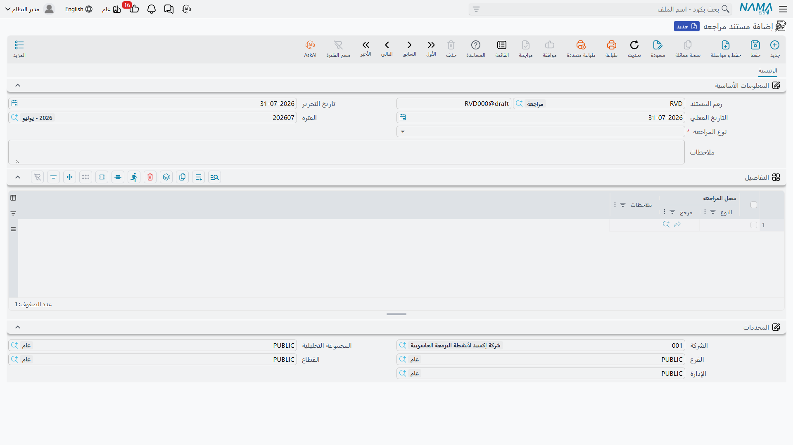
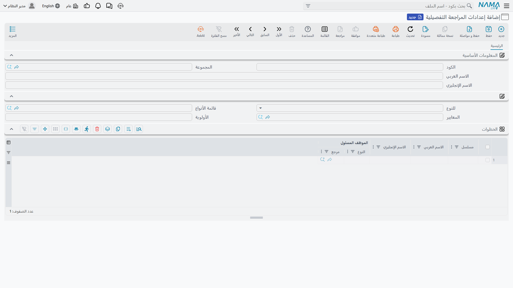

# المراجعة وإلغاء المراجعة

في كل منشأة سجلاتٌ يُفترض أن يطّلع عليها شخص غير الذي أدخلها. أمين المخزن يكتب سند الصرف، ومشرف المخازن يفحصه. المحاسب يسجّل الدفعة، والمدير المالي يمرّ عليها قبل إقفال الشهر. ويعطي النظام هذه اللحظة — لحظة «فحصها أحدهم» — مكاناً رسمياً هو **مراجعة** السجل.

والمراجعة أخفّ عن قصد من دورة الموافقة. فالموافقة تحدث *قبل* أن يُحدث المستند أثره: توجّه المستند إلى أشخاص، وتجمع القرارات، وقد تعيده. أما المراجعة فتحدث *بعد* أن يكون السجل قد اعتُمد وسرى مفعوله، فأثره في الحسابات والمخزون قد وقع بالفعل. وما تضيفه المراجعة هو ختم: اسم شخص، وتاريخ، وقفلٌ يمنع أي أحد من تغيير السجل بعدها بهدوء.

فإن كنت تحتاج قرارات وتوجيهاً فاستعمل [الموافقات](/ar/platform/approvals/approvals-system)، وإن كنت تحتاج علامة «فُحص وخُتم» على سجلات سارية بالفعل فالمراجعة هي الأداة.

## ماذا يحدث حين تراجع سجلاً

يجب أن يكون السجل **معتمداً** أولاً. فالمسودة لا تُراجع — وسيخبرك النظام بأن السجل مسودة — والسجل الجالس في دورة موافقة لا يُراجع كذلك، لأن محتواه لم يستقر بعد.

وبمجرد أن تراجع تحدث ثلاثة أمور:

1. **يُقفل السجل.** فأي محاولة لتعديله أو حذفه تُرفض برسالة تقول إن السجل تمت مراجعته. وتصحيح سجل مراجَع يبدأ بإلغاء مراجعته.
2. **يرتفع مستوى المراجعة درجة.** ومعظم التركيبات تستعمل مستوى واحداً فتكفي مراجعة واحدة، أما حيث يلزم أكثر من فحص فيتدرج السجل L1 ثم L2 ثم L3 مع كل اعتماد.
3. **يُسجَّل الحدث.** فالسجل يتذكر من راجعه، ويحتفظ سجل الإجراءات بسطر دائم لكل مراجعة وإلغاء مراجعة، مع المستوى الذي وقعت عليه.

و**إلغاء المراجعة** هو المرآة تماماً: ينزل بالسجل مستوى واحداً، وحين يبلغ الصفر يعود السجل قابلاً للتعديل. فمن راجع عند L2 هو من يعيد L2، ويبقى اعتماد L1 تحته حتى يسترده صاحبه.

::: tip المراجعة ليست معالجة
المستند المراجَع أدّى عمله بالفعل — فالقيد المحاسبي والحركة المخزنية وقعا حين اعتُمد. والمراجعة لا تغيّر شيئاً من آثار المستند، وإنما تسجّل أن إنساناً فحصه وتجمّده على تلك الحال.
:::

## كم اعتماداً يحتاج السجل

الافتراضي أن كل كيان يحتاج واحداً، وتغيّر ذلك من **الإعدادات العامة ← الموافقات والمراجعة**:

- **مستويات المراجعة الافتراضية** تحدد عدد الاعتمادات للكيانات التي ليست لها قاعدة خاصة.
- جدول **مستويات المراجعة** يحددها لكل نوع كيان — وبه تشترط اعتمادين على سند الدفع وواحداً على التحويل المخزني.

وحين يحتاج السجل أكثر من مستوى تعرض الشاشة المستوى الذي بلغه (L1 و L2 …)، أما مع مستوى واحد فلا شيء يحتاج تمييزاً فلا يظهر إلا علامة «تمت المراجعة».

## من يُسمح له بالمراجعة

الصلاحية تأتي من **ملف الصلاحيات** (أو الأسطر المقابلة على سجل المستخدم)، وفي كل سطر كيان أربعة إعدادات تهمّنا هنا:

| الإعداد | ما يتحكم فيه |
|---|---|
| **مراجعة** (Revise) | هل يجوز لهذا الملف مراجعة هذا الكيان أصلاً |
| **مستويات المراجعة** (Revise Levels) | أي المستويات يجوز له أخذها — اتركه فارغاً ليجوز له كلها |
| **إلغاء المراجعة** (Unrevise) | هل يجوز له إلغاء المراجعة |
| **إلغاء مستويات المراجعة** (Unrevise Levels) | أي المستويات يجوز له ردّها — اتركه فارغاً ليجوز له كلها |

وبهذا تقسم تركيبة من مستويين بين دورين: ملف المشرف يأخذ مستويات المراجعة `1`، وملف المدير يأخذ `2`، فلا يقوم أحدهما مقام الآخر.

::: warning قوائم المستويات قوائم لا مدَيات
`1,2,3` تعني المستويات 1 و2 و3. أما `1-3` فلا تعني «من واحد إلى ثلاثة» — بل تُقرأ مستويين فقط هما 1 و3، ويُرفض المستوى 2. فاكتب دائماً كل مستوى تريد السماح به مفصولاً بفاصلة.
:::

## الطرق الأربع للمراجعة

### من السجل نفسه

افتح السجل واستعمل زرّي **مراجعة** و**إلغاء المراجعة** في شريط الأدوات. ويظهر زر المراجعة ما دام في السجل مستوى لم يُؤخذ بعد، ويظهر زر إلغاء المراجعة حين يكون هناك مستوى يمكن ردّه — فعلى سجل ذي مستوى واحد تمت مراجعته سترى زر إلغاء المراجعة وحده.

### دفعةً واحدة من قائمة العرض

حدّد الأسطر التي تريدها في أي قائمة عرض واستعمل زرّي **مراجعة** و**إلغاء المراجعة** في شريط أدوات القائمة. ويُفحص كل سجل على حدة، فالدفعة التي فيها سجل ما زال مسودة تُراجَع بقيتها ويُبلَّغ عن الفشل.

### تلقائياً عند اعتماد السجل

قد يكون «الفحص» هو فعل الاعتماد ذاته، فتريد ختم السجل لحظة حفظه. فعّل **المراجعة مع الحفظ** على مجموعة الملف الرئيسي (للملفات الرئيسية) أو على دفتر المستند أو توجيه المستند (للمستندات)، فتُراجَع كل السجلات المنشأة تحته بمجرد اعتمادها — وتصير من تلك اللحظة غير قابلة للتعديل.

### عبر مستند مراجعة

أزرار المراجعة تعمل على سجل واحد في المرة ولا تخلّف وراءها إلا سطراً في السجل. أما **مستند المراجعة** فيحوّل فعل المراجعة إلى مستند قائم بذاته: يسمّي دفعةً من السجلات، ويحمل تاريخاً ووصفاً وملاحظات لكل سطر، ويمكن طباعته والموافقة عليه ومراجعته تدقيقياً.

وتجده تحت **الأساسيات ← المستندات ← مستند مراجعة**. اختر **نوع المراجعة** — *مراجعة* أو *إلغاء مراجعة* — ثم اسرد السجلات في جدول **التفاصيل**، سجلاً مراجَعاً في كل سطر مع ملاحظات اختيارية. واعتماد المستند يطبّق الإجراء المختار على كل سجل مسرود، وحذفه أو إلغاؤه يعكس ما فعله، فمستند المراجعة المستردّ يسترد معه الاعتمادات التي منحها.

وإن أردت أن تمرّ *كل* المراجعات عبر مستندات فعّل **استخدام مستند المراجعة لكل الكيانات** في الإعدادات العامة، أو علّم الخيار نفسه لأنواع كيانات بعينها في جدول مستويات المراجعة. عندها يتنحّى زر المراجعة المباشر وتعرض قائمة «المزيد» على السجل بدلاً منه **إنشاء مستند مراجعة** و**إنشاء مستند إلغاء مراجعة** و**عرض مستندات المراجعة**.

::: tip المراجعة بالجملة انطلاقاً من استعلام
لحملات التنظيف — «اختم كل فاتورة مبيعات أقدم من يومين» — هناك مسار كيان اسمه [EAReviseUnReviseFromQuery](/entity-flows/core/EAReviseUnReviseFromQuery) يراجع أو يلغي مراجعة كل ما يرجعه استعلام. شغّله من مهمة مجدولة حين تريده أن يجري دون تدخل.
:::

## إعدادات المراجعة التفصيلية: تسمية الخطوات وأصحابها

مستويات المراجعة المجردة تخبرك أن السجل بلغ L2، ولا تخبرك ما هو L2 ولا من كان يفترض أن يأخذه. و**إعدادات المراجعة التفصيلية** تسدّ هذه الثغرة: تصف المراجعة قائمةً قصيرة من الخطوات المسمّاة لكل خطوة صاحبها، ثم يفرض النظام ألا يأخذ الخطوة إلا صاحبها.

وتجد الشاشة تحت **إدارة النظام ← تخصيص شكل النظام ← إعدادات المراجعة التفصيلية**.

### تحديد السجلات التي تشملها القاعدة

| الحقل | ما يفعله |
|---|---|
| **الكود** و**الاسم العربي** و**الاسم الإنجليزي** و**المجموعة** | تعرّف القاعدة، والأسماء هي ما ستميّزها به في سجل المراجعة |
| **للنوع** (For Type) | نوع الكيان الذي تحكمه هذه القاعدة — سند دفع، فاتورة مبيعات، وهكذا |
| **قائمة الأنواع** (Entity Type List) | تستعملها بدل «للنوع» أو معه حين يفترض بقاعدة واحدة أن تحكم عدة أنواع كيانات |
| **المعايير** (Criteria) | تضيّق القاعدة على بعض السجلات — فواتير فوق قيمة، أو فرع واحد، أو فئة عملاء. واتركها فارغة لتشمل القاعدة كل سجلات النوع |
| **الأولوية** (Priority) | ترتيب فحص القواعد المتنافسة |

فحين يوشك سجل أن يُراجَع يجمع النظام القواعد المسجّلة لنوع كيانه، ويمرّ عليها بترتيب **الأولوية** بدءاً من الرقم الأصغر، ويستعمل **أول** قاعدة تحقق السجلُ معاييرها. والقاعدة بلا معايير تطابق كل شيء، فأعطِ قاعدتك الجامعة أكبر رقم أولوية، وإلا ابتلعت السجلات التي قصدت التقاطها بقواعدك الخاصة.

::: warning اعتمد سجل الإعدادات
لا تسري إلا الإعدادات المعتمدة. فالقاعدة المتروكة مسودةً لا تراها عملية المراجعة، ويرتد السجل إلى مستويات المراجعة المجردة الآتية من الإعدادات العامة.
:::

### وصف الخطوات

جدول **الخطوات** هو قلب الشاشة، وكل سطر فيه اعتماد واحد:

| العمود | ما يفعله |
|---|---|
| **مسلسل** (Sequence) | ترتيب الخطوة، والجدول يرقّم لك الأسطر الجديدة |
| **الاسم العربي** / **الاسم الإنجليزي** | اسما الخطوة — «فحص المخازن»، «اعتماد المدير المالي» |
| **الموظف المسئول** (Responsible Employee) | الموظف، أو مجموعة الموظفين، المسموح له بأخذ هذه الخطوة. واتركه فارغاً ليأخذها أي صاحب صلاحية |

وبمجرد أن تسري قاعدة على سجل تتغير أربعة أمور:

1. **يصير عدد الخطوات هو عدد المستويات.** فقاعدة من ثلاث خطوات تعني أن السجل يحتاج ثلاثة اعتمادات مهما قالت الإعدادات العامة لذلك النوع.
2. **يعرض السجل اسم الخطوة بدل رمز المستوى.** فيرى المستخدمون «فحص المخازن» لا L1.
3. **لا يأخذ الخطوة إلا المسئول عنها.** ويُرفض غيره برسالة تسمّي الخطوة التي ليس مسئولاً عنها. وإن كان المسئول مجموعة موظفين أجزأ أي عضو فيها.
4. **تُفتح حالة مراجعة** لتتبع ما بلغه السجل — انظر القسم التالي.

::: warning المسئولية تُفحص على الموظف خلف المستخدم
صاحب الخطوة *موظف*، والفحص يقارنه بالموظف المرتبط بالمستخدم الداخل على النظام. وحساب المستخدم الذي لا موظف مرتبط به لا يوقفه فحص المسئولية، فتأكد أن من يدخلون ليراجعوا مرتبطون فعلاً بسجلات موظفيهم.
:::

### مثال عملي

لنقل إن سندات الدفع فوق 50,000 تحتاج عينين إضافيتين، وما دونها يكفيه فحص واحد.

- قاعدة **DRC-1** بأولوية `1`، للنوع *سند دفع*، بمعايير «القيمة أكبر من 50,000»، وفيها خطوتان: `1 — فحص الخزينة` يملكها مجموعة موظفي الخزينة، و`2 — اعتماد المدير المالي` يملكها المدير المالي.
- قاعدة **DRC-2** بأولوية `99`، للنوع *سند دفع*، بلا معايير، وفيها خطوة واحدة: `1 — فحص الخزينة` تملكها مجموعة الخزينة.

فسند بـ 70,000 يطابق DRC-1 فيحتاج الاعتمادين، ويرى أمين الخزينة «فحص الخزينة» على زر المراجعة. أما سند بـ 4,000 فيسقط إلى DRC-2 وينتهي أمره باعتماد واحد.

::: tip أبقِ قواعد النوع الواحد متسقة
أسماء الخطوات المعروضة لنوع كيان تُؤخذ من قاعدته الأعلى أولويةً، لا من القاعدة التي تسري فعلاً على السجل الذي تنظر إليه. فحين تغطي عدة قواعد نوع الكيان نفسه، يجنّبك توحيد أسماء خطواتها ظهور مسمّيات غريبة على السجلات التي تحكمها القواعد الأخرى.
:::

## متابعة التقدم: سجل المراجعة

كل سجل تشمله قاعدة مراجعة تفصيلية تُفتح له **حالة مراجعة** تتتبع الاعتمادات وهي تَرِد. افتح سجلاً مراجَعاً واختر **المزيد ← عرض سجل المراجعة** لتراها.

وتخبرك الحالة بـ:

- **السجل محل المراجعة** وقاعدة الإعدادات المتبعة
- **المستوى الحالي**، و**الخطوة التالية** باسمها ومسلسلها
- **المطلوب منهم الخطوة التالية** — الموظفون الأفراد الذين يجوز لهم أخذها، مستخرَجين من الموظف المسئول أو مجموعته، فتعرف بالضبط من تتابع
- **تمت** وتاريخ اكتمالها، ويُضبطان حين تُؤخذ الخطوة الأخيرة
- **جدول الخطوات** الذي يسرد كل اعتماد أُعطي: الخطوة، ومن أعطاها فعلاً، وعند أي مستوى، ومتى

وإلغاء المراجعة يحذف آخر سطر من ذلك السجل ويعيد حساب الخطوة التالية، فتظل الحالة مرآةً لواقع السجل بدل أن تتراكم فيها القيود المعكوسة.

## ما الذي يتفاعل مع المراجعة أيضاً

المراجعة وإلغاؤها حدثان معتبران في النظام، ويمكن لخصائص أخرى أن تتعلق بهما:

- **مسارات الكيان** يمكن تشغيلها عند المراجعة وعند إلغائها، فتولّد مستنداً تابعاً، أو تختم حقلاً، أو تنادي نظاماً خارجياً لحظة اعتماد السجل.
- **التنبيهات** يمكن إطلاقها على حدثي المراجعة وإلغائها، وهي الطريقة المعتادة لإخبار صاحب الخطوة التالية بأن شيئاً ينتظره.
- **التحقق بالمعايير** يمكن كتابته ليجري تحديداً عند المراجعة وإلغائها، فيمنعك من اعتماد سجل رسب في فحص أخير.
- **سجل الإجراءات** يحتفظ بأثره الدائم لكل مراجعة وإلغاء مراجعة مع المستوى المعني — مستقلاً عن حالة المراجعة، ومتاحاً حتى للكيانات التي لا قاعدة مراجعة تفصيلية لها.
