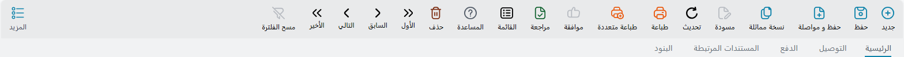
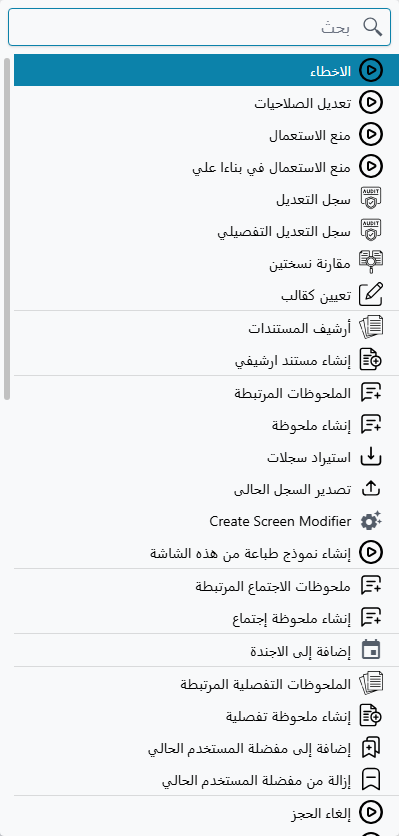
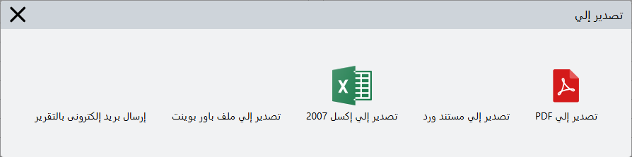
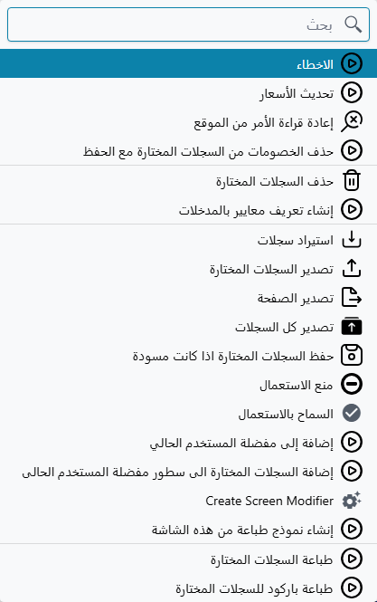

# الأزرار الموجودة في كل شاشة

في نما مئات الشاشات، ولا تكاد واحدة منها تملك أزرارها الخاصة. فاتورة المبيعات وملف الموظف والأصل
الثابت وطلب الصيانة كلها تجلس داخل الإطار نفسه، وهذا الإطار يحمل المجموعات الثلاث نفسها في كل مكان:
شريط أدوات أعلى شاشة التحرير، وشريط أدوات أعلى شاشة القائمة، ومجموعة صغيرة من الأزرار على كل جدول
داخل المستند.

تعلّمها مرة واحدة تكن قد تعلّمت أدوات التحكم في كل شاشة في النظام. فالذي يتغير من شاشة لأخرى ليس
الأزرار، بل أيّها مُفعّل.

## شريط أدوات شاشة التحرير

افتح أي سجل تجد الشريط فوق التبويبات مباشرة.

| الزر | ماذا يفعل | الاختصار |
|---|---|---|
| جديد | يفرغ الشاشة ويبدأ سجلاً جديداً من النوع نفسه | Alt + N |
| حفظ | يحفظ السجل ويعتمده | Ctrl + S |
| حفظ و مواصلة | يحفظ ويعتمد ثم يفتح سجلاً فارغاً جديداً فوراً — الزر الذي تستعمله حين تُدخل دفعة من المستندات واحداً تلو الآخر | Alt + S |
| نسخة مماثلة | يفتح سجلاً جديداً غير محفوظ مملوءاً مسبقاً من السجل الذي أمامك | Ctrl + D |
| مسودة | يحفظ السجل دون اعتماده لتعود إليه وتكمله لاحقاً | |
| تحديث | يعيد قراءة السجل من الخادم ويتخلص من التعديلات غير المحفوظة | Alt + F5 |
| طباعة | يطبع السجل بنموذج الطباعة الافتراضي الخاص به | Alt + P |
| طباعة متعددة | يفتح نافذة التصدير الموصوفة أدناه | |
| موافقة | يفتح حالة الموافقة لسجل ينتظر قرار أحدهم | |
| مراجعة | يضع علامة «روجع» على السجل — أي فُحص وخُتم | |
| القائمة | يترك السجل ويذهب إلى قائمة سجلات هذا النوع | Ctrl + L |
| المساعدة | يشغّل رسائل المساعدة على الشاشة ويطفئها | |
| حذف | يحذف السجل بعد رسالة تأكيد | Alt + حذف |
| الأول / السابق / التالي / الأخير | يتنقل بين سجلات هذا النوع دون العودة إلى القائمة | Alt + Home / Page Down / Page Up / End |
| مسح الفلترة | يمسح الفلتر الذي ضيّق ما يتنقل بينه الأول والسابق والتالي والأخير | |
| المزيد | يفتح قائمة المزيد | Ctrl + M |

الزر الرمادي ليس خللاً. «مسودة» يظهر رمادياً على سجل معتمد بالفعل، و«موافقة» يظهر رمادياً حين لا شيء
ينتظر قراراً، و«حذف» يختفي تماماً عند مستخدم لا تسمح له صلاحياته بالحذف. الشريط يعرض دائماً الأزرار
نفسها بالترتيب نفسه، وإنما يُخفت ما لا ينطبق منها الآن.

::: tip أسماء الأزرار اختيارية
الكلمات تحت الأيقونات تفضيل شخصي لا جزء ثابت من الشريط. من **التفضيلات ← إظهار أسماء أزرار شريط
الأدوات** تُطفئها فتبقى الأيقونات وحدها، وتكسب بذلك صفاً من المساحة الرأسية على الشاشات الصغيرة. كل
الصور في هذه الصفحة مأخوذة والأسماء ظاهرة.
:::

## قائمة المزيد

كل ما لم يتسع له شريط الأدوات يسكن خلف «المزيد» — وهي قائمة طويلة، لذلك تُفتح ومعها مربع بحث في
أعلاها. كتابة حرفين أو ثلاثة أسرع عادةً من التمرير.

تُبنى القائمة من جديد في كل مرة تفتحها، على ثلاث طبقات. أولاً الإجراءات الخاصة بنوع المستند هذا
تحديداً — في فاتورة المبيعات مثلاً إعادة قراءة الأمر من موقع التجارة الإلكترونية. ثم البنود القياسية
التي يحصل عليها كل سجل. وأخيراً أي تقارير مخصصة ربطها المنفّذ بهذه الشاشة.

والبنود القياسية تستحق أن تعرفها بأسمائها:

| البند | ماذا يفعل |
|---|---|
| الأخطاء | يعيد فتح أخطاء ورسائل الشاشة الحالية بعد أن تكون قد أغلقتها |
| تعديل الصلاحيات | يحدد صلاحية العرض والتعديل والاستعمال على هذا السجل وحده، متجاوزاً الإعداد العام للكيان |
| منع الاستعمال | يعطّل السجل تعطيلاً ليّناً: يبقى في النظام وفي مستنداته القديمة، لكنه يكفّ عن الظهور في قوائم الاختيار عند إنشاء شيء جديد — راجع [منع استعمال سجل](/ar/platform/prevent-usage) |
| منع الاستعمال في بناءاً علي | النسخة الأضيق — يظل السجل قابلاً للاختيار عادةً، لكنه لم يعد صالحاً ليكون المستند المصدر الذي يُولَّد منه مستند آخر — راجع [منع استعمال سجل](/ar/platform/prevent-usage) |
| سجل التعديل / سجل التعديل التفصيلي | من غيّر هذا السجل ومتى وماذا غيّر — انظر [سجل التعديل](/ar/platform/audit-trail) |
| مقارنة نسختين | يضع نسختين محفوظتين من السجل جنباً إلى جنب |
| تعيين كقالب | يحوّل السجل الذي أمامك إلى قالب قيم افتراضية، فتبدأ السجلات الجديدة من هذا النوع مملوءة منه — راجع [قوالب القيم الافتراضية](/ar/platform/default-values-templates) |
| أرشيف المستندات / إنشاء مستند ارشيفي | المستندات المؤرشفة المرتبطة بهذا السجل، وإنشاء واحد جديد |
| الملحوظات المرتبطة / إنشاء ملحوظة | ملحوظات نصية حرة مرتبطة بالسجل. ويتكرر الزوجان نفسهما لملحوظات الاجتماع وللملحوظات التفصيلية |
| إضافة إلى الاجندة | يضع السجل في أجندتك كشيء تعود إليه |
| استيراد سجلات / تصدير السجل الحالى | استيراد جماعي إلى هذه الشاشة، وتصدير السجل الذي تنظر إليه |
| محرر الشاشات (Screen Modifier) | ينتقل بك إلى محرر تصميم هذه الشاشة — انظر [محرر الشاشات](/ar/platform/screen-modifier/) |
| إنشاء نموذج طباعة من هذه الشاشة | يبدأ نموذج طباعة مبنياً على حقول الشاشة التي أنت فيها |
| إضافة إلى / إزالة من مفضلة المستخدم الحالي | يضع السجل في قائمة مفضلتك الخاصة |

وإن كان السجل قد حُفظ أكثر من مرة، تنتهي القائمة بسرد قصير لنسخه الأخيرة، فتطالع نسخة قديمة دون أن
تغادر الشاشة.

وهناك مجموعة أخيرة لا يراها معظم المستخدمين. مجموعة بنود إصلاحية — إعادة اعتماد السجل، وإعادة توليد
تأثيره المحاسبي، وإعادة توليد تأثيره المخزني، وإرجاعه إلى نسخة أقدم، وإظهار معرّفات الحقول الداخلية —
تبقى مخفية حتى يضغط أحدهم **Ctrl + Alt + X**، وهي الطريقة التي يشغّلها بها الدعم الفني لهذه الجلسة
(انظر [اختصارات لوحة المفاتيح](/ar/platform/shortcuts)). هي أدوات إصلاح لسجل اختلّت تأثيراته، لا جزء
من العمل اليومي، وتغادر القائمة ثانيةً بمجرد إعادة تحميل الصفحة.

## الطباعة ونافذة التصدير

«طباعة» يرسل السجل مباشرةً إلى نموذج الطباعة الافتراضي. أما **طباعة متعددة** فيتوقف أولاً ويسألك عما
تريد.

أربعة من الخيارات الخمسة تنتج ملفاً — PDF أو وورد أو إكسل أو باور بوينت. والخامس، *إرسال بريد إلكترونى
بالتقرير*، ينتج المخرج نفسه لكنه يسلّمه إلى نافذة البريد بدل تنزيله، وهو أسرع طريق لإيصال فاتورة إلى
عميل دون حفظ نسخة أولاً.

والزر نفسه، وخلفه النافذة نفسها، موجود في شريط أدوات القائمة. وهو هناك يعمل على السطور التي اخترتها
لا على السجل الذي أنت فيه.

## شريط أدوات شاشة القائمة

لشاشة القائمة شريط أدواتها الخاص، ونصفه تقريباً هو نفسه شريط شاشة التحرير.

«جديد» و«تحديث» و«طباعة» و«طباعة متعددة» و«حذف» و«المزيد» تعني تماماً ما عنته أعلاه، إلا أنها تعمل
على السطور التي أشّرت عليها لا على سجل واحد مفتوح. وما بقي خاص بالقائمة:

| الزر | ماذا يفعل |
|---|---|
| تصدير إلى اكسيل | يرسل الجدول كما هو الآن — بأعمدتك وترتيبك وفلاترك — إلى ملف إكسل |
| مراجعة / إلغاء المراجعة | يختم أو يفكّ ختم كل السطور المختارة دفعة واحدة — انظر [المراجعة وإلغاء المراجعة](/ar/platform/revise-and-unrevise) |
| اتجاه الترتيب | يبدّل بين التصاعدي والتنازلي. واضغط عليه بالزر الأيمن لتختار الحقول التي يجري عليها الترتيب |
| الفلترة والترتيب | يفتح لوحة الفلترة والترتيب |
| أعمدة النتائج | يختار الأعمدة التي يعرضها الجدول |
| ظبط العرض | زران متشابهان يفعلان شيئين مختلفين: الأول يمدّ الأعمدة لتملأ عرض النافذة، والثاني يضبط كل عمود على أعرض قيمة فيه |
| مسح الفلترة | يمسح كل الفلاتر دفعة واحدة ويعيد القائمة إلى محتواها الكامل |

وخلف «المزيد» في شاشة القائمة مجموعة أخرى مبنية على فكرة العمل على مجموعة مختارة.

«حذف السجلات المختارة» و«منع الاستعمال» و«السماح بالاستعمال» كلها تنطبق على السطور المؤشّر عليها.
و*حفظ السجلات المختارة اذا كانت مسودة* يعتمد دفعة من المسودات في مرور واحد. وبنود التصدير الثلاثة
تستحق أن تفصلها في ذهنك: **تصدير السجلات المختارة** يأخذ السطور المؤشّر عليها، و**تصدير الصفحة** يأخذ
الصفحة التي تنظر إليها، و**تصدير كل السجلات** يأخذ نتيجة البحث كاملة. أما **إنشاء تعريف معايير
بالمدخلات** فيحوّل الفلاتر التي ضبطتها إلى فلتر محفوظ قابل لإعادة الاستعمال.

وكل واحد من هذه الإجراءات مشروح بتمامه — ومعه ما يحدث حين يمتنع أحد السجلات المختارة — في
[التعامل مع عدة سجلات دفعة واحدة](/ar/platform/list-views/mass-operations).

## أزرار الجدول

داخل المستند، لكل جدول تفاصيل مجموعته الصغيرة من الأزرار على طرف عنوانه.

قراءةً من اليمين: البحث عن نص داخل الجدول، وإضافة سطر، ونسخ السطر الحالي، ونسخ السطر الحالي مرات
عديدة، وحذف السطر، والانتقال إلى سطر برقمه، وزرا ضبط العرض، وسحب السطور، وسحب الأعمدة، وعرض الأعمدة
المرتّبة، ومسح فلاتر الجدول.

و«النسخ المتعدد للسطور» هو الذي يفوت الناس. يسألك كم نسخة تريد ثم ينشئها كلها دفعة واحدة — فإن كنت
تُدخل عشرين سطراً لا تختلف إلا في كود الصنف، فملء الأول ونسخه تسع عشرة مرة أسرع كثيراً من كتابة الباقي
من الصفر.

ولمعظم هذه الأزرار مقابل من لوحة المفاتيح أسرع ما دامت يداك على الجدول أصلاً: **Insert** يضيف سطراً،
و**Ctrl + Insert** ينسخ سطراً، و**Ctrl + Alt + Insert** يفتح نافذة النسخ المتعدد، و**Ctrl + Delete**
يحذف سطراً. والمجموعة كاملة في [اختصارات لوحة المفاتيح](/ar/platform/shortcuts).

## لماذا يغيب زر

حين لا تجد زراً تتوقعه، فالسبب في الغالب واحد من أربعة.

**الصلاحيات.** الحذف والتصدير والاستيراد وقائمة المزيد نفسها، كل منها مرتبط بصلاحية. والمستخدم الذي
لا يملكها لا يرى الزر أصلاً.

**نوع السجل.** «العرض الشجري» لا يظهر إلا على الملفات الرئيسية التي لها بالفعل تسلسل هرمي. و«مراجعة»
و«إلغاء المراجعة» لا يظهران إلا حيث فُعّلت المراجعة لذلك النوع من السجلات.

**حالة السجل.** «إلغاء المسودة» لا يظهر إلا على سجل سبق اعتماده وفوقه مسودة غير محفوظة. و«سحب طلب
الموافقة» لا يظهر إلا وطلب الموافقة معلّق فعلاً.

**تعديل على الشاشة.** يستطيع المنفّذ أن يضيف إجراءات إلى الشاشة وأن يخفي ما لا يستعمله العميل. فإن
غاب زر على نظام عميل ووُجد على نظام آخر، فهذا هو السبب عادةً — انظر
[محرر الشاشات](/ar/platform/screen-modifier/).
