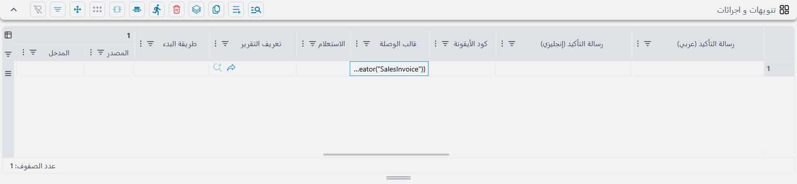
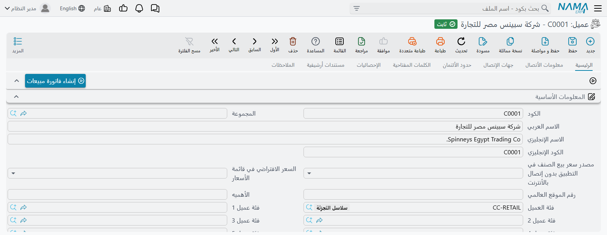
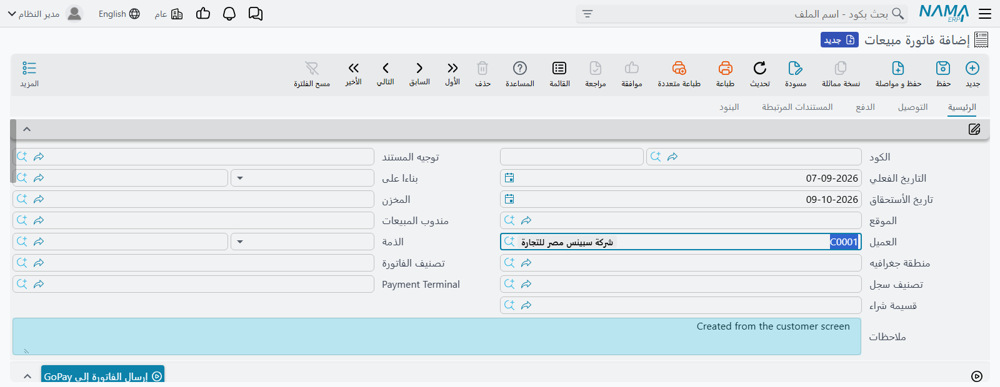

# إضافة أزرار إلى الشاشة

تأتي شاشات نما ومعها الأزرار التي يحتاجها النظام، ولا شيء غير ذلك. وعاجلًا أو آجلًا يطلب أحدهم زرًّا
خاصًّا بطريقة عمل شركته هو: زر في ملف العميل يبدأ فاتورة مبيعات لهذا العميل، أو زر في طلب الصيانة يفتح
الشكوى التي جاء منها، أو زر في بطاقة الموظف يشغّل تقريرًا والموظف مملوء فيه سلفًا، أو زر يشغّل مسار كيان
على المستند المفتوح أمامك.

كل هذه الحالات تخصيصٌ واحد للشاشة: سطر في جدول **تنويهات و اجرائات** داخل
[تعديل الشاشات](/ar/platform/screen-modifier/screen-modifier-overview.md). وهو أنفع جدول في تلك الشاشة
وأقلّها وضوحًا في التسمية — فاسم التبويب **تنويهات و اجرائات**، واسم الجدول نفسه **صلاحيات الإجراءات**،
أما وظيفته الفعلية فهي *إضافة الأزرار*.

::: tip أين تجده
افتح **إدارة النظام ← تخصيص شكل النظام ← تعديل شاشة**، ووجّه السجل إلى الشاشة المطلوبة (**مطبق على** = *نوع
الكيان*، و**للنوع** = *عميل* مثلًا)، ثم انتقل إلى تبويب **تنويهات و اجرائات**. كل سطر تضيفه هناك هو زر.
:::



## ماذا يمكن للزر أن يفعل

يتحدّد السطر بحسب *أي* من أعمدة الإجراء ملأت. املأ واحدًا واترك البقية فارغة.

| إذا ملأت هذا العمود | فإن الزر | 
| --- | --- |
| **تعريف التقرير** | يشغّل تقريرًا وتُغذّى مدخلاته من حقول السجل. ويحدّد **طريقة البدء** كيف يُفتح. |
| **قالب الوصلة** (URL Template) | يفتح وصلة يبنيها النظام من السجل الحالي — بما في ذلك وصلة **تفتح سجلًّا جديدًا مملوءًا مسبقًا**. وهذا ما تشرحه بقية الصفحة بالتفصيل. |
| **مسار الكيان** | يشغّل مسار كيان على السجل. ولا بد أن يحتوي المسار على سطر إجراء *يدوي* واحد على الأقل، وإلا رفض النظام حفظ السجل. |
| **تعريف الإشعار** | يرسل تنويهًا عن السجل — النظير اليدوي للتنويه الذي ينطلق تلقائيًّا. |
| **GUI Post Actions** | يشغّل سلوك شاشة مخصّصًا كتبه المستشار لديك، على أن يكون معرّفًا كيدوي. |
| **إعدادات تحرير متعدد** | يفتح نافذة التحرير المتعدد للصفوف المختارة في القائمة. وهذا الخيار **للقوائم فقط**: تعليم أي من خانات الظهور في شاشة التحرير على السطر نفسه يُرفض عند الحفظ. |
| **معرف الإجراء النظامي** | ليس زرًّا جديدًا أصلًا: يعيد وضع إجراء *نظامي قائم*، فتنقل زرًّا قياسيًّا إلى الصفحة التي تريدها أو تمنحه تسمية وأيقونة مختلفتين. |

## أين يظهر الزر

لا يظهر شيء في أي مكان حتى تطلب ذلك. يحمل كل سطر مفاتيح الظهور الخاصة به، ويمكنك تعليم أكثر من واحد:

| العمود | يضع الزر |
| --- | --- |
| **عرض زر في شاشة التحرير** | في شريط أزرار داخل الصفحة المذكورة في **في الصفحة** — وهذا هو «الزر على الشاشة» المعتاد. |
| **عرض في شريط الأدوات لشاشة التحرير** | في شريط الأدوات الرئيسي لشاشة التحرير، بجوار حفظ وطباعة. |
| **عرض في قائمة المزيد لشاشة التحرير** | داخل قائمة **المزيد** في شاشة التحرير. |
| **عرض في شريط الأدوات لشاشة القائمة** | في شريط أدوات شاشة القائمة. |
| **عرض في قائمة المزيد لشاشة القائمة** | داخل قائمة **المزيد** في شاشة القائمة. |
| **الإظهار في عمود الإجراءات بعرض القائمة** | كزرّ صغير على كل صف من صفوف القائمة. |

وهناك عمودان مطلوبان في كل سطر يتحكّمان في الموضع والتجميع:

- **في الصفحة** — الصفحة (التبويب) التي ينتمي إليها شريط الأزرار. استخدم رقمًا: `1` هو التبويب الأول
  و`2` الثاني. أما النص فيُطابَق باسم الصفحة *الداخلي* لا بالتسمية التي تقرأها على الشاشة، فيسهل أن
  تخطئه — وحين لا يطابق شيئًا يهبط الزر في الصفحة الأولى بصمت بدل أن يظهر خطأ. فالتزم بالأرقام ما لم
  تكن تعرف الاسم الداخلي.
- **الترتيب** — موضعه. السطور التي تحمل الترتيب نفسه تنتهي **في شريط أزرار واحد** جنبًا إلى جنب، بينما
  ترتيب مختلف يبدأ شريطًا جديدًا يوضع في ذلك الموقع بين بلوكات الصفحة. فالزرّان المتلازمان ينبغي أن
  يتشاركا رقم ترتيب واحدًا.

أما بقية السطر فهي شكل الزر والتحكم فيه:

- **العنوان العربى** / **العنوان الإنجليزي** — التسمية. اتركهما فارغين فيستعير الزر اسم ما يشغّله (اسم
  التقرير، اسم المسار، وهكذا) — مريح، لكنك غالبًا تريد صياغتك أنت. و**Resource ID** هو البديل: تشير به
  إلى ترجمة نظامية قائمة بدل كتابة العنوانين.
- **كود الأيقونة** — أيقونة الزر.
- **رسالة التأكيد (عربي)** / **(إنجليزي)** — املأ أيًّا منهما فيسأل الزر «هل أنت متأكد؟» بهذا النص قبل
  أن يفعل شيئًا. ويستحق الإضافة إلى كل ما لا رجعة فيه.
- **Security Id** — يربط الزر بصلاحية إجراء، فيتمكن
  [ملف الصلاحيات](/ar/platform/security/security-profiles.md) من منحه أو منعه لكل مستخدم.
- **تشغيل الإجراء علي** — الزر في الأصل يعمل على السجل الذي تنظر إليه. سمِّ حقل مرجع هنا فيعمل على السجل
  الذي *يشير إليه* ذلك الحقل بدلًا منه. وفي القائمة يعني ذلك أن زرًّا على قائمة الفواتير يمكنه العمل على
  عميل كل صف. ولا يمكن الجمع بينه وبين **معرف الإجراء النظامي**.

## فتح وصلة: عمود قالب الوصلة

عند **قالب الوصلة** يكفّ الجدول عن كونه قائمة بأشياء تُشغَّل، ويصير شيئًا أوسع كثيرًا. فما تكتبه فيه
يُعامَل قالب [تِمبو](/ar/admin/tempo.md)، ويُقيَّم على الخادم في مقابل السجل الذي يفتحه المستخدم، ثم
تُفتح النتيجة بوصفها وصلة.

والشقّ المهم هو «يُقيَّم في مقابل السجل». فأنت لا تكتب عنوانًا ثابتًا، بل قالبًا يستطيع قراءة أي حقل من
السجل المفتوح، بما في ذلك الحقول التي تصل إليها عبر المراجع:

```tempo
https://portal.example.com/customers/{code}?class={customerClass.code}
```

ولأن القالب يُقيَّم في وضع السجل، تعمل المسارات المنقوطة مثل `customerClass.code`. والوصلة التي تبدأ
بـ `http://` أو `https://` تُفتح موقعًا خارجيًّا في تبويب متصفح جديد، وأي شيء آخر يُفهم موضعًا **داخل
نما**. وأضف `{openinnewwindow}` في أول القالب لفرض تبويب جديد في الحالتين.

::: warning لا بد أن يكون السجل محفوظًا
يسلّم الزر الخادمَ هويةَ السجل، فهو لا يعمل إلا على سجل موجود فعلًا. اضغطه على شاشة فيها تعديلات غير
محفوظة فيردّ نما بـ **«Record Must Be Saved»** ولا يفعل شيئًا آخر. احفظ أولًا.
:::

## إنشاء سجل مملوء مسبقًا من زر

هذا ما تفعله فعلًا معظم سطور قالب الوصلة في التطبيقات الحقيقية، وهو جواب السؤال الذي يقود الناس إلى هذه
الصفحة: *كيف أضع زرًّا في شاشة العميل يفتح فاتورة مبيعات جديدة والعميل مكتوب فيها سلفًا؟*

الأداة هي **المُنشئ** (creator) في تِمبو. يبني وصلةً إلى شاشة الإضافة لأي نوع كيان، وقد امتلأت الحقول
التي تسمّيها. وهو **لا يحفظ شيئًا**: يصل المستخدم إلى سجل جديد عادي غير محفوظ، فيراجعه ويكمله ويضغط حفظ
بنفسه.

ضع هذا في **قالب الوصلة** داخل سجل تعديل شاشة موجّه إلى شاشة العميل:

```tempo
{creator("SalesInvoice")}
{f("customer")}{v(code)}
{f("remarks")}{v("Created from the customer screen")}
{endcreator}
```

اقرأه أزواجًا: **`{f("...")}` يسمّي حقلًا في السجل الجاري إنشاؤه**، و**`{v(...)}` الذي يليه مباشرة يعطي
القيمة. النص بين علامتي تنصيص قيمة ثابتة، والنص بلا تنصيص حقل يُقرأ من السجل الواقف عليه المستخدم** —
فـ `{v(code)}` تعني «كود *هذا* العميل».

علّم **عرض زر في شاشة التحرير**، واضبط **في الصفحة** على `1`، وامنحه عنوانًا عربيًّا وآخر إنجليزيًّا،
ثم احفظ وشغّل **إعادة توليد الشاشات للأنواع المطبق عليها فقط** من شريط الأدوات. عندها يظهر الزر في
التبويب الأول للعميل:



اضغطه، فتُفتح فاتورة مبيعات جديدة والعميل محلول والملاحظات مملوءة:



::: tip الزر الجديد لا يظهر قبل إعادة تحميل المتصفح
إعادة التوليد تبني الشاشة من جديد على الخادم، لكن جلسة المتصفح المفتوحة عندك ما زالت تحمل العرض القديم —
والانتقال إلى شاشة أخرى والعودة لا يكفي. حدّث الصفحة (F5) فتجد الزر.
:::

### ملء حقول المراجع

يُضبط حقل المرجع بـ **كوده**، تمامًا كما يكتبه المستخدم:

```tempo
{f("book")}{v("SVI02")}
{f("term")}{v("INV-02")}
{f("salesMan")}{v(salesMan.code)}
```

أما المرجع **العام** — الذي يمكن أن يشير إلى أنواع مختلفة، مثل *بناءً على* — فيحتاج مدخلين، النوع والكود،
يُكتبان بعلامة `#`:

```tempo
{f("fromDoc#type")}{v(EntityType)}
{f("fromDoc#code")}{v(code)}
```

و`EntityType` و`code` هنا يُقرآن من السجل الحالي، فيعني هذا الزوج «اجعل حقل *بناءً على* في المستند الجديد
يشير إلى السجل الذي ضغطت الزر وأنا فيه» — وهي الطريقة القياسية لبناء سلسلة مستندات مترابطة.

### أين يُفتح السجل الجديد

يقبل `{creator(...)}` عدة خيارات بين قوسيه:

| الخيار | الأثر |
| --- | --- |
| `newwindow="true"` | يفتح السجل الجديد في تبويب متصفح جديد ويترك الشاشة الأصلية كما هي. |
| `newwindow="popup"` | يفتحه في نافذة منبثقة داخل نما، فلا يغادر المستخدم الشاشة أصلًا. |
| *(محذوف)* | ينتقل بالتبويب الحالي إلى السجل الجديد. |
| `menu="..."` | يفتح السجل الجديد تحت مدخل قائمة بعينه، وهو ما يهمّ حين يقع نوع المستند نفسه تحت أكثر من قائمة. |
| `view="..."` | يفتحه بعرض شاشة مسمّى بعينه. |

وهذا سطر كامل كما يظهر في التطبيقات الفعلية:

```tempo
{creator("StockTransfer",newwindow="true")}
{f("book")}{v("VST")}
{f("fromDoc#type")}{v(EntityType)}
{f("fromDoc#code")}{v(code)}
{f("remarks")}{v(remarks)}
{endcreator}
```

ويوثّق [دليل تِمبو](/ar/admin/tempo.md) المُنشئ كاملًا، بما فيه العدّادات والحلقات لبناء **بنود** المستند
الجديد من بنود المستند الواقف عليه.

::: warning صفٌّ واحد في كل مرة على شاشة القائمة
زرّ قالب الوصلة الموضوع على شاشة قائمة يعمل على كل صف اخترته، لكن وصلةً واحدة فقط هي التي تُفتح في
النهاية. عامل هذه الأزرار بوصفها أدوات لسجل واحد واختر صفًّا واحدًا.
:::

## تشغيل الوصلة من استعلام بدل السجل

يغيّر عمود **الاستعلام** مصدر قيم القالب. اتركه فارغًا فيقرأ القالب حقول السجل، وهو ما يفترضه كل ما سبق.
املأه فيشغّل نما استعلامك أولًا ويقيّم القالب في مقابل **النتيجة** بدلًا من ذلك — عندها تشير المتغيّرات
إلى الأعمدة التي أعادها الاستعلام لا إلى حقول الشاشة. ولا تلجأ إليه إلا حين تكون القيمة المطلوبة في
الوصلة غير موجودة على السجل ولا سبيل إلى استخراجها إلا باستعلام.

## اقرأ أيضًا

- **[نظرة عامة والمفاهيم](/ar/platform/screen-modifier/screen-modifier-overview.md)** — النطاق والأولوية
  وكيف تعيد توليد الشاشات ليظهر أثر تغييراتك.
- **[تعديلات شاشة التعديل](/ar/platform/screen-modifier/screen-modifier-edit-screen.md)** — بقية جداول
  السجل نفسه.
- **[دليل لغة تِمبو](/ar/admin/tempo.md)** — لغة القوالب كاملة، والمُنشئ من ضمنها.
- **[أزرار كل شاشة](/ar/platform/screen-buttons.md)** — الأزرار القياسية التي سيقف زرّك الجديد بجوارها.
