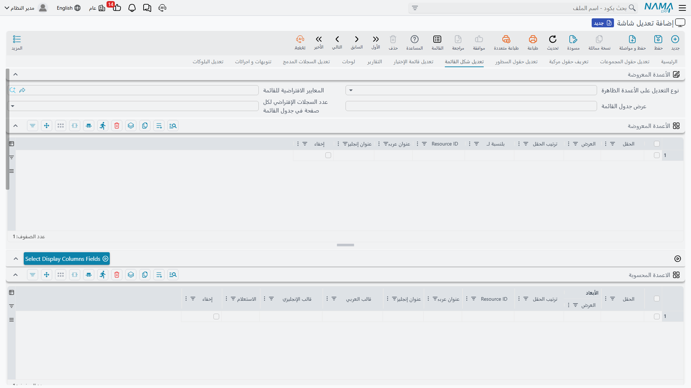
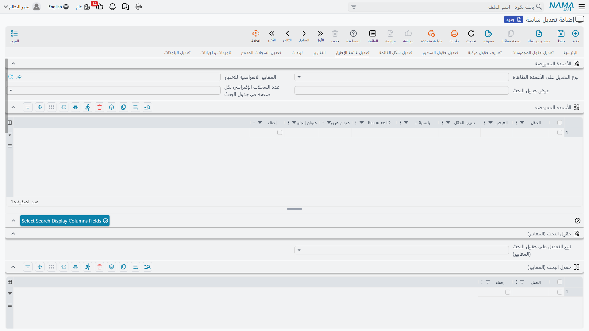

<rtl>

# تعديل الشاشات — قائمة العرض ونافذة الاختيار

إلى جانب شاشات التعديل، يمكن لتعديل الشاشة أن يعيد تشكيل المكانين اللذين تُعرض فيهما السجلات في *قوائم*:

- **قائمة العرض** — الجدول الكامل الذي تفتحه لتصفّح سجلات نوع ما وفلترتها وإدارتها، و
- **نافذة الاختيار** (البحث) — النافذة الأصغر التي تظهر حين تختار قيمة لحقل مرجع على شاشة أخرى.

يُضبط الاثنان بمجموعتين متوازيتين من الجداول: جداول قائمة العرض، ومجموعة مقابلة مخصّصة لنافذة الاختيار. وكلاهما يعمل بالطريقة نفسها، فإذا فهمت إحداهما فهمت الأخرى.

كما في شاشة التعديل، تُدخل كل عمود أو حقل بـ**معرّف الحقل** (مسار الخاصية، مثل `customer.name`)، لا بعنوانه، وتكون الاقتراحات مقيّدة بالأنواع المحددة في **للنوع** / **لقوائم أنواع**.

## استبدال أم إضافة — نوع التعديل

تأتي عدة من هذه الجداول مصحوبةً بحقل **نوع التعديل** المرافق الذي يقرّر كيف تتفاعل قائمتك من الأعمدة/الحقول مع الموجودة سابقًا:

- **تعديل (حذف الموجود سابقاً وإضافة ما يتم تحديده فقط)** — يتجاهل المجموعة الحالية كليًا ويستخدم *فقط* ما تُدرجه. اختره لتتحكم تحكمًا كاملًا في الأعمدة الظاهرة مثلًا.
- **إضافة إلى الموجود سابقاً** — يُبقي المجموعة الحالية ويُلحق بها ما تضيفه.

يظهر هذا الاختيار على الأعمدة الظاهرة والمعايير والترتيب وحقول «البحث عن»، ولكلٍّ حقل نوع تعديل خاص به.

## قائمة العرض

| الإعداد | ما الذي يتحكم فيه |
| --- | --- |
| **الأعمدة الظاهرة** + *نوع التعديل على الأعمدة الظاهرة* | الأعمدة المعروضة في جدول القائمة وترتيبها وموضعها (نسبةً إلى عمود موجود). |
| **حقول المعايير** + *نوع تعديلها* | الحقول المتاحة كفلاتر في لوحة بحث القائمة. |
| **حقول الترتيب** + *نوع تعديلها* | الحقول التي تُرتَّب القائمة بحسبها. |
| **نوع الترتيب الافتراضى** | هل الترتيب الافتراضي **تصاعدي** أم **تنازلي**. |
| **نوع الترتيب الافتراضى (لنافذة الاختيار)** | الاختيار نفسه تصاعدي/تنازلي، لكن لنافذة الاختيار. |
| **الفلترة السريعة** | شرائح فلترة بضغطة واحدة تظهر أعلى القائمة، تستند كلٌّ منها إلى تعريف معايير محفوظ، فيضيّق المستخدمون القائمة دون بناء فلتر يدويًا. |
| **الاعمدة المحسوبة** | **أعمدة محسوبة** — أعمدة إضافية تُحسب قيمها من قالب بدل قراءتها مباشرةً من حقل واحد. |
| **عدد السجلات الإفتراضي لكل صفحة في جدول القائمة** | عدد السطور التي تحمّلها القائمة في الصفحة الواحدة افتراضيًا. |
| **عرض جدول القائمة** | العرض الافتراضي لجدول القائمة. |
| **المعايير الافتراضية للقائمة** | تعريف معايير يُطبَّق تلقائيًا كلما فُتحت القائمة، فيبدأ المستخدمون من عرض مُفلتَر مسبقًا. |

## نافذة الاختيار (البحث)

تعكس هذه الإعدادات إعدادات قائمة العرض، لكنها تنطبق على النافذة المستخدمة لاختيار قيمة مرجع:

| الإعداد | ما الذي يتحكم فيه |
| --- | --- |
| **الأعمدة الظاهرة للبحث** + *نوع تعديلها* | الأعمدة المعروضة في نافذة الاختيار. |
| **حقول معايير البحث** + *نوع تعديلها* | حقول الفلترة المتاحة داخل النافذة. |
| **حقول ترتيب البحث** + *نوع تعديلها* | ترتيب السجلات داخل النافذة. |
| **حقول البحث (تستعمل لحقل البحث عن)** + *نوع تعديلها* | الحقول التي يشملها صندوق **البحث عن** النصي الوحيد في النافذة — أي الأعمدة التي يُطابَق بها نص البحث المكتوب. |
| **الفلترة السريعة لقائمة الإختيار** | شرائح الفلترة السريعة لنافذة الاختيار. |
| **الاعمدة المحسوبة لقائمة البحث** | الأعمدة المحسوبة لنافذة الاختيار. |
| **عدد السجلات الإفتراضي لكل صفحة في جدول البحث** | عدد السطور في الصفحة الواحدة داخل النافذة. |
| **عرض جدول البحث** | العرض الافتراضي لنافذة الاختيار. |
| **المعايير الافتراضية للبحث** | تعريف معايير يُطبَّق تلقائيًا في كل مرة تُفتح فيها النافذة. |

::: tip
لست مضطرًا لكتابة معرّف كل عمود يدويًا. يحتوي شريط أدوات تعديل الشاشة على إجراءات **Select … Fields** (Select Display Columns Fields، وSelect Search For Fields، وSelect Criteria Fields، وSelect Sort Fields، ونظائرها لجانب البحث) تفتح مُنتقي حقول للنوع الهدف وتملأ الجدول المقابل نيابةً عنك.
:::

## أعمدة المراجع (الكود والاسم والصورة)

حين يشير عمود إلى **مرجع** (مثل `lines.account`) فأنت غالبًا تريد إظهار شيء *عنه*. ألحِق لاحقة بمعرّف الحقل لإظهاره كعمود مستقل:

- **`.code`** — كود المرجع. مثال: `lines.account.code`
- **`.name`** — اسم المرجع. مثال: `lines.account.name`
- **`.image`** — صورة المرجع. مثال: `lines.account.image`

تعمل هذه اللواحق في أي موضع تُدخل فيه معرّف عمود — أعمدة عرض القائمة، وأعمدة عرض البحث، وأعمدة الجداول في شاشة التعديل سواءً بسواء.

## انظر أيضًا

- **[نظرة عامة والمفاهيم](/ar/platform/screen-modifier/screen-modifier-overview.md)** — النطاق والأولوية وكيف تجعل التغييرات تظهر.
- **[تعديلات شاشة التعديل](/ar/platform/screen-modifier/screen-modifier-edit-screen.md)** — لتغييرات شاشة تعديل السجل الواحد.
- **[الفلترة السريعة](/ar/platform/list-views/quick-filters.md)** — مزيد عن بناء شرائح الفلترة السريعة المذكورة أعلاه.

</rtl>
