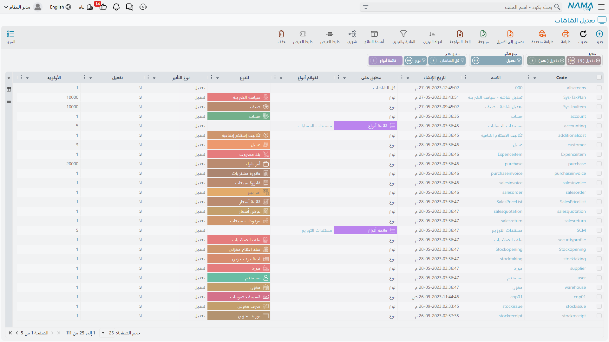
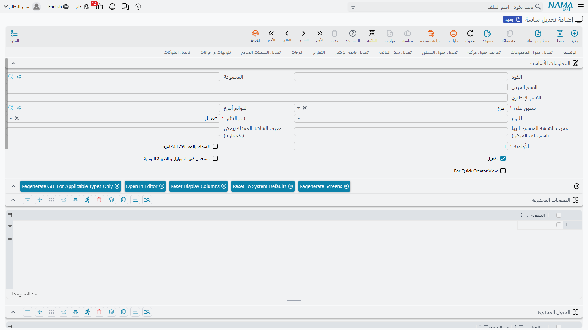

<rtl>

# تعديل الشاشات — نظرة عامة والمفاهيم

كل شاشة في نظام Nama ERP — شاشة تعديل الفاتورة، وقائمة عرض العملاء، والنافذة التي تختار منها صنفًا — تأتي بتصميم افتراضي جاهز. و**تعديل الشاشات** هو الطريقة التي تغيّر بها هذا التصميم في منشأتك دون الحاجة إلى برمجة أو انتظار إصدار جديد.

تخيّله كمجموعة من التعليمات تُضاف فوق الشاشات الافتراضية للنظام. أنت تخبر النظام: «في شاشة فاتورة المبيعات، أخفِ هذين الحقلين، وأعد تسمية هذا التبويب، وأضف عمودًا محسوبًا إلى القائمة، وانقل هذه المجموعة إلى صفحة أخرى». يحتفظ النظام بالتصميم الأصلي كما هو، ويطبّق تعليماتك فوقه في كل مرة تُبنى فيها الشاشة.

تجد تعديل الشاشات من خلال المسار:

> **إدارة النظام ← تخصيص شكل النظام ← تعديل شاشة**

## كيف يتكوّن سجل تعديل الشاشة

يجيب سجل تعديل الشاشة الواحد عن ثلاثة أسئلة:

1. **على أي الشاشات يُطبَّق؟** — يتحكم فيه حقل **مطبق على**.
2. **هل يغيّر الشاشة الحالية، أم يُنتج شاشة جديدة باسم مستقل؟** — يتحكم فيه حقل **نوع التأثير**.
3. **ما الذي يتغيّر بالضبط؟** — تصفه الجداول العديدة داخل السجل (المجموعات المضافة، الحقول المحذوفة، الأعمدة الظاهرة، الفلترة السريعة، وغيرها)، وكلٌّ موثّق في الصفحات المرتبطة أدناه.

أما بقية حقول السجل — الأولوية والتفعيل ومرفقات التوثيق — فتتحكم في **متى** و**هل** تُنفَّذ هذه التعليمات.

## اختيار الشاشات المتأثرة — مطبق على

يحدّد حقل **مطبق على** نطاق التعديل:

| القيمة | ما الذي تستهدفه |
| --- | --- |
| **نوع** (Entity Type) | شاشة واحدة — تختار نوعًا واحدًا بالضبط في حقل **للنوع** (مثل فاتورة المبيعات). |
| **قائمة أنواع** (EntityType List) | مجموعة محددة من الشاشات — تُدرج الأنواع في حقل **لقوائم أنواع**، فيطبّق سجل واحد التغيير نفسه على عدة شاشات معًا. |
| **الملفات** (Master Files) | كل شاشات الملفات (العملاء، الأصناف، الحسابات…). |
| **المستندات** (Documents) | كل شاشات المستندات (الفواتير، السندات، القيود…). |
| **كل الشاشات** (All Screens) | كل شاشة في النظام. |

عند اختيار **نوع** يُفعَّل حقل **للنوع** فقط؛ وعند اختيار **قائمة أنواع** يُفعَّل حقل **لقوائم أنواع** فقط. والتبديل بينهما يُفرّغ الحقل الذي لم يعد مستخدمًا.

::: tip
استخدم **نوع** لتغيير موجّه لشاشة واحدة، و**قائمة أنواع** عندما يجب أن يصل التعديل نفسه إلى عدة شاشات مترابطة. واحتفظ بالنطاقات الواسعة **الملفات** و**المستندات** و**كل الشاشات** للتغييرات الشاملة على مستوى النظام — مثل إزالة مرفق من بلوك النقاشات في كل مكان.
:::

::: warning
إجراءان فقط — **Open In Editor** (المحرر المرئي) و**Regenerate GUI For Applicable Types Only** — يعملان حين يكون **مطبق على** بقيمة **نوع** أو **قائمة أنواع**، لأنهما يحتاجان إلى قائمة محدّدة من الأنواع. ولا يعملان مع النطاقات الواسعة (كل الشاشات / الملفات / المستندات).
:::

## تعديل الشاشة أم نسخها — نوع التأثير

لحقل **نوع التأثير** قيمتان:

- **تعديل** (Modify) — يغيّر الشاشة التي يراها المستخدم بالفعل. تُطبَّق تعليماتك فوق العرض الافتراضي، ويستمر المستخدمون في فتح الشاشة نفسها وقد تغيّرت.
- **نسخ** (Copy) — يترك الشاشة الأصلية دون مساس ويُنتج **عرضًا جديدًا باسم مستقل**. عند اختيار **نسخ** يُفعَّل حقل **معرف الشاشة المنسوخ إليها (اسم ملف العرض)** لتمنح العرض الجديد كوده الخاص. وهكذا تقدّم نسخة *بديلة* من الشاشة (مثل تخطيط مبسّط لإدخال البيانات) إلى جانب القياسية.

أما حقل **معرف الشاشة المعدلة** فيتيح لك تحديد العرض الموجود الذي تبدأ منه تغييراتك، حين يكون للشاشة أكثر من عرض معرّف.

## الأولوية والتفعيل

- **الأولوية** *(مطلوب)* — عند انطباق عدة تعديلات على الشاشة نفسها تُنفَّذ بترتيب الأولوية. تُطبَّق التعليمات الأقل أولوية أولًا ثم الأعلى أولوية بعدها، فالأولوية أداتك للتحكم في أي تغيير «يفوز» حين يلمس تعديلان الجزء نفسه من الشاشة.
- **تفعيل** — لا تُحمَّل التعديلات ولا تُطبَّق إلا المُفعَّلة منها. وترك هذا الحقل دون تفعيل طريقة آمنة لإبقاء التعديل جانبًا أثناء بنائه أو اختباره دون التأثير على شاشات أحد.
- **السماح بالمعدلات النظامية** — لا يهمّ إلا حين تكون قد أعدت تصميم هذه الشاشة في [المحرر المرئي للتخطيط](/ar/platform/screen-modifier/screen-modifier-visual-editor.md). فعادةً، بمجرد حفظ تصميم مرئي مبنيّ يدويًا، يعامله النظام كالكلمة الأخيرة ويتوقف عن إضافة إضافاته التلقائية إلى تلك الشاشة — مثل جدول روابط «المستندات المرتبطة»، أو البلوكات الخاصة بالموديول التي كان سيحقنها. فعّل هذا الخيار لإبقاء تلك الإضافات التلقائية فوق تصميمك، تمامًا كما تظهر في شاشة لم تفتحها في المحرر. ولا أثر له على تعديل مبنيّ من الجداول العادية فقط.

## أنماط خاصة للشاشات

تستهدف بعض الخيارات شاشات غير شاشة التعديل المكتبية المعتادة:

- **تستعمل في الموبايل و الاجهزة اللوحية** — يُطبَّق التعديل على عرض الشاشة في الموبايل/الأجهزة اللوحية بدل عرض سطح المكتب.
- **For Quick Creator View** — يُطبَّق التعديل على نافذة الإنشاء السريع المُصغّرة المستخدمة لإنشاء سجل مباشرةً من شاشة أخرى.

## أكواد العرض — تجاوز الافتراضي

داخليًا، تُخزَّن كل شاشة تحت **كود عرض**. ويستخدم التصميم المدمج في النظام الكود `default`. ويمكنك تجاوزه بطريقتين:

- أنشئ عرضًا بالكود **`dbdefault`** لتجاوز الافتراضي على مستوى قاعدة البيانات كلها.
- أنشئ عرضًا بالكود **`legalentitycodedefault`** (مع استبدال `legalentitycode` بكود الشركة الفعلي) لتمنح *شركة بعينها* عرضها الافتراضي الخاص.

::: warning
تذكّر دائمًا تغيير المسار/الكود ليطابق الكود الجديد الذي تستخدمه. فالعرض المحفوظ بكود خاطئ ببساطة لن يُلتقَط.
:::

## حفظ التعديل في كتالوج التجهيز

عندما تبني تعديلًا تريد إعادة استخدامه عبر عدة منشآت، فعّل **الحفظ في كتالوج التجهيز** واختر **كتالوج التجهيز** الهدف. عندها يُخزَّن التعديل في ذلك الكتالوج لنقله إلى قواعد بيانات أخرى بدل إعادة بنائه يدويًا. وحقول **الصورة** و**عينة PDF** و**المرفقات** و**الكيان المرتبط** و**مرتبط بالموديول** هي بيانات توثيقية تُرافق التعديل في الكتالوج.

## كيف تجعل تغييراتك تظهر

لا يغيّر تعديل الشاشة شيئًا لحظة حفظه. فالحفظ يسجّل *تعليماتك* فقط — أما الشاشات نفسها فتُبنى (وتُخزَّن مؤقتًا) بشكل منفصل، لذا عليك أن تطلب من النظام إعادة بنائها. والإجراءات الموجودة في شريط أدوات تعديل الشاشة تفعل ذلك بالضبط:

| الإجراء | ما الذي يفعله |
| --- | --- |
| **Regenerate Screens** | يعيد بناء **كل** الشاشات، مطبّقًا الإعدادات الافتراضية للنظام مع كل تعديلات المستخدم المُفعَّلة. استخدمه بعد تغيير قد يطال شاشات كثيرة. |
| **Regenerate GUI For Applicable Types Only** | يعيد بناء الشاشات التي ينطبق عليها هذا التعديل فقط. أسرع وأأمن للتغيير الموجّه. *(فقط لنطاقَي نوع / قائمة أنواع.)* |
| **Reset To System Defaults** | يتجاهل تخصيصات المستخدم ويعيد بناء الشاشات من الإعدادات الافتراضية للنظام فقط. استخدمه للعودة إلى حالة نظيفة كما خرجت من الصندوق. |
| **Reset Display Columns** | يعيد بناء الأعمدة الظاهرة في جدول القائمة من الافتراضي فقط. |
| **Delete Unused Layouts** | ينظّف سجلات العرض التي لم تعد أي شاشة تشير إليها. |
| **Open In Editor** | يفتح الشاشة في [المحرر المرئي للتخطيط](/ar/platform/screen-modifier/screen-modifier-visual-editor.md) لتعيد تصميمها يدويًا. *(فقط لنطاقَي نوع / قائمة أنواع.)* |

::: tip
الإيقاع المعتاد: ابنِ تعديلك أو عدّله ← **احفظ** ← شغّل **Regenerate GUI For Applicable Types Only** ← أعد فتح الشاشة المتأثرة للتأكد. ولا تلجأ إلى **Regenerate Screens** الكاملة إلا حين يكون التغيير واسعًا بما يكفي ليطال شاشات كثيرة.
:::

## إلى أين بعد ذلك

- **[تعديلات شاشة التعديل](/ar/platform/screen-modifier/screen-modifier-edit-screen.md)** — إعادة تشكيل شاشة التعديل: الصفحات والمجموعات والجداول والحقول والإجراءات والمعادلات والمحررات المدمجة وخيارات النقاش.
- **[قائمة العرض ونافذة الاختيار](/ar/platform/screen-modifier/screen-modifier-list-and-search.md)** — تغيير الأعمدة والمعايير والترتيب والفلترة السريعة والأعمدة المحسوبة في القوائم ونوافذ البحث.
- **[المحرر المرئي للتخطيط](/ar/platform/screen-modifier/screen-modifier-visual-editor.md)** — صمّم الشاشة بصريًا واحفظها في تعديل.
- **[أسئلة شائعة](/ar/platform/screen-modifier/screen-modifier-faq.md)**

### فيديوهات

- [تعديل الشاشات — فيديو 1](https://youtu.be/LaBbI6yyIhg?si=exaaxilwJCZRNo2k)
- [تعديل الشاشات — فيديو 2](https://www.youtube.com/watch?v=RX83qUZGr60)

</rtl>
