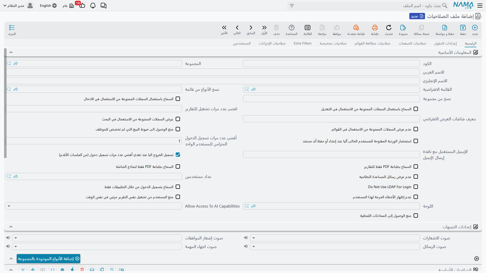
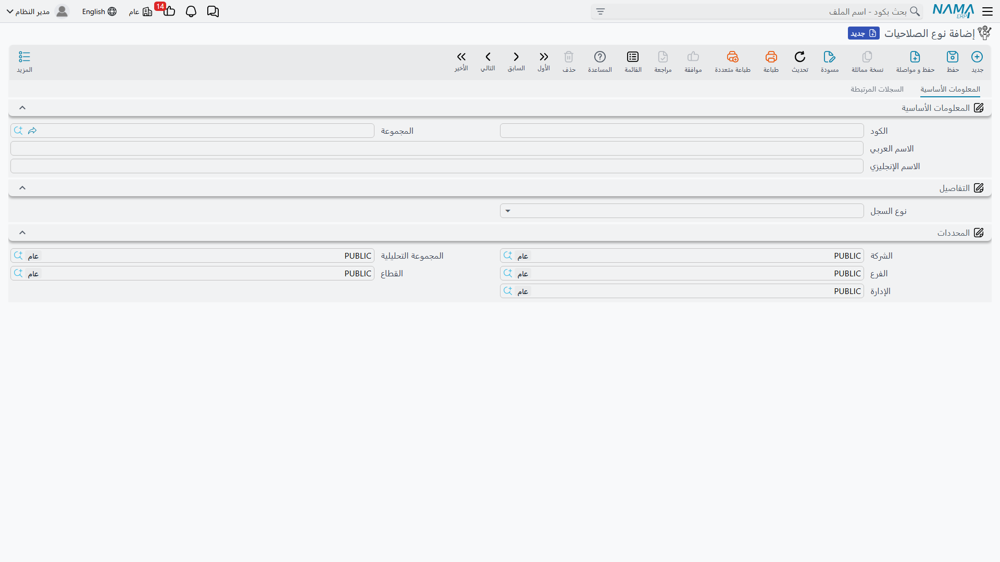
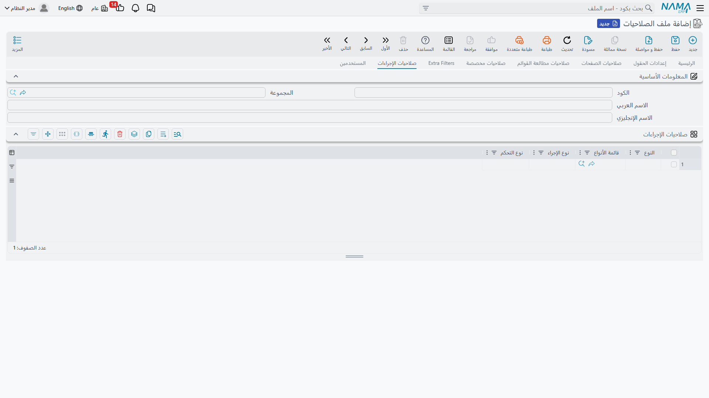

<rtl>

# ملف الصلاحيات (Security Profile)

ملف الصلاحيات هو المكان الذي تعيش فيه معظم إعدادات الصلاحيات لديك. تنشئ ملفاً واحداً لكل دور وظيفي، تملأ جداوله مرة واحدة، ثم تسنده إلى كل مستخدم يقوم بهذا الدور. هذه الصفحة تستعرض شاشة ملف الصلاحيات صفحة صفحة.

**المسار**: إدارة النظام > الصلاحيات > ملف الصلاحيات (Administration > Security > Security Profile)

## صلاحيات كاملة (Full Authority)

أقوى علامة في النظام كله. عند تفعيل **صلاحيات كاملة** يمنح الملف *كل شيء*: كل الأنواع، كل الصلاحيات، كل الحقول، كل الصفحات، كل شاشات العرض. وتُتجاهل بقية جداول الصلاحيات تماماً.

بعض القواعد التي يفرضها النظام حولها:

- ملف الصلاحيات المدمج **default** يجب أن تبقى علامة الصلاحيات الكاملة مفعلة فيه — فهو ملف المستخدم `admin`.
- الملف *بدون* صلاحيات كاملة يجب أن يحتوي على سطر صلاحيات أساسية واحد على الأقل، وإلا فهو لا يمنح شيئاً ويرفضه النظام عند الحفظ.
- ملف الصلاحيات الكاملة لا يمكن أن يحتوي على سطور صلاحيات مطالعة قوائم — فهما متناقضان.

::: tip
حتى مع ملف صلاحيات كاملة، يمكن تضييق رؤية السجلات عبر المحددات على سجل المستخدم ومحددات الدخول — راجع [الصلاحيات على مستوى السجلات](/ar/platform/security/record-level-security.md).
:::

## الصلاحيات الأساسية (Standard Security Lines)

هذا الجدول في الصفحة الرئيسية هو قلب ملف الصلاحيات: سطر لكل نوع كيان (أو مجموعة أنواع) يصف ما يستطيع الدور فعله به.

### تحديد نطاق السطر

كل سطر يبدأ بسؤال "أي أنواع يحكم هذا السطر؟":

- **النوع** — نوع كيان واحد، مثل فاتورة مبيعات.
- **قائمة الأنواع** — سجل *قائمة أنواع (EntityType List)* يجمع عدة أنواع.
- **كلاهما فارغ** — سطر عام (Wildcard) يطابق أي نوع لم يغطه سطر أكثر تحديداً.

عند فحص صلاحية، السطر الذي يسمي النوع بعينه يتقدم دائماً على سطر قائمة الأنواع، الذي يتقدم بدوره على السطر العام. والسطور المكررة لنفس النطاق تُرفض عند الحفظ.

ولست مضطراً لإضافة السطور واحداً واحداً: حقلا **نسخ الأنواع من قائمة (Copy Entities From Menu)** و**نسخ من مجموعة (Copy Entities From Group)** في رأس الشاشة مع زري **إضافة الأنواع الموجودة بالمجموعة / Add From Menu Definition** يولّدون سطوراً لكل الأنواع التي تظهر في قائمة أو مجموعة قوائم — طريقة سريعة لتأسيس دور انطلاقاً من القائمة التي سيستخدمها فعلاً.

### صلاحيات المطالعة

| العمود | المعنى |
|---|---|
| **كل الصلاحيات (Full)** | يمنح كل الصلاحيات على أنواع هذا السطر — "صلاحيات كاملة" على مستوى السطر. |
| **مطالعة السجل (Record View)** | فتح السجل وقراءة تفاصيله. |
| **مطالعة القوائم (List View)** | مشاهدة شاشات القوائم الخاصة بالنوع. |
| **العرض بالبحث (Search View)** | ظهور سجلات النوع في نتائج البحث في الحقول المرجعية. منح مطالعة القوائم يتضمن البحث. |
| **اقل عدد حروف للبدأ بالبحث (Min Search Query Length)** | يجب أن يكتب المستخدم هذا العدد من الحروف على الأقل قبل أن يعيد البحث نتائج — مفيد للملفات الضخمة كالأصناف والعملاء. |
| **مطالعة السجلات التي أنشأها فقط (View Only Created Records)** | لا يرى المستخدم إلا السجلات التي أنشأها بنفسه. راجع [الصلاحيات على مستوى السجلات](/ar/platform/security/record-level-security.md). |
| **السماح بمطالعة سجلات الآخرين عند البحث (Allow View Other Records At Search)** | تلطيف للعلامة السابقة: سجلات الآخرين تظهر في نتائج البحث المرجعي رغم أن شاشاتها ممنوعة عليه. |

### الإضافة والتعديل والحذف

| العمود | المعنى |
|---|---|
| **الإضافة والتعديل (Can Edit)** | مستوى وليس مجرد علامة: **Disabled** (لا كتابة إطلاقاً) ← **Save Draft** (مسودات فقط) ← **Commit** (إنشاء وحفظ، لكن السجل المحفوظ يُقفل) ← **Edit After Commit** (تعديل كامل حتى بعد الحفظ). |
| **تعديل السجلات التي أنشأها فقط (Edit Only Created Records)** | يعدّل فقط ما أنشأه بنفسه. يتطلب مستوى *Edit After Commit*. |
| **الحذف (Can Delete)** | حذف السجلات. |
| **حذف السجلات التي أنشأها (Delete Only Created Records)** | يحذف فقط ما أنشأه بنفسه. يتطلب صلاحية الحذف. |
| **حذف المسودات (Draft Deletion Capability)** | تحكم مستقل في حذف المسودات: **Yes** أو **No** أو **Same As Delete** (نفس صلاحية الحذف). |
| **حذف المسودات التي أنشأها فقط (Delete Only Created Drafts)** | يحذف فقط المسودات التي أنشأها. |
| **منع حفظ مسودة (Prevent Save Draft)** | تعطيل آلية المسودات كلياً لهذا النوع. |
| **منع التعديل/الحذف بعد الطباعة (Prevent Edit/Delete After Print)** | بعد طباعة السجل يُقفل عن التعديل / الحذف. |
| **منع التعديل/الحذف بعد الموافقة (Prevent Edit/Delete After Approval)** | بعد اكتمال مسار الموافقات يُقفل السجل. |
| **منع التعديل أثناء الموافقة (Prevent Modify While Under Approval)** | منع التعديل ما دامت هناك حالة موافقة جارية (راجع [نظام الموافقات](/ar/platform/approvals/approvals-system.md)). |

### الطباعة

| العمود | المعنى |
|---|---|
| **الطباعة (Can Print)** | **Disabled** أو **One** (يُطبع السجل مرة واحدة) أو **More Than One**. |
| **أقصى عدد مرات طباعة (Max Print Count)** | سقف رقمي لعدد مرات طباعة نفس السجل. |
| **منع طباعة المسودات (Do Not Allow Print Drafts)** | المسودات لا تُطبع. |

بدمج هذه الأعمدة مع *منع التعديل بعد الطباعة* تحصل على سياسة محكمة "الطباعة = نهائي" لمستندات مثل الفواتير الرسمية.

### المراجعة (Revision)

المستندات في نما يمكن أن *تُراجع* — أي تُختم كمراجَعة على أحد خمسة مستويات (L1–L5):

| العمود | المعنى |
|---|---|
| **مراجعة (Can Revise)** | يستطيع المستخدم ختم المستندات كمراجَعة. |
| **مستويات المراجعة (Revise Levels)** | المستويات المسموح له بختمها، مثل `1,2` أو `1-3`. |
| **إلغاء المراجعة / مستويات إلغاء المراجعة (Can UnRevise / UnRevise Levels)** | نفس الثنائية لإزالة ختم المراجعة. |

### نقل البيانات ومتفرقات

| العمود | المعنى |
|---|---|
| **نسخة مماثلة (Can Duplicate)** | إنشاء نسخة مماثلة من سجل موجود (مفعلة افتراضياً). |
| **نسخ من / نسخ إلى (Copy From / Copy To)** | السماح بأن يكون النوع مصدراً / هدفاً لميزة "النسخ من كيان آخر". |
| **استيراد / تصدير (Can Import / Can Export)** | استيراد وتصدير سجلات النوع عبر إكسل. |
| **المطالعة من المستند المصدر (Can View With From Doc)** | فتح السجل من مراجع "من مستند" في الشاشات الأخرى. |
| **منع مطالعة الحركات النظامية (Prevent View System Transaction)** | إخفاء الآثار النظامية للسجل (القيود والحركات المخزنية). |
| **منع قائمة المزيد (Prevent View More Menu)** | إخفاء قائمة "المزيد" على شاشات النوع. |
| **تغيير الصلاحية (Can Change Capability)** | السماح بإسناد/تغيير صلاحية على مستوى السجل الواحد (راجع [الصلاحيات على مستوى السجلات](/ar/platform/security/record-level-security.md)). |
| **عرض السجلات الممنوعة من الاستعمال (Display Prevent-Usage Records)** | هل تظهر السجلات الموسومة "ممنوع من الاستعمال" لهذا الدور: **Display** أو **Hide** أو **Same As Config** (حسب الإعدادات العامة). |
| **تعديل/حذف مستندات في ورديات مغلقة (Can Edit/Delete Docs In Closed Shifts)** | خاص بنقاط البيع: السماح بالتعامل مع مستندات تابعة لوردية نقدية أُغلقت. |

## السماح/المنع في القوائم

في الصفحة الرئيسية أيضاً، جدول **السماح/المنع في القوائم** يتحكم في عناصر القوائم التي يراها الدور. كل سطر يستهدف إما نوعاً / قائمة أنواع، **أو** كود عنصر قائمة / كود مجموعة — وليس الاثنين معاً. هذه أنظف طريقة لتقليص قائمة التنقل لكل دور دون إعادة تعريف القوائم.

## صفحة إعدادات الحقول

إخفاء حقول بعينها أو منع تعديلها لكل نوع. مشروحة بالتفصيل في [صلاحيات الحقول والصفحات والقوائم](/ar/platform/security/field-page-listview-security.md).

## صفحة صلاحيات الصفحات

إخفاء صفحات كاملة من شاشة النوع أو جعلها للقراءة فقط.

## صفحة صلاحيات مطالعة القوائم

السماح بشاشات عرض معينة أو منعها.

## صفحة الصلاحيات المخصصة

بعض الفحوصات في النظام ليست عمليات قياسية (إضافة/تعديل/حذف) — بل صلاحيات مسماة خاصة بميزات معينة، تُعرّف كسجلات **نوع الصلاحيات (Capability Types)** من **إدارة النظام > الصلاحيات > نوع الصلاحيات**.

طريقة العمل:

1. عرّف سجل **نوع صلاحيات** (مثلاً "مطالعة التقارير النظامية"، أو صلاحية تُستخدم لوسم السجلات الحساسة).
2. في الصلاحيات المخصصة على ملف الصلاحيات (أو المستخدم) أضف سطراً يمنح هذه الصلاحية، مع إمكانية حصره بنوع أو قائمة أنواع.
3. حيثما يتحقق النظام — أو أي تخصيص — من هذه الصلاحية، يمر حاملوها فقط. وبخلاف الصلاحيات الأساسية لا يوجد منطق سطر عام هنا: إما أنك تحمل الصلاحية أو لا.

تحمل سطور الصلاحيات المخصصة أيضاً مدخلات اختيارية (مرجعان، تاريخان، نصان) يمكن لميزات بعينها تفسيرها — مثل مرجع لمركز تكلفة تسري عليه الصلاحية.

::: info التقارير النظامية
علامة **عرض التقارير النظامية (View System Reports)** في رأس الشاشة منفذة داخلياً كصلاحية مدمجة كودها `SYSTEMREPORTS`. تفعيلها على الملف أو المستخدم يمنح هذه الصلاحية تلقائياً، والتقارير الموسومة *كتقارير نظامية* لا تظهر إلا لحامليها.
:::

## صفحة Extra Filters

فلاتر على مستوى الصفوف تقيّد *أي السجلات* يراها الدور لكل نوع — بمطابقة حقل مع الذمة المتعلقة بالمستخدم، أو بتعبير معايير حر. ولأن هذا موضوع رؤية سجلات، فهو موثق في [الصلاحيات على مستوى السجلات](/ar/platform/security/record-level-security.md).

## صفحة صلاحيات الإجراءات

شاشات الأنواع تحمل إجراءات تتجاوز العمليات القياسية — أزرار توليد، أدوات إعادة احتساب، مسارات كيانات. كل سطر هنا يستهدف نوعاً (أو قائمة أنواع، أو سطراً عاماً) مع **نوع الإجراء (Action ID)** و**نوع التحكم** بقيمة *enabled* أو *disabled*.

منطق الحسم هنا معكوس عن الصلاحيات الأساسية:

- **لا يوجد سطر مطابق ← الإجراء مسموح.** فالإجراءات مفتوحة افتراضياً.
- السطر المطابق يسمح بالإجراء فقط إذا كان نوع التحكم فيه *enabled* — أي أن سطر *disabled* هو طريقة سحب إجراء من الدور.
- نوع الإجراء `*` يعمل كرمز عام لكل إجراءات النوع المستهدف، والسطر الذي يسمي الإجراء صراحة يتقدم على سطر `*`.

لذا فالنمط الشائع: سطر بإجراء `*` و*disabled* لنوع ما (إقفال كل شيء)، مع سطور *enabled* صريحة للإجراءات القليلة التي يحتاجها الدور.

## خيارات رأس الشاشة في الصفحة الرئيسية

إلى جانب الجداول، يحمل رأس ملف الصلاحيات إعدادات افتراضية ومفاتيح تسري على كل مستخدم مسند إليه الملف (معظمها موجود أيضاً على سجل المستخدم حيث تتقدم قيمة المستخدم):

- **الجلسات والدخول**: أقصى عدد جلسات دخول متزامنة مع خيار تسجيل الخروج الآلي لأقدم جلسة، *السماح بتسجيل الدخول من خلال التطبيقات فقط*، و*Do Not Use LDAP For Login*.
- **التقارير والطباعة**: أقصى عدد تقارير يشغلها المستخدم في وقت واحد، *منع المستخدم من تشغيل نفس التقرير مرتين في نفس الوقت*، *السماح بطباعة PDF فقط* للتقارير و/أو لنماذج الشاشة، و*عرض التقارير النظامية*.
- **السجلات الممنوعة من الاستعمال**: السماح باستعمالها في الإدخال/التعديل، وعرضها أو إخفاؤها في البحث والقوائم.
- **الإعدادات الافتراضية**: القائمة الافتراضية، معرف شاشات العرض الافتراضي، اللوحة، الإيميل المستعمل مع نافذة الإرسال كإيميل، أقصى عدد سجلات في صفحة القوائم.
- **ضوابط إعادة المعالجة**: السماح بإعادة حفظ الملفات، إعادة إصدار التأثيرات المحاسبية، إعادة إصدار التأثيرات المخزنية، وإعادة مزامنة الملفات — أربعة مفاتيح (مفعلة افتراضياً) يمكنك سحبها من الأدوار الحساسة.
- **متفرقات**: عدم عرض رسائل المساعدة النظامية، عدم إظهار الأخطاء الحرجة، منع الوصول إلى خيوط البيع التي لم تخصص للموظف، استحضار وردية المستخدم آلياً، الوصول لقدرات الذكاء الاصطناعي، منع الوصول إلى المحادثات اللحظية، وأصوات التنبيهات.

## صفحة المستخدمين

آخر صفحة هي للعرض فقط: قائمة بكل المستخدمين المسند إليهم هذا الملف حالياً، لترى فوراً نطاق تأثير أي تغيير قبل حفظه.

::: warning التغييرات تسري عند الدخول التالي
بيانات الصلاحيات تُحمّل مع الجلسة. عادةً يلتقط المستخدمون تغييرات ملف الصلاحيات عند تسجيل دخولهم التالي — ضع ذلك في الحسبان أثناء الاختبار.
:::

</rtl>
