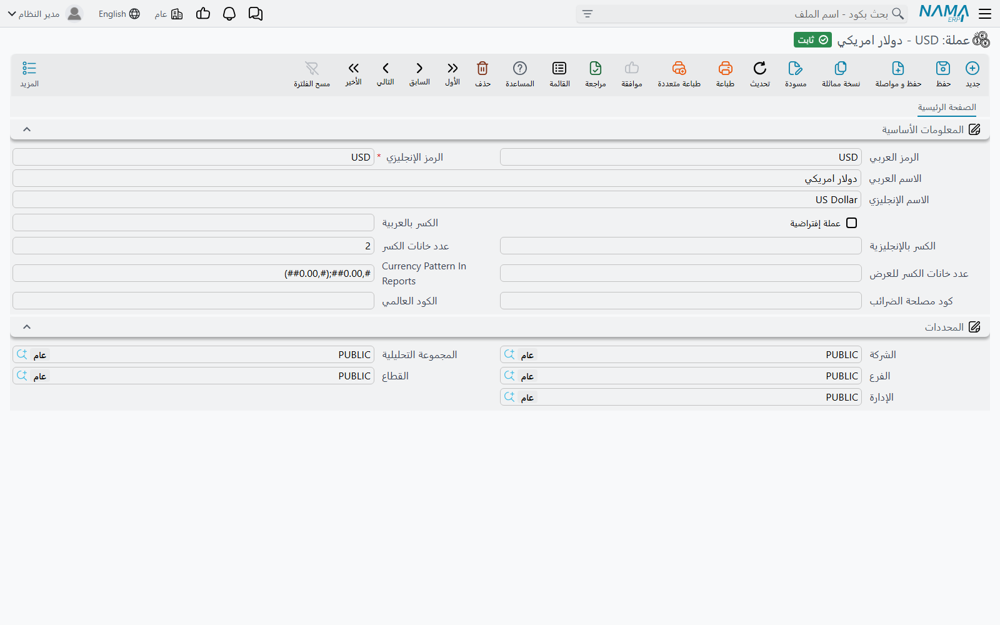
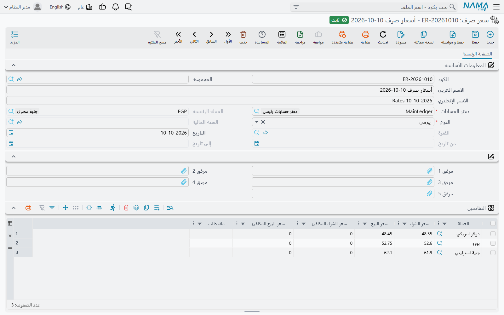

# العملات وأسعار الصرف

«أين أُدخل سعر الدولار اليوم؟» من أول الأسئلة التي تطرحها أي شركة تبيع أو تشتري بعملة أجنبية. والجواب هو شاشة **سعر صرف** (Exchange Rate) — وليس **سند تغيير سعر صرف** (Exchange Rate Update)، فذلك مستند مختلف يعيد تقييم أرصدة موجودة لديك بالفعل. تشرح هذه الصفحة ملف العملة، وشاشة سعر الصرف، وكيف يختار المستند معدّله منها.

## العملة المحلية تأتي من دفتر الحسابات

كل شركة تشير إلى **دفتر حسابات** (Ledger)، و**العملة الرئيسية** في هذا الدفتر هي العملة المحلية للشركة — العملة التي تُمسك بها الدفاتر. وكل مبلغ في المستند يُحفظ مرتين: بعملة المستند نفسها، وك**قيمة محلية** بالعملة الرئيسية. والرابط بينهما هو **المعدل** على المستند: *القيمة المحلية = المبلغ × المعدل*. فمعدل 48.5 على فاتورة بالدولار يعني أن الدولار الواحد يساوي 48.5 من العملة المحلية.

وفي الدفتر أيضًا حقل **عملة التقارير**. يُسجَّل في الدفتر ويُطبع في نموذجه، لكن لا يوجد مستند ولا تقرير يحوّل المبالغ إليها.

بمجرد أن تستخدم شركةٌ الدفترَ تثبت عملته الرئيسية — ويُرفض تغييرها برسالة «لا يمكن تعديل السجل بعد إستخدامه».

## ملف العملة

ملف **عملة** (`الأساسيات ← الملفات ← عملة`، ويظهر أيضًا في قائمة إعدادات الحسابات) يحوي سجلًا لكل عملة. وإلى جانب الكود والاسمين، فيه:

- **الكود الإنجليزي** — كود ثانٍ إلزامي.
- **الكسر بالعربية** / **الكسر بالإنجليزية** — اسم الوحدة الكسرية (قرش، هللة، سنت).
- **عدد خانات الكسر** — عدد الخانات العشرية لمبلغ بهذه العملة. العملة الجديدة تبدأ بـ 2؛ واجعلها 3 للدينار الذي ينقسم إلى 1000 فلس.
- **كود مصلحة الضرائب** و**الكود العالمي** — الكودان اللذان ترسلهما تكاملات الفاتورة الإلكترونية لهذه العملة.

أما كتابة المبلغ بالحروف («ألف جنيه فقط لا غير») فتُضبط منفصلة في صفحة [تفقيط العملات](../global-config/global-config-currencies.md) في الإعدادات العامة.

## شاشة سعر الصرف

شاشة **سعر صرف** (`الأساسيات ← المستندات ← سعر صرف`، وتظهر أيضًا في قائمة مستندات الحسابات) هي مكان إدخال الأسعار. السجل الواحد يحمل أسعار عدة عملات مقابل العملة الرئيسية لدفتر حسابات واحد، لمدة زمنية واحدة:

- **دفتر الحسابات** — إلزامي، و**العملة الرئيسية** تمتلئ منه تلقائيًا.
- **النوع** — مدة صلاحية السجل، وهو ما يحدد حقول التاريخ المتاحة:
  - **يومي** — **التاريخ**.
  - **من تاريخ لتاريخ** — **من تاريخ** و**إلى تاريخ**.
  - **فترة** — **السنة المالية** و**الفترة**.
  - **سنوى** — **السنة المالية**.
- الجدول: سطر لكل **عملة** فيه **سعر الشراء** و**سعر البيع**. اكتب سعر الشراء فيُملأ سعر البيع الفارغ بالرقم نفسه؛ وعمودا **سعر الشراء المكافئ** و**سعر البيع المكافئ** يعرضان المعدل المعكوس (1 ÷ المعدل) للاطلاع.

::: warning سعر الشراء وحده هو المستخدم
المستندات تأخذ **سعر الشراء** — في البيع والشراء على السواء. أما سعر البيع والأسعار المكافئة فللاطلاع فقط.
:::

الشركة التي تغيّر سعرها كل يوم تنشئ سجلًا **يوميًا** لكل يوم. والشركة التي تثبّت السعر طوال الشهر تنشئ سجل **فترة**. ويمكن أن يجتمع النوعان معًا.

## كيف يختار المستند معدّله

حين تختار عملة في مستند، يبحث النظام عن المعدل في دفتر حسابات شركة المستند، بحسب تاريخ القيمة والفترة والسنة المالية، بهذا الترتيب:

1. سجل **يومي** لتاريخ القيمة بالضبط؛
2. سجل **من تاريخ لتاريخ** يقع تاريخ القيمة داخل مداه؛
3. سجل **فترة** لفترة المستند؛
4. سجل **سنوى** لسنته المالية.

أول تطابق هو المعتمد. والعملة التي هي العملة الرئيسية نفسها معدلها 1 دائمًا.

لا يوجد رجوع إلى «آخر سعر سابق». فالسعر اليومي المُدخل يوم 9 أكتوبر **لا** يخدم مستندًا بتاريخ 10 أكتوبر؛ وإن لم يُعثر على تطابق يبقى المعدل فارغًا لتكتبه بنفسك. فإن لم تكن الأسعار تُدخل كل يوم، فاحتفظ بسجل فترة أو سجل سنوى خلف السجلات اليومية كشبكة أمان.

يُجلب المعدل عند اختيار العملة، ثم يصبح حقلًا عاديًا: يمكنك تعديله، ويحتفظ المستند بالرقم الذي حُفظ به. وتصحيح سعر في شاشة سعر الصرف لا يمتد إلى المستندات المحفوظة من قبل. (في توجيه مستند الراتب خيار **تحديث قيمة معدل العملة مع الحفظ** يعيد جلب المعدل عند كل حفظ — راجع [توجيهات الرواتب والمستحقات](../../modules/hr/document-terms/hr-terms-salary-and-dues.md).)

## إعدادات ذات صلة

- **عدد خانات معدل العملة** (الإعدادات العامة، الافتراضي 5) — عدد الخانات العشرية في حقول المعدل. راجع [الإعدادات العامة](../global-config/global-config-general.md).
- **يجب أن تطابق العملة في الذمة عملة الحساب** — راجع [إعدادات الحسابات](../global-config/global-config-accounting.md).
- **إضافة مصدر العملة و المعدل للتوجيه** — يسمح للتوجيه بأن يمدّ المستند بالعملة والمعدل. راجع [إعدادات المستندات](../global-config/global-config-documents.md).
- **Rate Pattern In Reports** — شكل طباعة المعدلات. راجع [إعدادات التقارير](../global-config/global-config-reports.md).

## حين تتحرك الأسعار: إعادة التقييم

شاشة سعر الصرف تغذّي المستندات الجديدة فقط. أما إعادة احتساب القيمة المحلية لرصيد أجنبي قائم لديك فتتم بمستند **سند تغيير سعر صرف**، الموصوف في [سندات القيد والتسويات](../../modules/accounting/journal-entries.md)، مع الخلفية في [الفترات المالية وإقفال الفترات وتعدّد العملات](../../modules/accounting/support/accounting-periods-and-currency.md).

## رسائل قد تظهر لك

معظم هذه الرسائل ليس لها نص عربي في البرنامج، فتظهر بالإنجليزية على الشاشات العربية أيضًا.

| الرسالة | لماذا | ما تفعله |
|---|---|---|
| *There is another record with same date* | يوجد بالفعل سجل يومي لهذا الدفتر وهذا التاريخ. | افتح السجل الموجود وعدّل أسطره. |
| *There is another record with same period* / *There is another record with same year* | الأمر نفسه لسجل فترة أو سجل سنوى. | عدّل السجل الموجود. |
| *Can not specify exchange rate for the main currency* | سطر في الجدول يذكر العملة الرئيسية للدفتر، ومعدلها 1 دائمًا. | احذف السطر. |
| *Currency repeated in line {0}* | العملة نفسها في سطرين. | اترك سطرًا واحدًا لكل عملة. |
| *Fiscal year does not belong to the ledger calendar {0}* | السنة المالية تتبع تقويمًا غير تقويم الدفتر. | اختر سنة من تقويم الدفتر. |
| *Fiscal period does not belong to the selected fiscal year {0}* | الفترة لا تتبع السنة المختارة. | اختر فترة من تلك السنة. |
| «لا يمكن تعديل السجل بعد إستخدامه» | غيّرت العملة الرئيسية أو عملة التقارير أو نوع الشجرة أو التقويم في دفتر تستخدمه شركة. | هذه لا تتغير بعد استخدام الدفتر. |
| «يجب ان تكون العملة عملة الحساب {0} أو العملة المحلية {1}. الحساب {2} - عملة الحركة {3}» | سطر يرحّل إلى حساب بعملة أجنبية معينة بعملة أجنبية أخرى. | استخدم عملة الحساب أو العملة المحلية في ذلك السطر. |
| «المعدل يجب ان يكون 1.0» | سطر بالعملة المحلية معدله غير 1. | اجعل المعدل 1. |
