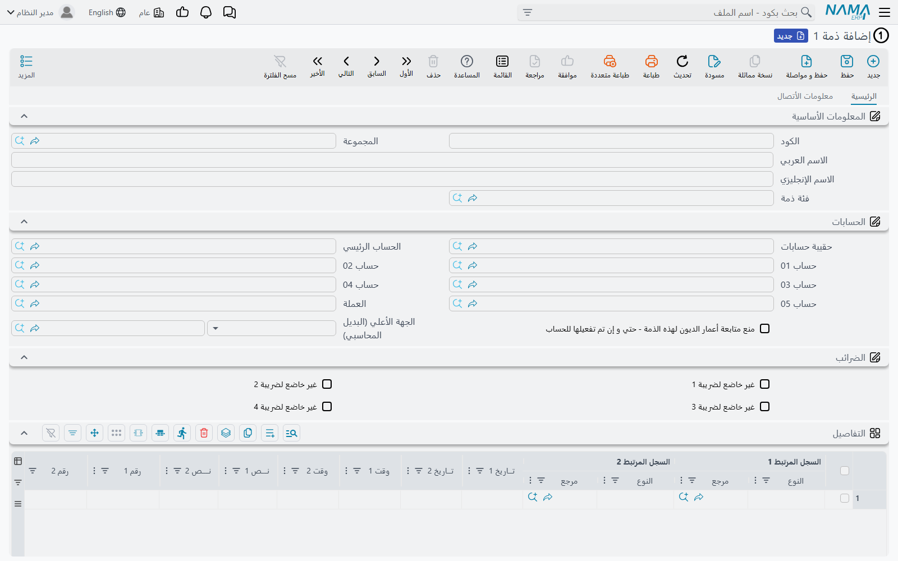
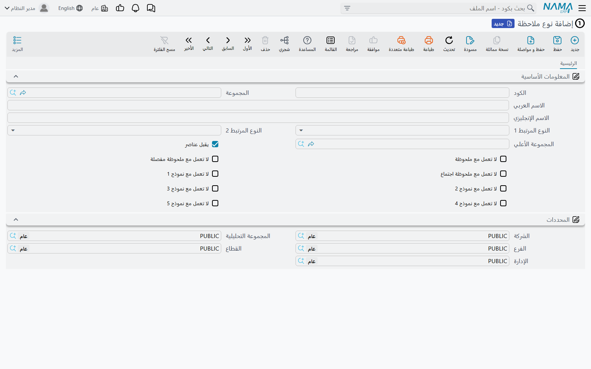

# الملفات الرئيسية الاحتياطية

[النماذج](/ar/platform/form-documents.md) تحلّ مشكلة عميل يحتاج مستنداً لا يحتاجه غيره. والمشكلة نفسها
تظهر على الرفّ الأدنى: أحياناً يكون ما يحتاجه العميل ليس مستنداً بل **ملفاً** — سجلاً لشيء ما، أو قائمة
أطراف، أو كتالوجاً صغيراً لا تملك له أي وحدة في نما شاشة.

شركة نقل تحتفظ بقائمة نقاط التفتيش التي تمرّ بها شاحناتها. عيادة تحتفظ بسجل الجهات المحوِّلة التي ليست
موردين ولا عملاء ولا موظفين. مصنع يحتفظ بقائمة قوالب يملكها عملاؤه. لا شيء من هذا يبرّر ملفاً رئيسياً
جديداً في المنتج — وكل واحد منها سجلٌ من خمسة حقول يحتاج أحدهم أن يختاره من حقل بحث.

يحتفظ نما بمجموعتين من الملفات الرئيسية الاحتياطية لهذا الغرض بالضبط، وهي مخزّنة في ركن القائمة نفسه
مع النماذج:

> **الأساسيات ← الملاحظات**

تبدو المجموعتان متشابهتين ومبنيّتين من مخزون الحقول الاحتياطية نفسه، لكنهما تختلفان في أمر واحد يحسم
أيّهما تستعمل: **إحداهما تستطيع حمل حساب.**

## الذمم من 1 إلى 5 — ملفات احتياطية تستطيع الترحيل لدفتر الأستاذ

عددها خمسة. كل واحد منها ملف رئيسي كامل له كود واسم ومحددات ومخزون الحقول الاحتياطية نفسه الذي يحمله
النموذج — خمسون رقماً، وثلاثون نصاً، وعشرون تاريخاً، وعشرون مفتاحاً، وعشرون حقل مرجع، وخمسة مستويات
تصنيف، وأحد عشر مرفقاً، وأربعة جداول.

وما يميّزها عن أي شيء آخر في هذا الركن من النظام هو وسط الشاشة:

هذه حقول محاسبية حقيقية. فسجل الذمة يحمل **حقيبة حسابات**، و**حساباً رئيسياً**، وعشرين خانة حساب
مرقّمة، وعملة، ومفاتيح إعفاء ضريبي، وطرفاً أباً، وتحكّمه الخاص في تتبّع أعمار الديون — المجموعة نفسها
التي يملكها عميل أو مورد.

وهي ليست زينة. فالذمة 1 حتى الذمة 5 أنواع ذمم حقيقية بالنسبة لدفتر الأستاذ العام: يستطيع قيد اليومية أو
سند القبض أو إعداد الجانب المحاسبي أن يسمّي إحداها تماماً كما يسمّي عميلاً. تتراكم عليها الأرصدة،
وتُتتبَّع عليها أعمار الديون، وتظهر في التقارير المبنية على الذمم.

وهذا يجعلها الخيار الصحيح كلما كان الملف الخاص **طرفاً** — شيئاً يُستحق له أو عليه مال، أو تتراكم عليه
تكاليف. نقاط تفتيش شركة النقل لا تحتاج هذا. أما قائمة قوالب العملاء التي تُحتسب عليها أجور تخزين فتحتاجه
بشدة.

::: tip قيّد أي تصنيف يذهب مع أي ملف
**تصنيف الذمم** (في مجلّد القائمة نفسه) هو تصنيف هذه الملفات، ويحمل مفتاح «غير مستعمل مع» لكل واحدة من
الخمس. اضبطها بحيث لا يمكن اختيار تصنيف مخصّص لسجل القوالب على سجل الجهات المحوِّلة — وهو الانضباط نفسه
الذي يمنع الملفّين من الذوبان أحدهما في الآخر.
:::

والصفحة الثانية من الذمة تحمل كتلة اتصال كاملة — عناوين وهواتف وبريد إلكتروني وتاريخ ميلاد وحالة
اجتماعية وبيانات إقامة وجواز سفر وكتلة ضريبية وبيانات بنكية كاملة بالآيبان والسويفت. فإن كان الملف
الخاص **شخصاً** أو **شركة**، فهذا قدر كبير من البنية تحصل عليه دون إعداد أي شيء.

## عائلة الملحوظات — ملفات احتياطية بلا حسابات

**الملحوظة** و**الملحوظة المفصلة** و**ملحوظة الاجتماع** موثّقة كخاصية لتدوين الملاحظات في صفحة
[الملحوظات والأجندة ومهام العمل](/ar/platform/remarks-and-agenda.md)، وهذا ما تستعملها له أغلب المواقع.
لكنها بنيوياً الشيء نفسه الذي هي عليه الذمة ناقصاً المحاسبة: ملف رئيسي له كود واسم وخمسة مستويات تصنيف
ومخزون الحقول الاحتياطية كاملاً وعشرة جداول في النسختين المفصلة والاجتماع.

فهي تصلح باباً للخروج الآمن أيضاً، وهي الخيار الأفضل حين لا يكون للملف الخاص بُعد مالي:

- حين يكون سجلاً أو قائمة تدقيق أو سجل أحداث لا طرفاً؛
- حين لا يُستحق له أو عليه شيء أبداً؛
- حين لا يحتاج الظهور في حقل بحث الذمم.

استعمل **الملحوظة المفصلة** أو **ملحوظة الاجتماع** حين يكون للسجل أجزاء متكررة، فهاتان تعرضان جدولاً
على الشاشة. أما **الملحوظة** العادية فلا تعرض شيئاً — مع أن الجداول العشرة نفسها تقبع خلفها، فيستطيع
تعديل الشاشة إظهار أحدها إن كنت قد التزمت بذلك الملف أصلاً.

::: warning إعادة استعمال ملف ملحوظات له ثمن
ملفات الملحوظات الثلاثة موصولة بقائمة «المزيد» في كل شاشة في المنتج — «إنشاء ملحوظة» و«الملحوظات
التفصيلية المرتبطة» وغيرها. فإن حوّلت الملحوظة المفصلة إلى **تقرير زيارة موقع** للعميل، صارت كل شاشة في
النظام تعرض إنشاء تقرير زيارة موقع على صنف أو حساب أو مسير رواتب، ولم يعد لتدوين الملاحظات العادي الذي
وُجدت له تلك الأوامر مكان.

وفي موقع يستعمل الملحوظات كملحوظات بالفعل، خذ ذمة أو نموذجاً بدلاً منها. ولا تعد استعمال ملف ملحوظات
إلا حين لا يستعمل العميل هذه الخاصية إطلاقاً — وتحقّق من ذلك بدل أن تفترضه.
:::

## أنواع الملاحظات — التصنيف الذي تشترك فيه كلها

كل الملفات أعلاه، والنماذج معها، تصنّف نفسها عبر الأشجار الخمس المستقلة نفسها: **نوع الملاحظة** حتى
**نوع الملاحظة 5**.

ثلاثة أمور في هذه الشاشة تستحق المعرفة.

**المستويات الخمسة أشجار مستقلة لا هرم واحد.** فنوع الملاحظة 2 ليس «ابناً لنوع الملاحظة 1» — بل تصنيف
منفصل بسجلاته الخاصة. ويستطيع كل مستوى، اختيارياً، أن يشير إلى المستوى الذي فوقه، وعندها تضيق حقول
البحث تبعاً لذلك: اختر نوع ملاحظة، فلا يعرض نوع الملاحظة 2 إلا السجلات التي تسمّيه. وهذا يعطيك تصنيفاً
متدرّجاً حين تريده، وخمس وسوم غير مترابطة حين لا تريده.

**النوع المرتبط 1 والنوع المرتبط 2 يملآن الارتباطات مسبقاً.** يستطيع نوع الملاحظة تسمية نوع السجل الذي
ينبغي أن يشير إليه حقلا المرجع العامّان. اختر ذلك النوع على مستند فيُضبط السجل المرتبط 1 و2 على هذين
النوعين آلياً. وعلى شاشة معاد تشكيلها يكون هذا غالباً كل التقييد الذي تحتاجه — ولا يلزم اللجوء إلى
[أعدادات الحقول و الشاشات](/ar/platform/fields-and-entities-settings/) الأثقل إلا حين تريد الحقل مقفلاً
لا مضبوطاً افتراضياً.

**«يقبل عناصر» يعلّم العقدة الطرفية.** فلا يمكن اختيار إلا الأنواع الموسومة بذلك على السجلات، والباقي
فروع وُجدت لتنظيم الشجرة.

::: warning مفاتيح «غير مستعمل مع» تتوقف عند النموذج 5
صفّ المفاتيح — غير مستعمل مع الملحوظة، وغير مستعمل مع الملحوظة المفصلة، وغير مستعمل مع ملحوظة الاجتماع،
وغير مستعمل مع النموذج 1 … 5 — هو القائمة كلها. فلا مقابل له للنماذج من 6 إلى 16، ولا للذمم.

والأثر العملي أن حقل نوع الملاحظة في النماذج من 6 إلى 16 غير مفلتر: يعرض كل نوع في النظام، طرفياً كان
أو لا. فإن كان نموذج العميل يعتمد على التصنيف، فضعه على أحد النماذج من 1 إلى 5 حيث تعمل الفلترة.
:::

## الاختيار بينها

| إن كان الشيء الخاص… | استعمل |
| --- | --- |
| حدثاً يقع في تاريخ، له رقم وطباعة | [نموذجاً](/ar/platform/form-documents.md) |
| طرفاً — يُستحق له أو عليه مال، أو تتراكم عليه تكاليف | ذمة 1 … 5 |
| سجلاً أو كتالوجاً بلا بُعد مالي، بسطور متكررة | ملحوظة مفصلة أو ملحوظة اجتماع — إن كان الموقع لا يستعملهما كملاحظات |
| سجلاً أو كتالوجاً بلا بُعد مالي وبلا سطور | ملحوظة — بالتحفّظ نفسه |
| طريقة لتجميع أي مما سبق | نوع ملاحظة 1 … 5، أو تصنيف ذمم |

وأياً كان اختيارك، فعمل الإعداد هو نفسه عمل النموذج، و[المثال العملي هناك](/ar/platform/form-documents.md)
ينطبق دون تغيير: غيّر اسم الملف وأسماء حقوله بتغيير الترجمة، وأظهر الحقول التي تحتاجها بتعديل الشاشة،
وقيّد حقول المرجع والنص في أعدادات الحقول و الشاشات، وأضف ما يحتاجه العميل من حساب وتحقق.

والقاعدة من تلك الصفحة تنطبق هنا أيضاً بلا استثناء: **اعرض المتطلَّب على فريق التطوير قبل أن تقرّر أنه
خاص بعميل واحد.**
