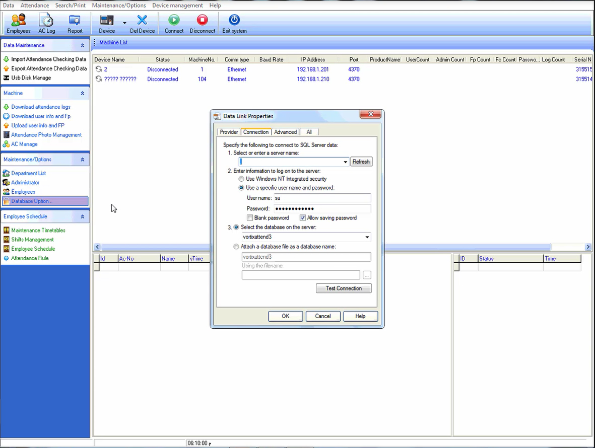
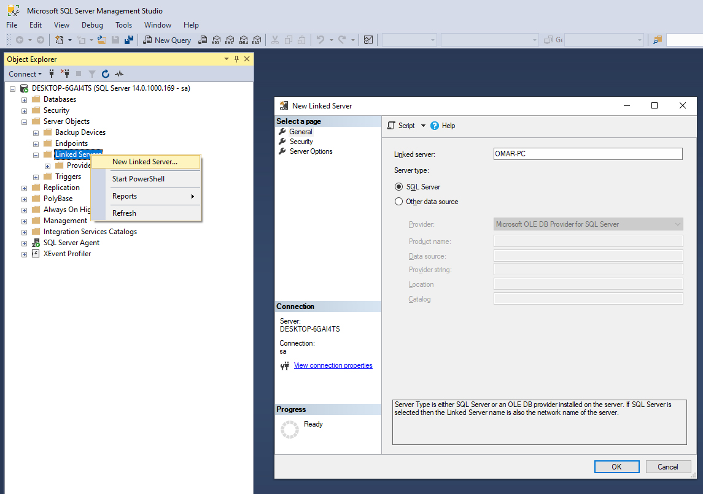
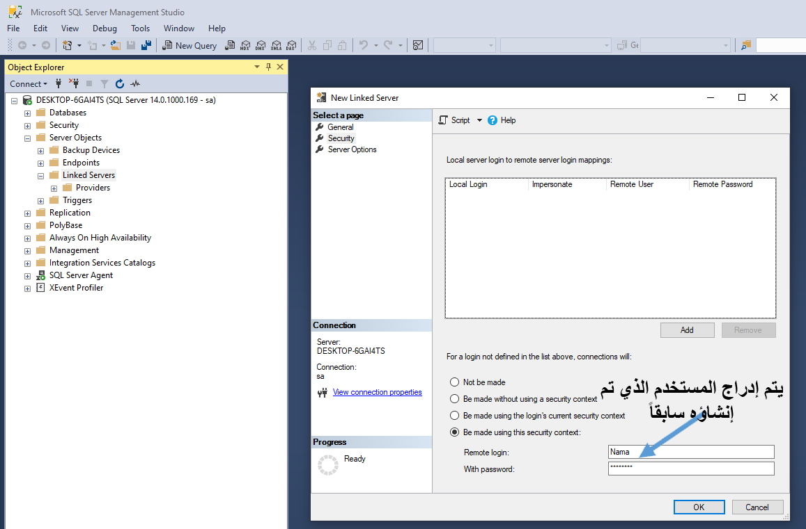
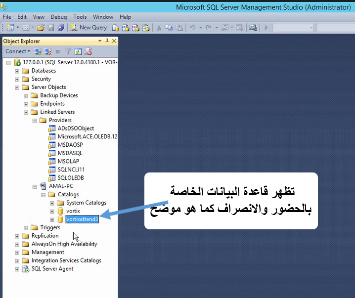

# Integration with Attendance Machines

The system supports two methods for integrating with attendance machines:

1. The first method uses a dedicated application installed on the devices that read fingerprints from the machines.
2. The second method connects the SQL Server database of the machines directly to the SQL Server database of Nama ERP.

## Method 1: The attcron Application

::: tip
This application requires a separate license — please contact the sales or technical support team to obtain a license.
:::

This is a dedicated application installed on devices that have software for importing data from attendance machines.
Its primary function is to fetch data from the local program's database or through the machine program's API, and send it periodically to the system.

### Application Features

* No static IP is required at branches that have attendance machines.
* However, a static IP or any method that allows the application to reach the main Nama ERP server must be available.

### Setup Steps

* Create an API Credentials record in Nama ERP and keep the **Client ID** and **Client Secret**.

* Create a new "Attendance Machine Settings" record and specify:

  * A suitable code
  * A name
  * The connection type

* Set a **CRON Expression** to define when data is read and sent to the system:

  * Example: `5 */1 * * *` will read data every hour at the fifth minute.
  * You can use the following site for help: [https://crontab.guru](https://crontab.guru)

* Set the scheduled task to run after pulling data from the machine:

  * This task fetches data from the fingerprint log table into the time attendance document.
  * To simplify task creation, a button named **Create Scheduled Task** has been added.

### Connection Type

The connection type has three options:

#### ZkBiotime

* Allows transferring fingerprint data from the ZK BioTime software.
* Requires:

  * Machine URL
  * Username
  * Password

#### SQL Server

* Allows transferring data from any machine that supports SQL Server.

* Required settings:

  * **Machine URL**: the SQL Server address — usually `localhost`
  * **Database Port**: the connection port — usually `1433`
  * **Username**: e.g. `sa`
  * **Password**
  * **SQL Query**: the query used to periodically read data from the machine's database
  * **Read For Period Query**: a query used to read data for a specific period when the "Read Attendance For Period" button is pressed in the attcron application
  * **Mapping Lines**: maps the query result columns to what the system needs

    Contains three columns:

    * **Response Field**: the name of the field required by the system.
      Possible values:
      `EmployeeCode`, `firstName`, `lastName`, `department`, `punchTime`, `punchState`, `punchStateDisplay`, `verifyType`, `verifyTypeDisplay`, `gpsLocation`, `areaAlias`, `terminalSN`, `uploadTime`
    * **Column Index**: the column number in the query result
    * **Column Alias**: an alternate column name to use in the SQL statement

* A button named **Default Queries** inserts default queries suitable for ZK machines.

#### Access

* Allows transferring data from a Microsoft Access database.
* Same settings as SQL Server, except:

  * No username, password, or server URL is needed.
  * Instead, specify the **database file path** on the machine where the attcron application will be installed.

### Steps to Install the Attendance Cron Application on a Device

1. Go to the device where the application will run and install:

  * **JDK 21**
  * **Apache Tomcat 10**

2. Configure Tomcat so that `Startup Type = Automatic`.

3. Download the Attendance Cron installer from the following link:

   [https://namasoft.com/bin/nama-attcron-upgrader.jar](https://namasoft.com/bin/nama-attcron-upgrader.jar)

4. Place the file in the Tomcat folder, then run it.

5. After running the file, the application will be downloaded.

6. Open a browser and navigate to:

   `http://localhost:8080/attcron`

7. A page will appear asking you to enter the following information:

  * **Nama Server Address**: enter the Nama server address.
  * **Client Id and Client Secret**: enter the connection credentials you created earlier.
  * **Attendance Machine Config Code**: enter the machine code you specified when creating the settings.

After completing these details, the application is ready to send attendance data to the system.

## Method 2: Direct SQL Server Database Integration

We will demonstrate this example using ZK machines, but this method can be enabled with any machine that stores its data in a SQL Server database.

The machine's attendance software (ZK) is installed on one of the organization's servers.
**It is preferable not to install this software on the same server as Nama ERP**, as the Nama server should be reserved for system administrators and technical support specialists to avoid exposing the system to errors caused by unqualified users.



Through the **Database Options** settings, confirm that the software is configured to work with **SQL Server**.

### If the Software is Installed on the Same Server as Nama ERP:

In this case, the ZK software's database is on the same SQL Server as Nama ERP, so the connection between the two systems is direct and requires no advanced configuration.

### If the Software is Installed on a Different Server:

Follow these steps:

* Obtain the **IP Address** or computer name of the machine that hosts the attendance machine's database.
* Create a new user in the attendance machine's SQL Server with appropriate permissions, for example: `Nama`.
* On the Nama ERP server, create a new **Linked Server** as shown below:



* Under the **Security** tab, configure the settings as shown in the following screenshot:



* After clicking (OK), you can test the connection to the attendance database as follows:



---

### How to Import Attendance Data Using a Scheduled Task

* Create a new record in "Scheduled Tasks" of type "Action".

The execution time can be easily set from the main window based on the employee work schedule.

In the "Action" window, configure the following settings:

* **Class Name**:
  `com.namasoft.modules.humanresource.utils.actions.EATimeAttendanceFromDBImporter`

* **Parameter 1 (SQL Query):**

```sql
SELECT e.attendanceMachineCode USERID, CHECKTIME [(yyyy-MM-dd HH:mm:ss)]
FROM [OMAR-PC].[TATimeAttendance].dbo.CHECKINOUT atm
LEFT JOIN [OMAR-PC].[TATimeAttendance].dbo.USERINFO ui ON ui.USERID = atm.USERID
LEFT JOIN Employee e ON RIGHT('00000000'+e.attendanceMachineCode,8) COLLATE Arabic_CI_AS = RIGHT('00000000'+CAST(ui.BADGENUMBER AS nvarchar(50)),8) COLLATE Arabic_CI_AS
WHERE e.id IS NOT NULL
  AND MONTH(atm.CHECKTIME) = MONTH(GETDATE())
  AND YEAR(atm.CHECKTIME) = YEAR(GETDATE())
ORDER BY 1, 2
```

> Where:
>
> * `OMAR-PC`: the name of the computer where the ZK software is installed
> * `TATimeAttendance`: the database name
> * `CHECKINOUT`: the check-in/check-out table
> * `attendanceMachineCode`: the employee code linked to the fingerprint

* **Parameter 2 (Input Format):**

```
empid#datetime{yyyy-MM-dd HH:mm:ss}#alternatingPunch
```

* **Parameter 3 (Document and Fiscal Period Information):**

```sql
SELECT
  'TA' + CAST(YEAR(GETDATE()) * 100 + MONTH(GETDATE()) AS nvarchar(8)) code,
  'TAB' book,
  YEAR(GETDATE()) * 100 + MONTH(GETDATE()) fiscalPeriod,
  CAST(DATEADD(MONTH, DATEDIFF(MONTH, 0, GETDATE()), 0) AS date) valueDate,
  (SELECT id FROM legalEntity WHERE code = '03') legalEntity
```

::: details JSON for Direct Import

```json
{
  "scheduleType": "Action",
  "className": "com.namasoft.modules.humanresource.utils.actions.EATimeAttendanceFromDBImporter",
  "title1": "Query. eg: SELECT USERID ,CHECKTIME [(yyyy-MM-dd HH:mm:ss)]...",
  "parameter1": "SELECT e.attendanceMachineCode USERID, CHECKTIME [(yyyy-MM-dd HH:mm:ss)] FROM [C.NAMASOFT.COM].[namazk].dbo.CHECKINOUT atm LEFT JOIN [C.NAMASOFT.COM].[namazk].dbo.USERINFO ui ON ui.USERID = atm.USERID LEFT JOIN Employee e ON RIGHT('00000000'+e.attendanceMachineCode,8) COLLATE Arabic_CI_AS = RIGHT('00000000'+CAST(ui.BADGENUMBER AS nvarchar(50)),8) COLLATE Arabic_CI_AS LEFT JOIN Sector s ON s.id = e.sector_id WHERE e.id IS NOT NULL AND MONTH(atm.CHECKTIME) = MONTH(GETDATE()) AND YEAR(atm.CHECKTIME) = YEAR(GETDATE()) ORDER BY 1,2",
  "title2": "Format Formula. eg: empid#datetime{}#type{I-O}#exact#addhours{2}",
  "parameter2": "empid#datetime{yyyy-MM-dd HH:mm:ss}#alternatingPunch",
  "title3": "Document Initialization Query",
  "parameter3": "SELECT 'TA'+CAST(YEAR(GETDATE())*100+ MONTH(GETDATE()) AS nvarchar(8)) code,'TAB' book,YEAR(GETDATE())*100+ MONTH(GETDATE()) fiscalPeriod,CAST(DATEADD(MONTH, DATEDIFF(MONTH, 0, GETDATE()), 0) AS date) valueDate,(SELECT id FROM legalEntity WHERE code = '1') legalEntity",
  "title4": "Save as draft(true,false)",
  "title5": "Data Pre-processor (groovy)",
  "title6": "Ignore Unfound Employees",
  "actionDescription": "Creates attendance doc per period from select"
}
```
:::


::: tip

* The scheduled task automatically imports attendance data **from the first day through the end of the month**.
* The resulting **document code** includes the current year and month for easy identification and later editing.
* If there are a large number of employees, it is preferable to configure the scheduled task to import **weekly** rather than monthly, to reduce load and improve performance.
* To re-import data for a previous month, use the path shown below.
:::

---

## Re-importing Data into a Time Attendance Document

### Why Might We Need to Re-import?

If a time attendance document has been created for a specific month but some days were not recorded (for example, the last two days due to a machine failure), **the old document will not be updated automatically** when fingerprint recording resumes in the new month.

### What Is the Solution?

You can create an **Entity Flow** named `ReImportTimeAttendance` that re-fetches data from the attendance machine's database (such as ZK) and inserts it into the current document manually.

---

### Defining the Re-import Entity Flow

::: details JSON for an entity flow that re-imports time attendance

```json
{
  "code": "ReImportTimeAttendance",
  "name1": "إعادة استيراد بيانات الحضور والانصراف",
  "name2": "Re-import Time Attendance Data",
  "targetType": "TimeAttendance",
  "details": [
    {
      "className": "com.namasoft.modules.humanresource.utils.actions.EATimeAttendanceFromDBImportIntoDocument",
      "title1": "Query. eg: SELECT  USERID ,CHECKTIME [(yyyy-MM-dd HH:mm:ss)],CHECKTYPE...",
      "parameter1": "SELECT e.attendanceMachineCode USERID,CHECKTIME [(yyyy-MM-dd HH:mm:ss)]\nFROM [C.NAMASOFT.COM].[namazk].dbo.CHECKINOUT atm ...",
      "title2": "Format Formula. eg: empid#datetime{}#type{I-O}#exact#addhours{2}",
      "parameter2": "empid#datetime{yyyy-MM-dd HH:mm:ss}#alternatingPunch",
      "title3": "Data Pre-processor (groovy)",
      "title4": "Ignore unfound employees",
      "targetAction": "Manual",
      "description": "Imports attendance into current document"
    }
  ]
}
```

:::

#### Explanation of Key Elements:

* `parameter1`: the custom query to fetch fingerprints from the database based on the specified month and year.
* `parameter2`: the format used to convert data into a format that can be entered into the document (`empid`, `datetime`, `alternatingPunch`).
* `className`: refers to the programming class within the system that executes this import.

---

### Modifying the Time Attendance Document Screen

To show the "Re-import Data" button inside the screen:

::: details Screen Modifier To Add re-import time attendance entity flow to time attendance screen

```json
{
  "applicableFor": "EntityType",
  "forType": "TimeAttendance",
  "actionLines": [
    {
      "inPage": "1",
      "notificationOrder": 2,
      "showButtonInEditScreen": true,
      "showInMoreMenuListScreen": true,
      "showInMoreMenuEditScreen": true,
      "entityFlow": "ReImportTimeAttendance",
      "arTitle": "اعادة استيراد البيانات",
      "enTitle": "اعادة استيراد البيانات"
    }
  ]
}
```

:::

### Notes:

* The button is displayed in the **edit screen** as well as in the **More menu** inside the document screen.
* The button can be used to re-import data.

---

### Creating a Scheduled Task to Calculate Attendance Data

The previous steps fetch fingerprint data into the `TimeAttendance` table.

To calculate tardiness, early departures, overtime, and more, the `EmpAttendanceSysLine` table is used.
This table is populated automatically when payroll is processed, but it can be calculated in advance to prepare reports for employees and their managers.

::: details JSON for Direct Import

```json
{
  "scheduleType": "Action",
  "className": "com.namasoft.modules.humanresource.utils.actions.EAEmpAttendanceSysEntryCalculator",
  "title1": "Select Statement",
  "parameter1": "with data as (select employee_id, cast(min(coalesce(fromDate,toDate)) as date) fromDate, GETDATE() toDate, max(jo.startDate) joStartDate from TimeAttendanceLine l left join Employee e on e.id = l.employee_id left join JobOffer jo on jo.id = e.jobOfferId where jo.id is not null and coalesce(fromDate,toDate) between DATEADD(month,-2,GETDATE()) and GETDATE() group by employee_id union select employee_id, cast(min(coalesce(fromDate,toDate)) as date) fromDate, GETDATE() toDate, max(jo.startDate) joStartDate from ElectronicAttendance l left join Employee e on e.id = l.employee_id left join JobOffer jo on jo.id = e.jobOfferId where jo.id is not null and coalesce(fromDate,toDate) between DATEADD(month,-2,GETDATE()) and GETDATE() group by employee_id) select employee_id, case when min(fromDate)>max(joStartDate) then min(fromDate) else max(joStartDate) end fromDate, case when max(toDate)>max(joStartDate) then max(toDate) else max(joStartDate) end toDate from data group by employee_id",
  "actionDescription": "Creates EmpAttendanceSysEntry Automatically."
}
```

:::

### Recalculating Attendance Data from a Time Attendance Document

In some cases you may need to recalculate attendance data for a period that was previously recorded inside a time attendance document, especially after re-importing fingerprint data from attendance machines.
To achieve this, you can use an Entity Flow based on the `EAEmpAttendanceSysEntryCalculator` object, which recreates entries in the attendance system table (`EmpAttendanceSysLine`).

::: details JSON for re-calculate Employee Attendance System Lines from a Time Attendance Document

```json
{
  "code": "RecalcAttendance",
  "targetType": "TimeAttendance",
  "targetAction": "Manual",
  "details": [
    {
      "className": "com.namasoft.modules.humanresource.utils.actions.EAEmpAttendanceSysEntryCalculator",
      "title1": "Select Statement. The first column must be employee id or code, the second is optional and it should return start date, the third is optional and it should return end date\nExample:- \nwith dates as (\nselect cast(DATEADD(month, DATEDIFF(month, 0, GETDATE()), 0) as date) mstart,cast(DATEADD(s,-1,DATEADD(mm, DATEDIFF(m,0,GETDATE())+1,0)) as date) mend\n)\nselect distinct l.employee_id,mstart,mend from TimeAttendanceLine l left join dates on 1 = 1 where fromDate >=dates.mstart and l.toDate<=mend",
      "parameter1": "select employee_id,cast(min(coalesce(fromDate,toDate)) as date) fromDate,cast(max(coalesce(toDate,fromDate)) as date) toDate from TimeAttendanceLine l\nwhere l.timeAttendance_id = {id} and coalesce(fromDate,toDate) is not null\ngroup by employee_id",
      "targetAction": "Manual",
      "description": "Creates EmpAttendanceSysEntry Automatically."
    }
  ]
}
```

:::

To make this flow available in the user interface, the time attendance document screen must be modified to add the flow to the actions list.

::: details Screen Modifier To Add re-calculate Employee Attendance System Line entity flow to time attendance screen

```json
{
  "applicableFor": "EntityType",
  "forType": "TimeAttendance",
  "actionLines": [
    {
      "inPage": "1",
      "notificationOrder": 2,
      "showButtonInEditScreen": true,
      "showInMoreMenuListScreen": true,
      "showInMoreMenuEditScreen": true,
      "entityFlow": "RecalcAttendance",
      "arTitle": "اعادة حساب بيانات الحضور و الانصراف",
      "enTitle": "اعادة حساب بيانات الحضور و الانصراف"
    }
  ]
}
```

:::

---

### Sending Data to Employees as a Report

To send the attendance report to employees, you can use the system report `SYSR-HRS001` inside a scheduled task.

::: details JSON for Direct Import

```json
{
  "scheduleType": "ParameterizedReport",
  "reportDefinition": "SYSR-HRS001",
  "repOutputFormat": "PDF",
  "emailSubjectTemplate": "تفاصيل الحضور و الانصراف عن الفترة من {fromDate} الي {toDate}",
  "emailSubjectQuery": "select convert(nvarchar(20),DATEADD(MONTH, DATEDIFF(MONTH, 0, GETDATE())-1, 25),103) fromDate, convert(nvarchar(20),getdate(),103) toDate",
  "query": "select distinct DATEADD(MONTH, DATEDIFF(MONTH, 0, GETDATE())-1, 25) fromDate, getdate() toDate, 'Employee' [FEmployee#type], employee_id [FEmployee#id], 'Employee' [TEmployee#type], employee_id [TEmployee#id], email as sendto from NaMaUser where preventLogin = 0 and email <> '' and employee_id is not null",
  "attachmentNameTemplate": "namasoft-time-attendance",
  "sendAsMail": true
}
```

:::
