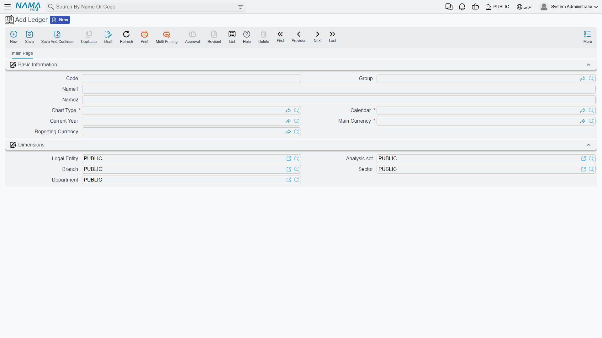
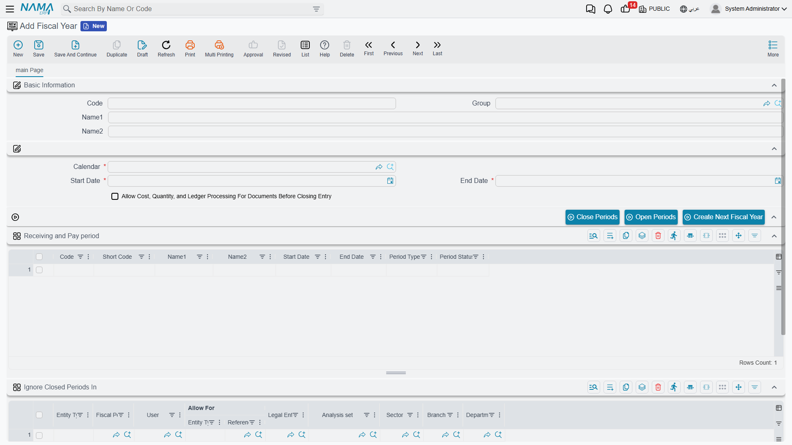

# Accounting Concepts & First-Time Setup

Before you can record your first entry, the accounting system needs to "know" a few fixed facts about your organization: What is your main currency? Which chart of accounts do you work on? What is your fiscal year, and when does it start and end? These answers are entered once, when the system is first set up, in a small number of master files — and everything afterwards builds on them. Every invoice, every voucher, every entry refers back to these files to know where and how to record its accounting effect.

This page explains those foundational files and how they connect: the **Ledger**, the **Account Chart Type**, the **Calendar**, and the **Fiscal Year and its periods** — and how each **Legal Entity** is linked to its ledger.

::: info Required license
These features are part of the core `accounting` license. If you don't see the accounting menus at all, the license is most likely not enabled.
:::

## The big picture: where does it all start?

Imagine setting up the books for a brand-new company. The logical order of setup is:

1. **Calendar** — defines how the year is divided into periods (usually monthly).
2. **Account Chart Type** — a classification that groups together the companies sharing the same chart of accounts.
3. **Ledger** — links the main currency + chart type + calendar together, and represents the "book" in which balances are kept.
4. **Fiscal Year and its periods** — created from the calendar, with periods opened to receive transactions.
5. **Legal Entity** — linked to the ledger, at which point it's ready to operate.

You don't repeat this setup every year; what you repeat annually is just creating a new **fiscal year** and opening its periods.

## The Ledger

The ledger is the heart of the setup. You'll find it under **Accounting → Settings → Ledger**, and it gathers the major financial decisions in one place:

- **Main Currency** — the currency your balances are held in and your financial statements are prepared in. Any transaction in another currency is translated to this currency when recorded.
- **Reporting Currency** — an optional second currency kept in parallel with the main currency, useful for organizations that need to present their results in another currency (say, USD) alongside the local one.
- **Chart Type** — links the ledger to the chart of accounts it works on (see the next section).
- **Calendar** — the calendar on which this ledger's years and periods are built.
- **Current Year** — the fiscal year currently adopted for the ledger.

The ledger also carries **default dimensions** (legal entity, branch, sector, department, analysis set) shown in the lower section of the screen, used as initial values when working on this ledger.

::: warning Core fields can't be changed after use
Once you link any **Legal Entity** to this ledger, the system blocks changing the **Main Currency**, **Reporting Currency**, **Chart Type**, or **Calendar**. These decisions shape every recorded balance, so changing them after go-live would corrupt the historical data. Plan them carefully before the first transaction — if you try to edit them after linking, you'll get a save-blocking message.
:::

## The Account Chart Type

You might wonder: why is there a separate file called **Account Chart Type**? The idea is simple: in groups that span several companies, some companies may share the same chart of accounts while others differ. The "account chart type" is the classification that groups everyone working on the same chart. If you have a single company, you'll define one type, link your ledger and chart to it, and not give it another thought.

The file itself is just a code and a name — its importance is in the linking, not the content. The details of building the chart itself (accounts, levels, classifications) are covered in the [Chart of Accounts](./chart-of-accounts.md) page.

## The Calendar

The Calendar (`Basic > Master Files > Calendar`) defines how accounting time is divided. Most organizations use a monthly calendar (twelve periods), but the system supports other divisions. Fiscal years and their periods are built on this calendar, so you define it once and reuse it every year.

## The Fiscal Year and accounting periods

The fiscal year (`Basic > Master Files > Fiscal Year`) is the time umbrella your transactions belong to over a year, divided internally into **accounting periods** (usually months), which are what actually get opened and closed.

In the fiscal-year header you set the **Calendar**, **Start Date**, and **End Date**, and its periods appear in the periods grid — one row per period with columns for code, name, start and end dates, **period type**, and **period status**.

### Period types

Every period has a **type** that defines its role in the year:

| Type | Meaning |
|---|---|
| **Opening** | The start-of-year period into which opening balances carried over from the prior year are loaded. |
| **Normal** | The day-to-day operating periods (typically the twelve months) where most transactions are recorded. |
| **Adjustment** | A period dedicated to year-end adjustment entries before closing. |
| **Closing** | The period in which the year-end closing entry is recorded. |
| **Purge Period** | A special period for purging/archiving old transactions. |

### Period status

Each period has one of two statuses: **Opened** (accepts transactions) or **Closed** (rejects any new transaction). Closing periods is a core control: once a month is finished and its figures approved, you close it so no one can alter its past.

### Action buttons

Above the periods grid, three buttons save you the manual work:

- **Create Next Fiscal Year** — generates next year and its periods from the same calendar, with no re-keying.
- **Open Periods** — opens a set of periods at once to receive transactions.
- **Close Periods** — closes a set of periods at once.

::: tip
Fine-grained locking doesn't stop at the period. If you need to block transactions on a specific account or within a particular date range without closing the entire period, that's the job of the **Prevent Accounting Transactions** document, covered in the [Year-end & period control](./year-end-and-period-control.md) page.
:::

The **Allow processing costs, quantities and entries after the closing entry** option lets certain transactions keep processing even after the closing entry is recorded — used in special cases when late processing must be completed in a year that has been closed.

## Linking a Legal Entity to a ledger

The last step of setup is linking the **Legal Entity** (`Basic > Dimensions > Legal Entity`) to the ledger you created. With this link the company inherits its main currency, chart, and calendar from the ledger, and becomes ready to receive transactions. And it's precisely from the moment of this link that the system begins protecting the ledger's core fields from edits, as noted above.

Broader detail on the legal entity as one of the **dimensions** (alongside branch, sector, and department) will be in the **Dimensions, cost centers & distribution** technical reference.

## For Support

- **"The accounting screens don't appear at all"** — check that the `accounting` license is enabled.
- **"The system refuses to save a transaction on a certain date"** — most likely the accounting period for that date has status **Closed**, or no period covers the date, or a **Prevent Accounting Transactions** document is blocking it. Open the fiscal year and review the periods grid and their statuses.
- **"A blocking message when editing the ledger"** — appears when trying to change the main/reporting currency, chart type, or calendar after the ledger has been linked to a legal entity. These fields are deliberately locked after use.
- Year creation and bulk open/close of periods will be covered in depth in the **Fiscal periods & currency** reference, and the module's option catalog in [Accounting configuration](./support/accounting-configuration.md).
