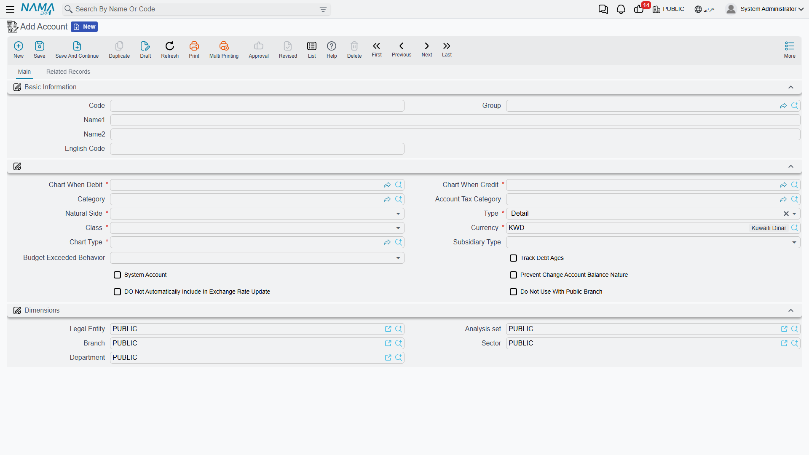

# Accounts

If the chart of accounts is the structure, the **Account** is the unit balances are actually recorded on. Every accounting entry — whatever its source — ends up posting a debit or credit amount to an account. And because most posting errors and reversed "subsidiary" balances trace back to the account's own setup, this is one of the most important screens for support staff to understand well.

You'll find accounts under **Accounting → Master Files → Account**.

::: info Required license
Accounts are part of the core `accounting` license.
:::

## The two account types: Detail or Subsidiary

The most important field on the screen is **Type**, with two values that define the account's entire behavior:

- **Detail** — an ordinary account holding a single aggregated balance (like a "Rent" or "Electricity" account). You look at it and see one balance.
- **Subsidiary** — an account whose balance breaks down by **party**: customer, supplier, employee, bank, safe... A "Customers" account of type Subsidiary doesn't give you just one number; it gives a balance per individual customer, plus a grand total. This is what lets you know "how much does customer A owe us" without opening a separate account for every customer.

## Linking the account to the chart: Debit chart and Credit chart

Notice the account has two separate links to the chart: **Chart When Debit** and **Chart When Credit**. Why two? Because some accounts must appear in a different place in the statements depending on their balance's nature. A bank current account, for example, may appear under assets when it's in debit, and under liabilities when in credit (an overdraft). Specifying two different nodes for debit and credit keeps the presentation in the financial statements correct in both cases. In ordinary cases both links point to the same node.

Alongside them you set:

- **Natural Side** (`Debit`/`Credit`) — the natural side of the account's balance.
- **Class** — the financial-statement classification (Balance Sheet / Income Statement / Other).
- **Chart Type** — the chart type it belongs to.
- **Currency** — the account's currency. A transaction in any other currency is translated at the exchange rate.
- **Account Category** and **Account Tax Category** — the two angles feeding the income statement, cash-flow statement, and tax reports (see [Chart of Accounts](./chart-of-accounts.md)).

## Subsidiary types (up to five)

When the account is of type **Subsidiary**, you set its **Subsidiary Type** — the kind of party the balance breaks down by (customer, supplier, employee, bank, bank account, safe, fixed asset, item, project... the list is long and includes entities from every licensed module). You can combine up to **five subsidiary types** on the same account (subsidiary type 2 through 5), so its balance breaks down across more than one dimension at once — for example customer × project.

::: tip
The **Allow Transactions Without Subsidiary** option lets you, when needed, record a transaction on a subsidiary account without specifying the party. By default, subsidiary accounts require the party; don't enable this without a clear reason.
:::

## The control flag set

The part that makes this screen pivotal for support is the set of flags (checkboxes) that govern the account's behavior during posting:

- **System Account** — marks an account that documents generate automatically (not usually used manually). Whether documents may use it is governed by the module's option catalog.
- **Prevent Changing Account Balance Nature** — blocks a transaction that would flip the account's balance to its unnatural side (e.g., making a cash balance credit). A safeguard against errors.
- **Track Debt Ages** — enables debt-age tracking for this account, a prerequisite for the account appearing in debt-age reports.
- **Do Not Auto-Include In Exchange Rate Update** — excludes the account from periodic foreign-currency revaluation.
- **Use Transaction Local Currency** — makes the account keep its value in the transaction's local currency.
- Dimension restrictions: **Must Use With Public Sector/Branch/Department/Analysis Set Only**, or their opposites **Do Not Use With Public ...**, require or forbid using a public dimension with this account.
- Data enforcement: **Do Not Allow Empty Reference/Narration** forces the user to fill the reference or narration fields when posting to the account.

## Budget control on the account

If you use financial budgets, the **Budget Exceeded Behavior** and **Prevent Save If No Budget** fields determine how the system reacts when spending exceeds its budget:

- **Allow** — records the transaction and tolerates a silent overrun.
- **Prevent Saving** — rejects the over-budget transaction.
- **Request Approval** — halts the transaction pending approval.

## Reports

This account's statements and balances (general/subsidiary/detail account statement, trial balance, debt ages) are all on the [Account statements & trial balance](./reports-account-statements-and-trial-balance.md) page.

## For Support

Most "the entry won't post" or "the balance is wrong" tickets are resolved from this screen:

- **"Blocking message on posting: change of balance nature"** — the account has **Prevent Changing Account Balance Nature** enabled and the transaction would have flipped its balance to the unnatural side. Review the transaction logic or the setup.
- **"The system asks for a subsidiary/customer and won't save"** — the account is of type **Subsidiary** and no party was specified; either specify it or (only if necessary) enable **Allow Transactions Without Subsidiary**.
- **"The system mandatorily requires a reference/narration"** — one of the **Do Not Allow Empty Reference/Narration** flags is enabled on the account.
- **"The account doesn't appear in the debt-age report"** — the **Track Debt Ages** flag is off.
- **"The account isn't revalued with currency differences"** — the **Do Not Auto-Include In Exchange Rate Update** flag is on.
- **"A transaction rejected because of the budget"** — the account's **Budget Exceeded Behavior** is **Prevent Saving** or **Request Approval**.
- How the account's debit/credit figures are built during document processing is covered in [How documents are processed into accounting effects](./support/accounting-request-processing.md), and dimension restrictions in the **Dimensions, cost centers & distribution** reference.
